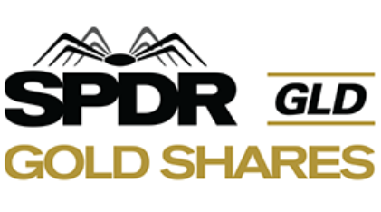

## Table of Contents

## What is the SPDR Gold Shares Exchange-Traded Fund?

The SPDR Gold Shares Exchange-Traded Fund, often called GLD, is a type of investment fund that lets people buy shares that represent physical gold. Instead of buying gold bars or coins, investors can buy shares of GLD, which are traded on stock exchanges just like regular stocks. This makes it easier for people to invest in gold without having to store and secure the metal themselves.

GLD is designed to track the price of gold, meaning the value of the shares goes up and down along with the market price of gold. The fund holds actual gold bars in vaults, and the number of shares available can change based on how much gold is in the fund. This way, investors can easily buy and sell shares throughout the trading day, making it a convenient way to add gold to their investment portfolio.

## How does the SPDR Gold Shares ETF work?

The SPDR Gold Shares ETF, or GLD, is a special kind of investment that lets you own a piece of gold without actually having to buy and store it yourself. When you buy shares of GLD, you're buying a share of a big pool of gold that the fund holds in secure vaults. The price of GLD shares goes up and down with the price of gold, so if gold becomes more expensive, the value of your shares goes up too, and if gold gets cheaper, the value of your shares goes down.

The fund is managed so that it always reflects the current market price of gold. This means that the people running the fund will create new shares if more people want to invest in gold, and they'll take away shares if people are selling. This keeps the price of the shares in line with the price of gold. It's a simple way for people to add gold to their investments without having to worry about keeping it safe.

## What are the benefits of investing in the SPDR Gold Shares ETF?

Investing in the SPDR Gold Shares [ETF](/wiki/etf-trading-strategies), or GLD, has several benefits. One big advantage is that it's easy to buy and sell. You don't need to go to a special store or worry about storing gold safely at home. You can just buy or sell shares of GLD through your regular stock trading account, which makes it very convenient. Also, because GLD trades like a stock, you can buy or sell it whenever the stock market is open, which gives you more flexibility compared to buying physical gold.

Another benefit is that GLD closely follows the price of gold. This means if you believe gold will go up in value, you can invest in GLD and your shares should increase in value too. It's a straightforward way to add gold to your investment mix without the hassle of dealing with the physical metal. Plus, GLD is very clear about what it holds – it tells you exactly how much gold it has, so you know what you're investing in.

## What are the risks associated with the SPDR Gold Shares ETF?

Investing in the SPDR Gold Shares ETF, or GLD, comes with some risks you should know about. One big risk is that the price of gold can go up and down a lot. If you buy shares of GLD and the price of gold goes down, the value of your shares will go down too. This means you could lose money. Also, even though GLD tries to match the price of gold, sometimes it might not be exactly the same. This can happen because of costs to run the fund or because of how people are buying and selling the shares.

Another risk is that GLD is not the same as owning physical gold. If you want to own gold because you like the idea of having something you can touch, GLD might not feel the same. Also, if something big happens, like a problem with the company that runs GLD or the place where they keep the gold, it could affect the value of your shares. So, it's important to think about these things before you decide to invest in GLD.

## How is the price of the SPDR Gold Shares ETF determined?

The price of the SPDR Gold Shares ETF, or GLD, is based on the price of gold. The people who run the fund make sure that the value of the shares stays close to the price of gold by keeping track of how much gold they have and how many shares are out there. If more people want to buy GLD, the fund can create more shares by buying more gold. If people are selling their shares, the fund can take away shares by selling some of the gold. This keeps the price of GLD in line with the price of gold.

Sometimes, the price of GLD might not be exactly the same as the price of gold. This can happen because it costs money to run the fund, and these costs can make a small difference. Also, how people are buying and selling the shares can affect the price a bit. But overall, GLD is designed to give you a good idea of what gold is worth, so you can invest in it easily without dealing with the physical metal.

## What is the expense ratio of the SPDR Gold Shares ETF?

The expense ratio of the SPDR Gold Shares ETF, or GLD, is 0.40%. This means that for every $100 you have invested in GLD, you'll pay 40 cents each year to cover the costs of running the fund.

These costs include things like storing the gold safely, managing the fund, and other expenses. It's important to know about the expense ratio because it can affect how much money you make from your investment over time. Even though 0.40% might not sound like a lot, it can add up if you keep your money in GLD for a long time.

## How does the SPDR Gold Shares ETF compare to other gold investment options?

The SPDR Gold Shares ETF, or GLD, is one way to invest in gold, but there are other options too. One common choice is buying physical gold like coins or bars. With physical gold, you own the actual metal, but you have to find a safe place to keep it and you might need to pay for insurance. GLD is easier because you just buy and sell shares like stocks, and you don't need to worry about storing the gold. But, with physical gold, you can hold it in your hands, which some people like.

Another option is gold mining stocks, where you invest in companies that mine gold. These stocks can go up if the price of gold goes up, but they also depend on how well the company is doing. This can make them more risky than GLD because the price of the stock can move a lot more than the price of gold. GLD is simpler because it just follows the price of gold, without the extra ups and downs from the company's performance. But, if you believe in a specific gold mining company, investing in their stock might give you bigger gains if they do well.

Lastly, there are other gold ETFs and mutual funds that you can invest in. Some of these might have lower expense ratios than GLD, which means you pay less to own them. Others might invest in a mix of gold and other things, which can spread out your risk. GLD is focused just on gold, so it's a pure play on the price of gold. But, if you want to mix gold with other investments, other ETFs or mutual funds might be a better fit for you.

## What is the historical performance of the SPDR Gold Shares ETF?

The SPDR Gold Shares ETF, or GLD, has been around since November 2004. Over the years, its performance has gone up and down with the price of gold. For example, during the financial crisis in 2008, gold prices went up a lot, and so did the price of GLD. From 2004 to 2011, GLD had a big run, with the price going from around $40 per share to over $180 per share. But after 2011, gold prices started to fall, and GLD's price went down too, hitting a low of about $100 per share in late 2015.

Since then, GLD has had its ups and downs. In 2020, when the world was dealing with the COVID-19 pandemic, gold prices and GLD's price went up again, reaching over $190 per share. But by the end of 2022, the price had come down to around $160 per share. Overall, if you look at the long term, GLD has given investors a way to follow the price of gold without having to buy the metal itself. But remember, past performance doesn't tell you what will happen in the future, so it's important to think about your own goals and how much risk you're okay with before you decide to invest in GLD.

## How can one buy and sell shares of the SPDR Gold Shares ETF?

Buying and selling shares of the SPDR Gold Shares ETF, or GLD, is easy if you have a brokerage account. You can do it just like you would buy or sell any other stock. Just log into your account, search for GLD, and place your order. You can choose to buy or sell at the current market price, or you can set a specific price you want to buy or sell at. Once you place your order, it will be filled when the price matches what you asked for.

You can buy or sell GLD any time the stock market is open. This means you have a lot of flexibility to make trades whenever you want during trading hours. Keep in mind that there might be some fees from your brokerage for making these trades, so it's a good idea to check what those fees are before you start buying and selling.

## What are the tax implications of investing in the SPDR Gold Shares ETF?

Investing in the SPDR Gold Shares ETF, or GLD, can have some tax effects you should know about. When you buy and sell GLD, you might have to pay capital gains tax. If you hold onto your shares for less than a year before selling, any profit you make is considered a short-term capital gain, and you'll pay tax on it at your regular income tax rate. If you keep your shares for more than a year, any profit is a long-term capital gain, which usually has a lower tax rate.

Also, GLD is treated as a collectible by the IRS, which means it might have a higher tax rate than other investments. If you have long-term gains from GLD, the tax rate could be up to 28%, which is higher than the usual long-term capital gains rate for stocks and bonds. It's a good idea to talk to a tax professional to understand how investing in GLD might affect your taxes, and to see if there are ways to lower your tax bill.

## How does the SPDR Gold Shares ETF manage its gold holdings?

The SPDR Gold Shares ETF, or GLD, manages its gold holdings by keeping them in safe vaults. The gold is stored in places like London and is looked after by companies that specialize in keeping things secure. When people want to buy more shares of GLD, the fund buys more gold to add to its vaults. If people are selling their shares, the fund might sell some of its gold. This way, the amount of gold in the vaults matches the number of shares that are out there.

The fund makes sure that the price of its shares stays close to the price of gold. They do this by keeping track of how much gold they have and how many shares are out there. If the price of gold goes up, the value of the shares goes up too. If the price of gold goes down, the value of the shares goes down. This helps make sure that people who invest in GLD are getting a fair deal that reflects what gold is worth in the market.

## What are the future prospects and potential changes for the SPDR Gold Shares ETF?

The future prospects for the SPDR Gold Shares ETF, or GLD, depend a lot on what happens with the price of gold. If the world keeps facing economic uncertainty, or if there are big changes in inflation or interest rates, gold might become more popular as a safe investment. This could push the price of gold up, and GLD would likely go up too. But if things get more stable and people start feeling more confident about other investments, the price of gold might not grow as much, which would affect GLD's performance.

There could also be changes in how GLD works. The people who run the fund might decide to lower the expense ratio to make it more attractive to investors. They might also think about new ways to make the fund even more closely tied to the price of gold, or maybe even start offering different ways to invest in gold through new products. But no matter what happens, GLD will probably keep being a popular choice for people who want an easy way to invest in gold without having to buy the actual metal.

## References & Further Reading

[1]: ["The Economics of Gold"](https://www.researchgate.net/publication/282562398_The_Financial_Economics_of_Gold_-_A_Survey) by Lawrence A. Maloney

[2]: ["The Alchemy of Finance"](https://www.amazon.com/Alchemy-Finance-George-Soros/dp/0471445495) by George Soros

[3]: Agarwal, V., & Naik, N. Y. (2000). ["On Taking the Alternative Route: Risks, Rewards, and Performance Persistence of Hedge Funds"](https://papers.ssrn.com/sol3/papers.cfm?abstract_id=150388). Journal of Financial and Quantitative Analysis.

[4]: ["Advances in Financial Machine Learning"](https://www.amazon.com/Advances-Financial-Machine-Learning-Marcos/dp/1119482089) by Marcos Lopez de Prado

[5]: Elton, E. J., Gruber, M. J., Comer, G., & Li, K. (2002). ["Spiders: Where Are the Bugs?"](https://www.jstor.org/stable/10.1086/339891) Journal of Business.

[6]: ["Evidence-Based Technical Analysis: Applying the Scientific Method and Statistical Inference to Trading Signals"](https://www.amazon.com/Evidence-Based-Technical-Analysis-Scientific-Statistical/dp/0470008741) by David Aronson

[7]: Malkiel, B. G., & Fama, E. F. (1970). ["Efficient Capital Markets: A Review of Theory and Empirical Work"](https://www.jstor.org/stable/2325486). The Journal of Finance.

[8]: Chan, E. P. (2008). ["Quantitative Trading: How to Build Your Own Algorithmic Trading Business"](https://github.com/ftvision/quant_trading_echan_book).