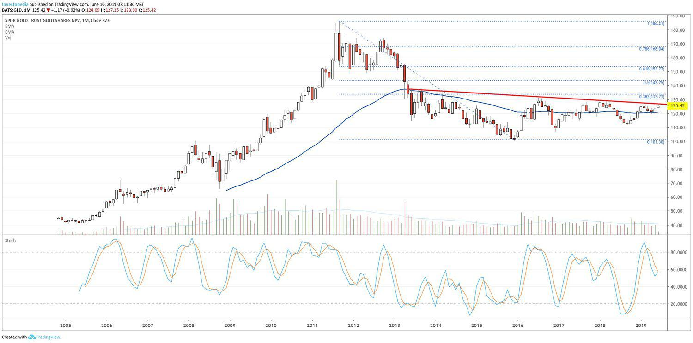

Gold is a timeless asset revered for its intrinsic value and historical significance. Throughout history, gold has been a symbol of wealth and power, often used as currency and a store of value. Its role as a reliable economic pillar is renowned, with the metal offering a safe haven during times of financial instability. This resilience and trust make gold a favored choice among investors, particularly during periods of economic volatility.

Investors today have an array of options to access the gold market. Traditional methods include purchasing physical gold, such as coins and bars, which provide direct ownership but come with challenges like storage and security. However, modern financial instruments, such as gold exchange-traded funds (ETFs), have opened new avenues for gold investment. Gold ETFs allow individuals to invest in gold without having to manage the physical aspects related to its storage and security.



One of the most prominent gold ETFs is the SPDR Gold Shares ETF (GLD). Since its inception, GLD has become a popular vehicle for investors looking to gain exposure to gold's price movements. This ETF offers a practical solution by eliminating the logistical concerns of owning physical gold. By investing in GLD, individuals can participate in the gold market with the simplicity and convenience of trading stocks.

This article will examine the mechanics of SPDR Gold Shares, its significance in the financial market, and how it can be practically integrated into an algorithmic trading strategy. Algorithmic trading, driven by technological advancements, allows investors to leverage data and technology for precise and efficient trading decisions. Understanding the role of GLD in such strategies could unlock potential benefits for individuals and institutions seeking to optimize their investment portfolios.

## Table of Contents

## Understanding Gold ETFs and SPDR Gold Shares

Gold Exchange-Traded Funds (ETFs) provide a mechanism for investors to gain exposure to gold without the necessity of holding the physical asset. They achieve this by tracking the price movements of gold, offering a convenient and efficient way for investors to participate in the gold market. SPDR Gold Shares (GLD), introduced in 2004, is one of the most influential gold ETFs, providing a liquid and easily tradable asset that resembles the characteristics of stock market transactions.

GLD is designed to closely mirror the performance of the price of gold bullion by holding physical gold bars, predominantly stored in secure vaults in London. This structure ensures that GLD remains a tangible asset-backed investment, giving investors confidence in the authenticity of their investment. The expense ratio of GLD is also competitive, contributing to its attractiveness among investors seeking cost-effective exposure to gold.

Investors often choose GLD because of its straightforward nature. Buying shares of GLD allows investors to gain exposure to gold prices without delving into the complexities associated with trading gold futures contracts or the logistical challenges and security concerns related to holding physical gold. This simplicity, combined with the [liquidity](/wiki/liquidity-risk-premium) of GLD, makes it an attractive option for both individual and institutional investors, enabling efficient portfolio management and strategic allocation.

Overall, the accessibility of trading GLD on major stock exchanges and its transparency in terms of holdings and operations bolster investor confidence and have contributed to its status as a premier choice for those looking to benefit from movements in the price of gold. By aligning their investment with the performance of gold bullion, investors can effectively utilize GLD as part of a broader investment strategy.

## Algorithmic Trading and Gold ETFs

Algorithmic trading has revolutionized the financial markets by employing computer programs to execute trades with increased precision and efficiency. This method relies on algorithms that operate according to predefined criteria, allowing traders to capitalize on market opportunities within milliseconds. The integration of Gold ETFs, such as SPDR Gold Shares (GLD), into these systems provides traders with the ability to efficiently engage with gold market trends.

GLD and similar Gold ETFs can be seamlessly integrated into [algorithmic trading](/wiki/algorithmic-trading) systems due to their liquidity and real-time pricing. By tracking the price of gold bullion, these ETFs enable traders to engage without dealing with the logistics of physical gold ownership. Within an algorithmic framework, traders can analyze historical prices and real-time data to identify patterns and trends in gold price fluctuations.

One of the primary advantages of algorithmic trading with GLD is the ability to set stop-loss orders and execute trades automatically based on market conditions. For example, an algorithm could be designed to sell GLD shares if the price falls below a certain threshold, thereby minimizing losses. Conversely, algorithms can be set to purchase additional shares during optimal pricing windows, maximizing potential gains.

Utilizing historical data and various technical indicators, traders can develop algorithms that predict future price movements of GLD. Python is a popular language for creating such trading algorithms due to its robust libraries like Pandas, NumPy, and Scikit-learn for data analysis, and APIs from trading platforms for real-time data access. Below is a simplified example of a Python script that uses moving averages as a basic trading strategy:

```python
import pandas as pd
import numpy as np

# Load historical GLD price data
data = pd.read_csv('gld_historical_data.csv')

# Calculate moving averages
data['SMA_50'] = data['Close'].rolling(window=50).mean()
data['SMA_200'] = data['Close'].rolling(window=200).mean()

def generate_signals(data):
    buy_signals = []
    sell_signals = []
    position = False  # Initially not holding any GLD

    for i in range(len(data['Close'])):
        if data['SMA_50'].iloc[i] > data['SMA_200'].iloc[i] and not position:
            buy_signals.append(data['Close'].iloc[i])
            sell_signals.append(np.nan)
            position = True
        elif data['SMA_50'].iloc[i] < data['SMA_200'].iloc[i] and position:
            buy_signals.append(np.nan)
            sell_signals.append(data['Close'].iloc[i])
            position = False
        else:
            buy_signals.append(np.nan)
            sell_signals.append(np.nan)

    return buy_signals, sell_signals

data['Buy_Signal'], data['Sell_Signal'] = generate_signals(data)
```

The code above sets up a simple moving average crossover strategy, indicating potential buy or sell signals based on the relationship between short-term (50-day) and long-term (200-day) moving averages.

Algorithmic approaches in trading are especially beneficial during volatile market conditions, enabling traders to quickly respond to price changes and optimize returns. This strategic advantage, combined with GLD's inherent qualities as a gold-backed [ETF](/wiki/etf-trading-strategies), makes it a valuable asset component in algorithmic trading strategies.

## The Role of SPDR Gold Shares in Portfolio Diversification

Gold has long been regarded as a safe haven asset, particularly during times of economic uncertainty and inflationary pressures. Its ability to preserve value makes it a valuable component of a diversified investment portfolio. The SPDR Gold Shares ETF (GLD) provides a practical avenue for investors wishing to harness these protective qualities without the logistical complexities of holding physical gold.

One of the primary benefits of considering GLD for portfolio diversification lies in its low correlation with traditional asset classes such as stocks and bonds. The correlation coefficient $\rho$ between two assets is a statistical measure that indicates how the prices move in relation to each other. A $\rho$ close to 1 implies strong positive correlation, $\rho$ close to -1 indicates strong negative correlation, and a $\rho$ around 0 suggests no correlation. Historically, gold has shown a relatively low correlation with equities and fixed income, implying that the price movements of gold are often unlinked to those of these asset classes. This lack of correlation enables GLD to act as a buffer against market [volatility](/wiki/volatility-trading-strategies), reducing the overall risk and possibly increasing the risk-adjusted returns of a portfolio.

Moreover, the liquidity that GLD offers is noteworthy. Trading on major exchanges like the New York Stock Exchange, GLD combines the appeal of gold with the convenience and efficiency of equity transactions. Its liquidity means investors can buy and sell shares with ease, allowing for both long-term holdings and short-term speculative trading. This flexibility opens opportunities for various investment strategies, catering to both conservative investors seeking stability and traders aiming for profit in fluctuating markets.

For those concerned about market swings, holding GLD can not only provide a hedge but also a potential for price appreciation. As global economic conditions fluctuate, the demand for gold, often seen as a hedge against currency devaluation and inflation, can drive up its price, consequently elevating the value of GLD shares. For instance, during the 2008 financial crisis and the COVID-19 pandemic, gold prices surged as investors flocked to safe assets.

In conclusion, integrating SPDR Gold Shares in an investment portfolio offers a blend of liquidity, convenience, and protection. Whether it's mitigating risk, leveraging liquidity for trading, or seeking an asset that could thrive under certain economic conditions, GLD supports a balanced investment strategy capable of withstanding diverse market environments.

## Conclusion

Incorporating gold ETFs, particularly SPDR Gold Shares (GLD), into an investment strategy can provide numerous advantages. The benefits stem from its ability to offer exposure to gold without the complexities and costs associated with physical gold ownership. GLD's attributes of liquidity and accessibility make it a highly favorable choice for investors aiming to harness the performance of gold in the financial market.

Algorithmic trading is a significant modern innovation that maximizes returns when engaging in the gold market through GLD. By employing computer programs to analyze historical data and monitor real-time market shifts, traders can implement algorithms that efficiently respond to changes in gold prices. The integration of GLD with algorithmic trading systems allows for the application of sophisticated strategies, such as setting stop-loss orders or executing trades at optimal periods, thereby potentially enhancing returns and managing risks effectively. 

As economic conditions fluctuate, diversifying a portfolio with an asset like gold is a prudent choice for both individual and institutional investors. Gold's historical reputation as a hedge against inflation and economic instability makes GLD a strategic inclusion in any investment portfolio. The low correlation of gold with other asset classes, such as stocks and bonds, further underscores its role in risk mitigation.

Understanding how to effectively utilize GLD in varying trading environments is crucial for enhancing investment portfolios. Whether through algorithmic trading or traditional investment strategies, leveraging GLD enables investors to capitalize on gold’s potential for appreciation and its defensive qualities. As markets continue to evolve, maintaining exposure to gold via instruments like GLD will remain essential for a balanced and resilient investment strategy.

## References & Further Reading

[1]: ["The Economics of Gold"](https://www.researchgate.net/publication/282562398_The_Financial_Economics_of_Gold_-_A_Survey) by Lawrence A. Maloney

[2]: ["The Alchemy of Finance"](https://www.amazon.com/Alchemy-Finance-George-Soros/dp/0471445495) by George Soros

[3]: Agarwal, V., & Naik, N. Y. (2000). ["On Taking the Alternative Route: Risks, Rewards, and Performance Persistence of Hedge Funds"](https://papers.ssrn.com/sol3/papers.cfm?abstract_id=150388). Journal of Financial and Quantitative Analysis.

[4]: ["Advances in Financial Machine Learning"](https://www.amazon.com/Advances-Financial-Machine-Learning-Marcos/dp/1119482089) by Marcos Lopez de Prado

[5]: Elton, E. J., Gruber, M. J., Comer, G., & Li, K. (2002). ["Spiders: Where Are the Bugs?"](https://www.jstor.org/stable/10.1086/339891) Journal of Business.

[6]: ["Evidence-Based Technical Analysis: Applying the Scientific Method and Statistical Inference to Trading Signals"](https://www.amazon.com/Evidence-Based-Technical-Analysis-Scientific-Statistical/dp/0470008741) by David Aronson

[7]: Malkiel, B. G., & Fama, E. F. (1970). ["Efficient Capital Markets: A Review of Theory and Empirical Work"](https://www.jstor.org/stable/2325486). The Journal of Finance.

[8]: Chan, E. P. (2008). ["Quantitative Trading: How to Build Your Own Algorithmic Trading Business"](https://github.com/ftvision/quant_trading_echan_book).