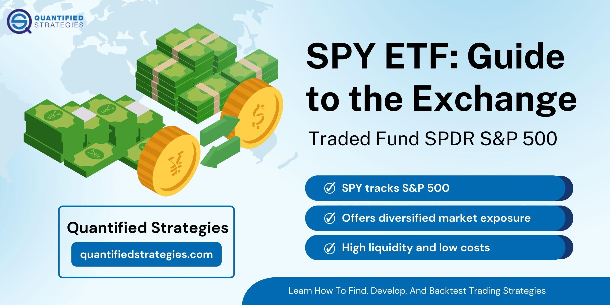

The SPDR S&P 500 ETF, commonly referred to as SPY, represents a significant tool for investors aiming to emulate the performance of the S&P 500 Index. This index comprises 500 of the largest publicly traded companies in the United States, serving as a critical benchmark for assessing the U.S. stock market's dynamics. SPY offers a transparent and cost-effective means of gaining exposure to a diversified portfolio of large-cap U.S. equities, with particular appeal for individuals interested in algorithmic trading. 

This article examines SPY's comprehensive holdings and explores its potential utility in various algorithmic trading strategies. With such a broad foundation, the ETF facilitates opportunities for investors to optimize their trading models and exploit market trends. Understanding the structure and benefits of SPY is crucial, particularly for those integrating algorithmic methodologies into their investment approach.

## Table of Contents

## Understanding SPY ETF

The SPDR S&P 500 ETF, commonly referred to as SPY, was established on January 22, 1993, marking its significance as the inaugural index exchange-traded fund (ETF) listed in the U.S. financial market. This ETF is designed to replicate the S&P 500 Index, granting investors exposure to a diversified selection of large-cap U.S. stocks that represent various sectors of the economy. The S&P 500 Index itself is a key barometer of the U.S. stock market and is composed of 500 of the most substantial publicly traded companies.

SPY endeavors to provide investors with the overall performance of these 500 companies through its structure, which enables comprehensive market exposure. This replication is achieved by owning underlying equity securities included in the S&P 500 Index in approximately the same proportions as the index itself. As a result, investors opting for SPY can achieve a diversified portfolio by holding single ETF shares, reducing the risk associated with individual stock investments.

As of recent reports, SPY manages assets amounting to approximately $573.53 billion, positioning it among the largest ETFs in the world. This substantial asset base underscores its popularity and effectiveness as a vehicle for both individual and institutional investors seeking efficient market exposure. 

SPY's shares are traded on the NYSE Arca exchange, which is renowned for its liquidity and accessibility. The high liquidity of SPY is a crucial feature, as it allows investors to buy and sell shares with ease and minimal price impact. This liquidity facilitates cost-effective transactions and is a major [factor](/wiki/factor-investing) contributing to SPY's appeal.

In summary, SPY provides an efficient mechanism for participating in the U.S. stock market's potential growth while offering the advantages of diversification, [liquidity](/wiki/liquidity-risk-premium), and accessibility through its unique structure replicating the S&P 500 Index.

## Portfolio Structure and Costs

The SPDR S&P 500 [ETF](/wiki/etf-trading-strategies) (SPY) operates as a unit investment trust (UIT), providing a structured and efficient method to replicate the holdings of the S&P 500 Index. As a UIT, SPY is characterized by a predefined portfolio that mirrors the composition of the S&P 500, a strategy that ensures the ETF closely follows the index's performance. This structure is distinct from open-ended or actively managed funds, as it does not allow for frequent changes to its holdings, except when rebalancing to maintain alignment with the S&P 500 Index.

SPY is known for its cost-effectiveness, featuring an expense ratio of 0.0945%. This fee is relatively low compared to many other mutual funds and ETFs, although some competitors offer even lower fees, providing investors with a variety of cost options. The expense ratio is critical as it indicates the percentage of fund assets used annually to cover administrative, management, and other costs. Lower fees can significantly affect an investor's net returns over time, especially in index investing where the goal is to closely match the benchmark's performance.

The ETF's design permits the creation and redemption of units, a process facilitated by authorized participants. These participants play a crucial role by engaging in [arbitrage](/wiki/arbitrage) activities that help maintain the ETF's market price in line with its net asset value (NAV). This mechanism helps ensure the ETF's share price closely tracks the underlying value of the S&P 500 Index.

The creation and redemption process involves the exchange of ETF shares with a basket of the underlying index's stocks, either directly impacting the ETF's liquidity and price efficiency. These transactions allow SPY to accommodate market demands without suffering from significant price deviations, ensuring liquidity remains high and spreads tight, attributes particularly beneficial for large-scale and [algorithmic trading](/wiki/algorithmic-trading) activities.

## Top Holdings of SPY ETF

The SPDR S&P 500 ETF Trust (SPY) is structured to mirror the S&P 500 Index, which comprises an extensive collection of leading U.S. large-cap companies across diverse sectors. This diversification is achieved through specific sector allocations, with 31.55% invested in Information Technology and 12.90% in Financials as notable examples. These allocations are critical as they represent the economic sectors that drive U.S. market performance.

Information Technology companies play a significant role in SPY's holdings due to their substantial market capitalization, innovation, and revenue growth. Top positions in the ETF are occupied by prominent entities such as Apple Inc. (AAPL), Microsoft Corp. (MSFT), and NVIDIA Corp. (NVDA). Their dominating presence is reflective of the S&P 500's capitalization-weighted structure, where a company's contribution to the index is proportionate to its market value.

The diversification strategy employed by SPY aims to mitigate the [volatility](/wiki/volatility-trading-strategies) associated with individual stocks. This is accomplished by spreading investments across various industries and companies. Such a diversified approach diminishes the impact of adverse movements in single stocks on the overall performance of the ETF. For instance, while a significant event affecting a company like Apple might influence its stock price, the broad exposure across multiple sectors and companies within SPY reduces the potential impact on the entire ETF. 

Moreover, having a range of companies from other sectors such as Financials, Health Care, and Consumer Discretionary further cushions the ETF against sector-specific risks. This balanced sector distribution not only enhances stability but also provides exposure to different facets of the U.S. economy, enabling investors to capture broader market trends.

Incorporating large-cap stocks in such a manner allows SPY to offer investors a microcosm of the U.S. stock market, ensuring its performance is closely tied to that of the underlying index. As investors continue seeking ways to balance risk and return, SPY's diversified portfolio remains a compelling choice.

## Performance Analysis

SPY has demonstrated a robust performance profile, consistently aligning with the S&P 500 Index, which it aims to track. Historically, SPY has achieved an average annual return of approximately 10.43% since its inception in 1993, a figure that underscores its efficacy as a passive investment vehicle. The performance of SPY is intrinsically linked to the S&P 500 Index, itself a barometer of the U.S. economy, capturing the performance of 500 leading companies across various sectors.

A critical aspect of SPY’s performance is its low tracking error, which measures the divergence between the ETF's returns and the S&P 500 Index. A low tracking error indicates that SPY closely follows the index's movements, demonstrating the ETF's effectiveness in achieving its objective. The tracking error can be calculated using the formula:

$$
\text{Tracking Error} = \sqrt{\frac{1}{n-1} \sum_{i=1}^{n} (R_i - I_i)^2}
$$

where $R_i$ represents the portfolio returns and $I_i$ represents the index returns over $n$ periods.

For passive investors, SPY offers a reliable mechanism to gain exposure to the U.S. stock market's broad movements without the need to engage in active stock selection. The ETF’s low expense ratio further enhances its attractiveness, ensuring that more of the investor's capital is committed to market exposure rather than management fees. Consequently, SPY is not only a tool for achieving index-like returns but also a cost-effective solution for investors seeking to capitalize on long-term growth in equity markets.

## SPY ETF and Algorithmic Trading

Algorithmic trading employs computer algorithms to [carry](/wiki/carry-trading) out trades at optimal prices based on predefined conditions and parameters. This form of trading is highly reliant on the liquidity and tight spreads of the financial instruments involved. The SPDR S&P 500 ETF (SPY) offers these characteristics in abundance, making it a preferred choice for algorithmic traders.

SPY's high liquidity is characterized by its large trading [volume](/wiki/volume-trading-strategy), which ensures that trades can be executed swiftly without causing significant price changes. This liquidity reduces market impact and minimizes transaction costs, making it an attractive feature for automated trading systems that require quick execution. The tight spreads associated with SPY further enhance its suitability for algorithmic trading. A tight spread indicates a small difference between the bid and ask prices, allowing traders to enter and [exit](/wiki/exit-strategy) positions more efficiently.

The ETF's stable and predictable behavior arises from its structure, designed to closely replicate the performance of the S&P 500 Index. This predictability enables traders to develop and implement various algorithmic trading strategies. Two such popular strategies are [statistical arbitrage](/wiki/statistical-arbitrage) and [momentum](/wiki/momentum) trading.

Statistical arbitrage involves using quantitative methods to identify pricing inefficiencies between related securities. In the context of SPY, traders might analyze price movements relative to the S&P 500 Index or other correlated instruments. By exploiting temporary mispricings, traders aim to profit from the eventual convergence of prices. This strategy frequently employs statistical techniques like mean reversion, where the trader assumes that the relative prices will revert to a baseline over time.

Momentum trading, on the other hand, capitalizes on the continuance of existing trends within the market. Algorithms can be programmed to detect and follow persistent upward or downward movements in SPY's price, entering trades in the direction of the trend. This strategy often relies on technical indicators such as moving averages or the relative strength index (RSI) to signal potential entry and exit points.

In implementing these strategies, traders commonly use programming languages like Python, which offer robust libraries for quantitative finance and data analysis. For example, libraries such as NumPy and Pandas facilitate efficient data manipulation and analysis, while tools like SciPy and Matplotlib assist in conducting statistical computations and visualizing data. The use of algorithmic trading with SPY extends not only to individual traders but also to institutional investors who seek to leverage technology for enhanced trading performance.

## Conclusion

The SPDR S&P 500 ETF offers investors an efficient means of gaining exposure to a broad spectrum of U.S. equities with relatively low expenses. It replicates the performance of the S&P 500 Index, which consists of 500 of the largest publicly traded companies in the United States. This diversification is advantageous because it reduces the impact of single-stock volatility on portfolio performance. SPY’s high liquidity ensures that investors can buy or sell shares with minimal price impact, favoring both long-term investors seeking steady returns and algorithmic traders looking to implement complex strategies.

The robust performance of SPY, with historically strong average annual returns and low tracking error relative to the S&P 500 Index, makes it a reliable vehicle for passively managed portfolios. Investors can use SPY in various trading strategies, leveraging its predictable behavior and high trading volumes. Algorithmic traders, in particular, can capitalize on these attributes to perform trades effectively, employing strategies such as statistical arbitrage and momentum trading.

Incorporating SPY into trading strategies allows investors to align with overall market trends while effectively managing associated risks. Whether for long-term investment portfolios or high-frequency trading operations, SPY offers both stability and opportunity in the fast-paced financial markets.

## References & Further Reading

[1]: ["Advances in Financial Machine Learning"](https://www.amazon.com/Advances-Financial-Machine-Learning-Marcos/dp/1119482089) by Marcos Lopez de Prado

[2]: ["Evidence-Based Technical Analysis: Applying the Scientific Method and Statistical Inference to Trading Signals"](https://www.amazon.com/Evidence-Based-Technical-Analysis-Scientific-Statistical/dp/0470008741) by David Aronson

[3]: ["Machine Learning for Algorithmic Trading"](https://github.com/PacktPublishing/Machine-Learning-for-Algorithmic-Trading-Second-Edition) by Stefan Jansen

[4]: ["Quantitative Trading: How to Build Your Own Algorithmic Trading Business"](https://books.google.com/books/about/Quantitative_Trading.html?id=j70yEAAAQBAJ) by Ernest P. Chan

[5]: ["Algorithms for Hyper-Parameter Optimization."](https://papers.nips.cc/paper/4443-algorithms-for-hyper-parameter-optimization.pdf) by Bergstra, J., Bardenet, R., Bengio, Y., & Kégl, B., Advances in Neural Information Processing Systems 24.