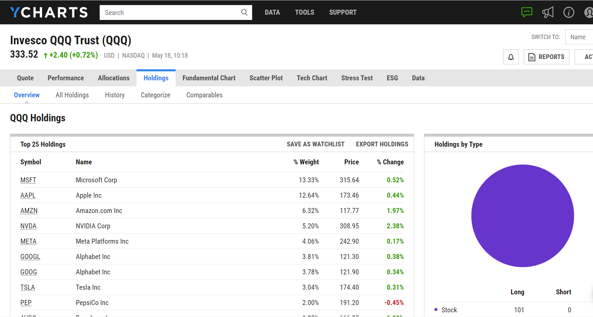

## Table of Contents

## What is the SPDR S&P 500 ETF Trust?

The SPDR S&P 500 ETF Trust is a type of investment fund that tracks the performance of the S&P 500 index. The S&P 500 is a collection of 500 large companies in the United States, and it's used to show how well the stock market is doing. When you buy shares of the SPDR S&P 500 ETF Trust, you're essentially buying a small piece of all the companies in the S&P 500. This makes it easier for people to invest in the stock market without having to pick individual stocks.

The SPDR S&P 500 ETF Trust is popular because it's easy to buy and sell, and it's a good way to diversify your investments. Diversification means spreading your money across many different investments to reduce risk. Instead of putting all your money into one company, you're investing in hundreds of companies at once. This can help protect your money if some companies don't do well. The SPDR S&P 500 ETF Trust is also known for having low costs, which means more of your money stays invested and working for you.

## How does the SPDR S&P 500 ETF Trust work?

The SPDR S&P 500 ETF Trust works by pooling money from many investors to buy shares in all the companies that make up the S&P 500 index. This index includes 500 of the biggest companies in the United States. When you buy shares of the SPDR S&P 500 ETF Trust, you're getting a tiny piece of each of these companies. The value of your investment goes up and down based on how well these companies are doing. If the companies in the S&P 500 do well, the value of the ETF goes up. If they don't do well, the value goes down.

The SPDR S&P 500 ETF Trust is designed to closely follow the performance of the S&P 500 index. This means it tries to match the returns of the index as closely as possible. It does this by holding the same stocks in the same proportions as the index. The fund is managed by professionals who make sure it stays in line with the S&P 500. This makes it a simple way for people to invest in the overall stock market without having to pick individual stocks themselves. Plus, it's easy to buy and sell shares of the ETF, just like you would with any stock.

## What are the benefits of investing in the SPDR S&P 500 ETF Trust?

One big benefit of investing in the SPDR S&P 500 ETF Trust is that it's a simple way to own a piece of the overall U.S. stock market. Instead of picking individual stocks, you get to invest in 500 of the biggest companies in the U.S. all at once. This makes it easier for people who don't want to spend a lot of time researching stocks. Plus, because it follows the S&P 500, you're likely to see similar returns as the overall market, which has historically grown over the long term.

Another benefit is that the SPDR S&P 500 ETF Trust helps you spread out your risk. By investing in many different companies across different industries, you're not putting all your eggs in one basket. If one company or industry doesn't do well, the others might still perform okay, which can help protect your investment. Also, the costs of investing in this ETF are usually low, meaning more of your money stays invested and working for you.

## What are the risks associated with the SPDR S&P 500 ETF Trust?

One risk of investing in the SPDR S&P 500 ETF Trust is that the stock market can go down. Even though the S&P 500 has done well over the long term, it can still lose value in the short term. If the market goes down, the value of your investment in the ETF will also go down. This means you could lose money if you need to sell your shares during a market downturn.

Another risk is that the SPDR S&P 500 ETF Trust is not diversified across the whole world. It only includes big U.S. companies, so if the U.S. economy does poorly, your investment could be affected more than if you were invested in a more global fund. Also, while the ETF is designed to closely follow the S&P 500, there can be small differences in performance due to fees and other factors, which might affect your returns.

## How can one invest in the SPDR S&P 500 ETF Trust?

To invest in the SPDR S&P 500 ETF Trust, you need to have a brokerage account. This is like a special bank account where you can buy and sell investments. You can open a brokerage account with many different companies, like Fidelity, Charles Schwab, or Robinhood. Once your account is set up, you can search for the SPDR S&P 500 ETF Trust, which is usually listed under the ticker symbol "SPY". Then, you decide how much money you want to invest and place an order to buy the shares.

After you buy the shares, you own a piece of the SPDR S&P 500 ETF Trust. You can keep track of how your investment is doing through your brokerage account. If you want to sell your shares later, you can do that through the same account. Remember, the value of your investment can go up or down depending on how the stock market is doing. So, it's a good idea to think about your investment as something you might hold for a long time.

## What are the top holdings in the SPDR S&P 500 ETF Trust?

The top holdings in the SPDR S&P 500 ETF Trust are the biggest companies in the S&P 500. These companies make up a large part of the ETF. Some of the top holdings are usually big tech companies like Apple, Microsoft, and Amazon. These companies are important because they have a lot of influence on the overall performance of the ETF.

Other top holdings can include big companies from different industries, like healthcare, finance, and energy. For example, you might find companies like Johnson & Johnson, JPMorgan Chase, and Exxon Mobil in the top holdings. The exact companies can change over time as the market changes, but these are the kinds of big, well-known companies that are usually at the top of the list.

## How does the performance of the SPDR S&P 500 ETF Trust compare to the S&P 500 index?

The SPDR S&P 500 ETF Trust is designed to closely match the performance of the S&P 500 index. This means that if the S&P 500 goes up by a certain percentage, the ETF should go up by about the same amount, minus a small fee. The fee is called the expense ratio, and for the SPDR S&P 500 ETF Trust, it's very low, so the difference between the ETF's performance and the index's performance is usually small.

However, there can be tiny differences between the ETF and the index. These differences can come from things like trading costs or how the fund managers handle the ETF's money. But overall, the SPDR S&P 500 ETF Trust does a good job of following the S&P 500 index. So, if you're looking to invest in the overall U.S. stock market, the SPDR S&P 500 ETF Trust is a good choice because it closely tracks the performance of the S&P 500.

## What is the expense ratio of the SPDR S&P 500 ETF Trust and how does it impact returns?

The expense ratio of the SPDR S&P 500 ETF Trust is very low, at about 0.0945%. This means that for every $100 you invest in the ETF, you pay about 9.45 cents each year to cover the costs of managing the fund. This expense ratio is taken out of the fund's assets, so it reduces the overall return you get from your investment.

Even though the expense ratio is small, it still has an impact on your returns over time. If the S&P 500 goes up by 10% in a year, the ETF might go up by a bit less because of the expense ratio. Over many years, this small fee can add up, but because the expense ratio is so low, it doesn't take away much from the growth of your investment.

## How does the SPDR S&P 500 ETF Trust handle dividends?

The SPDR S&P 500 ETF Trust collects dividends from the companies in the S&P 500. When these companies pay out dividends, the ETF gets that money. Instead of keeping the dividends, the SPDR S&P 500 ETF Trust gives them to its investors. This happens every three months, or quarterly. So, if you own shares of the ETF, you'll get a little bit of money every three months from the dividends the ETF collects.

The dividends you get from the SPDR S&P 500 ETF Trust can be used in different ways. You can take the money and spend it, or you can choose to reinvest it. Reinvesting means using the dividend money to buy more shares of the ETF. This can help your investment grow over time because you're buying more shares without spending extra money. Many people choose to reinvest their dividends to make their investment bigger and potentially earn more in the future.

## What are the historical returns of the SPDR S&P 500 ETF Trust?

The SPDR S&P 500 ETF Trust has done well over the long term, just like the S&P 500 index it follows. If you look at the past 10 years, the ETF has given investors an average yearly return of around 10-12%. This means if you invested $100 ten years ago, it could be worth about $250 to $300 now. But remember, these numbers can change a lot from year to year. Some years the ETF might go up a lot, and other years it might go down.

Over shorter periods, the returns can be very different. For example, in some years, the SPDR S&P 500 ETF Trust might go up by 20% or more, but in other years, it could drop by 10% or even more. It's important to think about the long term when you invest in the ETF. Even though there can be ups and downs, the overall trend has been up over many years. This is why many people see it as a good way to grow their money over time.

## How does the SPDR S&P 500 ETF Trust manage sector exposure?

The SPDR S&P 500 ETF Trust manages sector exposure by following the S&P 500 index. This means it holds stocks in the same proportions as the index, which is made up of different sectors like technology, healthcare, finance, and more. If the S&P 500 has a lot of tech companies, the ETF will also have a lot of tech companies. This way, the ETF's exposure to each sector matches the index, giving investors a broad view of the U.S. economy.

The balance of sectors in the ETF can change over time as the S&P 500 changes. If a sector like technology grows bigger in the S&P 500, the ETF will adjust to have more tech stocks. This keeps the ETF's performance in line with the overall market. By doing this, the SPDR S&P 500 ETF Trust helps investors spread their money across many different sectors, reducing the risk that comes from being too focused on just one part of the economy.

## What advanced strategies can be used with the SPDR S&P 500 ETF Trust for portfolio management?

One advanced strategy for using the SPDR S&P 500 ETF Trust in portfolio management is called dollar-cost averaging. This means you invest a fixed amount of money into the ETF at regular times, like every month. By doing this, you buy more shares when the price is low and fewer shares when the price is high. Over time, this can help you pay a lower average price for your shares and reduce the risk of investing all your money at the wrong time. It's a good way to build up your investment slowly and steadily.

Another strategy is using the SPDR S&P 500 ETF Trust for tactical asset allocation. This means you might change how much of your money is in the ETF based on what you think the market will do. For example, if you think the market will go up, you might put more money into the ETF. If you think it will go down, you might take some money out and put it into safer investments like bonds. This can help you try to get better returns, but it also means you need to keep a close eye on the market and be ready to make changes to your investments.

## What is Performance Analysis?

SPY has demonstrated a robust performance profile, consistently aligning with the S&P 500 Index, which it aims to track. Historically, SPY has achieved an average annual return of approximately 10.43% since its inception in 1993, a figure that underscores its efficacy as a passive investment vehicle. The performance of SPY is intrinsically linked to the S&P 500 Index, itself a barometer of the U.S. economy, capturing the performance of 500 leading companies across various sectors.

A critical aspect of SPY’s performance is its low tracking error, which measures the divergence between the ETF's returns and the S&P 500 Index. A low tracking error indicates that SPY closely follows the index's movements, demonstrating the ETF's effectiveness in achieving its objective. The tracking error can be calculated using the formula:

$$
\text{Tracking Error} = \sqrt{\frac{1}{n-1} \sum_{i=1}^{n} (R_i - I_i)^2}
$$

where $R_i$ represents the portfolio returns and $I_i$ represents the index returns over $n$ periods.

For passive investors, SPY offers a reliable mechanism to gain exposure to the U.S. stock market's broad movements without the need to engage in active stock selection. The ETF’s low expense ratio further enhances its attractiveness, ensuring that more of the investor's capital is committed to market exposure rather than management fees. Consequently, SPY is not only a tool for achieving index-like returns but also a cost-effective solution for investors seeking to capitalize on long-term growth in equity markets.

## References & Further Reading

[1]: ["Advances in Financial Machine Learning"](https://www.amazon.com/Advances-Financial-Machine-Learning-Marcos/dp/1119482089) by Marcos Lopez de Prado

[2]: ["Evidence-Based Technical Analysis: Applying the Scientific Method and Statistical Inference to Trading Signals"](https://www.amazon.com/Evidence-Based-Technical-Analysis-Scientific-Statistical/dp/0470008741) by David Aronson

[3]: ["Machine Learning for Algorithmic Trading"](https://github.com/PacktPublishing/Machine-Learning-for-Algorithmic-Trading-Second-Edition) by Stefan Jansen

[4]: ["Quantitative Trading: How to Build Your Own Algorithmic Trading Business"](https://books.google.com/books/about/Quantitative_Trading.html?id=j70yEAAAQBAJ) by Ernest P. Chan

[5]: ["Algorithms for Hyper-Parameter Optimization."](https://papers.nips.cc/paper/4443-algorithms-for-hyper-parameter-optimization.pdf) by Bergstra, J., Bardenet, R., Bengio, Y., & Kégl, B., Advances in Neural Information Processing Systems 24.