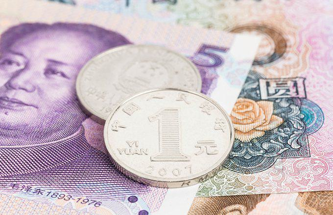

Special Administrative Regions (SARs) represent unique governance structures that operate under the sovereignty of a country while enjoying a high degree of autonomy in certain areas. These regions are established to maintain distinct socio-political systems, often inherited from colonial administrations or as a part of transitional political agreements. The concept of SARs is significant in both global politics and economics due to their unique ability to straddle different governmental frameworks. This uniqueness presents opportunities for varied economic and legal systems to coexist under a unified national identity.

SARs are characterized by their distinct governance systems that allow them to maintain separate legal, economic, and administrative frameworks from the central government. This separation is especially important in facilitating economic activities that might be constrained under conventional governance models. The foresight to establish SARs reflects an understanding that diversity in governance can enhance a nation’s global competitiveness, particularly in an increasingly internationalized economy.

In the context of global politics, SARs hold substantial relevance. They serve as testing grounds for political experimentation, showcasing how differing systems can coexist peacefully within a larger national framework. The 'one country, two systems' concept, made famous by China's SARs, illustrates how distinct political and legal systems can thrive under a singular national sovereignty. This model has prompted discussions about autonomy, sovereignty, and the balance of power between regional and central authorities, highlighting the impact of SARs on political discourse.

Economically, SARs have become pivotal players on the global stage. Due to their special status, they often act as international financial hubs, attractive to businesses and investors who benefit from the regions’ advantageous regulatory environments. The economic models of SARs are typically designed to encourage innovation and global trade, positioning them as critical nodes in the global economic network.

In modern administrative governance, SARs play specific roles in advancing sophisticated governmental practices. They possess the flexibility to quickly adapt to global economic trends while simultaneously serving as conduits for international diplomacy and trade. The ability of SARs to implement tailored policies that cater to their unique needs while engaging with broader national policies exemplifies their importance in enhancing a nation’s governance strategy.

An emerging application of SAR structures can be observed in algorithmic trading. These regions provide an ideal environment for algorithmic trading due to their advanced technological infrastructure and favorable regulatory conditions. The presence of a developed financial sector, coupled with the autonomy to regulate financial activities, allows SARs to become hubs for innovation in financial technology. As a result, they attract significant investment and talent in the field of algorithmic trading, demonstrating the dynamic application of SAR governance structures in modern economic practices.

In conclusion, Special Administrative Regions are pivotal in shaping contemporary political and economic landscapes. Their unique ability to maintain distinct systems within a broader sovereign framework not only enhances their host countries' competitiveness but also contributes to diversity in governance. This positions SARs as integral players in both global politics and economics, particularly as facilitators of new economic paradigms such as algorithmic trading.

## Table of Contents

## Understanding Special Administrative Regions (SARs)

Special Administrative Regions (SARs) are designated areas within a sovereign state that have a high degree of autonomy in certain administrative, legislative, and economic matters. This unique governance model is primarily aimed at allowing regions to maintain distinct legal and economic systems from the rest of the country while remaining under the central government's sovereignty. The concept of SARs is most prominently exemplified by regions like Hong Kong and Macau under the People's Republic of China.

The establishment of SARs was significantly driven by historical factors. For instance, the creation of SARs within China emanated from the need to resolve post-colonial governance issues. Hong Kong, a former British colony, and Macau, a former Portuguese colony, were returned to China in 1997 and 1999, respectively. To facilitate smooth transitions and preserve the economic systems that had flourished under colonial rule, the SAR status was employed.

A defining characteristic of SARs is the "one country, two systems" principle. This principle allows them to operate under a different economic and legal system than the rest of the country. Chinese leader Deng Xiaoping initially proposed this concept to address the complexities in reintegrating Hong Kong and Macau. While China maintains sovereignty, SARs enjoy considerable self-governance in all matters except foreign affairs and defense.

Globally, examples of SARs are rare, but besides Hong Kong and Macau, the concept can be observed in proposals for other regions seeking greater autonomy without secession. However, Hong Kong and Macau remain the most notable examples. Hong Kong is known for its robust financial system and vibrant international trade, while Macau is famed for its gaming and tourism industries, demonstrating the diverse applications and economic significance of SARs.

## Hong Kong as an Example of SAR

Hong Kong, as a Special Administrative Region (SAR) of China, exemplifies a unique governance structure underpinned by the "one country, two systems" principle. This principle allows Hong Kong to maintain its own legal, administrative, and economic systems, distinct from those of mainland China. Established in 1997 following the end of British rule, this arrangement was designed to preserve Hong Kong's capitalist economy and its way of life for 50 years post-handover.

Hong Kong's legal system is based on the common law framework, inherited from its history as a British colony. This system operates independently of mainland China, emphasizing the rule of law and upholding rights such as freedom of speech and assembly. Administratively, Hong Kong is governed by its Basic Law, which serves as its constitution and grants the region high degrees of autonomy, including executive, legislative, and independent judicial power. However, the Chief Executive, Hong Kong's head of government, is selected via an election process that often involves Beijing’s influence, which has been a point of contention.

Economically, Hong Kong thrives as a global financial hub characterized by a free market economy with low taxation and minimal government intervention. It serves as a major conduit for international trade, with its currency, the Hong Kong dollar, pegged to the U.S. dollar, offering stability in foreign exchange dealings. The robust financial system supports a high level of prosperity and advanced infrastructure, attracting significant foreign investment.

Despite its distinct system, Hong Kong faces notable autonomy challenges, particularly in recent years, as Beijing has increasingly asserted its influence. This tension was exemplified during the 2019 anti-extradition law protests, where large-scale demonstrations erupted over concerns regarding the erosion of judicial independence. The introduction of the National Security Law in 2020 further heightened fears about Beijing's encroachment on Hong Kong's freedoms and autonomy.

The economic implications of Hong Kong's SAR status are profound. As a gateway between East and West, Hong Kong benefits from preferential trade arrangements, serving as an essential logistics and re-export hub. This status facilitates a lucrative environment for businesses looking to engage with China while operating under a more familiar legal and economic framework. Additionally, Hong Kong's sophisticated financial markets and regulatory structures attract a plethora of multinational corporations, bolstering its stature as a key player in global finance. Yet, ongoing political uncertainties pose risks to its economic stability, potentially affecting investor confidence and international relations.

In summary, Hong Kong's status as a Special Administrative Region of China provides it with unique governance and economic advantages but simultaneously subjects it to significant political pressures that challenge its autonomy. These dynamics continue to shape the region's role on the global stage, influencing both local developments and broader international economic trends.

## Macau: A Case Study

Macau, a Special Administrative Region of China, represents a unique model of governance that combines both Western and Chinese systems under the principle of "one country, two systems." This principle allows Macau to maintain a high degree of autonomy in its legal and economic systems, distinct from mainland China, until at least 2049, as per the Sino-Portuguese Joint Declaration and the Basic Law of Macau.

Macau's transition into an SAR officially began on December 20, 1999, when Portugal transferred sovereignty to China. Since then, Macau has experienced significant transformation, becoming one of the most prominent examples of successful SAR governance. The region has maintained its legal system, predominantly based on Portuguese civil law, while integrating certain aspects of Chinese administrative instruction. Macau possesses its judiciary and legislative bodies, providing it with the capability to manage internal affairs and enforce local laws.

Economically, Macau has established itself as a significant player on the global stage, primarily through its position as the world's largest gambling hub. The gaming industry serves as the backbone of its economy, contributing to over 50% of its GDP and providing significant tax revenues, which fund welfare programs, infrastructure, and public services. The liberalization of the gaming industry in the early 2000s, allowing foreign casino operators to enter the market, was a catalytic move that transformed Macau's economic landscape. This evolution not only increased tourism but also diversified the job market, attracting a wide range of service sector businesses.

Macau also serves a crucial role as a gateway for international trade, especially between China and Portuguese-speaking countries. Its well-established infrastructure, deep-water port, and strategic location on the Pearl River Delta enhance its trade capabilities. The Closer Economic Partnership Arrangement (CEPA) between Macau and mainland China further boosts economic interactions, providing Macau businesses with access to the extensive Chinese market under favorable conditions.

Tourism is another pillar of Macau's economy, primarily driven by its gaming industry and rich cultural heritage, which is a blend of Chinese and Portuguese influences. The Historic Centre of Macau, a UNESCO World Heritage site, further bolsters its appeal to international tourists, particularly from neighboring regions such as Hong Kong, Taiwan, and mainland China. Additionally, the development of non-gaming attractions, such as luxury resorts, shopping centers, and entertainment facilities, contributes to Macau's economic diversification efforts, aiming to mitigate heavy dependency on gambling.

Despite its economic success, Macau faces challenges such as wealth inequality and the need for economic diversification. The heavy reliance on the gaming sector exposes Macau to economic [volatility](/wiki/volatility-trading-strategies), particularly during global downturns or changes in gaming regulations. As a result, policymakers continuously strive to promote other sectors, such as finance, technology, and education, to ensure sustainable long-term growth.

In conclusion, Macau serves as a compelling case study of how a Special Administrative Region can leverage its unique governance structure to foster significant economic growth. By balancing its traditional and modern economic drivers, Macau continues to navigate its challenges while securing its role as a pivotal hub for international trade and tourism.

## Algorithmic Trading in SARs

Algorithmic trading refers to the use of computer algorithms to automate financial trading operations. These algorithms execute orders at high speeds and volumes, drawing on predefined criteria such as timing, price, and [volume](/wiki/volume-trading-strategy). This form of trading has become a significant component of global financial markets, accounting for a substantial portion of trading activity on many stock exchanges. The advantages of [algorithmic trading](/wiki/algorithmic-trading) include increased efficiency, reduced transaction costs, and minimized human errors.

Hong Kong, as a Special Administrative Region (SAR) of China, stands out as a major hub for algorithmic trading. Its strategic geographical location, combined with a robust financial infrastructure and an open market economy, has attracted numerous global financial institutions and tech enterprises. Hong Kong's SAR status grants it the autonomy to maintain its legal and economic systems distinct from mainland China, under the "one country, two systems" framework. This autonomy allows Hong Kong to position itself as an attractive destination for algorithmic trading activities.

The regulatory framework governing trading in SARs like Hong Kong plays a crucial role in supporting algorithmic trading. In Hong Kong, the Securities and Futures Commission (SFC) is the primary regulatory authority overseeing financial markets and ensuring fair conduct of trading activities. The SFC has implemented rigorous regulatory measures to foster a secure and transparent trading environment. These measures include requirements for pre-trade risk controls, post-trade monitoring, and measures for safeguarding against market manipulation. The regulations are designed to ensure that algorithmic trading activities do not compromise market integrity and investor protection.

Hong Kong has witnessed several successful cases of algorithmic trading. For instance, many leading financial institutions operating in the region have adopted algorithmic trading strategies for equities, bonds, and derivatives. Quantitative hedge funds, which rely heavily on algorithms, have also thrived in Hong Kong's market environment. These institutions employ sophisticated trading algorithms that analyze market data and employ predictive analytics to execute trades with precision. One notable example is the use of high-frequency trading ([HFT](/wiki/high-frequency-trading-strategies)) algorithms, which conduct large volumes of trades in fractions of a second to capitalize on small price fluctuations.

In summary, algorithmic trading is pivotal in global financial markets, with SARs like Hong Kong playing influential roles as hubs for such activities. The regulatory frameworks in these regions provide a conducive environment for algorithmic trading while ensuring market stability and integrity. The successful application of algorithmic trading in SARs is exemplified by the presence of multiple thriving financial entities employing advanced trading strategies, further accentuating the strategic importance of SARs in contemporary financial landscapes.

## Challenges and Considerations in SAR Governance

Special Administrative Regions (SARs) such as Hong Kong encounter a myriad of governance challenges, primarily stemming from their unique status and the intricate balance they must maintain between local autonomy and national sovereignty. One notable political challenge faced by SARs is the pressure from the central government, which can lead to significant debates over autonomy and governance policies.

**Political Challenges and Central Government Influence**  
SARs are designed to operate under the "one country, two systems" framework, which allows them autonomy in most political, economic, and legal matters while being a part of a larger national entity. However, maintaining this balance is complex. The political framework of Hong Kong, for instance, stipulates that it should have a high degree of autonomy. Despite this, there have been increasing instances where central government policies appear to intrude upon this autonomy. Issues such as the 2019 Extradition Bill, which sparked widespread protests, highlight the tensions that can arise when local governance structures are perceived to be undermined by policies originating from the central government.

**Balance Between Local and National Interests**  
The essence of SAR governance lies in maintaining a delicate equilibrium between local interests and national mandates. This acrobatic balance is often tested in policy areas where local and national interests might conflict. For example, Hong Kong's legislative processes and its approach to civil liberties often reflect this tug-of-war. The tension between maintaining local governance and adhering to national expectations poses continual challenges, with implications for both governance stability and public sentiment.

**Socio-Economic Impacts**  
Governance policies in SARs significantly impact their socio-economic landscapes. Hong Kong's economic policy, accessibility to international trade, and financial systems have positioned it as a global financial hub. Yet, political unrest, often tied to governance challenges, can influence economic stability. The Occupy Central Movement in 2014, for example, was largely a reaction to perceived infringements on local policy-making autonomy, which indirectly affected economic operations and investor confidence. Similarly, tourism and investment, critical to SAR economies, are sensitive to the perceived stability of their governance systems.

In conclusion, governance in Special Administrative Regions requires careful navigation of political challenges, centralized influence, and socio-economic implications. These factors collectively impact the effectiveness and stability of SARs, making their governance a subject of significant global interest and importance.

## Conclusion

Special Administrative Regions (SARs) have emerged as significant entities in global administrative governance. By providing a framework where distinct political and economic systems coexist under the umbrella of a single sovereign state, SARs like Hong Kong and Macau exemplify the adaptability and resilience of varied administrative models. This unique governance structure allows SARs to flourish as hubs of economic activity and international trade, illustrating their capacity to promote diverse political and economic systems.

The role of SARs in an interconnected world is poised to expand. As globalization intensifies and technological advancements reshape economies, the adaptive structures of SARs can offer crucial lessons in balancing local autonomy with broader national interests. This balance is essential not only for regional prosperity but also for maintaining political order and socio-economic development. The adaptability seen in SARs could serve as a model for other regions attempting to integrate varying governance systems while preserving local distinctiveness.

In the context of modern practices like algorithmic trading, SARs have demonstrated significant progress and potential. Hong Kong, in particular, has capitalized on its SAR status to become a vital hub for algorithmic trading. This advancement is supported by a robust regulatory framework that encourages innovation while maintaining market integrity. Algorithmic trading, which leverages mathematical models and computer algorithms to execute trades, represents a crucial aspect of modern financial markets. SARs, with their unique status, provide fertile ground for such innovations by combining the flexibility of independent regulatory environments with the stability offered by a sovereign nation.

In conclusion, SARs stand as pivotal entities shaping administrative governance worldwide. Their success in managing diverse political and economic environments, their potential future roles in a globalized world, and their contribution to advancing modern economic practices like algorithmic trading underscore their importance. As the world becomes more interconnected, the adaptability and innovative governance models of SARs will likely play an increasingly influential role in the global administrative landscape.

## References & Further Reading

[1]: Deng, P. (2011). ["China's Political Economy in Modern Times"](https://archive.org/details/chinaspoliticale0000deng) by Palgrave Macmillan

[2]: Gómez, E. C. (2019). ["Autonomy in Subnational Island Jurisdictions."](https://pubmed.ncbi.nlm.nih.gov/30772908/) Routledge.

[3]: Lopez de Prado, M. (2018). ["Advances in Financial Machine Learning"](https://www.amazon.com/Advances-Financial-Machine-Learning-Marcos/dp/1119482089) Wiley.

[4]: Friedman, B. M. (1999). ["The Future of Hong Kong》(https://scholar.harvard.edu/bfriedman/publications/future-monetary-policy-central-bank-army-only-signal-corps) Palgrave Macmillan. 

[5]: Merino, N., & Ramon, A. V. (2018). ["The Political Economy of Special Economic Zones"](https://www.cambridge.org/core/journals/journal-of-institutional-economics/article/abs/political-economy-of-special-economic-zones/CE09F95681408037426D2F4D210BEEA5) Palgrave Macmillan.

[6]: Trotti, M. J. (2010). ["Autonomy and Federalism: Constitutional Choices for Africa"](https://www.academia.edu/57587587/WELLER_M_AND_NOBBS_K_eds_2010_Asymmetric_Autonomy_and_the_Settlement_of_Ethnic_Conflicts_Penn_Press_Philadelphia_360_p) The Journal of Modern African Studies, 48(4), 731-760.

[7]: Zyren, J., & Filipiuk, A. (2008). ["Algorithmic Trading and Its Implications on Market Liquidity and Stock Price Volatility"](https://www.jstor.org/stable/43303831) Review of Quantitative Finance and Accounting, 36(3), 309-329.