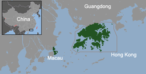

## Table of Contents

## What is a Special Administrative Region (SAR)?

A Special Administrative Region (SAR) is a special area within a country that has its own set of laws and rules, different from the rest of the country. This is usually done to keep the area's unique way of life, economy, and culture. For example, Hong Kong and Macau are SARs of China. They have their own legal systems, currencies, and immigration policies, even though they are part of China.

SARs are created to help these areas keep their special status and continue to grow and develop. They often have more freedom in how they manage their own affairs compared to other parts of the country. This can attract businesses and tourists because of the unique opportunities and benefits available in these regions.

## How does a Special Administrative Region differ from other regions within a country?

A Special Administrative Region (SAR) is different from other regions within a country because it has its own special rules and laws. While other regions follow the country's main laws, an SAR can have its own legal system, currency, and even immigration policies. This means that people living in an SAR might have different rights and responsibilities compared to people in other parts of the country.

The main reason for creating an SAR is to keep the area's unique way of life, economy, and culture. For example, Hong Kong and Macau are SARs of China. They were allowed to keep their own systems even after becoming part of China. This helps them attract businesses and tourists because they offer unique opportunities and benefits that are not available in other parts of the country. In contrast, other regions usually follow the national laws and policies more closely, without as much freedom to do things differently.

## What is the historical background of Special Administrative Regions?

The idea of Special Administrative Regions (SARs) started in the late 20th century. It was mainly used by China when it took back control of Hong Kong and Macau from Britain and Portugal. These places had been under foreign rule for a long time and had their own ways of doing things. China wanted to keep these ways the same, so it made them SARs. This meant they could keep their own laws, money, and ways of running things, even though they were now part of China.

The first SAR was Hong Kong, which became one in 1997. Macau followed in 1999. Both places were allowed to keep their own systems for 50 years under what is called the "one country, two systems" policy. This policy was a big part of the agreements made when Britain and Portugal handed over these places to China. The idea was to make sure that life in Hong Kong and Macau would not change too much, and they could keep being important centers for business and trade.

SARs are a special way for countries to handle areas that are different from the rest of the country. They help keep peace and stability by letting these areas keep their own ways of doing things. This can be good for the economy and for the people living there. It also shows how countries can find new ways to solve problems when they have to deal with different cultures and histories within their borders.

## Which countries currently have Special Administrative Regions?

Right now, only China has Special Administrative Regions. These are Hong Kong and Macau. They are special because they have their own rules and laws, even though they are part of China. Hong Kong used to be ruled by Britain, and Macau used to be ruled by Portugal. When they became part of China again, they were made into SARs so they could keep their own ways of doing things.

Hong Kong became a Special Administrative Region in 1997, and Macau followed in 1999. This was part of a big plan called "one country, two systems." It means that even though Hong Kong and Macau are part of China, they can still have their own money, laws, and ways of running things. This helps them stay important places for business and trade.

## What are the key features of a Special Administrative Region?

A Special Administrative Region, or SAR, is a special part of a country that has its own rules and laws, different from the rest of the country. This means that an SAR can have its own money, its own way of making laws, and even its own rules about who can come and live there. The main reason for having an SAR is to keep the area's unique way of life, economy, and culture. For example, Hong Kong and Macau are SARs of China. They were allowed to keep their own systems even after becoming part of China again.

SARs are important because they help keep peace and stability. By letting these areas keep their own ways of doing things, the country can make sure that life there does not change too much. This can be good for the economy and for the people living there. It also shows how countries can find new ways to solve problems when they have to deal with different cultures and histories within their borders. Right now, only China has SARs, and they are Hong Kong and Macau.

## How is the governance structure of an SAR different from the rest of the country?

The governance structure of a Special Administrative Region (SAR) is different from the rest of the country because an SAR has its own set of laws and rules. While the rest of the country follows the national laws, an SAR can have its own legal system. This means that the people living in an SAR might have different rights and responsibilities compared to people in other parts of the country. For example, Hong Kong and Macau, which are SARs of China, have their own courts and legal processes that are separate from mainland China's.

In addition to having their own legal systems, SARs can also have their own government structures. For instance, Hong Kong and Macau have their own Chief Executives and local governments that handle many of the day-to-day affairs. These local governments have more freedom to make decisions about things like education, health care, and economic policies compared to other regions in the country. This helps the SARs keep their unique ways of life and attract businesses and tourists by offering special opportunities and benefits that are not available in other parts of the country.

## What are the economic implications of establishing an SAR?

Establishing a Special Administrative Region (SAR) can have big effects on the economy. When a place becomes an SAR, it can keep its own rules and laws, which can make it a good place for businesses. Companies might want to set up in an SAR because they can have special benefits, like lower taxes or easier rules to follow. This can bring more money into the area and create more jobs. For example, Hong Kong and Macau, which are SARs of China, have become important centers for trade and finance because of their special status.

On the other hand, having an SAR can also make things more complicated. The rest of the country might not get the same benefits as the SAR, which can cause some people to feel left out. Also, the different rules in the SAR can make it harder to do business with the rest of the country. But if managed well, an SAR can help the whole country's economy by bringing in more money and making the country more attractive to foreign businesses and tourists.

## Can you provide examples of Special Administrative Regions and their unique characteristics?

Hong Kong is a Special Administrative Region of China. It used to be ruled by Britain until 1997. When it became part of China again, it was made into an SAR so it could keep its own laws and money. Hong Kong has its own legal system, which is different from the rest of China. It also has its own currency, called the Hong Kong dollar. This helps Hong Kong stay a big center for business and trade. People from all over the world come to Hong Kong to work and visit because it has special rules that make it easier to do business there.

Macau is another Special Administrative Region of China. It was ruled by Portugal until 1999. Like Hong Kong, Macau was made into an SAR to keep its own way of life. Macau has its own legal system and its own currency, called the Macanese pataca. Macau is famous for its casinos and tourism. It attracts a lot of visitors because it has special rules that make it a good place for gambling and entertainment. Both Hong Kong and Macau help China's economy by bringing in money and making the country more attractive to foreign businesses and tourists.

## How do Special Administrative Regions impact international relations?

Special Administrative Regions (SARs) can affect how countries work together. When a place like Hong Kong or Macau becomes an SAR, it can still have its own rules and laws, even though it is part of a bigger country like China. This can make other countries want to work with the SAR because it has special benefits, like easier rules for business or lower taxes. For example, many countries have special trade deals with Hong Kong because it is a big center for business and trade. This can help the country that has the SAR, like China, to have better relationships with other countries.

But having an SAR can also cause some problems. Other countries might worry about the different rules in the SAR and how they fit with the rest of the country. For example, some countries have been worried about how China's laws affect Hong Kong's freedom. This can make it harder for the country with the SAR to work with other countries. But if the SAR is managed well, it can help the country have better relationships with other countries by bringing in more money and making the country more attractive to foreign businesses and tourists.

## What legal frameworks govern Special Administrative Regions?

Special Administrative Regions (SARs) have their own special rules and laws that are different from the rest of the country. For example, Hong Kong and Macau, which are SARs of China, have their own legal systems. This means they can make their own laws about things like business, money, and who can come and live there. These laws are based on the systems they had before they became part of China again. Hong Kong's laws are based on British common law, and Macau's laws are based on Portuguese civil law. This helps them keep their own way of life and attract businesses and tourists.

The main rule that lets SARs have their own laws is called the "one country, two systems" policy. This policy was made when Britain and Portugal handed over Hong Kong and Macau to China. It says that even though Hong Kong and Macau are part of China, they can keep their own systems for 50 years. This means they can have their own courts, their own money, and their own rules about many things. The policy helps make sure that life in these places does not change too much and that they can keep being important centers for business and trade.

## What challenges do Special Administrative Regions face in terms of integration and autonomy?

Special Administrative Regions face challenges in balancing their autonomy with integration into the larger country. For example, Hong Kong and Macau are SARs of China. They have their own laws and ways of doing things, but they are still part of China. This can be hard because sometimes the rules in the SARs might not match the rules in the rest of the country. People in the SARs might want to keep their own ways, but the rest of the country might want them to follow the national rules more closely. This can cause tension and disagreements.

Another challenge is making sure the SARs stay connected to the rest of the country. Even though they have their own systems, they still need to work with the rest of the country on things like trade, travel, and security. This can be tricky because the different rules might make it harder to do things together. For example, people in Hong Kong might have different rights than people in mainland China, which can make it hard to work together on some issues. But if they can find ways to work together, it can help the whole country grow and stay strong.

## How might the concept of Special Administrative Regions evolve in the future?

In the future, the concept of Special Administrative Regions might change in different ways. As countries face new problems, they might find new ways to use SARs. For example, they might use SARs to help areas that are struggling with their economy or to keep peace in places with different cultures. Countries might also start using SARs more to attract businesses and tourists by offering special benefits. This could mean more countries setting up their own SARs, not just China.

Another way the concept might evolve is in how SARs work with the rest of the country. As time goes on, it might become easier for SARs to stay connected to the rest of the country. This could happen through better communication and more shared projects. But there might also be more tension as people in the SARs and the rest of the country want different things. Finding the right balance between keeping the SARs' special status and working together with the rest of the country will be important for the future of SARs.

## References & Further Reading

[1]: Deng, P. (2011). ["China's Political Economy in Modern Times"](https://archive.org/details/chinaspoliticale0000deng) by Palgrave Macmillan

[2]: Gómez, E. C. (2019). ["Autonomy in Subnational Island Jurisdictions."](https://pubmed.ncbi.nlm.nih.gov/30772908/) Routledge.

[3]: Lopez de Prado, M. (2018). ["Advances in Financial Machine Learning"](https://www.amazon.com/Advances-Financial-Machine-Learning-Marcos/dp/1119482089) Wiley.

[4]: Friedman, B. M. (1999). ["The Future of Hong Kong》(https://scholar.harvard.edu/bfriedman/publications/future-monetary-policy-central-bank-army-only-signal-corps) Palgrave Macmillan. 

[5]: Merino, N., & Ramon, A. V. (2018). ["The Political Economy of Special Economic Zones"](https://www.cambridge.org/core/journals/journal-of-institutional-economics/article/abs/political-economy-of-special-economic-zones/CE09F95681408037426D2F4D210BEEA5) Palgrave Macmillan.

[6]: Trotti, M. J. (2010). ["Autonomy and Federalism: Constitutional Choices for Africa"](https://www.academia.edu/57587587/WELLER_M_AND_NOBBS_K_eds_2010_Asymmetric_Autonomy_and_the_Settlement_of_Ethnic_Conflicts_Penn_Press_Philadelphia_360_p) The Journal of Modern African Studies, 48(4), 731-760.

[7]: Zyren, J., & Filipiuk, A. (2008). ["Algorithmic Trading and Its Implications on Market Liquidity and Stock Price Volatility"](https://www.jstor.org/stable/43303831) Review of Quantitative Finance and Accounting, 36(3), 309-329.