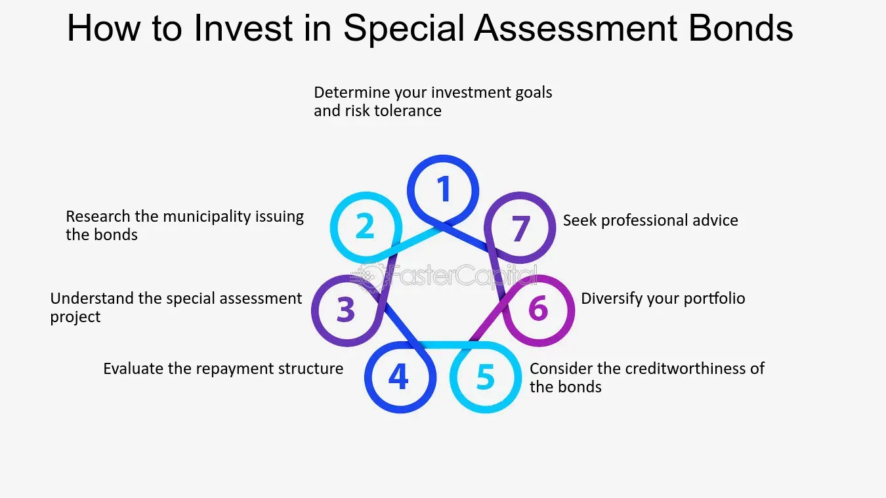

## Table of Contents

## What are Special Assessment Bonds?

Special Assessment Bonds are a type of municipal bond that local governments issue to fund specific projects, like building new roads or improving water systems. These bonds are paid back through special assessments, which are extra charges added to the property taxes of the people who benefit from the project. For example, if a new road is built, the people living near that road might have to pay a little more in taxes to help pay for it.

These bonds are different from general obligation bonds, which are backed by the full faith and credit of the issuing government. Instead, special assessment bonds are only backed by the revenue from those special assessments. This means they can be riskier for investors because if the people who are supposed to pay the assessments don't pay, the bond might not get paid back. But, they can also offer higher interest rates to make up for that risk.

## How do Special Assessment Bonds differ from general obligation bonds?

Special Assessment Bonds and general obligation bonds are both types of municipal bonds, but they have some key differences. Special Assessment Bonds are used to pay for specific projects, like building a new road or improving a water system. The money to pay back these bonds comes from special assessments, which are extra charges added to the property taxes of the people who benefit from the project. For example, if a new park is built, the people living near the park might have to pay a little more in taxes to help pay for it.

On the other hand, general obligation bonds are backed by the full faith and credit of the issuing government. This means that the government promises to use its general tax revenues to pay back the bond, not just the taxes from a specific group of people. Because of this, general obligation bonds are usually seen as safer for investors, but they might offer lower interest rates compared to Special Assessment Bonds. Special Assessment Bonds can be riskier because if the people who are supposed to pay the assessments don't pay, the bond might not get paid back, but they can offer higher interest rates to make up for that risk.

## What types of projects are typically funded by Special Assessment Bonds?

Special Assessment Bonds are often used to pay for projects that help specific areas or groups of people. These projects can include building new roads, fixing up old ones, or adding sidewalks and streetlights. They can also be used for things like improving water and sewer systems, which are important for keeping neighborhoods clean and safe. The idea is that the people who live near these improvements will benefit from them, so they should help pay for them through special assessments on their property taxes.

Sometimes, Special Assessment Bonds are used for projects that make neighborhoods nicer, like building parks or community centers. These projects can make an area more enjoyable to live in and can even increase property values. By using Special Assessment Bonds, the cost of these projects is shared among the people who will enjoy the new amenities, rather than being paid for by the whole city or town.

## Who is responsible for repaying Special Assessment Bonds?

The people who live near the project that the Special Assessment Bonds pay for are responsible for repaying these bonds. If a new road or park is built, the people who live close to it will have to pay a little more in their property taxes. This extra charge is called a special assessment, and it's used to pay back the money that was borrowed to build the project.

If the people who are supposed to pay these special assessments don't pay, it can be a problem. The bond might not get paid back, which makes Special Assessment Bonds riskier than other types of bonds. But because they are riskier, they can also offer higher interest rates to the people who buy them.

## How are Special Assessment Bonds structured?

Special Assessment Bonds are a way for local governments to borrow money to pay for specific projects, like new roads or parks. The money to pay back these bonds comes from special assessments, which are extra charges added to the property taxes of the people who live near the project. For example, if a new park is built, the people living close to it might have to pay a little more in taxes to help pay for it.

These bonds are set up so that the money collected from the special assessments goes straight to paying back the bond. This means that the bond is only backed by the money from these assessments, not by the general tax money of the whole city or town. If the people who are supposed to pay the assessments don't pay, it can be a problem because the bond might not get paid back. This makes Special Assessment Bonds riskier than other types of bonds, but they can also offer higher interest rates to make up for that risk.

## What are the benefits of using Special Assessment Bonds for funding projects?

Using Special Assessment Bonds to fund projects has several benefits. One big benefit is that it spreads the cost of the project among the people who will benefit from it the most. For example, if a new road is built, the people who live near it will have to pay a little more in taxes, but they will also get to use the new road. This way, the whole city or town doesn't have to pay for something that only a few people will use.

Another benefit is that Special Assessment Bonds can help get projects done faster. Because the money to pay back the bonds comes from the people who benefit from the project, the government can borrow the money it needs right away. This means that the project can start sooner, and the people who live near it can start enjoying the new road, park, or whatever the project is, sooner too.

## What are the risks associated with investing in Special Assessment Bonds?

Investing in Special Assessment Bonds can be riskier than other types of bonds. The main risk is that the people who are supposed to pay the special assessments might not pay them. If they don't, there won't be enough money to pay back the bond. This is different from general obligation bonds, which are backed by the whole city or town's tax money. With Special Assessment Bonds, if the people near the project don't pay, the bond might not get paid back at all.

Another risk is that the project might not be as successful as planned. If the new road or park doesn't make the area better or increase property values, the people living there might not want to pay the extra taxes. This could make it hard to collect the special assessments needed to pay back the bond. Because of these risks, Special Assessment Bonds can be less safe for investors, but they might offer higher interest rates to make up for that risk.

## How is the interest rate on Special Assessment Bonds determined?

The interest rate on Special Assessment Bonds is determined by a few things. One big thing is how risky the bond is. If it's risky, the interest rate will be higher. This is because investors want to be paid more for taking on more risk. Another thing that can affect the interest rate is how long the bond will last. Bonds that last longer usually have higher interest rates because there's more time for something to go wrong.

The market also plays a role in setting the interest rate. If a lot of people want to buy Special Assessment Bonds, the interest rate might go down because the government doesn't have to offer as much to get people to buy them. But if not many people want to buy them, the interest rate might go up to make them more attractive to investors. So, the interest rate is a balance between how risky the bond is, how long it lasts, and what's happening in the market.

## What is the process for issuing Special Assessment Bonds?

To issue Special Assessment Bonds, a local government first decides on a project that will benefit a specific area, like building a new road or park. They figure out how much money the project will cost and how they will collect the special assessments from the people who live near the project. These special assessments are extra charges added to the property taxes of those people. The government then creates a plan to show how the special assessments will be used to pay back the bond.

Next, the government goes out to the market to sell the Special Assessment Bonds. They work with banks or other financial companies to help them sell the bonds to investors. The government has to explain the project and the plan for paying back the bond to these investors. If the investors think the plan is good and the project will be successful, they will buy the bonds. The money from selling the bonds is then used to pay for the project. Over time, the special assessments collected from the property owners near the project are used to pay back the bond, including the interest owed to the investors.

## How do Special Assessment Bonds impact property owners?

Special Assessment Bonds can change things for people who own property near the project. If a new road or park is built, these property owners will have to pay a little more in their property taxes. This extra charge, called a special assessment, helps pay for the project. So, the cost of the new road or park is shared among the people who will use it the most.

Even though it means paying more in taxes, the project can also make the area nicer and might even make the property worth more money. A new road can make it easier to get around, and a new park can be a nice place to spend time. So, while property owners have to pay more, they also get to enjoy the benefits of the new project.

## What are the legal considerations and requirements for issuing Special Assessment Bonds?

When a local government wants to issue Special Assessment Bonds, they have to follow certain legal rules. First, they need to make sure they have the power to issue these bonds. This usually means they need to check their state laws and local rules to see if they can do it. They also need to figure out how they will collect the special assessments from the property owners near the project. This involves creating a plan that shows how much each property owner will have to pay and how long they will have to pay it. The government might need to hold public meetings to explain the project and the special assessments to the people who will be affected.

Once the plan is ready, the government has to get approval from the right people. This could mean getting a vote from the city council or another local government group. They also need to make sure they follow all the rules about how to sell the bonds to investors. This includes giving clear information about the project and how the special assessments will be used to pay back the bond. If they don't follow these rules, they could get in trouble, and the bond might not be valid. So, it's important for the government to be careful and follow all the legal steps when issuing Special Assessment Bonds.

## How do Special Assessment Bonds perform in different economic conditions?

Special Assessment Bonds can act differently depending on how the economy is doing. When the economy is good, people have more money and are more likely to pay their special assessments on time. This makes the bonds safer for investors because the government can collect the money it needs to pay back the bonds. Also, when the economy is strong, property values might go up because of the new projects, like roads or parks, which can make people happier to pay the extra taxes.

But when the economy is not doing well, Special Assessment Bonds can be riskier. If people lose their jobs or have less money, they might not be able to pay the special assessments. This can make it hard for the government to collect enough money to pay back the bonds. Because of this, investors might be more worried about buying these bonds during tough economic times, and the interest rates might go up to make up for the extra risk.

## References & Further Reading

1. **Municipal Finance Overview**:
   - "Municipal Bond Markets: Origins and Developments" by George J. Papadopoulos provides a comprehensive analysis of how municipal bonds have developed over time. This book explores the intricate workings of muni markets and is a critical resource for understanding the fundamentals of municipal finance.
   - "The Handbook of Municipal Bonds" edited by Sylvan G. Feldstein and Frank J. Fabozzi offers an in-depth guide to the municipal bond market, including various types of bonds, market participants, and investment strategies.

2. **Special Assessment Bonds**:
   - "Public Finance and the American Economy" by Neil Bruce discusses the role and impact of special assessment bonds in municipal finance. This book is essential for policymakers and financial analysts interested in the taxation mechanisms supporting public projects.
   - "The Theory and Practice of Revenue Allocation" provides case studies and theoretical perspectives on how special assessment bonds are utilized in generating revenues for specific local projects. This resource is beneficial for understanding the practical application and challenges associated with these bonds.

3. **Algorithmic Trading in Municipal Bonds**:
   - "Algorithmic Trading & DMA: An introduction to direct access trading strategies" by Barry Johnson is a primer on algorithmic trading strategies, providing insights into how these methods are applied in various financial markets, including municipal bonds.
   - "Quantitative Trading: How to Build Your Own Algorithmic Trading Business" by Ernie Chan offers a practical guide for understanding the technical aspects of algorithmic trading, with applications extending to the municipal bond market.

4. **Economic Reports and Industry Analysis**:
   - The Municipal Securities Rulemaking Board (MSRB) publications offer extensive data and analysis of municipal securities markets, including annual statistical summaries useful for market participants.
   - "Municipal Finance Journal" regularly features articles and reports on the latest trends, challenges, and innovations in municipal finance, including algorithmic trading and special assessment bonds.

5. **Practical Guides for Investors and Policymakers**:
   - "Investing in Municipal Bonds: How to Balance Risk and Reward for Success in Today’s Bond Market" by Philip Fischer provides strategic insights for investors looking to navigate the opportunities and risks associated with municipal bonds.
   - Government Finance Officers Association (GFOA) reports and guidelines provide best practices and recommendations for implementing effective municipal finance strategies, focusing on transparency and efficiency.

