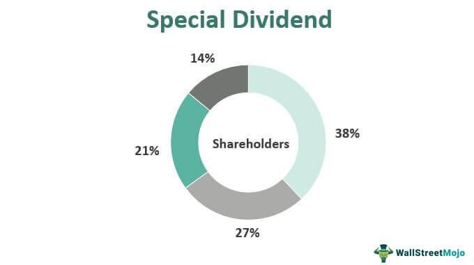

In today's dynamic financial landscape, understanding the nuances of investment income, particularly dividends, is essential for optimizing financial strategies. Dividends represent a significant portion of investment returns and are payouts from corporate profits to shareholders. They come in various forms and have distinct tax implications that can substantially impact an investor's after-tax income. 

This article explores the intricacies of special dividends, dividend taxation, and the role of algorithmic trading in managing investment income. Special dividends, distinct from regular dividends, are non-recurring and often arise from unique circumstances, such as a company's asset sale or an especially profitable period. Understanding these special payouts is crucial, as they can significantly affect investment decisions and portfolio performance.



Moreover, dividend income is subject to variable tax rates based on its classification, necessitating a comprehensive understanding of taxation rules to minimize liabilities. Algorithmic trading offers sophisticated methods to execute dividend-based strategies efficiently, leveraging technology to optimize trade timing and tax outcomes.

We'll discuss how different types of dividends are taxed, strategic use of algorithmic trading, and how these elements converge to maximize returns. The interplay of these factors underscores the importance of informed strategy in achieving financial success and highlights the need for continued education on evolving tax laws and trading technologies to maintain an optimized investment approach.

## Table of Contents

## Understanding Special Dividends

A special dividend is a non-recurring distribution of company earnings to shareholders that is separate from the regular, periodic dividends a company typically issues. Unlike regular dividends, which are usually distributed quarterly or annually and represent a portion of the company's ongoing profits, special dividends are often one-time events. They are typically declared when a company has accumulated a surplus of profits, possibly from exceptional operational performance or the sale of an asset.

Special dividends are issued under several circumstances. A company might distribute a special dividend when its cash reserves substantially exceed the amount needed for operational or strategic investments, such as expansion or acquisitions. Additionally, a company may issue a special dividend as a gesture of goodwill to reward loyal shareholders, particularly if there have been periods of irregular income or significant profits that are not expected to recur. Such distributions can also occur in situations where a company intends to alter its financial structure, such as moving from a corporation to a different type of business entity, where different capital requirements might affect dividend policies.

The impact of special dividends on share prices can be significant. In the short term, when a special dividend is announced, share prices may increase due to investor anticipation of immediate cash returns. This is because the future cash flow from receiving the dividend increases the stock's intrinsic value for investors holding the share before the ex-dividend date. However, on the ex-dividend date, the share price typically drops by an amount approximately equal to the dividend itself, reflecting the outflow of cash from the company. This adjustment is due to the reduction in the company's assets equivalent to the paid dividend. 

Investor perception of special dividends varies. Some investors view special dividends positively, interpreting them as a sign of strong financial health and efficient capital management. Others, however, may perceive the declaration of a special dividend as an indication that the company lacks viable reinvestment opportunities for growth. Consequently, the issuance of a special dividend could signal differing strategic implications to the market, depending on the context and the company's communication of its intentions.

## Taxation of Dividend Income

Dividend income is a crucial component of many investment portfolios, yet it presents varied taxation dynamics that investors must navigate. Understanding the different types of dividends and their tax implications is essential for effective financial planning.

### Qualified vs. Non-Qualified Dividends

**Qualified Dividends**

Qualified dividends are typically subjected to lower tax rates compared to ordinary income. To be classified as qualified, dividends must be issued by a U.S. corporation or a qualified foreign entity. Additionally, the investor must own the stock for more than 60 days during the 121-day period surrounding the ex-dividend date. Qualified dividends are taxed at the same rates as long-term capital gains, which as of 2023, are 0%, 15%, or 20%, depending on the taxpayer's income level.

**Non-Qualified Dividends**

Non-qualified dividends, often referred to as ordinary dividends, include dividends from real estate investment trusts (REITs) and master limited partnerships (MLPs). These dividends are taxed as ordinary income, subject to the individual's marginal tax rate, which can be as high as 37% depending on the taxpayer's taxable income bracket.

### Special Dividends Taxation

Special dividends, also known as extra dividends, are typically one-time distributions by a company to shareholders, potentially arising from extraordinary profits. For tax purposes, special dividends are treated according to how they are classified by the company. If a special dividend is deemed qualified, it enjoys the reduced tax rate. Conversely, if classified as non-qualified, it incurs the regular income tax rate. It's essential for investors to understand how these dividends are characterized by the company to anticipate tax obligations.

### Impact on Taxable Income and Overall Tax Liability

Dividend income, whether qualified or non-qualified, contributes to an individual's total taxable income. This addition can potentially push a taxpayer into a higher tax bracket, thereby increasing their overall tax liability. Investors should be mindful of tax brackets to strategically manage dividend income, perhaps by spreading out investments across tax-advantaged accounts such as Roth IRAs or using tax-loss harvesting strategies to offset gains.

For example, consider a taxpayer with a taxable income of $150,000. If they earn $10,000 in qualified dividends, these dividends could push part of their income from the 15% long-term capital gains bracket to the 20% bracket, depending on the specifics of the tax code and their overall income structure.

Overall, effectively managing dividend income through an understanding of tax classifications and strategic asset placement can significantly impact an investor’s net returns and tax efficiency.

## Algorithmic Trading and Dividend Income

Algorithmic trading leverages computer algorithms to execute trades based on predefined criteria, offering precision and speed far beyond human capabilities. When applied to dividend-based strategies, [algorithmic trading](/wiki/algorithmic-trading) can enhance the timing and efficiency of transactions related to dividend events.

One of the primary advantages of algorithmic trading in this context is the ability to optimize trade timing around key dividend dates. Algorithms can be programmed to execute trades precisely at times when dividend announcements or distributions occur, such as ex-dividend dates. This precision allows investors to potentially capture dividend payouts efficiently while minimizing market exposure. For instance, by automatically purchasing shares just before the ex-dividend date and selling them immediately after, algorithmic trading can facilitate a dividend capture strategy. This strategy exploits the fact that shareholders on record before the ex-dividend date are entitled to receive the dividend.

Another significant contribution of algorithmic trading to dividend strategies is the enhancement of tax efficiency. Algorithms can be designed to adhere to various tax regulations, ensuring that trades are executed in a manner that minimizes taxable events. For instance, algorithms can monitor and adjust the holding period of shares to qualify for favorable tax treatment on dividends, such as meeting the requirements for qualified dividend tax rates. By automatically monitoring holding periods and executing trades accordingly, algorithmic trading helps maximize after-tax returns.

Algorithmic trading also supports the dynamic adjustment of portfolios based on real-time data analysis. By continuously analyzing market conditions and dividend announcements, algorithms can recalibrate portfolios to optimize dividend yield and tax outcomes. This dynamic management ensures that portfolios remain aligned with investors' income and tax efficiency goals. Furthermore, algorithmic trading can incorporate [machine learning](/wiki/machine-learning) techniques to improve decision-making over time by learning from historical data and adapting to new market conditions.

In summary, algorithmic trading provides a sophisticated toolset for managing dividend-based investment strategies, optimizing trade timing, and enhancing tax efficiency through automated precision and adaptability.

## Strategies for Managing Dividend Taxes in Algorithmic Trading

Timing trades in relation to ex-dividend dates is a critical component of managing dividend taxes within algorithmic trading strategies. An ex-dividend date is the cutoff date that determines eligibility for receiving a company's dividend. Investors who purchase shares before this date are entitled to the dividend payment, whereas those who acquire shares on or after the ex-dividend date will not receive the dividend. This timing introduces strategic opportunities for optimizing dividend returns and tax liabilities.

Automated algorithmic strategies can be employed to navigate these timing nuances effectively. By leveraging algorithms, traders can precisely position trades to capture dividends or avoid dividend payments depending on their tax implications. For instance, if a dividend is non-qualified and subject to higher tax rates, traders might opt to sell before the ex-dividend date to avoid the tax burden. On the contrary, if the dividend is qualified and taxed at a lower rate, an algorithm may be designed to buy before and sell after the ex-dividend date to benefit from both the dividend and capital gains.

Consider the following Python example, which outlines a simple algorithmic approach to manage trades around ex-dividend dates:

```python
import datetime
import pandas as pd

def trade_based_on_exdividend(stock_data, qualified_dividend, current_date):
    # Analyze stock data to identify dividend dates
    for index, row in stock_data.iterrows():
        ex_dividend_date = row['ex_dividend_date']

        # Check if the trade should be made before ex-dividend for qualified dividends
        if qualified_dividend and current_date < ex_dividend_date:
            print(f"Buy before ex-dividend on {ex_dividend_date} for stock: {row['ticker']}")

        # Check if the trade should be made to sell before ex-dividend for non-qualified dividends
        elif not qualified_dividend and current_date < ex_dividend_date:
            print(f"Sell before ex-dividend on {ex_dividend_date} for stock: {row['ticker']}")

# Mock stock data
stock_data = pd.DataFrame({
    'ticker': ['AAPL', 'MSFT'],
    'ex_dividend_date': [datetime.date(2023, 10, 16), datetime.date(2023, 10, 18)]
})

trade_based_on_exdividend(stock_data, qualified_dividend=True, current_date=datetime.date(2023, 10, 15))
```

This basic example guides traders on whether to buy or sell based on the dividend qualification and proximity to the ex-dividend date.

Further optimizing dividend tax outcomes involves utilizing tax-advantaged accounts like Individual Retirement Accounts (IRAs) or Roth IRAs. These accounts offer tax deferral or complete tax elimination on dividend earnings, depending on the account type. Contributions to a traditional IRA allow for pre-tax investments, which means taxes are deferred until withdrawal, often at retirement when tax rates can be lower. In contrast, a Roth IRA involves post-tax contributions but allows for tax-free growth and distributions, making it optimal for long-term tax efficiency.

These strategies,potentially reduce immediate tax liabilities and enable traders to compound their dividend income more effectively. By combining the timing precision of algorithmic trading with the tax shielding features of specific account types, investors can significantly enhance the efficiency and overall value of their investment portfolios.

## Recent Changes and Trends in Taxation and Algo Trading

Recent changes and trends in taxation and algorithmic trading have significant implications for investors and traders. Various jurisdictions have updated tax laws affecting dividend income, prompting strategic adjustments from investors to maintain or enhance returns.

### Tax Law Changes

In recent years, tax legislation has undergone several changes, impacting how dividend income is taxed. Notably, some countries have adjusted the tax rates for qualified and non-qualified dividends. Qualified dividends, generally taxed at a lower capital gains rate, have seen varying rate adjustments depending on jurisdiction. Non-qualified dividends, taxed at ordinary income rates, have also experienced changes that can affect overall investment strategies and tax obligations. In the United States, for example, the Jobs and Tax Cuts Act (JTCA) of 2017 altered individual tax brackets, affecting the tax rate applied to dividend income based on the taxpayer’s income level.

Algorithmic trading is also influenced by these changes. The introduction of specific tax-related regulations can affect how algorithmic models are constructed, particularly those focusing on dividend capture strategies. Traders may need to adjust their algorithms to reflect changes in ex-dividend dates or other factors influencing dividend tax treatment in order to enhance their tax efficiency.

### Regulatory Changes and Implications

New regulatory frameworks have been put in place to address the growing complexity in trading technologies. Regulatory bodies are keen on ensuring transparency and fairness in trading practices, which sometimes results in stricter compliance measures for algorithmic trading. These may include requirements for detailed algorithmic strategies disclosures or constraints on high-frequency trading ([HFT](/wiki/high-frequency-trading-strategies)), to mitigate systemic risk and protect market integrity.

The implications of these regulatory changes can be significant. For one, trading strategies might need revisions to comply with updated disclosure requirements or trading limits. This compliance adds layers of operational adjustments and possibly costs for traders, affecting profit margins. Additionally, increased scrutiny of algorithmic approaches might lead firms to prioritize models which enhance transparency and predictability in response to regulatory demands.

### Future Trends

Going forward, dividend taxation is expected to continue evolving. With the global focus on equity redistribution and increased public spending, changes such as increased tax rates on dividend income or the introduction of new tax brackets are potential adjustments governments might explore. Investors should prepare for these possibilities by diversifying income streams or utilizing tax-advantaged accounts more effectively.

Algorithmic trading is poised for further technological evolution, driven by advancements in [artificial intelligence](/wiki/ai-artificial-intelligence) and machine learning. These technologies offer improved predictive capabilities and execution efficiencies, benefiting strategies that rely on timing and precision, such as dividend capture. The continued integration of big data analytics in trading could significantly reshape how algorithms are developed and implemented, leading to more intelligent decision-making models that better navigate regulatory landscapes and market [volatility](/wiki/volatility-trading-strategies).

In conclusion, investors and traders must remain vigilant to adapt to ongoing changes in both tax policies and algorithmic trading technologies. Proactive strategies and continued learning are essential to optimize investment outcomes in a dynamic regulatory and technological environment.

## Conclusion

Understanding the intersection of dividends, taxation, and algorithmic trading is crucial for investors aiming to optimize their financial strategies. The complex nature of dividend income, especially with special dividends, requires careful attention to how these earnings are taxed. Different types of dividends, such as qualified and non-qualified, have distinct tax implications, influencing an investor's taxable income and overall tax liability. Recognizing these distinctions is essential for tax-efficient investment management.

Algorithmic trading offers significant advantages in managing investment income, particularly with dividend-based strategies. This approach allows investors to optimize the timing of trades around dividend events, enhancing the potential for maximizing returns while minimizing tax liabilities. By employing algorithms, investors can execute trades strategically, aligning with key dates like ex-dividend dates, to improve tax outcomes.

To maintain financial optimization, staying informed about recent changes in tax laws and advancements in trading technology is paramount. Tax regulations are continually evolving, and understanding these shifts is vital for refining trading strategies and ensuring compliance. Additionally, embracing new technologies in algorithmic trading can unlock further efficiencies and opportunities for investors.

In conclusion, leveraging a comprehensive understanding of dividend taxation and the strategic implementation of algorithmic trading can significantly enhance tax planning and financial performance. Investors should prioritize ongoing education on these topics, keeping abreast of regulatory changes and technological advancements to achieve sustained financial success.

## References & Further Reading

1. **Dividend Income and Taxation**
   - The U.S. Internal Revenue Service (IRS) provides comprehensive guidelines on how dividend income is taxed. Their official website is a valuable resource for understanding tax brackets, qualified versus non-qualified dividends, and other taxation rules applicable to dividend income. Visit the IRS website at [irs.gov](https://www.irs.gov/taxtopics/tc404).
   - For a deeper exploration of tax-efficient investment strategies involving dividend income, "Tax-Efficient Investing for Beginners" by National Endowment for Financial Education offers practical insights. This publication is available on [nefe.org](https://www.nefe.org).

2. **Special Dividends**
   - Investopedia is an excellent resource for understanding the unique characteristics of special dividends. Their articles explain the circumstances under which companies issue special dividends and the impact on share prices. Access the relevant article at [investopedia.com](https://www.investopedia.com/terms/s/specialdividend.asp).
   - For academic research on the effect of special dividends on stock performance and investor perception, "The Journal of Finance" offers peer-reviewed articles. Access their digital library at [jstor.org](https://www.jstor.org).

3. **Algorithmic Trading**
   - Algorithmic trading strategies, particularly those focusing on dividend capture, are thoroughly discussed in "Algorithmic Trading and DMA" by Barry Johnson. This book offers insights into the mechanics and strategies for optimizing trading outcomes. Available on [Amazon](https://www.amazon.com).
   - The Securities and Exchange Commission (SEC) provides guidelines and regulations related to algorithmic trading, which are crucial for traders seeking compliance and efficiency. Visit the SEC’s website at [sec.gov](https://www.sec.gov).

4. **Recent Changes and Trends**
   - Stay updated with recent changes in taxation laws by following publications from tax consultancy firms like Deloitte or PwC, which provide frequent updates on tax reforms. Their websites offer a plethora of articles and whitepapers on evolving tax implications for dividend income. Access [Deloitte's publications](https://www2.deloitte.com/us/en/insights.html) and [PwC's insights](https://www.pwc.com/gx/en/insights.html).
   - For recent trends in algorithmic trading, the "Automated Trader" magazine publishes insights and forecasts regarding the future of trading technology. Their articles can be accessed at [automatedtrader.net](http://www.automatedtrader.net).

Readers are encouraged to explore these resources to broaden their understanding of investment income, taxation intricacies, and the strategic implementation of algorithmic trading.

