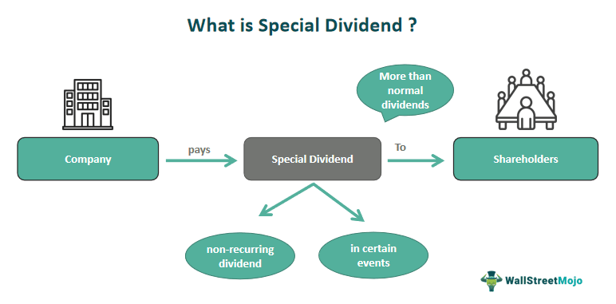

## Table of Contents

## What is a special dividend?

A special dividend is an extra payment that a company gives to its shareholders. It is different from the regular dividends that a company might pay out on a schedule, like every quarter or every year. A special dividend is usually a one-time thing and can happen when a company has extra money that it doesn't need for its business.

Companies might decide to pay a special dividend for different reasons. They might have had a really good year and made a lot of money, or they might have sold something big, like a part of their business, and now they have extra cash. When this happens, the company's leaders might choose to share some of that extra money with the people who own the company's stock, as a way to say thank you and keep them happy.

## How does a special dividend differ from a regular dividend?

A special dividend is different from a regular dividend because it's not something that happens on a set schedule. Regular dividends are payments that a company makes to its shareholders at regular times, like every three months or once a year. These payments are expected by the shareholders and are part of the company's normal business plan. On the other hand, a special dividend is a one-time payment that a company decides to give out when it has extra money it doesn't need for its regular business activities.

The reasons for paying a special dividend can be different from those for regular dividends. A company might pay a special dividend if it had a really good year and made a lot more money than it expected, or if it sold something big and got a lot of cash from it. This extra money is what the company uses to pay the special dividend. Regular dividends, however, come from the company's normal profits and are planned as part of how the company shares its earnings with shareholders regularly.

## Why do companies issue special dividends?

Companies issue special dividends when they have extra money that they don't need for their regular business. This extra money can come from a really good year where they made a lot more profit than they expected. It can also come from selling something big, like a part of their business or some property, and getting a lot of cash from it. When this happens, the company's leaders might decide to share some of this extra money with the people who own the company's stock. This is a way to say thank you to the shareholders and keep them happy.

Another reason companies might issue special dividends is to show that they are doing well and have a strong financial position. By giving out extra money, they can signal to the market that they are confident about their future and have more cash than they need for their current plans. This can make investors feel good about the company and might even make the company's stock price go up. Special dividends are not something that happens all the time, so when they do, it can be a big deal for shareholders.

## What are the tax implications of receiving a special dividend for individual investors?

When you get a special dividend, you have to pay taxes on it, just like with regular dividends. In the United States, special dividends are usually taxed as ordinary income if they are considered non-qualified dividends. This means they are added to your other income, and you pay taxes on the total at your regular income tax rate. The tax rate can be higher than the rate for qualified dividends, which are taxed at a lower rate, usually 0%, 15%, or 20%, depending on your income.

However, if the special dividend meets certain rules, it might be treated as a qualified dividend. To be a qualified dividend, the company paying it must be based in the U.S. or a country that has a tax treaty with the U.S., and you must have held the stock for a certain amount of time before and after the dividend was paid. If it's a qualified dividend, you'll pay the lower tax rate. It's a good idea to talk to a tax professional to understand exactly how your special dividend will be taxed, because tax laws can change and your personal situation can affect how much you owe.

## How are special dividends taxed differently from regular dividends?

Special dividends and regular dividends are both taxed, but the way they are taxed can be different. If a special dividend is considered a non-qualified dividend, it's taxed as ordinary income. This means it gets added to your other income, and you pay taxes on the total at your regular income tax rate. This rate can be higher than the rate for qualified dividends.

Sometimes, a special dividend can be treated as a qualified dividend if it meets certain rules. To be a qualified dividend, the company must be based in the U.S. or a country with a tax treaty with the U.S., and you must have held the stock for a certain amount of time before and after the dividend was paid. If it's a qualified dividend, you pay a lower tax rate, which can be 0%, 15%, or 20%, depending on your income. It's a good idea to talk to a tax professional to make sure you understand how your special dividend will be taxed.

## Can special dividends affect a company's stock price, and if so, how?

Special dividends can affect a company's stock price in a few ways. When a company announces a special dividend, it often makes the stock price go up right away. This happens because investors see the special dividend as a good sign that the company is doing well and has extra money to share. People might want to buy the stock to get the special dividend, which can push the price up.

After the special dividend is paid out, the stock price might go down a bit. This is because the value of the special dividend gets taken out of the stock price. If a company pays a $5 special dividend, the stock price might drop by about $5 on the day the dividend is paid. But if investors still think the company is doing well, the stock price might not drop as much, or it might even keep going up over time.

## What are the accounting treatments for special dividends?

When a company decides to pay a special dividend, it has to record this in its financial statements. The company first sets aside the money it wants to pay as a special dividend. This is done by moving money from the company's retained earnings, which is the profit the company has kept over time, to a special account called dividends payable. This shows that the company owes this money to its shareholders.

Once the special dividend is paid out to the shareholders, the company records the payment by reducing the dividends payable account back to zero and also reducing the cash account by the same amount. This reflects that the company has given the money to its shareholders and no longer has it. The whole process is straightforward but important for keeping the company's financial records accurate and up to date.

## How do special dividends impact a company's financial statements?

When a company decides to pay a special dividend, it affects its financial statements in a few ways. First, the company moves money from its retained earnings, which is the profit it has saved up over time, to a special account called dividends payable. This shows that the company now owes this money to its shareholders. On the balance sheet, you'll see the retained earnings go down and the dividends payable go up by the same amount.

When the special dividend is actually paid out to shareholders, the company's cash account goes down by the amount of the dividend. At the same time, the dividends payable account goes back to zero because the company has paid what it owed. So, on the balance sheet, you'll see the cash go down and the dividends payable go back to zero. This keeps the company's financial records accurate and shows that the money has been given to the shareholders.

## Are there any specific regulations or guidelines that companies must follow when issuing special dividends?

When a company wants to issue a special dividend, it has to follow certain rules and guidelines. These rules can be different depending on where the company is located and the stock market it's listed on. In the United States, for example, companies need to follow the rules set by the Securities and Exchange Commission (SEC). They have to make sure they tell everyone about the special dividend in a clear way, usually through a press release or a filing with the SEC. This helps keep things fair and open for everyone who owns the company's stock.

Also, companies need to make sure they have enough money to pay the special dividend without hurting their business. They can't just give away all their cash if it means they won't be able to pay their bills or keep running their business. Sometimes, the company's own rules, like what's written in their bylaws or what the board of directors decides, can also affect how and when they can pay a special dividend. It's important for companies to follow these rules to keep their shareholders happy and to stay out of trouble with the law.

## What historical examples illustrate the impact of special dividends on both the company and its shareholders?

In 2012, Costco announced a special dividend of $7 per share, which was a big deal for the company and its shareholders. This special dividend was paid because Costco had a lot of extra money and wanted to share it with the people who owned its stock. When Costco announced the dividend, the stock price went up a lot because investors were excited to get the extra money. But after the dividend was paid, the stock price dropped by about $7, which is normal because the value of the dividend gets taken out of the stock price. Even with the drop, many shareholders were happy because they got the special dividend and still had their stock.

Another example is Microsoft's special dividend in 2004. Microsoft paid a special dividend of $3 per share, which was a big surprise for shareholders. The company had a lot of cash from its successful business and decided to give some of it back to the people who owned its stock. When Microsoft announced the special dividend, the stock price went up because investors were happy about the extra money. After the dividend was paid, the stock price went down a bit, but not as much as the dividend amount. This showed that investors still believed in Microsoft's future and were happy with the special dividend.

## How can investors strategize around the announcement and payment of special dividends?

Investors can strategize around special dividends by paying close attention to company announcements and financial news. When a company says it will pay a special dividend, the stock price often goes up right away. Investors can buy the stock before the special dividend is paid to get the extra money. But they need to be quick because the stock price might go up a lot when the special dividend is announced. Also, investors should think about how long they want to keep the stock. If they only want the special dividend, they might sell the stock after getting it, but they need to know that the stock price might drop by the amount of the dividend after it's paid.

Another way investors can strategize is by looking at the company's financial health. If a company has a lot of extra money and a strong business, it might be more likely to pay a special dividend. Investors can look at the company's earnings reports and cash flow statements to see if it has enough money to pay a special dividend. They can also think about how the special dividend might affect the company's future. If the company gives away too much money, it might not have enough left to grow or pay its bills. So, investors need to balance the chance to get a special dividend with the company's long-term health.

## What are the potential long-term effects on a company's financial health after issuing a special dividend?

When a company pays a special dividend, it can affect its financial health in the long run. If the company gives away a lot of its cash, it might not have enough money left to grow its business or pay for important things like new equipment or buildings. This can slow down the company's growth and make it harder for it to keep up with other companies in its industry. Also, if the company needs money later on, it might have to borrow more, which can be expensive and risky.

On the other hand, paying a special dividend can also have good effects on a company's financial health. If the company's leaders are smart about it and only pay a special dividend when they have extra money they don't need, it can show everyone that the company is doing well. This can make investors feel good about the company and want to buy its stock, which can make the stock price go up. A higher stock price can make it easier for the company to get money in the future if it needs it, like by selling more stock or borrowing money at a better rate.

## References & Further Reading

1. **Dividend Income and Taxation**
   - The U.S. Internal Revenue Service (IRS) provides comprehensive guidelines on how dividend income is taxed. Their official website is a valuable resource for understanding tax brackets, qualified versus non-qualified dividends, and other taxation rules applicable to dividend income. Visit the IRS website at [irs.gov](https://www.irs.gov/taxtopics/tc404).
   - For a deeper exploration of tax-efficient investment strategies involving dividend income, "Tax-Efficient Investing for Beginners" by National Endowment for Financial Education offers practical insights. This publication is available on [nefe.org](https://www.nefe.org).

2. **Special Dividends**
   - Investopedia is an excellent resource for understanding the unique characteristics of special dividends. Their articles explain the circumstances under which companies issue special dividends and the impact on share prices. Access the relevant article at [investopedia.com](https://www.investopedia.com/terms/s/specialdividend.asp).
   - For academic research on the effect of special dividends on stock performance and investor perception, "The Journal of Finance" offers peer-reviewed articles. Access their digital library at [jstor.org](https://www.jstor.org).

3. **Algorithmic Trading**
   - Algorithmic trading strategies, particularly those focusing on dividend capture, are thoroughly discussed in "Algorithmic Trading and DMA" by Barry Johnson. This book offers insights into the mechanics and strategies for optimizing trading outcomes. Available on [Amazon](https://www.amazon.com).
   - The Securities and Exchange Commission (SEC) provides guidelines and regulations related to algorithmic trading, which are crucial for traders seeking compliance and efficiency. Visit the SEC’s website at [sec.gov](https://www.sec.gov).

4. **Recent Changes and Trends**
   - Stay updated with recent changes in taxation laws by following publications from tax consultancy firms like Deloitte or PwC, which provide frequent updates on tax reforms. Their websites offer a plethora of articles and whitepapers on evolving tax implications for dividend income. Access [Deloitte's publications](https://www2.deloitte.com/us/en/insights.html) and [PwC's insights](https://www.pwc.com/gx/en/insights.html).
   - For recent trends in algorithmic trading, the "Automated Trader" magazine publishes insights and forecasts regarding the future of trading technology. Their articles can be accessed at [automatedtrader.net](http://www.automatedtrader.net).

Readers are encouraged to explore these resources to broaden their understanding of investment income, taxation intricacies, and the strategic implementation of [algorithmic trading](/wiki/algorithmic-trading).

