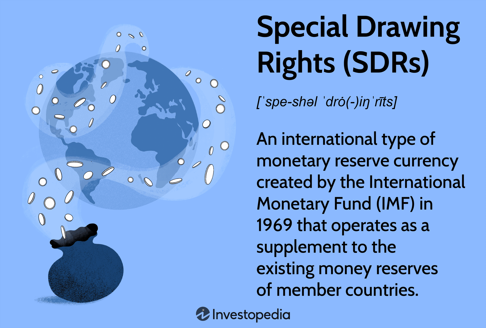

The global financial landscape is in a state of perpetual transformation, heavily influenced by advancements in technology and shifts in economic paradigms. At the heart of this dynamic environment lies the International Monetary Fund's (IMF) Special Drawing Rights (SDRs), which, though not conventional currencies, are pivotal assets for the IMF's member nations. Established to bolster international liquidity, SDRs have progressively become instrumental in providing financial support during periods of economic distress.

SDRs are unique in that they are derived from a basket of key international currencies: the U.S. dollar, Japanese yen, euro, British pound, and Chinese yuan. This composite nature ensures that SDRs maintain a stable value, thereby serving as a reliable financial resource for nations across the globe. As financial markets and economic activities become increasingly sophisticated, the integration of SDRs with modern technologies, specifically algorithmic trading, is gaining attention.



Algorithmic trading, characterized by the utilization of complex algorithms to make trading decisions, operates at a speed and efficiency far surpassing traditional methods. By combining this with the strategic use of SDRs, there exists potential to enhance macroeconomic stability and foster financial innovation. This synergy could revolutionize financial systems, enabling more effective liquidity management, risk mitigation, and strategic investments—key factors for sustaining economic growth.

Understanding the intersection of SDRs with algorithmic trading is crucial as it not only uncovers new avenues for economic resilience but also provides essential insights into shaping future financial policies. By optimizing the deployment and management of SDRs through cutting-edge techniques, stakeholders can better navigate the challenges of a rapidly evolving global economy, leveraging new opportunities for sustainable development and shared prosperity.

## Table of Contents

## Understanding Special Drawing Rights (SDRs)

Special Drawing Rights (SDRs) were introduced by the International Monetary Fund (IMF) as a supplementary international reserve asset. They are designed to augment the official reserves of member countries, providing a crucial financial resource that can be utilized during economic exigencies. Unlike traditional currencies, SDRs do not function as a medium of exchange for the purchase of goods and services but instead serve as a potential claim on the freely usable currencies of IMF member countries. This arrangement allows countries to exchange SDRs for more liquid assets in a moment of need, facilitating global liquidity.

The value of an SDR is determined by a basket of five major international currencies, specifically the U.S. dollar, Japanese yen, euro, British pound, and Chinese yuan. This diversified currency basket provides a stable valuation, minimizing the exchange rate [volatility](/wiki/volatility-trading-strategies) risks associated with any single currency. The IMF reviews the composition of the currency basket every five years to ensure it reflects the current status of global trade and financial systems.

During times of financial instability or when a nation experiences a balance of payments crisis, SDRs can be allocated or used to receive additional [liquidity](/wiki/liquidity-risk-premium). This function contributes to the stabilization of the international monetary system by providing countries with the means to address short-term liquidity challenges without resorting to drastic economic measures.

SDRs are allocated to countries by the IMF according to their quotas in the IMF, which are broadly determined by the size of their economies. After allocation, countries can utilize SDRs in exchange transactions with other member countries or in dealings with the IMF itself. These exchanges are typically conducted through voluntary trading arrangements between member countries, ensuring flexibility and responsiveness in addressing individual liquidity needs.

In conclusion, Special Drawing Rights provide member countries with a valuable financial tool to supplement reserves, stabilize economies, and maintain confidence during economic crises. By functioning as a claim on the world's most significant currencies, SDRs contribute to the maintenance and stability of the global financial system.

## Historical Context and Purpose of SDRs

Special Drawing Rights (SDRs) were introduced by the International Monetary Fund (IMF) in 1969 to address the critical issue of global liquidity shortages that were highlighted during the Bretton Woods era. At that time, the international financial system was heavily reliant on gold and the U.S. dollar as the primary reserves held by countries to manage their own currency values. However, these reserves were finite and increasingly insufficient to support the expanding global trade and investment markets.

The creation of SDRs was an innovative solution to supplement existing reserves and maintain stability in the global economic system. SDRs function as an international reserve asset, providing countries with an additional layer of financial security and flexibility. Each SDR allocation is distributed among IMF member countries proportional to their IMF quotas.

The value of SDRs is derived from a basket of major international currencies, including the U.S. dollar, euro, Japanese yen, British pound sterling, and Chinese yuan. This structure allows the SDR to act as a potential claim on the freely usable currencies of IMF member nations, giving it a distinctive advantage in liquidity provision. For instance, countries experiencing balance of payments pressures can exchange SDRs for hard currency, thereby enhancing their financial stability without increasing their debt levels.

Since their establishment, SDRs have primarily benefited developing countries, offering a safety net during times of economic distress. As global financial systems evolved, so too did the role of SDRs. They have become crucial not only for immediate liquidity relief but also as a tool for strategic reserve management and international financial cooperation.

In recent years, the applicability of SDRs has expanded to address new dimensions of global finance, akin to developments such as [algorithmic trading](/wiki/algorithmic-trading). While SDRs themselves are not directly traded or invested in markets, their underpinning in the world's major currencies makes them relevant in a highly digitized and fast-paced financial environment. For example, algorithmic trading strategies could potentially optimize the use of SDRs by enhancing currency exchange mechanisms, ultimately supporting a more resilient global monetary framework. 

In conclusion, the evolution of SDRs from a simple reserve asset to a comprehensive financial instrument reflects their enduring importance in supporting global economic stability and addressing the dynamic challenges of modern finance.

## Algorithmic Trading and Its Role in Modern Finance

Algorithmic trading, commonly referred to as algo trading, involves the use of computer programs and algorithms to execute trades in financial markets. These programs can process vast quantities of market data at high speeds, enabling them to make trading decisions faster than a human trader ever could. The efficiency brought by algo trading in today's financial markets stems from its ability to precisely and rapidly execute orders, often capitalizing on minute price discrepancies that exist only briefly.

Algo trading primarily involves strategies driven by predefined sets of rules or algorithms, which dictate the trade execution process. These rules can be based on timing, price, quantity, or any mathematical model that the trader wishes to implement. For example, an algorithm might be programmed to buy stocks when certain technical indicators align, or when a stock's price falls below a predetermined level.

A key advantage of algorithmic trading lies in its capacity to handle complex trading strategies that would be cumbersome or even impossible for human traders to manage manually. By removing emotive decision-making, algo trading ensures trades are entered and executed with precision and objectivity. This can result in higher trading volumes and liquidity, contributing to smoother market operations.

Incorporating high-speed data processing, algo trading can execute orders within milliseconds. This speed is critical when capturing [arbitrage](/wiki/arbitrage) opportunities that often exist for only a few seconds. Additionally, the ability to back-test algorithms against historical data allows traders to refine and improve their strategies over time, enhancing overall performance.

For financial instruments like Special Drawing Rights (SDRs), understanding and leveraging the dynamics of algo trading can be particularly beneficial. Algorithmic strategies can optimize SDR allocation and reserve management by enabling more strategic investments across global currencies. Furthermore, the increased transparency and reduced transaction costs associated with algo trading can facilitate more efficient cross-currency exchanges, which are crucial for managing SDRs in an interconnected financial ecosystem.

Overall, the efficient, high-speed, and strategic nature of algorithmic trading solidifies its role as a cornerstone of modern finance, enhancing both market liquidity and the strategic deployment of complex financial instruments like SDRs.

## The Intersection of SDRs and Algorithmic Trading

Integrating Special Drawing Rights (SDRs) with algorithmic trading strategies can significantly enhance liquidity management and risk mitigation strategies for both countries and financial institutions. Algorithmic trading, by leveraging high-speed data processing and advanced algorithms, allows for the automatic execution of trades based on predefined criteria. This capability is crucial for optimizing the conversion and utilization of SDRs across various currency markets.

One of the critical advantages of using algorithmic trading strategies in the context of SDRs is portfolio diversification. SDRs, which are valued based on a basket of major global currencies, require efficient conversion mechanisms when utilized. Algorithmic trading can identify optimal moments for currency conversion, reducing the risks associated with currency fluctuations. For instance, an algorithm could be programmed to execute conversion trades when the exchange rate for a particular currency within the SDR basket is favorable, thereby maximizing the value obtained from each SDR unit.

Moreover, algorithmic trading can increase transparency and reduce transaction costs associated with SDR exchanges. By automating trades, algorithms ensure that transactions are executed at market rates without the lags associated with manual trading. This efficiency reduces the bid-ask spread, which in turn lowers transaction costs. Additionally, automated systems maintain a detailed transaction log, offering increased transparency and accountability, crucial elements in global currency exchanges involving SDRs.

Incorporating algorithmic trading strategies with SDRs also supports the development of a more resilient monetary framework. For both developed and developing nations, this integration can improve economic stability by providing more efficient tools for managing exchange reserves. By applying sophisticated algorithms to manage SDR allocations, countries can better adjust to economic fluctuations, mitigate risks associated with currency exposure, and ensure more stable economic growth.

The Python example below illustrates a simple algorithmic trading strategy designed to optimize SDR conversion based on currency exchange rate thresholds:

```python
import requests

# Function to fetch current exchange rates for SDR basket currencies
def fetch_exchange_rates():
    response = requests.get("https://api.exchangeratesapi.io/latest?base=SDR")
    return response.json()

# Simple trading algorithm to optimize currency conversion
def optimize_sdr_conversion(thresholds):
    exchange_rates = fetch_exchange_rates()
    for currency, rate in exchange_rates['rates'].items():
        if rate > thresholds.get(currency, float('inf')):
            print(f"Convert SDR to {currency} at rate {rate}")

# Define thresholds for currency conversion
conversion_thresholds = {
    'USD': 1.4,
    'EUR': 1.2,
    'GBP': 1.0,
    'JPY': 150.0,
    'CNY': 9.0
}

# Run optimization
optimize_sdr_conversion(conversion_thresholds)
```

This example simplifies the process by checking current exchange rates against predefined thresholds to decide whether a conversion is advantageous. Real-world applications would involve more complex logic and integration with trading platforms but highlight the potential for algorithmic trading to enhance the effectiveness of SDR management, contributing to both economic growth and stability.

## Challenges and Opportunities

The integration of Special Drawing Rights (SDRs) with algorithmic trading introduces a complex array of challenges, primarily rooted in regulatory compliance and the technical infrastructure required to support such a system. Regulatory standards across different jurisdictions may vary significantly, potentially creating hurdles for seamless cross-border transactions involving SDRs. Institutions must ensure compliance with international laws and financial regulations, necessitating close collaboration with policymaking bodies to address these constraints effectively.

From a technical standpoint, the development and maintenance of infrastructure capable of handling high-frequency algorithmic trading linked to SDRs demand significant investment. This infrastructure must be capable of supporting rapid data processing and execution, often required in algo trading paradigms, where decisions are made within milliseconds. Financial institutions must invest in advanced computational platforms and maintain low latency networks to fully leverage the benefits of algorithmic strategies in managing SDR transactions.

Amid these challenges, substantial opportunities arise. For emerging economies, algorithmic trading can significantly enhance the usability and accessibility of SDRs. By optimizing the conversion and management of SDR allocations across various currencies, algorithmic trading can support better portfolio diversification and risk management. This, in turn, enables countries with emerging markets to stabilize their reserves and reduce exposure to currency crises.

Ensuring robust cybersecurity measures is crucial when integrating SDRs with algorithmic trading. Protecting against potential cyber threats is paramount, as the security of international financial transactions and sensitive monetary data is at stake. Enhanced cybersecurity frameworks protect against data breaches and ensure the integrity of financial operations involving SDRs.

As global financial ecosystems grow increasingly interconnected, both policymakers and investors must understand how algorithmic trading impacts SDR utilization. The combination of these elements can potentially transform financial systems, paving the way for improved macroeconomic stability across diverse economies. However, it is essential that stakeholders implement these advanced tools with careful consideration of the risks involved, ensuring a balance between innovation and security.

## Conclusion

The convergence of the International Monetary Fund's (IMF) Special Drawing Rights (SDRs) and algorithmic trading signifies a transformative development in global finance and macroeconomic management. This amalgamation presents a future in which financial innovation could significantly bolster the stability and growth potential of economies worldwide. By integrating SDRs, which provide emergency liquidity and enhance currency reserves, with algorithmic trading, which ensures rapid and efficient execution, financial systems stand to gain from increased efficiency and reduced operational costs. The application of algorithmic strategies to SDR transactions can optimize liquidity management, facilitate smoother currency exchanges, and encourage diversification, potentially leading to increased resilience in both emerging and established markets.

The continuous evolution of these tools necessitates further exploration and implementation to maximize their benefits. As SDRs and algorithmic trading techniques advance, they offer unprecedented opportunities for more robust and responsive financial frameworks that cater to the dynamic needs of global economies. By leveraging these advancements, participating countries can achieve not only financial stability but also unlock new avenues for economic growth.

To harness the full potential of this synergy, collaboration among stakeholders, including policymakers, financial institutions, and technology developers, is essential. This collaboration should focus on navigating technical challenges, such as enhancing regulatory compliance and safeguarding cybersecurity, while promoting inclusivity and accessibility in global financial ecosystems. Through diligent and adaptive management, the integration of SDRs and algorithmic trading can be optimized, ensuring that all nations can reap the benefits of this innovative financial landscape.

## References & Further Reading

[1]: ["Special Drawing Rights (SDRs): The Role of the International Monetary Fund."](https://www.imf.org/en/Topics/special-drawing-right) International Monetary Fund, Factsheet.

[2]: ["The SDR at Forty"](https://plumberpilot.com/pipe-line/sdr-35-vs-schedule-40/) by Barry Eichengreen, 2009. International Monetary Fund, Working Paper.

[3]: Narang, R. (2013). ["Inside the Black Box: A Simple Guide to Quantitative and High-Frequency Trading."](https://onlinelibrary.wiley.com/doi/book/10.1002/9781118662717) Wiley Trading.

[4]: Lopez, C. & Garcia, J. (2020). ["Algorithmic Trading: A Comprehensive Beginners Guide to Learn and Understand Algorithmic Trading and Its Components."](https://ichgcp.net/cs/clinical-trials-registry/publications/271475-new-metrics-to-assess-type-2-diabetes-after-bariatric-surgery-the-time-within-remission-range)

[5]: ["Handbook of Exchange Rates"](https://onlinelibrary.wiley.com/doi/book/10.1002/9781118445785) by Jessica James, Ian W. Marsh, Lucio Sarno.