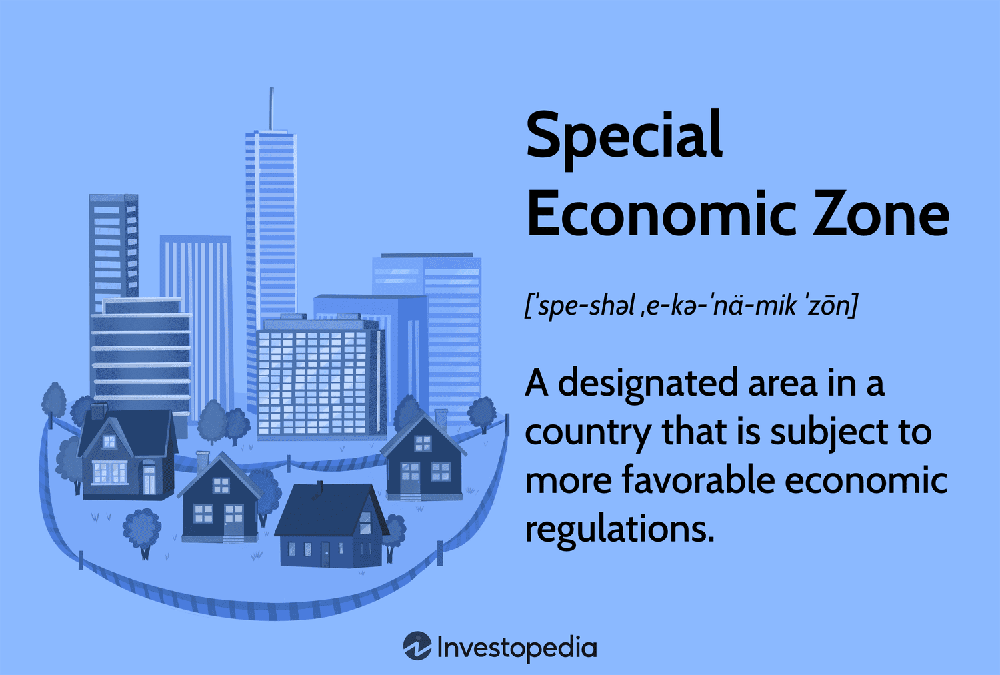

## Table of Contents

## What is a Special Economic Zone (SEZ)?

A Special Economic Zone (SEZ) is a specific area in a country where the government has created special rules to encourage business and trade. These zones usually have lower taxes, fewer restrictions, and better infrastructure to attract companies from around the world. The idea is to boost the local economy by creating jobs and bringing in new technology and skills.

Countries set up SEZs to help their economies grow faster. By making it easier for businesses to operate, they hope to attract foreign investment and increase exports. SEZs can be found in many places, like China, India, and the United Arab Emirates, and they play a big role in global trade.

## How do Special Economic Zones attract foreign direct investment?

Special Economic Zones attract foreign direct investment by offering businesses special benefits that they might not get in other parts of the country. These benefits can include lower taxes, which means companies can keep more of their profits. SEZs also often have fewer rules and regulations, making it easier for businesses to start and run their operations. This can be a big draw for companies looking to avoid the red tape that might slow them down elsewhere.

Another way SEZs attract investment is by providing better infrastructure. This can include good roads, reliable power supplies, and modern ports or airports, which help businesses move their goods more efficiently. When companies know they can operate smoothly and easily in a well-equipped zone, they are more likely to invest there. Overall, the combination of financial incentives, fewer regulations, and improved facilities makes SEZs very appealing to foreign investors looking for a good place to do business.

## What are the common incentives offered in Special Economic Zones?

Special Economic Zones offer many incentives to attract businesses. One of the main incentives is lower taxes. Companies in SEZs often pay less in taxes on their profits, which means they can keep more money. This makes it more attractive for businesses to set up in these zones. Another common incentive is fewer rules and regulations. In SEZs, the government often makes it easier for businesses to start and operate by reducing the paperwork and other requirements that can slow them down.

SEZs also provide better infrastructure to help businesses run smoothly. This can include good roads, reliable electricity, and modern ports or airports. When companies know they can easily move their goods and have the resources they need, they are more likely to invest in these zones. Additionally, some SEZs offer special grants or subsidies to help businesses with their costs. These financial supports can make a big difference for companies deciding where to invest.

Overall, the combination of lower taxes, fewer regulations, better infrastructure, and financial support makes Special Economic Zones very appealing to businesses. These incentives help attract foreign direct investment and encourage economic growth in the areas where SEZs are located.

## Can you provide examples of successful Special Economic Zones around the world?

One successful example of a Special Economic Zone is Shenzhen in China. It was set up in 1980 and has grown from a small fishing village into a huge city with lots of businesses and factories. Shenzhen attracted many foreign companies because of its low taxes and good infrastructure. Today, it's a big center for technology and innovation, showing how SEZs can help a place grow quickly.

Another example is the Jebel Ali Free Zone in Dubai, United Arab Emirates. It started in 1985 and has become one of the biggest free zones in the world. Jebel Ali offers businesses low taxes, good roads, and a big port to help them move goods easily. Many companies from around the world have set up there, making it a key place for trade and business in the Middle East.

The Shannon Free Zone in Ireland is also a good example. It was the world's first free trade zone, starting in 1959. The zone helped Ireland attract lots of foreign investment by offering low taxes and good services. Many big companies, especially in technology and pharmaceuticals, have come to Shannon, helping to create jobs and boost the local economy.

## How do SEZs impact the local economy of the host country?

Special Economic Zones can have a big impact on the local economy of the host country. They bring in foreign companies that create jobs for local people. When businesses set up in SEZs, they need workers, so more people can find work. This helps lower unemployment and gives people more money to spend, which can help the whole economy grow. SEZs also bring in new technology and skills, which can help local businesses learn and improve.

SEZs can also help the host country earn more money from exports. When companies in the zones make products and sell them to other countries, it increases the country's exports. This can help the country's trade balance and bring in more foreign money. However, SEZs can also have some challenges. Sometimes, the benefits of the zones might not spread to other parts of the country, and there can be concerns about working conditions and the environment. Overall, though, SEZs can be a powerful tool for boosting the local economy if managed well.

## What are the potential drawbacks of establishing Special Economic Zones?

One potential drawback of Special Economic Zones is that they can create inequality. The benefits like jobs and better infrastructure might not spread to other parts of the country. This can make people in other areas feel left out. Also, SEZs can sometimes lead to lower wages and poor working conditions. Companies might pay workers less because they are in a special zone with fewer rules, which can be bad for the workers.

Another issue is the impact on the environment. SEZs often have factories and businesses that can pollute the air and water. If the government doesn't have strict rules, this can harm the local area and the people who live there. Plus, setting up an SEZ can be expensive. The government needs to spend a lot of money on infrastructure and other things to attract businesses. If the SEZ doesn't bring in enough investment, it might not be worth the cost.

## How do SEZs influence the overall foreign direct investment trends in a country?

Special Economic Zones can greatly increase the amount of foreign direct investment (FDI) coming into a country. They do this by offering businesses lower taxes, fewer rules, and better infrastructure. When companies from other countries see these benefits, they are more likely to invest in the country where the SEZ is located. This can lead to a big increase in FDI, as more and more foreign companies decide to set up their businesses in the SEZ.

However, SEZs can also affect FDI trends in other ways. Sometimes, the investment might only go to the SEZ and not spread to other parts of the country. This can create an imbalance where the SEZ gets all the benefits, while other areas don't see much growth. Also, if the SEZ does not succeed in attracting enough investment, it might not have the positive impact on FDI that the country hoped for. Overall, SEZs can be a powerful tool for boosting FDI, but they need to be managed carefully to make sure the benefits are spread evenly across the country.

## What role do government policies play in the effectiveness of SEZs?

Government policies are very important for making Special Economic Zones work well. The government decides what rules and benefits the SEZs will have. If the government offers good incentives like low taxes and fewer rules, more businesses will want to come to the SEZ. The government also needs to make sure the SEZ has good roads, power, and other things businesses need. If the government does a good job with these policies, the SEZ can attract a lot of foreign investment and help the local economy grow.

However, if the government's policies are not good, the SEZ might not be successful. For example, if the taxes are still too high or the rules are too strict, businesses might not want to come. Also, the government needs to make sure the SEZ does not harm the environment or the workers. If the government does not have strong rules to protect these things, it can cause problems. So, the right government policies are key to making sure SEZs help the country and its people.

## How do SEZs contribute to technology transfer and skill development?

Special Economic Zones help bring new technology and skills to a country. When foreign companies set up in an SEZ, they often bring their own technology and ways of doing things. This can be new machines, software, or special ways to make things. Local workers in the SEZ get to learn how to use this technology and these new skills. Over time, this can help the whole country learn and grow, as workers take their new knowledge to other jobs and businesses.

SEZs also help with skill development by giving local people a chance to work with big international companies. These companies often train their workers well, so people in the SEZ can learn a lot. They might learn about management, how to use new tools, or how to work in a big business. As these workers get better at their jobs, they can help other businesses in the country improve too. This way, SEZs can help the whole country get better at making things and doing business.

## What are the environmental impacts associated with Special Economic Zones?

Special Economic Zones can have a big impact on the environment. When companies set up factories and businesses in SEZs, they might make a lot of pollution. This can include dirty air from factories, chemicals in the water, and waste that harms the land. If the government does not have strict rules, this pollution can make the area around the SEZ unhealthy for people and bad for nature. It can also affect the plants and animals that live there, making it hard for them to survive.

On the other hand, some SEZs try to be better for the environment. They might use clean energy like solar power and have rules to reduce pollution. If the government makes sure these rules are followed, SEZs can help the environment instead of hurting it. But this takes a lot of planning and effort. Overall, the impact on the environment depends a lot on how the SEZ is managed and the rules that are in place.

## How can the performance of SEZs be measured and evaluated?

The performance of Special Economic Zones can be measured by looking at how much they help the economy grow. One way to do this is by counting the number of jobs created in the SEZ. If more people are working because of the SEZ, it's a good sign. Another way is to see how much foreign money comes into the country because of the SEZ. If the SEZ attracts a lot of foreign investment, it shows that businesses find it a good place to set up. Also, looking at how much the SEZ helps with exports can show if it's working well. If companies in the SEZ are making and selling a lot of products to other countries, that's a positive result.

Another important part of evaluating SEZs is looking at how they affect the people and the environment. For the people, it's important to see if the SEZ helps them earn more money and live better lives. If workers in the SEZ are paid well and have good working conditions, it's a success. But if the SEZ leads to low wages or bad working conditions, that's a problem. For the environment, checking if the SEZ causes pollution or harms nature is key. If the SEZ has rules to protect the environment and follows them, it's doing well. But if it leads to a lot of pollution, that's a negative impact that needs to be fixed.

Overall, measuring the performance of SEZs involves looking at economic growth, job creation, foreign investment, exports, the well-being of workers, and environmental impact. By considering all these factors, it's possible to get a full picture of how well an SEZ is doing and whether it's helping the country in the right ways.

## What are the future trends and potential developments in the use of SEZs for attracting foreign direct investment?

In the future, Special Economic Zones might become even more important for attracting foreign direct investment. Countries could start using new technology like smart factories and green energy in their SEZs to make them more attractive to businesses. This could mean using robots and computers to make things faster and cleaner. Also, more SEZs might focus on special industries like technology, health care, or green energy. This way, they can attract companies that are looking for places to grow in these areas. Governments might also work together to create SEZs that cross borders, making it easier for businesses to trade between countries.

Another trend could be that SEZs will try harder to be good for the environment and the people who live nearby. This means having strict rules to stop pollution and make sure workers are treated well. More SEZs might use renewable energy like solar or wind power to be cleaner. They might also focus on helping the local community by creating jobs and training programs. If SEZs can show they are good for the environment and the people, more companies might want to invest in them. This could help countries attract more foreign direct investment while also making sure the SEZs are sustainable and fair.

## References & Further Reading

[1]: Zeng, D. Z. (2010). ["Building Engines for Growth and Competitiveness in China: Experience with Special Economic Zones and Industrial Clusters."](https://openknowledge.worldbank.org/bitstream/handle/10986/2501/564470PUB0buil10Box349496B01PUBLIC1.pdf) World Bank Publications.

[2]: Farole, T. (2011). ["Special Economic Zones in Africa: Comparing Performance and Learning from Global Experiences."](https://archive.org/details/specialeconomicz0000faro) World Bank Publications.

[3]: Lopez de Prado, M. (2018). ["Advances in Financial Machine Learning."](https://www.amazon.com/Advances-Financial-Machine-Learning-Marcos/dp/1119482089) Wiley.

[4]: Chan, E. (2009). ["Quantitative Trading: How to Build Your Own Algorithmic Trading Business."](https://github.com/ftvision/quant_trading_echan_book) Wiley.

[5]: Jansen, S. (2020). ["Machine Learning for Algorithmic Trading."](https://github.com/stefan-jansen/machine-learning-for-trading) Packt Publishing.

[6]: Lall, S., & Wang, H. (2006). ["China's Manufacturing Performance: A Survey."](https://link.springer.com/article/10.4209/aaqr.2007.03.0017) National Institute Economic Review.