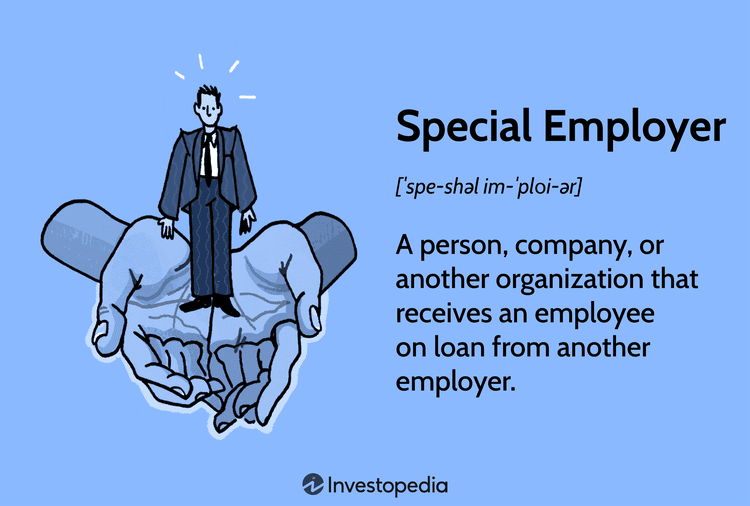

In today's dynamic employment landscape, both employers and job seekers are navigating new structures and models influenced by technology and market demands. Technological innovations, particularly in automation and data analytics, have fundamentally altered how businesses operate and how employees contribute. Among these innovations, algorithmic trading has emerged as a prominent force within the financial sector, significantly impacting employment models. 

Algorithmic trading, characterized by high-frequency, data-driven transactions, has necessitated a paradigm shift in the skill sets required in the financial industry. This shift is exemplified by the growing demand for expertise in programming, data analysis, and machine learning. As a result, financial professionals are compelled to adapt by acquiring new competencies that align with the digital transformation sweeping through the sector. 



The convergence of special employer structures and evolving employment models presents both challenges and opportunities. Special employer structures, where employees are contracted to work for one company while being on loan from another, are becoming more prevalent as organizations seek adaptable workforce solutions. These arrangements require a nuanced understanding of responsibilities, liabilities, and compliance to benefit both employers and employees effectively.

This article aims to explore the intricate relationship between special employer structures, contemporary employment models, and the rise of algorithmic trading. By understanding these trends, individuals and organizations can strategically position themselves to thrive in this continuously evolving environment. Leveraging insights from these developments will be crucial in ensuring success and sustainability in an increasingly digital job market.

## Table of Contents

## Understanding Special Employer Structures

Special employer structures are innovative employment arrangements where an individual is engaged to work at one company while technically employed by another. These configurations are particularly prevalent in scenarios requiring workforce flexibility or specialized expertise. The quintessential example of this is the use of staffing agencies or consulting firms that hire employees and then loan them to client organizations to execute specific projects or roles.

In these arrangements, the primary advantage for firms is flexibility. Companies can adjust the size of their workforce more readily in response to market demands without incurring the long-term commitments associated with traditional employment contracts. This model also allows organizations to bring in expertise that may not be available in-house, adding value while simultaneously controlling costs.

However, special employer structures necessitate clear and comprehensive contractual agreements. These contracts must delineate the responsibilities and liabilities of each party involved—typically the lending company, the borrowing company, and the employee. Contracts generally include specifics on job roles, reporting hierarchies, duration of employment, and compensation structures. They also address the allocation of responsibilities related to employee benefits, compliance with labor laws, and risk management, particularly concerning workplace safety and professional liability.

Ensuring compliance with these contractual terms is crucial to protect both parties. From a legal perspective, non-compliance can lead to disputes, particularly concerning employee entitlements and responsibilities. Moreover, regulatory environments often require adherence to specific standards, influencing the design and operationalization of special employer agreements.

Both companies involved must have a clear understanding of their respective roles to ensure successful implementation. On the one hand, the lending company needs to maintain administrative control over employment matters such as payroll, benefits, and disciplinary actions. On the other hand, the borrowing company typically assumes day-to-day supervisory responsibilities. This division of duties calls for robust communication channels and clear governance structures to prevent any operational disconnect that could disadvantage the employee or breach regulatory guidelines. 

Such employer structures highlight the importance of strategic human resource management that is adaptable and responsive to dynamic business needs. By optimizing these arrangements, companies can not only enhance operational efficiency but also maintain a competitive edge in a rapidly evolving market landscape.

## Employment Models in the Digital Age

The digital age has significantly altered traditional employment paradigms, introducing innovative employment models such as remote work and the gig economy. These models enable organizations to tap into a global and diverse talent pool, thereby fostering a workforce that is both adaptable and versatile. 

**Remote Work and Flexibility**

Remote work, facilitated by advancements in communication technology, has become prevalent in various sectors. This model allows employees to perform their tasks from locations outside the conventional office setting. The flexibility afforded by remote work not only enhances work-life balance but also broadens the scope for talent acquisition across geographical boundaries. For companies, the financial benefits include reduced overhead costs related to office space and utilities. To harness the advantages of remote work, organizations have adopted collaborative digital tools, such as video conferencing platforms and project management software, to ensure seamless communication and productivity.

**The Gig Economy and its Implications**

The gig economy refers to a labor market characterized by short-term contracts or freelance work as opposed to permanent jobs. This model has proliferated with digital platforms like Uber, Upwork, and Fiverr, connecting freelancers with a myriad of job opportunities. The gig economy offers workers autonomy over their schedules and projects, providing a tailored working experience. For businesses, it presents a cost-effective solution to meet fluctuating demand without the long-term commitments of traditional employment. However, it also brings challenges related to job security and benefits, prompting ongoing discussions about workers' rights and regulations.

**Embracing Digital Tools and Skill Development**

Adapting to these new models necessitates the adoption of various digital tools and a commitment to continuous skill enhancement. Technologies such as cloud computing, cybersecurity protocols, and [artificial intelligence](/wiki/ai-artificial-intelligence) are integral to the efficient operation of these employment models. Workers are encouraged to develop competencies in digital literacy, virtual collaboration, and project management to remain competitive. Companies, on their part, must provide access to learning platforms and resources that facilitate skill development in emerging technologies.

In conclusion, the digital age's employment models require both employers and employees to innovate and adopt new strategies. By embracing the advantages and addressing the challenges of remote work and the gig economy, stakeholders can navigate the modern employment landscape effectively.

## Algorithmic Trading and Its Impact on Employment

Algorithmic trading, which relies on computer algorithms to automate the process of buying and selling securities, has significantly reshaped employment within the financial sector. It allows for high-frequency, data-driven transactions, providing a competitive edge in speed and efficiency. This transformation in trading methodology has led to a heightened demand for professionals equipped with skills in programming, data analysis, and [machine learning](/wiki/machine-learning)—tools essential for developing and managing complex algorithms.

The rise of [algorithmic trading](/wiki/algorithmic-trading) has shifted the skills landscape, prompting financial professionals to pivot towards technical expertise to remain pertinent in their careers. The necessity for proficiency in programming languages, such as Python, and an in-depth understanding of machine learning techniques are increasingly crucial. These competencies enable the development of sophisticated models capable of analyzing vast datasets to identify trading patterns and inform decision-making.

Moreover, skills in quantitative analysis have become paramount. Financial professionals are now required to integrate statistical methods and mathematical concepts to optimize trading strategies. This integration often involves the application of linear algebra, calculus, and probability theory, which forms the backbone of algorithmic model development.

For example, Python has become a tool of choice for many practitioners due to its vast libraries like NumPy, pandas, and SciPy, which facilitate data manipulation and complex computations. The following Python code snippet demonstrates how a financial analyst might use pandas to calculate moving averages, a common technique in algorithmic trading:

```python
import pandas as pd

# Sample data - closing prices
data = {'close': [210, 212, 208, 215, 217, 210, 213, 216]}
df = pd.DataFrame(data)

# Calculate a simple moving average (SMA) for a 3-day window
df['SMA_3'] = df['close'].rolling(window=3).mean()

print(df)
```

Furthermore, algorithmic trading requires a robust understanding of machine learning, particularly in designing models that can learn from market data and improve trading strategies over time. This capability is instrumental in creating predictive algorithms that adapt to market changes and unforeseen variables, thereby enhancing trading efficacy.

As the financial industry continues to evolve, it is imperative for financial professionals to embrace these emerging technologies. Organizations investing in workforce reskilling and experts pursuing continuous learning in programming and data science will likely thrive in this transformed landscape. These adaptations not only secure professional relevance but also sustain the industry's competitive advantage in an era where data-driven decisions are pivotal.

## Advantages and Disadvantages of Algo Trading Employment Models

Algorithmic trading, also known as algo trading, has profoundly transformed financial transactions, providing distinct advantages and posing unique challenges. Central to the benefits of algo trading is its ability to execute transactions with heightened efficiency and precision compared to manual trading methods. This efficiency is achieved through the use of complex algorithms that can process large datasets rapidly, enabling high-frequency trading and minimizing the delay between market conditions and related trading actions. As a result, algo trading can significantly reduce transaction costs and improve [liquidity](/wiki/liquidity-risk-premium) in the markets.

One of the primary technical advantages of algo trading is its reliance on quantitative models that can incorporate various data inputs - ranging from historical price levels and economic indicators to real-time news - to forecast market movements. For instance, a basic algorithmic trading strategy might be based on moving averages, where buy and sell orders are initiated based on the intersection of shorter and longer-term moving averages.

```python
# Example of a simple moving average crossover strategy
import pandas as pd

# Assume 'data' is a DataFrame with a 'Close' column representing daily closing prices
short_window = 40
long_window = 100

signals = pd.DataFrame(index=data.index)
signals['Signal'] = 0.0

# Create short simple moving average
signals['short_mavg'] = data['Close'].rolling(window=short_window, min_periods=1).mean()

# Create long simple moving average
signals['long_mavg'] = data['Close'].rolling(window=long_window, min_periods=1).mean()

# Generate signals
signals['Signal'][short_window:] = np.where(
    signals['short_mavg'][short_window:] > signals['long_mavg'][short_window:], 1.0, 0.0)

# Create orders by taking the difference of the signals
signals['Positions'] = signals['Signal'].diff()
```

However, along with these advantages, algo trading presents notable challenges. Cybersecurity is a critical concern as the reliance on digital infrastructures increases the vulnerability of trading systems to cyber-attacks. Enhanced cybersecurity measures are necessary to mitigate the risks associated with hacking and data breaches.

Additionally, the speed and automation of algo trading can contribute to market instability. The 'flash crash' of 2010 is a prime example where rapid automated trading exacerbated sudden market declines. Such instances underscore the importance of regulatory frameworks to monitor and control the potential negative impacts of high-frequency trading on market stability.

In summary, while algorithmic trading elevates financial transaction efficiency and accuracy, both businesses and employees in the financial sector must navigate the associated cybersecurity risks and potential for market [volatility](/wiki/volatility-trading-strategies). Understanding and balancing these factors is pivotal to maximizing the strategic benefits of algorithmic trading environments.

## Preparing for Future Job Market Trends

In an era where technology continues to advance at an unprecedented pace, the job market is witnessing transformative shifts that necessitate both individuals and organizations to adopt new strategies for staying competitive. Continuous learning, particularly in fields such as data science and IT, has become a critical requirement for individuals aiming to maintain relevance and contribute effectively to their workplaces. This focus on lifelong learning allows professionals to keep pace with ever-evolving technologies and methodologies, ensuring they can navigate the demands of tomorrow's job market.

For individuals, honing skills in emerging technology areas is not merely an option but a necessity. Engaging in courses, certifications, and practical application through projects helps in acquiring expertise in high-demand areas like data analysis, machine learning, and cloud computing. A significant focus is placed on programming languages such as Python, which is extensively used in data science for data manipulation, analysis, and visualization. Consider the following example of a simple Python function leveraging basic data analysis:

```python
import pandas as pd

def analyze_data(file_path):
    # Load data from a CSV file
    data = pd.read_csv(file_path)
    # Display basic data statistics
    print(data.describe())
    # Return the correlation matrix
    return data.corr()

file_path = 'data.csv'
correlation_matrix = analyze_data(file_path)
print(correlation_matrix)
```

This code demonstrates the foundational skills necessary in handling datasets, an essential capability in the data-driven economy. Developing proficiency in such skills equips individuals with the tools to contribute effectively in various sectors, from finance to healthcare.

Organizations, on the other hand, play a pivotal role in fostering a culture of innovation and flexibility. To thrive amid rapid technological advancements and changing market dynamics, companies must invest in upskilling initiatives for their workforce. This involves not only facilitating access to the latest training resources but also creating an environment that encourages experimentation and creativity. Agile methodologies can be implemented to ensure that organizations can swiftly adapt to new challenges and opportunities, promoting a proactive rather than reactive approach.

Moreover, the adoption of collaborative tools and platforms is essential to support remote and hybrid working models, which have become prevalent. Employing integrated communication systems and project management software enables seamless collaboration across different teams and geographies, ensuring that innovation is not hindered by logistical barriers.

By emphasizing continuous learning and cultivating an adaptive organizational culture, both job seekers and employers can effectively maneuver the complexities of future job market trends. This proactive mentality will not only enhance individual careers but also contribute to the sustainable growth of organizations in an increasingly interconnected and digital world.

## Conclusion

Special employer structures and the rise of algorithmic trading have accentuated the critical importance of adaptability in the contemporary job market. These shifts necessitate that both individuals and organizations embrace continuous learning and make strategic adjustments to employment models to achieve future success. The landscape of the job market is evolving at an accelerated pace, influenced heavily by technological advancements and innovative business practices. 

For individuals, this means cultivating a mindset geared towards lifelong learning and staying abreast of emerging technologies, skills, and methodologies. The demand for proficiency in areas such as data analysis, programming, and machine learning, particularly within the financial sector, is indicative of this need for ongoing education. Engaging with resources, whether through online platforms, formal education, or industry workshops, can enhance one's ability to remain competitive and relevant.

Organizations, on the other hand, must foster environments that prioritize flexibility and innovation. This approach involves not only integrating advanced technologies like algorithmic trading but also adopting employment models that allow for dynamic workforce management. By crafting policies and practices that embrace changes such as remote work arrangements and gig economy models, businesses can better align with the future market demands.

Ultimately, the understanding and leveraging of these trends are essential for stakeholders aiming for sustainable growth in an increasingly digital world. These strategic adaptations will not only position individuals and businesses for immediate gains but also fortify them against future market disruptions. As technology continues to integrate deeply into the fabric of employment structures and business strategies, the ability to adapt will define success and resilience in the evolving landscape.

## References & Further Reading

- **Investopedia. (2022). Special Employer: What It is, How it Works, Example.** This resource offers a detailed explanation of special employer structures, highlighting how these arrangements function and the implications for both employers and employees. It provides real-world examples and insights into the legal and operational aspects of such structures.

- **OECD Employment Outlook 2021.** This report by the Organisation for Economic Co-operation and Development (OECD) examines global employment trends and challenges, focusing on post-pandemic recovery. It includes data-driven analyses that explore shifts in employment models and the adoption of digital technologies, offering policymakers guidance on creating resilient labor markets.

- **World Economic Forum. (2020). The Future of Jobs Report.** Produced by the World Economic Forum, this report covers the transformative impact of the Fourth Industrial Revolution on employment. It details how technologies like AI and machine learning influence job markets, skills demands, and the need for continuous learning across industries.

- **McKinsey & Company. (2022). The Future of Work After COVID-19.** This report from McKinsey & Company explores how the COVID-19 pandemic has accelerated changes in work environments. It addresses the shift towards remote work, the rise of the gig economy, and evolving workforce requirements, offering strategies for businesses to adapt and thrive in this new landscape.

