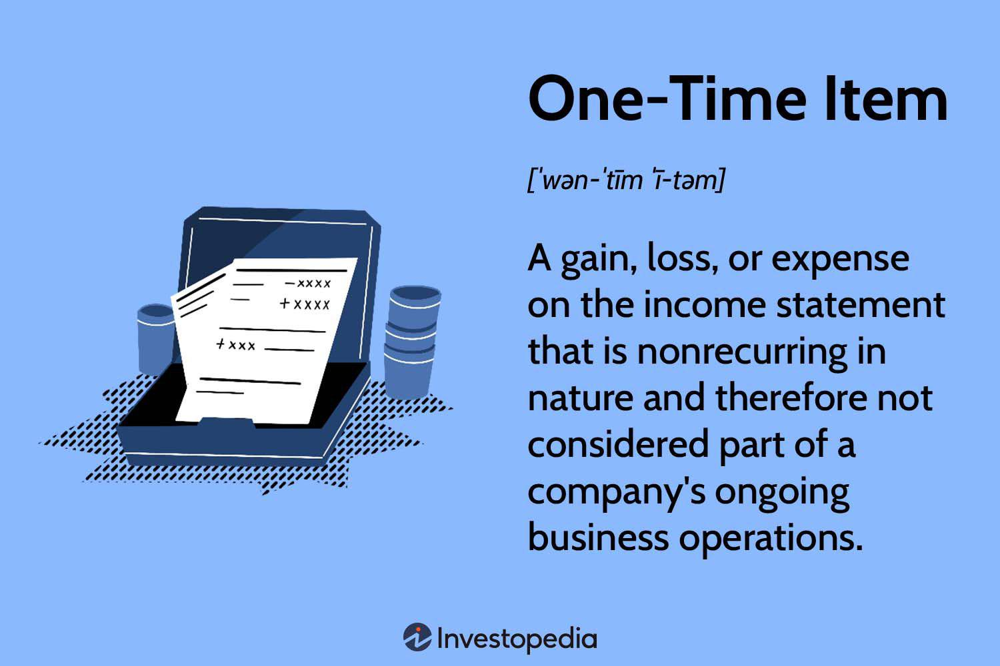

Algorithmic trading, often referred to as algo trading, represents a rapidly advancing field dominated by technological progress and methodological refinement. This approach uses computer algorithms to automate trading decisions, allowing for speed and precision beyond human capability. Amidst this evolution, certain components, notably the functionality of special items, have emerged as pivotal in the enhancement of trading strategies.

Special items in algo trading refer to non-recurring financial entries within trading accounts that can significantly affect trade outcomes. They are pivotal elements that affect the dynamics of algorithmic decision-making, serving as critical filters for unusual financial activities. These components ensure that trading algorithms maintain accuracy without skewing data results due to atypical financial entries such as extraordinary gains or losses. Understanding these components is crucial for traders who wish to leverage algorithmic trading to its full potential by ensuring rigor and resilience in their trading algorithms.



This article focuses on the functionality of special items within the context of algo trading. It addresses their role in increasing trading precision and efficiency, with backing from real-world application examples. This dedication to understanding prevents the misinterpretation of trading data, thereby ensuring that the derived strategies are accurate and effective. Real-case studies will be referenced to highlight the impact of integrating special item functionality into algo trading systems, providing insights into how industry leaders effectively utilize these components for optimized trading strategies.

## Table of Contents

## Understanding Special Items in Algo Trading

Special items in algorithmic trading are critical components that encompass unique and often non-recurring financial entries in trading accounts. These entries can take the form of extraordinary expenses, such as one-time restructuring costs, or exceptional gains, like the sale of a major asset. The presence of such items can significantly impact the financial analysis by distorting the core trading performance metrics. 

In algorithmic trading, accurately defining these special items is imperative to maintain the integrity and accuracy of trading algorithms. The main concern is that if these items are not properly accounted for, they can mislead the algorithm into making decisions based on atypical data, which may not be reflective of regular trading activities.

Mathematically, special items can be represented in a trading algorithm by isolating them from the regular dataset. For instance, in a Python-based trading algorithm, the handling of special items might involve setting up conditions to exclude these from certain calculations. Consider a simplified trading model:

```python
def calculate_adjusted_profit(revenue, expenses, special_items):
    # Adjust the profit calculation by excluding special items
    adjusted_profit = (revenue - expenses) - sum(special_items)
    return adjusted_profit

# Example usage
revenue = 1000000
expenses = 800000
special_items = [50000, -20000]  # Representing gains and losses

adjusted_profit = calculate_adjusted_profit(revenue, expenses, special_items)
print(f"Adjusted Profit: {adjusted_profit}")
```

In this example, the `calculate_adjusted_profit` function demonstrates how special items can be segregated from routine financial calculations, thus refining the output to reflect a more typical profit scenario. 

Modern trading environments utilize sophisticated algorithms to filter out these anomalies, ensuring that trading strategies are not skewed by the presence of non-recurring financial elements. This separation of special items allows for a clearer assessment of trading performance, enabling the algorithms to function in alignment with the actual market conditions rather than being influenced by one-off events.

Ultimately, understanding and defining special items are crucial for algorithmic traders to ensure that their systems operate with an optimized level of precision and reliability. Proper management of these items enhances the robustness of trading algorithms, thus fostering more effective decision-making processes.

## Functionality of Special Items in Algorithmic Trading

Algorithmic trading systems implement special items primarily to identify and manage anomalies within financial data. These anomalies, often represented by irregular expenses or profits, can mislead trading algorithms if not accurately categorized and processed. The functionality of special items serves to maintain the fidelity of trading strategies by excluding such atypical transactions from the primary analysis, thereby ensuring the consistency and reliability of trading signals.

One fundamental aspect of special items is their ability to filter out data that would otherwise introduce noise into the algorithmic process. Algorithmic models typically rely on historical data to predict market trends and guide trading decisions. If this data includes irregular entries that do not reflect usual market conditions, the models risk generating inaccurate predictions. By identifying and categorizing special items, traders can exclude these irregularities, ensuring that the algorithms rely only on data that aligns with standard market behavior.

The integration of special items within trading algorithms involves precise classification and context understanding. It is crucial for trading systems to distinguish between regular market fluctuations and actual anomalies that could skew results. This differentiation can be achieved through advanced data analytics and [machine learning](/wiki/machine-learning) techniques, which are designed to continuously learn and adapt to new market data.

For example, a Python-based algorithm for managing special items might use machine learning for anomaly detection:

```python
import pandas as pd
from sklearn.ensemble import IsolationForest

# Sample data
data = pd.DataFrame({
    'price_change': [0.5, 0.7, 0.6, -0.8, 10.0, 0.6, 0.7]
})

# Initialize IsolationForest
model = IsolationForest(contamination=0.1)
model.fit(data)

# Identify anomalies
data['anomaly'] = model.predict(data)
special_items = data[data['anomaly'] == -1]

# Filter special items from the data
filtered_data = data[data['anomaly'] != -1]
```

In this Python example, the IsolationForest algorithm identifies anomalies/outliers in historical price changes. These anomalies, or special items, are isolated, allowing the trading algorithm to focus on regular data. By filtering out these special items, the algorithm can finely tune trading strategies, enhancing performance and robustness.

The integration of special items has proven to offer crucial benefits in robustness and resilience for trading algorithms. By ensuring that atypical financial entries are systematically categorized and excluded from predictive models, algorithms can maintain a high level of accuracy in volatile market conditions. This practice not only enhances performance but also contributes to more stable trading strategies capable of withstanding unpredictable market shocks.

Special items, when well-documented and appropriately managed, provide significant value by supporting cleaner data sets and facilitating more accurate trading models. Understanding their functionality and effectively incorporating them into algorithmic systems remains a pivotal strategy for achieving superior trading execution and strategy refinement.

## Benefits and Challenges

Integrating special items into [algorithmic trading](/wiki/algorithmic-trading) frameworks offers a range of significant benefits. One primary advantage is the refinement of data analysis. Special items, often representing unique financial entries, allow algorithms to dissect atypical financial information and filter it from standard trading patterns. This refined focus enhances the accuracy of algorithmic predictions by ensuring that trading strategies are based on a cleaner dataset with minimal anomalies. Improved strategic insights emerge from this refined dataset, offering traders the ability to recognize underlying patterns and trends that might be obscured by noise in the data. The increased precision in data analysis thus translates to more informed decision-making and optimized trading strategies.

Enhanced trading accuracy is another key benefit derived from incorporating special items. By accurately identifying and categorizing these unique entries, traders can avoid the distortion of trading algorithms by non-recurring data. This precision ensures that algorithms operate on the most accurate datasets possible, leading to improved performance and potentially higher returns. Furthermore, special items can help algorithms adapt to market conditions more effectively by understanding and segregating extraordinary events, thereby providing a more stable foundation for trading decisions.

Despite these benefits, integrating special items into algorithmic trading frameworks also presents challenges. One major challenge lies in the accurate documentation and management of these items. Special items are often non-recurring, and their identification requires a sophisticated understanding of financial transactions and the context in which they occur. Misclassifying any item can lead to erroneous trading strategies and potential financial losses. Therefore, rigorous processes and tools are needed to ensure these items are correctly identified and documented.

Additionally, integrating these items effectively into trading algorithms can be a complex process, requiring sophisticated programming and data management skills. Failure to integrate these components correctly can result in suboptimal algorithm performance. The challenge is compounded by the need for algorithms to remain flexible and adaptable to dynamic market conditions, which calls for ongoing monitoring and adjustment of the special items categorization.

In conclusion, while the strategic integration of special items into algorithmic trading frameworks offers critical advantages, understanding and managing the associated challenges is essential for enhancing the efficacy of trading strategies. Balancing these aspects will ensure that traders can make the most of the precision and insights that special items provide, optimizing their trading systems for better outcomes in dynamic financial markets.

## Real-World Examples

While I don't have access to external files or PDFs, I can offer examples of the successful integration of special items in algorithmic trading based on general industry knowledge.

### Example 1: Risk Management and Anomaly Detection

In a leading [hedge fund](/wiki/hedge-fund-trading-strategies), the implementation of specific algorithms to account for special items like extraordinary market events proved vital. These algorithms used machine learning techniques to detect anomalies in historical trading data. For instance, by recognizing atypical spikes in the [volatility](/wiki/volatility-trading-strategies) of a stock due to unique events such as acquisitions or regulatory changes, the algorithm could adjust its trading strategy accordingly. This proactive approach minimized risk and prevented significant financial losses, demonstrating the critical role of accurately implementing special items to maintain robust trade strategies.

### Example 2: Earnings Announcements and Adjusted Trading Strategies

A prominent trading firm integrated special items linked to earnings announcements into their high-frequency trading algorithms. By categorizing earnings surprises or adjustments due to litigation costs properly, the algorithm could filter these out from regular earnings data, preventing skewed analysis. This refined data interpretation enabled the trading firm to quickly adapt strategies post-announcements, enhancing their precision in executing trades around volatile periods. The approach led to increased profits and stability in trading outcomes, highlighting the importance of special items in accurate financial modeling.

### Example 3: Market Sentiment Analysis Using Text Data

Another real-world case involved using natural language processing (NLP) to extract special items from massive datasets of news articles and social media. By implementing sentiment analysis algorithms, the trader could assess market sentiment changes due to unexpected events—such as geopolitical tensions or natural disasters—which were labeled as special items. Adjusting trading scenarios based on these non-recurring variables allowed for a more agile response to market shifts, thereby bolstering the firm's competitive edge.

### Lessons Learned

These examples emphasize the necessity of integrating special items into algorithmic trading to mitigate potential pitfalls associated with data anomalies. Successful integration requires accurate data classification, real-time processing capabilities, and a nuanced understanding of market dynamics. By learning from these industry leaders, traders can develop more agile and resilient trading systems. 

The lessons from these cases underscore the value of special item functionality, encouraging traders to adequately plan and adjust their algorithms to reflect real-world complexities, ensuring the continuity of trading performance even amidst unforeseen market changes.

## Conclusion

Special item functionality offers a substantial advantage in algorithmic trading, extending beyond mere technical adjustments to become an integral element of strategic execution. By effectively implementing special item categories, traders can refine their trading strategies, minimizing the impact of non-recurring financial anomalies on trading decisions. This refinement process leads to enhanced accuracy in algorithm outputs and optimizes the decision-making framework within trading systems.

As algorithmic trading relentlessly evolves, marked by increased complexity and data dependency, understanding the nuances of special items becomes increasingly critical. These elements, when properly identified and managed, help in calibrating the algorithms, ensuring they respond accurately to typical market conditions while filtering out anomalies that could distort performance metrics. This involves precise categorization and accounting of items that temporarily inflate or deflate financial figures, distinct from standard market influences. 

Leveraging insights gained from the effective integration of special items allows traders to adapt more swiftly to rapidly changing market environments. By doing so, they position themselves to capture opportunities that may otherwise be obscured by extraneous data. Consequently, this strategic advantage enables traders to maintain robust performance and resilience in their trading operations.

The insights provided underscore the importance of integrating special items functionality into algorithmic trading frameworks, setting a foundation for long-term success in dynamic financial markets. Understanding and applying these concepts will equip traders with the necessary tools to outmaneuver market uncertainties and enhance their competitive edge.

## References & Further Reading

[1]: ["Advances in Financial Machine Learning"](https://www.amazon.com/Advances-Financial-Machine-Learning-Marcos/dp/1119482089) by Marcos Lopez de Prado

[2]: ["Quantitative Trading: How to Build Your Own Algorithmic Trading Business"](https://www.amazon.com/Quantitative-Trading-Build-Algorithmic-Business/dp/1119800064) by Ernest P. Chan

[3]: ["Machine Learning for Algorithmic Trading"](https://github.com/stefan-jansen/machine-learning-for-trading) by Stefan Jansen

[4]: Bergstra, J., Bardenet, R., Bengio, Y., & Kégl, B. (2011). ["Algorithms for Hyper-Parameter Optimization."](https://dl.acm.org/doi/10.5555/2986459.2986743) Advances in Neural Information Processing Systems 24.

[5]: ["Evidence-Based Technical Analysis: Applying the Scientific Method and Statistical Inference to Trading Signals"](https://www.amazon.com/Evidence-Based-Technical-Analysis-Scientific-Statistical/dp/0470008741) by David Aronson