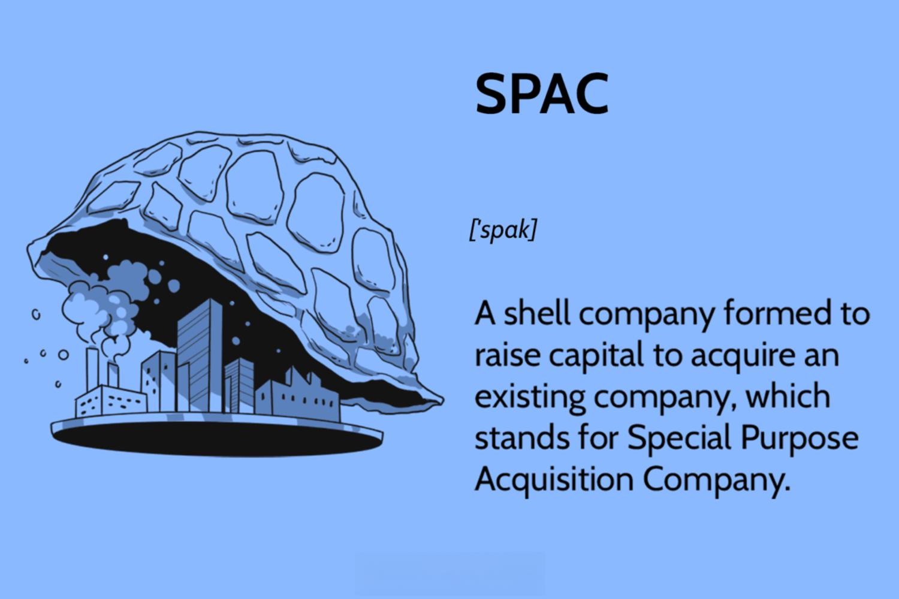

## Table of Contents

## What is a Special Purpose Acquisition Company (SPAC)?

A Special Purpose Acquisition Company, or SPAC, is a company that is created with the sole purpose of raising money through an initial public offering (IPO) to buy another company. It's like a shell company that doesn't have any actual business operations of its own. Instead, it uses the money it raises from investors to find and buy a private company, which then becomes a public company through this process.

SPACs are popular because they offer a faster and often less complicated way for private companies to go public compared to a traditional IPO. Investors in a SPAC are essentially betting on the management team's ability to find and buy a good company. If the SPAC can't find a suitable company to buy within a certain time, usually two years, it has to return the money to the investors. This adds a layer of urgency and accountability to the process.

## How does a SPAC go public?

A SPAC goes public by doing an initial public offering (IPO). This means it sells shares to the public to raise money. The people who start the SPAC, called sponsors, work with investment banks to set a price for the shares and sell them. When people buy these shares, they are investing in the SPAC, hoping it will find a good company to buy later.

Once the SPAC has the money from the IPO, it is officially a public company and listed on a stock exchange. The sponsors then have a set time, usually about two years, to find a private company to buy with the money they raised. If they can't find a company to buy in that time, they have to give the money back to the investors. This makes the process exciting but also risky for everyone involved.

## What are the advantages of investing in a SPAC?

Investing in a SPAC can be a good way to get in on the ground floor of a company that might do well in the future. When you buy shares in a SPAC, you're betting on the people running it to find a good company to buy. If they do, and the company they buy turns out to be successful, the value of your shares can go up a lot. This can be a faster and easier way for a private company to go public than a traditional IPO, which means you might see quicker returns on your investment.

Another advantage is that SPACs often have a set time limit, usually two years, to find a company to buy. If they don't find one in time, they have to give your money back. This can make investing in a SPAC feel safer because you know you'll get your money back if things don't work out. Plus, you get to be part of the excitement of seeing a new company go public and grow.

## What are some well-known examples of SPACs?

One well-known example of a SPAC is DraftKings. It started as a private company that let people play fantasy sports and bet on games. In 2020, it merged with a SPAC called Diamond Eagle Acquisition Corp. This made DraftKings a public company without having to go through a traditional IPO. People who invested in the SPAC got to be part of DraftKings' growth, and the company became very popular.

Another example is Virgin Galactic, the space travel company started by Richard Branson. In 2019, Virgin Galactic merged with a SPAC called Social Capital Hedosophia. This helped Virgin Galactic go public quickly and easily. People who bought shares in the SPAC got to invest in the exciting world of space travel. Virgin Galactic's success showed how SPACs can help new and innovative companies reach the public market.

## How does a SPAC acquire a target company?

When a SPAC wants to buy a company, it first looks for a good target. The people running the SPAC, called sponsors, do a lot of research to find a private company that they think will do well as a public company. Once they find a target they like, they start talking to the leaders of that company to see if they want to be bought. If everyone agrees, they start working on a deal.

After the SPAC and the target company agree on a price and other details, they sign a contract. Then, the SPAC holds a meeting with its investors to vote on whether to go ahead with the buy. If most investors say yes, the SPAC uses the money it raised from its IPO to buy the target company. Once the deal is done, the target company becomes a public company, and the SPAC's job is finished. The new public company then starts trading on the stock market under a new name and ticker symbol.

## What are the typical timelines involved in a SPAC merger?

When a SPAC wants to merge with a company, it usually starts by looking for a good target right after it goes public. This search can take anywhere from a few months to the full two years that the SPAC has to find a company. Once they find a target, the SPAC and the company start talking and negotiating. This part can take a few weeks to a few months. If they agree on a deal, they sign a contract, which is called a letter of intent.

After the letter of intent is signed, the SPAC holds a meeting with its investors to vote on the merger. This voting process usually takes about a month. If the investors approve the merger, the SPAC uses the money it raised to buy the target company. The whole process of merging, from signing the contract to completing the deal, can take another few months. So, all together, from starting the search to finishing the merger, it can take anywhere from a few months to over two years.

## What are the risks associated with investing in SPACs?

Investing in SPACs can be risky because you're betting on the people running the SPAC to find a good company to buy. If they pick a bad company, the value of your shares can go down a lot. Also, there's a chance the SPAC won't find any company to buy at all. If that happens, you might get your money back, but you won't make any profit, and you'll have missed out on other investment opportunities while waiting.

Another risk is that the people who start the SPAC, called sponsors, get a big chunk of shares for free. This can be a problem because they might make decisions that are good for them but not for other investors. For example, they might push for a merger even if it's not the best deal, just so they can keep their shares. This can make it hard for regular investors to know if the SPAC is a good investment or not.

## How do SPACs differ from traditional IPOs?

SPACs and traditional IPOs are two different ways for companies to go public, but they work in different ways. In a traditional IPO, a company that already has a business and makes money decides to sell shares to the public for the first time. They work with banks to set a price for the shares and then sell them to people who want to invest. It can take a long time to get ready for a traditional IPO because the company has to show a lot of information about its business to the public.

On the other hand, a SPAC is like a shell company that doesn't have its own business. It goes public by selling shares to raise money, but it doesn't have any operations of its own. Instead, it uses the money to find and buy another company, which then becomes public through the SPAC. This can be a faster way for a company to go public because it doesn't have to do all the work of a traditional IPO. But it's also riskier because you're betting on the SPAC's team to pick a good company to buy.

## What role do sponsors play in a SPAC, and what are their incentives?

Sponsors are the people who start a SPAC. They come up with the idea for the SPAC and work hard to make it happen. When the SPAC goes public, sponsors get a big chunk of shares for free. This is called the "sponsor promote." They use these shares to help them find a good company to buy. Sponsors also help manage the SPAC and make sure it finds a good target company to merge with.

The main incentive for sponsors is to make money. If the SPAC finds a good company to buy and the value of the company goes up, the value of the sponsors' shares goes up too. This can make them a lot of money. But if the SPAC doesn't find a good company, or if the company they buy doesn't do well, the sponsors might lose money. So, they have a big reason to pick a good company to buy and make the SPAC successful.

## How are SPACs regulated, and what recent changes have affected them?

SPACs are regulated by the Securities and Exchange Commission (SEC) in the United States. The SEC makes rules to make sure that people who invest in SPACs are treated fairly and get the right information. SPACs have to follow a lot of rules, like telling investors about their plans, how they will find a company to buy, and what will happen if they can't find one. They also have to be honest about any risks involved in investing in the SPAC. This helps people make smart choices about whether to invest or not.

Recently, the SEC made some changes to how SPACs work. They want to make sure that SPACs are even more clear about what they are doing and the risks involved. For example, they now have to tell investors more about the costs of the SPAC and how the people running it are paid. They also have to be more careful about how they talk about the company they want to buy. These changes are meant to protect investors and make sure that everyone knows what they are getting into when they invest in a SPAC.

## What financial metrics should be considered when evaluating a SPAC?

When you're thinking about investing in a SPAC, you should look at some key financial numbers to help you decide if it's a good idea. One important thing to check is the SPAC's IPO price, which is how much the shares cost when the SPAC first went public. You should also look at the trust account balance, which is where the SPAC keeps the money it raised from investors. This balance shows how much money the SPAC has to spend on buying a company. Another thing to consider is the sponsor's investment, which is the money the people who started the SPAC put into it. This can give you an idea of how much they believe in the SPAC's success.

Another set of numbers to look at are related to the target company the SPAC wants to buy. You should check the target company's revenue, which is how much money it makes, and its earnings, which is how much profit it makes after paying all its bills. It's also good to look at the target company's debt, which is how much money it owes, and its growth potential, which is how much it might grow in the future. These numbers can help you figure out if the target company is a good choice for the SPAC to buy. By looking at all these financial metrics, you can make a smarter decision about whether to invest in the SPAC.

## What are the long-term performance trends of SPACs compared to the broader market?

When you look at how SPACs do over a long time, they can be a bit of a mixed bag. Some SPACs do really well and make a lot of money for investors, especially if they pick a good company to buy. But on average, SPACs don't always do as well as the broader market, like the S&P 500. This is because [picking](/wiki/asset-class-picking) a good company to buy is hard, and sometimes the companies SPACs buy don't do as well as expected. So, while some SPACs can be big winners, many of them end up doing worse than the market as a whole.

One reason SPACs might not do as well over time is because of the costs involved. When a SPAC goes public and then buys a company, there are a lot of fees and costs that can eat into the money investors make. Also, the people who start the SPAC, called sponsors, get a big chunk of shares for free, which can make it harder for other investors to make money. So, while SPACs can be exciting and offer big potential rewards, they also come with more risks and costs than just investing in the broader market.

## References & Further Reading

[1]: Klausner, M. D., & Ohlrogge, M. (2020). ["A Sober Look at SPACs."](https://openyls.law.yale.edu/bitstream/handle/20.500.13051/17930/06.%20Klausner%20Article.%20Final.%20228-303.pdf) Stanford Law and Economics Olin Working Paper.

[2]: Gahng, M., Ritter, J. R., & Zhang, D. (2021). ["SPACs vs IPOs."](https://papers.ssrn.com/sol3/papers.cfm?abstract_id=3775847) SSRN Electronic Journal.

[3]: Easterbrook, F. (2021). ["SPAC Modernization Proposals: Investor Protection or Investor Deterrent?"](https://en.wikipedia.org/wiki/Frank_Easterbrook) University of California, Berkeley.

[4]: MacKenzie, D. (2021). ["Trading at the Speed of Light: How Ultrafast Algorithms Are Transforming Financial Markets."](https://ieeexplore.ieee.org/document/9647710) Princeton University Press.

[5]: Aldridge, I. (2013). ["High-Frequency Trading: A Practical Guide to Algorithmic Strategies and Trading Systems."](https://www.amazon.com/High-Frequency-Trading-Practical-Algorithmic-Strategies/dp/1118343506) Wiley Trading.

[6]: Narang, R. K. (2013). ["Inside the Black Box: The Simple Truth About Quantitative Trading."](https://onlinelibrary.wiley.com/doi/book/10.1002/9781118267738) Wiley Trading.