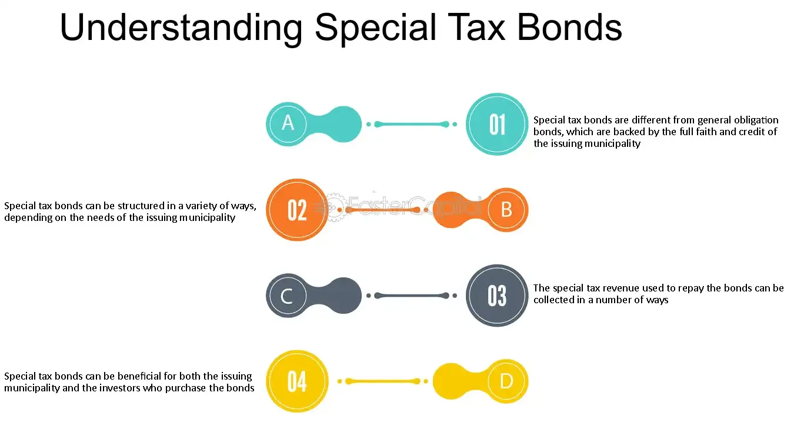

## Table of Contents

## What are special tax bonds?

Special tax bonds are a type of bond that governments issue to raise money for specific projects. These projects can be things like building new schools, roads, or water systems. The money to pay back these bonds comes from a special tax that is set up just for this purpose. This tax is usually added to property taxes or sales taxes in the area where the project is happening.

These bonds are different from general obligation bonds, which are backed by the full faith and credit of the government issuing them. With special tax bonds, if the special tax doesn't bring in enough money, the government isn't always required to use other funds to pay back the bondholders. This makes special tax bonds a bit riskier for investors, but they can still be a good way for communities to fund important projects without raising general taxes.

## How do special tax bonds differ from general obligation bonds?

Special tax bonds and general obligation bonds are both ways for governments to borrow money, but they have some key differences. Special tax bonds are used to fund specific projects like building new schools or roads. The money to pay back these bonds comes from a special tax that is set up just for this project. This tax might be added to property taxes or sales taxes in the area where the project is happening.

On the other hand, general obligation bonds are backed by the full faith and credit of the government that issues them. This means that if the government can't pay back the bond with the money it planned to use, it can use other funds to make sure the bondholders get paid. Because of this, general obligation bonds are seen as less risky for investors. Special tax bonds, however, are riskier because if the special tax doesn't bring in enough money, the government isn't always required to use other funds to pay back the bondholders.

## What types of projects are typically funded by special tax bonds?

Special tax bonds are often used to pay for building or fixing things that help a community. These projects can include new schools, where kids can learn better, or new roads, which make it easier for people to get around. Sometimes, these bonds help pay for water systems, which bring clean water to homes, or sewer systems, which keep communities clean and healthy.

These bonds can also be used for projects like building new parks, where people can enjoy nature and play, or setting up new libraries, where people can read and learn. The special tax that pays for these projects is usually added to the property taxes or sales taxes in the area where the project is happening. This way, the people who benefit from the new projects help pay for them.

## Who can issue special tax bonds?

Special tax bonds can be issued by different levels of government. This includes cities, counties, and sometimes even school districts. These governments use the bonds to get money for special projects that will help their communities.

When a government decides to issue special tax bonds, it sets up a special tax just for that project. This tax might be added to the property taxes or sales taxes that people in the area already pay. The money from this special tax is used to pay back the people who bought the bonds.

## How are special tax bonds repaid?

Special tax bonds are paid back using money from a special tax that is set up just for the project they are funding. This tax is usually added to the property taxes or sales taxes that people in the area pay. So, if the bond is for building a new school, the people who live near the school might pay a little more in taxes to help pay back the bond.

The special tax keeps collecting money until the bond is fully paid back. This can take many years, depending on how much money was borrowed and how much the special tax brings in. If the special tax doesn't bring in enough money, the government might not have to use other money to pay back the bondholders, which makes these bonds a bit riskier for investors.

## What is the role of a special tax in these bonds?

The special tax is really important for special tax bonds. It's like a special piggy bank that collects money just for the project the bond is funding. For example, if the bond is for building a new road, the special tax might be added to the property taxes or sales taxes that people in the area pay. This extra tax money goes straight into paying back the bond.

The special tax keeps collecting money until the bond is fully paid off. This can take a long time, depending on how much money was borrowed and how much the special tax brings in. If the special tax doesn't bring in enough money, the government might not have to use other money to pay back the bondholders. This makes special tax bonds a bit riskier for investors, but it helps communities fund important projects without raising general taxes.

## What are the risks associated with investing in special tax bonds?

Investing in special tax bonds can be riskier than other types of bonds. The main risk is that the special tax might not bring in enough money to pay back the bond. If this happens, the government might not have to use other money to pay the bondholders. This means that investors might not get all their money back, or they might get it back later than expected.

Another risk is that the project the bond is funding might not go as planned. If the project fails or costs more than expected, it could affect the special tax and make it harder to pay back the bond. This uncertainty can make special tax bonds less attractive to some investors, even though they can offer higher interest rates to make up for the risk.

## How does the credit rating of special tax bonds work?

The credit rating of special tax bonds tells investors how safe their money is. A credit rating is like a grade that shows how likely it is that the bond will be paid back on time. Special tax bonds get their credit rating from special companies called rating agencies. These agencies look at things like how much money the special tax is expected to bring in and how well the project is going. If the special tax is expected to bring in a lot of money and the project seems to be going well, the bond might get a high credit rating. This means it's seen as safer for investors.

But if the special tax might not bring in enough money, or if the project is risky, the bond might get a lower credit rating. A lower credit rating means the bond is seen as riskier, and investors might be less likely to buy it. To make up for this risk, special tax bonds with lower credit ratings often have to offer higher interest rates to attract investors. So, the credit rating is really important because it helps investors decide if they want to put their money into the bond.

## What are the legal and regulatory considerations for issuing special tax bonds?

When a government wants to issue special tax bonds, it has to follow a lot of rules. First, the government needs to get permission from the people who live in the area. This usually means holding a vote where people can say yes or no to the special tax that will pay for the bond. If most people say yes, the government can go ahead and issue the bond. There are also rules about how the special tax can be set up. It has to be clear and fair, so everyone knows how much they will have to pay and for how long.

There are also rules from the government about how the money from the special tax can be used. The money has to go to the project that the bond was issued for, like building a new school or fixing a road. The government can't use the money for anything else. There are also rules about telling people how the project is going and how the money is being spent. This helps make sure that everyone knows what's happening with their tax money.

## How do special tax bonds impact local economies?

Special tax bonds can help local economies by paying for new projects that make the area better. For example, if a bond is used to build a new school, it can make the area a nicer place to live because kids can go to a better school. This might bring more families to the area, which can help local businesses grow. Also, building projects create jobs for people in the area, which means more money is spent at local stores and restaurants.

However, special tax bonds can also make things harder for some people. The special tax that pays for the bond means people have to pay more in taxes. This can be tough for people who are already struggling to pay their bills. If the special tax is too high, it might even make some people move away from the area. So, while special tax bonds can help improve the local economy in some ways, they can also cause problems if not managed carefully.

## What are some case studies of successful special tax bond projects?

In Denver, Colorado, a special tax bond was used to build a new light rail system. The special tax was added to property taxes in the area. The new light rail made it easier for people to get around the city without using cars. This helped reduce traffic and pollution. The project also created a lot of jobs while it was being built. Now, more people can live and work in Denver without worrying about traffic, which has helped the local economy grow.

In San Francisco, California, special tax bonds were used to fix up old schools. The special tax was added to property taxes in the area. The schools got new classrooms, better playgrounds, and updated technology. This made the schools better places for kids to learn. It also made the area a more attractive place for families to live, which helped local businesses. The project showed that special tax bonds can be a good way to improve important community buildings like schools.

## What future trends might affect the use and effectiveness of special tax bonds?

In the future, special tax bonds might be used more often because of new technology. For example, smart cities might need special tax bonds to pay for new technology like smart traffic systems or better internet. These projects can make cities work better and help the environment. But, people might also want to use special tax bonds for things like making buildings more energy-efficient or setting up renewable energy projects. This could make special tax bonds more popular and important for helping communities grow in a sustainable way.

Another trend that could affect special tax bonds is how people feel about taxes. If people start to feel that taxes are too high, they might vote against new special tax bonds. This could make it harder for governments to use special tax bonds to pay for new projects. On the other hand, if people see that special tax bonds are helping their communities in big ways, like building better schools or fixing roads, they might be more willing to support them. So, how well special tax bonds work in the future will depend a lot on what people think about them and how they are used.

## References & Further Reading

[1]: Fong, T., Hara, J., & Ozman, A. (2018). ["Algorithmic Trading in a Municipal Bond Market."](https://www.semanticscholar.org/paper/Algorithmic-Trading-and-Market-Quality%3A-Evidence-Boehmer-Fong/2dde378b30aa5acadbfed3ee3483a512f547a6d9) SSRN Electronic Journal.

[2]: Fabozzi, F. J. (2001). ["The Handbook of Fixed Income Securities."](https://archive.org/download/FrankFabozziTheHandbookOfFixedIncomeSecurBookFi/%5BFrank_Fabozzi%5D_The_Handbook_of_Fixed_Income_Secur%28BookFi%29.pdf) McGraw-Hill.

[3]: ["Municipal Bond Markets: Immunization and Duration Analysis"](https://www.investopedia.com/terms/i/immunization.asp) by Gerald J. Miller

[4]: Wood, D. (2017). ["The Evolution of Green Bonds in Mobilizing Bundled Resources for Sustainable Development."](https://www.sciencedirect.com/science/article/pii/S004016252100809X) Energy Policy, 114, 438-449.

[5]: Narang, R. K. (2013). ["Inside the Black Box: A Simple Guide to Quantitative and High-Frequency Trading."](https://onlinelibrary.wiley.com/doi/book/10.1002/9781118662717) Wiley Finance.