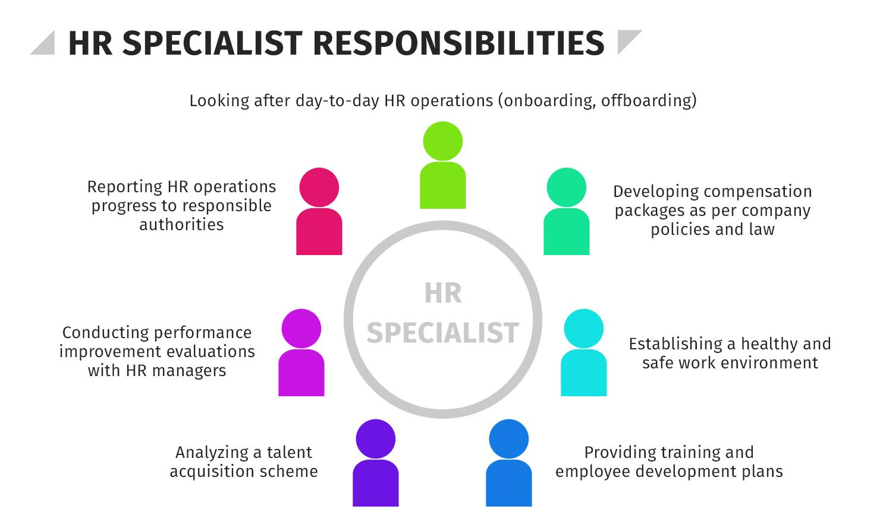

## Table of Contents

## What is a specialist role?

A specialist role is a job where a person has deep knowledge and skills in a specific area. This could be anything from a medical doctor who specializes in heart problems to a software engineer who focuses on a certain type of coding. People in specialist roles often spend many years learning and practicing their skills to become experts. They are usually very good at solving complex problems in their area of expertise.

Specialists are important because they can provide detailed and accurate solutions to specific issues. For example, a car mechanic who specializes in electric vehicles can fix problems that a general mechanic might not understand. Companies and organizations often hire specialists to help them with tasks that need a high level of skill and knowledge. This can make their work more efficient and effective.

## What are the common functions of a specialist?

Specialists often focus on solving detailed problems in their area of expertise. They use their deep knowledge to find solutions that others might not see. For example, a specialist in cybersecurity might find and fix security holes in a company's computer systems. They spend a lot of time learning and staying up-to-date with the latest information in their field. This helps them to be very good at what they do.

Specialists also give advice and guidance to others. They might train other workers or help a company make decisions. For instance, a financial specialist could help a business plan its budget or investments. By sharing their knowledge, specialists help improve the overall performance and efficiency of the organization they work for.

## How does a specialist differ from a generalist?

A specialist and a generalist are different in their focus and skills. A specialist knows a lot about one specific area. They spend a lot of time learning and working on this one thing, so they become very good at it. For example, a specialist in heart surgery knows a lot about heart problems and how to fix them. They can solve complex problems in their area of expertise.

On the other hand, a generalist knows a little about many different things. They can handle a wide range of tasks but may not be as skilled in any one area as a specialist. For example, a general doctor can treat many different health problems but might not know as much about heart surgery as a heart specialist. Generalists are good at seeing the big picture and can adapt to different situations.

In summary, specialists have deep knowledge in one area, while generalists have broader but shallower knowledge across many areas. Both are important, but they serve different needs. A specialist is crucial when you need an expert solution to a specific problem, while a generalist is valuable when you need someone who can handle a variety of tasks.

## What industries commonly employ specialists?

Many industries need specialists because they help solve hard problems. In the healthcare industry, specialists like doctors and nurses work on specific health issues. For example, a heart specialist helps people with heart problems, and a cancer specialist treats people with cancer. In technology, companies hire specialists in areas like software development, cybersecurity, and data science. These specialists make sure that computer systems work well and are safe from attacks.

Other industries that use specialists include finance and engineering. In finance, specialists like financial analysts and investment advisors help people and companies manage their money. They know a lot about markets and investments. In engineering, specialists design and build things like bridges, cars, and airplanes. They make sure these things are safe and work well. Each of these industries relies on specialists to do important work that needs deep knowledge and skills.

## What skills are essential for someone in a specialist role?

To be good in a specialist role, you need to know a lot about your specific area. This means you have to spend a lot of time learning and staying up-to-date with the latest information. For example, if you are a specialist in computer programming, you need to keep learning about new coding languages and techniques. Being able to solve hard problems is also important. Specialists often work on complex issues that need careful thinking and creativity to solve.

Good communication skills are also essential for a specialist. You need to explain your ideas and solutions clearly to others, whether you are working with a team or helping a client. Being able to teach others about your area of expertise can also be helpful. Lastly, specialists need to be good at managing their time and staying organized. This helps them to work efficiently and meet deadlines, which is important in many specialist jobs.

## How can one prepare for a career as a specialist?

To prepare for a career as a specialist, you need to focus on learning a lot about one specific area. This usually starts with getting a good education in your field. For example, if you want to be a heart specialist, you might start by going to medical school and then doing extra training in heart surgery. It's also important to keep learning after you finish school. You can do this by reading [books](/wiki/algo-trading-books), going to workshops, and staying up-to-date with new research in your area.

Another important part of preparing for a specialist career is gaining practical experience. This can come from internships, working on real projects, or even practicing on your own. The more you work in your field, the better you will become at solving complex problems. It's also helpful to find a mentor who is already a specialist in your area. They can give you advice and help you grow in your career. By combining education, continuous learning, and practical experience, you can become a successful specialist.

## What are the typical career paths for specialists?

Starting a career as a specialist often begins with getting the right education. For example, if you want to be a heart specialist, you would go to medical school and then do more training in heart surgery. After school, you might start as a junior specialist, working under more experienced people. As you learn and gain more experience, you can move up to become a senior specialist. Some specialists also go into teaching or research, sharing their knowledge with others.

As you become more experienced, you might take on more responsibility. You could become a lead specialist, where you guide a team of other specialists. Some specialists also start their own businesses or consult for different companies. For example, a cybersecurity specialist might work for many different companies, helping them keep their computer systems safe. The path you take can depend on your interests and what you want to achieve in your career.

In some fields, like technology or finance, specialists might move into management roles. They could become a director or manager, overseeing a whole department. This is a big change because it involves managing people and projects, not just working on technical problems. But their deep knowledge still helps them make good decisions. No matter the path, becoming a specialist takes a lot of hard work and dedication, but it can lead to a rewarding career.

## How do specialists contribute to organizational success?

Specialists help organizations succeed by solving hard problems that need deep knowledge. They focus on one area and become experts in it. This means they can find solutions that others might miss. For example, a cybersecurity specialist can find and fix security holes in a company's computer systems, keeping the company safe from attacks. By solving these problems, specialists help the organization work better and achieve its goals.

Specialists also share their knowledge with others in the organization. They can train other workers or help the company make smart decisions. For instance, a financial specialist can help a business plan its budget or investments. By giving advice and guidance, specialists make the whole organization more efficient and effective. This is important for the company's success because everyone can do their jobs better with the help of specialists.

## What are the challenges faced by specialists in their roles?

Specialists often face the challenge of keeping up with new information in their field. Because they focus on one specific area, they need to stay up-to-date with the latest research and technology. This can be hard because things change quickly. For example, a software specialist needs to learn new coding languages and tools all the time. If they don't, they might not be able to solve problems as well as they could.

Another challenge for specialists is working with others who may not understand their area of expertise. Specialists have a lot of deep knowledge, but they need to explain it in a way that others can understand. This can be hard, especially when they are working on a team with people from different backgrounds. Good communication is important, but it can take a lot of effort. Specialists also need to balance their time between solving problems and teaching others, which can be difficult.

## How do specialists stay updated with industry developments?

Specialists stay updated with industry developments by constantly learning and staying curious about their field. They read books, journals, and articles that share the latest research and news. They also go to conferences and workshops where experts talk about new ideas and technologies. By doing these things, specialists make sure they know the most recent information in their area. This helps them solve problems better and stay ahead in their careers.

Another way specialists stay updated is by joining professional groups and online communities. These groups let them talk to other experts and share what they know. They can ask questions and get advice from people all over the world. Being part of these communities helps specialists feel connected and learn from each other. This way, they can keep improving their skills and knowledge, even when things in their industry change quickly.

## What advanced qualifications can enhance a specialist's career?

Advanced qualifications can help specialists do better in their careers. One way to get these qualifications is by [earning](/wiki/earning-announcement) higher degrees, like a master's or a PhD. These degrees show that a specialist knows a lot about their field. For example, a doctor might get a PhD in a specific type of medicine to become an even better specialist. Another way is to get certifications. These are special tests or courses that show a specialist has certain skills. For instance, a cybersecurity specialist might get a certification in a new type of security software.

Specialists can also improve their careers by taking advanced training courses. These courses can teach them about the latest tools and techniques in their field. For example, a software developer might take a [course](/wiki/best-algorithmic-trading-courses) on a new programming language. By doing this, they can solve problems better and help their organization more. Staying updated with advanced qualifications helps specialists stay ahead and be more successful in their jobs.

## How do specialists collaborate with other team members and departments?

Specialists work with other team members and departments by sharing their deep knowledge and skills. They often explain complex ideas in a way that everyone can understand. For example, a cybersecurity specialist might help the marketing team understand how to protect customer data. By doing this, the specialist helps the whole organization work better and stay safe. They also work together on projects, where the specialist's expertise can solve hard problems that the team faces.

Specialists also need to listen to others and learn from them. Even though they know a lot about their own area, they can still learn from people in other departments. For instance, a financial specialist might work with the sales team to understand how to make better budgets. By working together, specialists and other team members can come up with new ideas and solutions. This teamwork helps the organization reach its goals and be more successful.

## What skills are necessary to develop for a career in algorithmic trading?

In the competitive landscape of [algorithmic trading](/wiki/algorithmic-trading), developing a robust skill set is crucial for those seeking to excel. A fundamental requirement is proficiency in programming languages, notably Python and C++. These languages are integral to developing and executing trading algorithms due to their efficiency and extensive libraries. For instance, Python’s Pandas library is invaluable for data manipulation and analysis. Here is a simple example of using Python for basic financial calculations:

```python
import pandas as pd

# Calculate moving average
def moving_average(prices, window):
    return prices.rolling(window=window).mean()

# Example usage
data = pd.Series([10, 11, 12, 13, 14, 15])
print(moving_average(data, window=3))
```

In addition to programming, strong analytical abilities are essential. Algorithmic traders must analyze vast datasets rapidly, identify patterns, and make data-driven decisions. Knowledge of statistical models and methods is vital, allowing traders to forecast market trends and optimize strategies. For instance, linear regression or time-series analysis can be used to predict future price movements or [volatility](/wiki/volatility-trading-strategies).

Mathematical skills are a cornerstone of algorithmic trading, supporting the development of quantitative models that underpin trading strategies. An understanding of calculus, linear algebra, and probability theory is often required. For example, stochastic calculus is frequently employed in modeling financial markets. A simple mathematical formula used in trading algorithms is the calculation of the exponential moving average (EMA), given by:

$$
\text{EMA}_{today} = ( \text{Price}_{today} \times \text{K}) + (\text{EMA}_{yesterday} \times (1 - \text{K}))
$$

where $K = \frac {2}{N+1}$ and $N$ is the number of days.

Understanding complex financial concepts is as critical as technical aptitude. Prospective algorithmic traders should be familiar with market dynamics, investment theories, and risk management principles.

Paths to acquiring these skills are diverse. Formal education, such as degrees in finance, computer science, mathematics, or engineering, offers a structured foundation. However, the rapid evolution of trading technologies also necessitates continuous self-learning. Online resources provide flexibility and up-to-date content, with platforms such as Coursera, edX, and Khan Academy offering courses on programming, data science, and financial markets.

Practical experience is equally important. Aspiring algorithmic traders should engage in internships or projects with financial firms to apply theoretical knowledge in real-world scenarios. Building a personal trading system or [backtesting](/wiki/backtesting) algorithms on historical data can offer invaluable insights and hands-on learning.

In summary, a career in algorithmic trading demands a comprehensive blend of technical and analytical skills, underpinned by a thorough understanding of financial concepts. By leveraging educational resources and gaining practical experience, one can develop the expertise necessary to thrive in this field.

## References & Further Reading

[1]: Bergstra, J., Bardenet, R., Bengio, Y., & Kégl, B. (2011). ["Algorithms for Hyper-Parameter Optimization."](https://proceedings.neurips.cc/paper/2011/file/86e8f7ab32cfd12577bc2619bc635690-Paper.pdf) Advances in Neural Information Processing Systems 24.

[2]: ["Advances in Financial Machine Learning"](https://www.amazon.com/Advances-Financial-Machine-Learning-Marcos/dp/1119482089) by Marcos Lopez de Prado

[3]: ["Evidence-Based Technical Analysis: Applying the Scientific Method and Statistical Inference to Trading Signals"](https://www.amazon.com/Evidence-Based-Technical-Analysis-Scientific-Statistical/dp/0470008741) by David Aronson

[4]: ["Machine Learning for Algorithmic Trading"](https://github.com/PacktPublishing/Machine-Learning-for-Algorithmic-Trading-Second-Edition) by Stefan Jansen

[5]: ["Quantitative Trading: How to Build Your Own Algorithmic Trading Business"](https://books.google.com/books/about/Quantitative_Trading.html?id=j70yEAAAQBAJ) by Ernest P. Chan