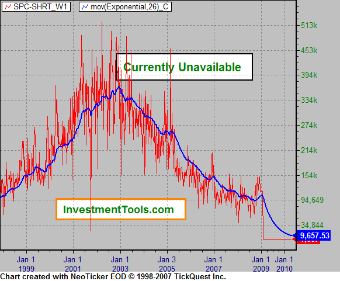

## Table of Contents

## What is a short sale in the stock market?

A short sale in the stock market is when an investor borrows shares of a stock from a broker and then sells those shares on the market. The investor hopes that the price of the stock will go down. If it does, they can buy the shares back at the lower price, return them to the broker, and keep the difference as profit.

However, short selling can be risky. If the stock price goes up instead of down, the investor will lose money. They will have to buy the shares back at a higher price to return them to the broker, resulting in a loss. Short selling is often used by experienced investors who believe a stock is overvalued and will decrease in price soon.

## What does the Specialist Short Sale Ratio measure?

The Specialist Short Sale Ratio is a measure that shows how much short selling is happening in the stock market. It looks at the number of shares that specialists, who are people that help with trading on stock exchanges, are selling short. This ratio is important because it can give investors an idea about what other traders think will happen to stock prices.

When the Specialist Short Sale Ratio is high, it means that specialists are doing a lot of short selling. This might mean they think stock prices will go down soon. On the other hand, if the ratio is low, it could mean that specialists are not doing much short selling, which might suggest they think stock prices will stay the same or go up. By watching this ratio, investors can get clues about market trends and make better decisions.

## How is the Specialist Short Sale Ratio calculated?

The Specialist Short Sale Ratio is figured out by looking at how many shares specialists are selling short compared to all the shares they are trading. Specialists are people who help with buying and selling stocks on stock exchanges. To find the ratio, you take the total number of shares that specialists sold short and divide it by the total number of shares they traded. This gives you a number that shows what part of their trading was short selling.

This ratio is useful because it tells us what specialists think about the market. If the ratio is high, it means specialists are doing a lot of short selling, which might mean they think stock prices will go down. If the ratio is low, it means they are not doing much short selling, which could mean they think prices will stay the same or go up. By watching this ratio, other investors can get hints about what might happen next in the market.

## Why is the Specialist Short Sale Ratio important for investors?

The Specialist Short Sale Ratio is important for investors because it gives them clues about what might happen to stock prices. Specialists are people who know a lot about the stock market and help with buying and selling stocks. When they do a lot of short selling, which means they think stock prices will go down, the Specialist Short Sale Ratio goes up. If investors see a high ratio, they might think about selling their stocks or waiting before they buy more, because it could mean prices will drop soon.

On the other hand, if the Specialist Short Sale Ratio is low, it means specialists are not doing much short selling. This could be a sign that they think stock prices will stay the same or go up. Investors might feel more confident about buying stocks when they see a low ratio, because it suggests that the market might be stable or growing. By keeping an eye on this ratio, investors can make smarter choices about when to buy or sell stocks.

## What does a high Specialist Short Sale Ratio indicate?

A high Specialist Short Sale Ratio means that specialists are doing a lot of short selling. Specialists are people who help with buying and selling stocks on the stock market. When they do a lot of short selling, it means they think that the prices of stocks will go down soon. They are betting that they can buy back the stocks at a lower price later.

This information is important for other investors. If they see a high Specialist Short Sale Ratio, it might be a warning sign. It could mean that it's a good time to sell their stocks or wait before buying more, because the market might be about to go down. By paying attention to this ratio, investors can make better decisions to protect their money.

## What does a low Specialist Short Sale Ratio suggest?

A low Specialist Short Sale Ratio means that specialists are not doing much short selling. Specialists are people who help with trading stocks on the stock market. When they don't do a lot of short selling, it shows that they think stock prices will stay the same or go up. They are not betting that the prices will go down soon.

This can be good news for other investors. If they see a low Specialist Short Sale Ratio, it might mean that it's a good time to buy stocks or hold onto the ones they already have. It suggests that the market might be stable or growing, which can help investors feel more confident about their investments.

## How can the Specialist Short Sale Ratio be used in trading strategies?

The Specialist Short Sale Ratio can help traders decide when to buy or sell stocks. If the ratio is high, it means that specialists think stock prices might go down. Traders might use this information to sell their stocks before the prices drop, or they might wait to buy stocks until the prices are lower. This way, they can avoid losing money or buy stocks at a better price.

On the other hand, if the Specialist Short Sale Ratio is low, it suggests that specialists think stock prices will stay the same or go up. Traders might see this as a good time to buy stocks or keep the ones they have. By watching the ratio, traders can feel more confident about their choices and try to make money when the market is doing well.

## What are the limitations of using the Specialist Short Sale Ratio as an indicator?

The Specialist Short Sale Ratio can be helpful, but it has some problems. One big problem is that it only shows what specialists think, and they might be wrong. Just because they think stock prices will go down or up doesn't mean it will happen. Also, the ratio can change a lot from day to day, so it might not be a good idea to make big decisions based on it alone. It's better to use it with other information to get a fuller picture of what's happening in the market.

Another limitation is that the Specialist Short Sale Ratio doesn't tell you why specialists are short selling. They might be doing it for many different reasons, not just because they think prices will go down. For example, they might be short selling to balance their own portfolios or because they have to follow certain rules. So, the ratio can be confusing if you don't know the whole story. It's important for traders to look at other signs and data too, not just this one ratio, to make smart choices about their investments.

## How does the Specialist Short Sale Ratio differ from other short interest metrics?

The Specialist Short Sale Ratio is different from other short interest metrics because it only looks at what specialists are doing. Specialists are people who help with trading on stock exchanges. This ratio shows how much of their trading is short selling. Other short interest metrics, like the Short Interest Ratio or Days to Cover, look at the total number of shares that everyone is short selling, not just specialists. So, the Specialist Short Sale Ratio gives a more focused view of what a specific group of traders thinks about the market.

Another way the Specialist Short Sale Ratio differs is that it can change quickly from day to day. This is because it's based on the daily actions of specialists. Other short interest metrics, like the Short Interest Ratio, are usually reported less often, like every two weeks or once a month. Because the Specialist Short Sale Ratio updates more often, it can be more useful for traders who want to make quick decisions. But it can also be more confusing because it can change a lot.

## Can the Specialist Short Sale Ratio predict market movements?

The Specialist Short Sale Ratio can give clues about what might happen in the stock market, but it can't predict the future for sure. It shows how much short selling specialists are doing. If the ratio is high, it means specialists think stock prices might go down soon. If it's low, they think prices might stay the same or go up. But specialists can be wrong, and many other things can affect the market too.

Because the Specialist Short Sale Ratio can change a lot from day to day, it's not always a good idea to rely on it alone to guess what the market will do. It's better to use it with other information, like news about the economy or other short interest metrics. This way, traders can get a fuller picture and make smarter choices about buying or selling stocks.

## How has the Specialist Short Sale Ratio been affected by changes in market regulations?

Changes in market regulations have had a big impact on the Specialist Short Sale Ratio. For example, rules that make it harder to short sell stocks can lower the ratio. When it's harder to short sell, specialists might do it less often. Also, new rules about how much information has to be shared can change how the ratio is calculated or reported. If there are more rules about reporting, the ratio might be more accurate but could also be more confusing to understand.

Another way regulations affect the Specialist Short Sale Ratio is through changes in how the stock market works. For instance, if there are new rules about who can be a specialist or how they have to trade, it can change what the ratio shows. Sometimes, regulations can make specialists less important in the market, which might mean the Specialist Short Sale Ratio becomes less useful as an indicator. Traders need to keep an eye on these changes to understand what the ratio means at different times.

## What are some case studies where the Specialist Short Sale Ratio provided significant insights?

In 2008, during the financial crisis, the Specialist Short Sale Ratio gave important clues about what was happening in the stock market. As the crisis got worse, the ratio went up a lot. This meant that specialists were doing more short selling because they thought stock prices would go down. Many investors saw this and decided to sell their stocks before the prices dropped even more. This helped some people avoid big losses during a very tough time in the market. The high Specialist Short Sale Ratio was a clear warning sign that the market was in trouble.

Another case was in early 2016, when the Specialist Short Sale Ratio started to go down. This suggested that specialists thought the market might start to get better. Many investors saw this and decided it was a good time to buy stocks. As it turned out, the market did start to recover later that year. The low Specialist Short Sale Ratio gave investors a hint that it might be a good time to invest, and some people made money by following this clue. These examples show how the Specialist Short Sale Ratio can help investors make smart choices, but it's not always right, so it's best to use it with other information too.

## What role does Ratio Analysis play in Investment Decisions?

Ratio analysis serves as an essential method for evaluating a company's financial condition and is pivotal in making informed investment decisions. This analytical tool allows investors to dissect financial statements using calculated ratios, which can highlight a company's strengths, weaknesses, and overall stability.

### Key Ratios Involved in Short Selling

In the context of short selling, several financial ratios are particularly useful:

1. **Debt-to-Equity Ratio (D/E)**: This ratio assesses a company's financial leverage by comparing its total liabilities to its shareholder equity. It is defined as:
$$
   \text{Debt-to-Equity Ratio} = \frac{\text{Total Liabilities}}{\text{Shareholders' Equity}}

$$

   A high D/E ratio might indicate that a company is heavily financed by debt, which could signify financial instability and potentially make it a target for short selling if investors speculate on its declining value.

2. **Price-Earnings Ratio (P/E)**: This ratio measures a company's current share price relative to its per-share earnings. Calculated as:
$$
   \text{P/E Ratio} = \frac{\text{Market Value per Share}}{\text{Earnings per Share (EPS)}}

$$

   A high P/E ratio might suggest overvaluation, which could attract short-sellers expecting a market correction.

3. **Specialist Short Sale Ratio**: This ratio focuses on the volume of short sales in relation to overall trading volume. It can provide insights into market sentiment and is given by:
$$
   \text{Specialist Short Sale Ratio} = \frac{\text{Short Sales Volume}}{\text{Total Trading Volume}}

$$

   A rising short sale ratio might indicate bearish investor sentiment towards the stock.

### Interpreting Ratios

Investors interpret these ratios to gauge a company's financial health and discern potential opportunities for short-selling. For example, a combination of a high D/E ratio and a declining P/E ratio may suggest imminent financial difficulties, making the stock an attractive target for short-sellers.

### Relationship with Broader Market Indicators

Short sell ratios can be compared with broader market metrics such as indices or sector performance, providing a more comprehensive view of market trends. This comparison can reveal whether a company is underperforming relative to its peers or the market as a whole, offering further context for short-selling decisions.

### Using Ratio Analysis in Trading Strategies

Investors rely on ratio analysis to refine their trading strategies, aiming to minimize risks while maximizing returns. By comparing ratios across different companies and sectors, investors can identify outliers and potential inefficiencies that may present short-selling opportunities. This calculated approach supports the development of balanced, risk-averse portfolios.

Incorporating ratio analysis into investment strategies allows investors to make data-driven decisions, aiming to optimize returns while mitigating potential downsides. This analytical technique remains a cornerstone of sound financial analysis and investment strategy development.

## References & Further Reading

[1]: Bergstra, J., Bardenet, R., Bengio, Y., & Kégl, B. (2011). ["Algorithms for Hyper-Parameter Optimization."](https://dl.acm.org/doi/10.5555/2986459.2986743) Advances in Neural Information Processing Systems 24.

[2]: ["Advances in Financial Machine Learning"](https://www.amazon.com/Advances-Financial-Machine-Learning-Marcos/dp/1119482089) by Marcos Lopez de Prado.

[3]: ["Evidence-Based Technical Analysis: Applying the Scientific Method and Statistical Inference to Trading Signals"](https://www.amazon.com/Evidence-Based-Technical-Analysis-Scientific-Statistical/dp/0470008741) by David Aronson.

[4]: ["Machine Learning for Algorithmic Trading"](https://github.com/stefan-jansen/machine-learning-for-trading) by Stefan Jansen.

[5]: ["Quantitative Trading: How to Build Your Own Algorithmic Trading Business"](https://www.amazon.com/Quantitative-Trading-Build-Algorithmic-Business/dp/1119800064) by Ernest P. Chan.