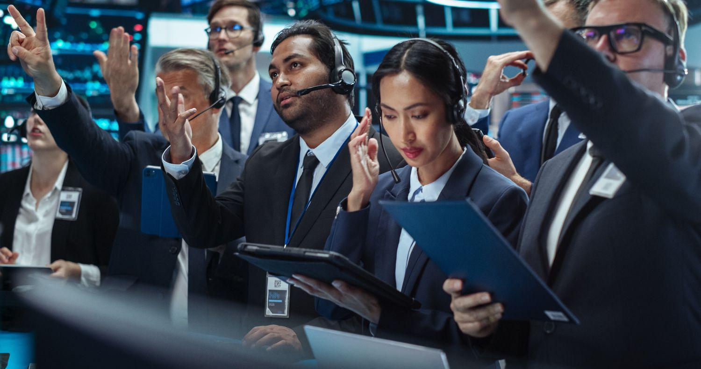

## Table of Contents

## What is a Specialist Unit?

A Specialist Unit is a group of people who are experts in a specific area. They work together to handle tasks that need special skills or knowledge. For example, in a hospital, there might be a Specialist Unit for heart surgery. These units are important because they can focus on one thing and do it really well.

In businesses, a Specialist Unit might be set up to deal with things like marketing or technology. This helps the company because the people in the unit know a lot about their subject and can solve problems quickly. Having a Specialist Unit can make a big difference in how well a company or organization works.

## What are the different types of Specialist Units?

Specialist Units can be found in many places like hospitals, police departments, and businesses. In hospitals, there are units like the Intensive Care Unit (ICU) where doctors and nurses take care of very sick patients. Another example is the Emergency Room (ER) where medical staff quickly help people who need urgent care. Police departments might have a SWAT team, which is a group trained to handle dangerous situations like hostage rescues. These units are important because they have the skills and tools needed for specific jobs.

In businesses, Specialist Units are often set up to focus on areas like marketing, technology, or human resources. A marketing unit, for example, works on advertising and promoting the company's products. A technology unit might handle all the computer systems and software used by the company. These units help the business run smoothly because the people in them know a lot about their specific area and can solve problems quickly.

Overall, Specialist Units are groups of experts who work together on tasks that need special skills. Whether it's in healthcare, law enforcement, or business, these units make a big difference by focusing on one thing and doing it really well.

## How does a Specialist Unit differ from a general unit?

A Specialist Unit is a group of people who are experts in one specific area. They work together to do tasks that need special skills or knowledge. For example, in a hospital, a Specialist Unit like the Intensive Care Unit (ICU) takes care of very sick patients. These units are important because the people in them know a lot about their specific job and can do it really well.

A general unit, on the other hand, is made up of people who can do many different tasks. They might not be experts in one thing, but they can handle a wide range of jobs. In a hospital, a general unit might be a regular ward where nurses and doctors take care of patients with different kinds of health problems. The main difference is that a Specialist Unit focuses on one thing and does it really well, while a general unit can do many things but might not be as good at any one thing as a Specialist Unit.

## What are the common roles within a Specialist Unit?

In a Specialist Unit, you'll find different roles that help the unit do its job well. There's usually a leader, like a manager or a team captain, who makes sure everyone knows what to do and keeps things running smoothly. Then, there are the experts, who are really good at the unit's special skill. For example, in a hospital's Intensive Care Unit, these experts might be doctors and nurses who know a lot about taking care of very sick patients.

Besides the leader and the experts, there might be other roles like technicians or support staff. Technicians could be people who handle special equipment or tools needed for the unit's work. Support staff might do things like keeping records or helping with daily tasks, so the experts can focus on their main job. All these roles work together to make sure the Specialist Unit can do its special job really well.

## What kind of training is required to join a Specialist Unit?

Joining a Specialist Unit usually needs special training. This training helps you learn the skills and knowledge you need for the unit's job. For example, if you want to join a hospital's Intensive Care Unit, you might need to go to medical school and then get more training in taking care of very sick patients. This could mean learning how to use special machines or understanding how to treat certain illnesses really well.

The training can take a long time and might include both classroom learning and hands-on practice. For a police SWAT team, you would first need to be a police officer and then go through extra training in things like using special weapons, handling dangerous situations, and working as a team. This training makes sure that everyone in the Specialist Unit knows what to do and can do it well when it matters.

## How are Specialist Units typically deployed?

Specialist Units are usually deployed when a situation needs their special skills. For example, in a hospital, if a patient is very sick, the Intensive Care Unit (ICU) team might be called to take care of them. The team gets a message or an alert, and they quickly go to where they are needed. They bring their special tools and knowledge to help the patient get better.

In other places like police departments, a SWAT team might be sent to handle a dangerous situation, like a hostage rescue. When the police get a call about something serious, they decide if the SWAT team is needed. If it is, the team gets ready fast, gathers their gear, and goes to the scene to deal with the problem safely.

## What are the key challenges faced by Specialist Units?

Specialist Units often face challenges because they need to be ready for hard jobs. One big challenge is keeping up their skills. Since they deal with special situations, they need to practice a lot. If they don't practice, they might not be as good when they are needed. Also, they need to have the right tools and equipment. If something breaks or is missing, it can be hard for them to do their job well.

Another challenge is working together as a team. In a Specialist Unit, everyone has to know what the others are doing. If someone makes a mistake, it can affect the whole team. They also need to communicate well, so they can react quickly to changes. It can be hard to keep everyone working smoothly, especially in stressful situations.

Lastly, Specialist Units can face problems with resources. They might not always have enough money or people to do everything they need to do. This can make it tough to keep the unit running well. They might have to do more with less, which can be very challenging.

## Can you provide examples of successful operations conducted by Specialist Units?

In 2013, a Specialist Unit called the Navy SEALs carried out a successful mission to rescue an American doctor kidnapped by the Taliban in Afghanistan. The SEALs used their special training to sneak into the area where the doctor was being held. They worked as a team to quickly and quietly free the doctor without anyone getting hurt. This showed how well they could use their skills and work together in a dangerous situation.

Another example is from the medical field. In 2020, during the height of the COVID-19 pandemic, the Intensive Care Units (ICUs) in many hospitals did a great job taking care of very sick patients. The doctors and nurses in these units used their special knowledge to help people breathe better and fight the virus. Their hard work and teamwork saved many lives and showed how important Specialist Units are in emergencies.

## How does technology impact the operations of Specialist Units?

Technology has a big impact on how Specialist Units do their jobs. It helps them work better and faster. For example, in a hospital's Intensive Care Unit, machines like ventilators and monitors help doctors and nurses keep track of a patient's health. These tools give them important information quickly, so they can make good decisions and help the patient get better. Technology also lets them talk to each other easily, even if they are in different places. This is important for working as a team.

In police SWAT teams, technology like drones and special cameras helps them see what is happening in dangerous situations without putting themselves at risk. They can use this information to plan their actions carefully. Also, computers and special software help them practice and train for different situations. This makes sure they are ready when they need to act. Technology makes Specialist Units more effective and safer.

## What are the future trends for Specialist Units in terms of organization and capabilities?

In the future, Specialist Units will likely see big changes in how they are organized and what they can do. One trend is that they will use more technology to help them work better. For example, they might use robots or [artificial intelligence](/wiki/ai-artificial-intelligence) to help with their jobs. This could mean robots helping doctors in hospitals or AI helping police plan their actions. These tools can make Specialist Units faster and more accurate, so they can help people even better.

Another trend is that Specialist Units will work more closely with other groups. They might team up with other units or even different organizations to share information and skills. This teamwork can help them solve bigger problems and handle more complex situations. For example, a hospital's Intensive Care Unit might work with a technology company to develop new tools for treating patients. By working together, Specialist Units can do more than they could alone.

## How do Specialist Units coordinate with other military or law enforcement units?

Specialist Units often need to work with other military or law enforcement units to get their jobs done well. They do this by talking to each other a lot and sharing important information. For example, a SWAT team might need to work with regular police officers to handle a dangerous situation. The SWAT team would tell the other officers what they are planning to do, so everyone knows their role and can work together safely. They might use radios, computers, or special meetings to make sure everyone is on the same page.

In the military, Specialist Units like Special Forces might need to work with regular army units during big missions. They would plan together and share information about the mission's goals and how to achieve them. The Special Forces might give the regular units advice on how to handle certain parts of the mission, and the regular units might help with things like transportation or backup. Good coordination makes sure that everyone works together smoothly and can handle whatever challenges come up.

## What ethical considerations must Specialist Units take into account during their operations?

Specialist Units have to think about ethics when they do their jobs. This means they need to do what is right and fair. For example, in a hospital, the Intensive Care Unit team must treat all patients the same, no matter who they are. They need to make sure they are not favoring one person over another. They also need to keep patients' information private and only share it when it's needed for their care. This helps build trust and makes sure everyone gets the help they need.

In law enforcement, like a SWAT team, ethical considerations are also very important. They need to use force only when it's necessary and always try to keep people safe. They should follow the rules and laws, even in dangerous situations. This means not using too much force and making sure they treat everyone fairly. By doing this, they can do their job well and still do what is right.

## What are the roles and responsibilities in algorithmic trading?

Algorithmic trading has transformed how financial markets operate by leveraging mathematical models and advanced algorithms to execute trades with speed and precision. A key component of this system is the roles and responsibilities of quantitative analysts, developers, and traders, each of whom plays a critical part in the trading process.

Quantitative analysts, often referred to as "quants," are responsible for the creation and refinement of mathematical models that predict market behavior. These professionals use a variety of quantitative tools and techniques to develop trading strategies designed to capitalize on market inefficiencies. By employing statistical methods, like linear regression and time-series analysis, quants analyze historical data to identify patterns and forecast future price movements. For example, a simple moving average (SMA) model might be used to predict trends based on past performance:

$$
\text{SMA} = \frac{P_1 + P_2 + \cdots + P_n}{n}
$$

where $P_1, P_2, \ldots, P_n$ are the price values at different time points, and $n$ is the number of observations.

Developers take these trading models and implement them into functional algorithms using programming languages such as Python or C++. Their job is to ensure that these algorithms are efficient, reliable, and scalable. The developers write code that executes trades based on parameters set by the quantitative analysts, often incorporating [machine learning](/wiki/machine-learning) techniques to adapt to changing market conditions. For example, a Python script might automate a simple moving average crossover strategy:

```python
import pandas as pd

def sma_crossover_strategy(prices, short_window=40, long_window=100):
    signals = pd.DataFrame(index=prices.index)
    signals['signal'] = 0.0

    # Compute short and long simple moving averages
    signals['short_mavg'] = prices['Close'].rolling(window=short_window, min_periods=1).mean()
    signals['long_mavg'] = prices['Close'].rolling(window=long_window, min_periods=1).mean()

    # Create signals
    signals['signal'][short_window:] = np.where(signals['short_mavg'][short_window:] 
                                                > signals['long_mavg'][short_window:], 1.0, 0.0)   

    # Generate trading orders
    signals['positions'] = signals['signal'].diff()
    return signals
```

Traders, on the other hand, are responsible for monitoring these algorithms and making real-time adjustments based on dynamic market conditions. With access to analytics tools and dashboards, traders evaluate performance metrics such as risk exposure, trading [volume](/wiki/volume-trading-strategy), and execution speed. They may intervene to adjust parameters or halt trading in response to unexpected market events. This proactive management helps balance the risk and ensure adherence to trading strategies.

Together, these roles create a cohesive framework that drives the [algorithmic trading](/wiki/algorithmic-trading) process. While quants develop and fine-tune the theoretical foundation, developers ensure practical implementation, and traders provide oversight and tactical adjustments, ensuring the alignment of strategies with market realities. This collaborative dynamic is critical for enhancing the efficiency and efficacy of trading operations.

## What are Common Algorithmic Trading Strategies?

In algorithmic trading, strategies are designed to capitalize on various market inefficiencies using statistical and quantitative analysis. Among the most popular strategies are [trend following](/wiki/trend-following), mean reversion, and [arbitrage](/wiki/arbitrage).

Trend following strategies aim to exploit the [momentum](/wiki/momentum) of market prices, operating on the principle that stocks that have been rising or falling will continue to do so. These strategies often utilize moving averages, breakouts, and other technical indicators to identify trends. For instance, a simple moving average crossover strategy might buy a security when a short-term moving average crosses above a long-term moving average, signaling an upward price trend. Here is a basic implementation in Python:

```python
import pandas as pd

def moving_average_crossover(prices, short_window=40, long_window=100):
    signals = pd.DataFrame(index=prices.index)
    signals['short_mavg'] = prices.rolling(window=short_window).mean()
    signals['long_mavg'] = prices.rolling(window=long_window).mean()
    signals['signal'] = 0.0
    signals['signal'][short_window:] = \
        np.where(signals['short_mavg'][short_window:] > signals['long_mavg'][short_window:], 1.0, 0.0)
    signals['positions'] = signals['signal'].diff()
    return signals
```

Mean reversion strategies, on the other hand, are based on the hypothesis that prices will revert to their historical averages over time. Such strategies identify securities that are currently mispriced, assuming they will return to their mean value. The Ornstein-Uhlenbeck stochastic process is a common model employed for mean reversion strategies, represented by the equation:

$$
dX_t = \theta (\mu - X_t) dt + \sigma dW_t
$$

where $X_t$ is the price level at time $t$, $\theta$ is the rate of reversion, $\mu$ is the long-term mean price, $\sigma$ is the volatility, and $dW_t$ is a Wiener process.

Arbitrage strategies involve simultaneously buying and selling identical financial instruments or their derivatives to profit from price discrepancies across different markets or forms. A classic example is [statistical arbitrage](/wiki/statistical-arbitrage), which often employs pairs trading. This involves identifying two historically correlated securities, monitoring their price deviations, and executing trades when they diverge with the expectation that they will revert to their mean historical relationship.

These algorithmic trading strategies are powered by sophisticated statistical models and require [backtesting](/wiki/backtesting) to assess their robustness under various market conditions. They depend on accurate data, efficient computational resources, and impeccable execution to be successful. As financial markets continue to grow in complexity, traders leverage these strategies to gain an edge, constantly refining them to adapt to the evolving landscape.

## References & Further Reading

[1]: Bergstra, J., Bardenet, R., Bengio, Y., & Kégl, B. (2011). ["Algorithms for Hyper-Parameter Optimization."](https://dl.acm.org/doi/10.5555/2986459.2986743) Advances in Neural Information Processing Systems 24.

[2]: ["Advances in Financial Machine Learning"](https://www.amazon.com/Advances-Financial-Machine-Learning-Marcos/dp/1119482089) by Marcos Lopez de Prado

[3]: ["Evidence-Based Technical Analysis: Applying the Scientific Method and Statistical Inference to Trading Signals"](https://www.amazon.com/Evidence-Based-Technical-Analysis-Scientific-Statistical/dp/0470008741) by David Aronson

[4]: ["Machine Learning for Algorithmic Trading"](https://github.com/stefan-jansen/machine-learning-for-trading) by Stefan Jansen

[5]: ["Quantitative Trading: How to Build Your Own Algorithmic Trading Business"](https://www.amazon.com/Quantitative-Trading-Build-Algorithmic-Business/dp/1119800064) by Ernest P. Chan