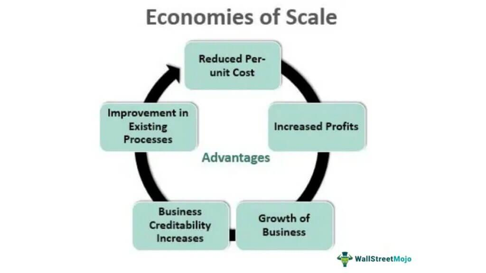

The relationship between business strategies and economies of scale is intrinsic to the understanding of modern economic growth and competitive advantage. Economies of scale refer to the cost advantages that businesses experience when production becomes efficient, demonstrated by the reduction of average costs with the increase of output. This concept is pivotal for firms aiming to establish a strong market presence by optimizing their operations and capitalizing on reduced per-unit costs. 

Algorithmic trading represents a burgeoning area within financial markets, characterized by the utilization of advanced algorithms and computer systems to execute trades at high speeds and frequencies. As a growing field, algorithmic trading leverages large volumes of data and sophisticated analytical tools to capitalize on market movements. The trend towards automation and systematic trading methods showcases the profound impact of technology on traditional trading practices.

Specialization plays a vital role in achieving economies of scale, aligning with the principle that focusing on specific areas of production or expertise can bolster efficiency and drive growth. Firms that specialize effectively can produce greater volumes at lower costs, as they benefit from refined processes and expert knowledge. This concentrated focus not only enhances productivity but also positions companies strategically in competitive markets.

Algorithmic trading significantly benefits from both economies of scale and specialization. As firms scale their trading operations, they can maximize efficiencies through the increased processing of data and execution of trades. Specialization within algorithmic trading – whether in specific markets, asset classes, or trading strategies – allows firms to harness deep market insights and tailored strategies, improving both performance and profitability. The synthesis of these strategies within the realm of algorithmic trading forms a robust foundation for creating sustained competitive advantages.

The purpose of this article is to explore the interrelated concepts of economies of scale, specialization, and their implications on business strategy, particularly within the context of algorithmic trading. By examining these themes, the article seeks to provide insights into how businesses can align these strategies to enhance performance and achieve strategic growth.

Key sections of the article will include a detailed explanation of economies of scale and their impact on businesses, an analysis of specialization as a strategic approach, an overview of algorithmic trading and its evolution, and a discussion on achieving and merging these concepts within the trading industry. The article will conclude by integrating these strategies to propose a holistic business approach that aligns scalability with specialized expertise for optimal outcomes.

## Table of Contents

## Understanding Economies of Scale

Economies of scale refer to the cost advantages that businesses can achieve due to an increase in the scale of operations resulting in reduced per-unit costs. This concept is a cornerstone in strategic planning, facilitating businesses to enhance their competitive edge by optimizing costs and output.

Economies of scale are broadly categorized into two types: internal and external. Internal economies of scale occur within a company and are the result of scalable processes, efficient use of resources, and managerial efficiencies. Examples include technological advancements in production processes, bulk purchasing of materials, and specialization of the workforce. For instance, a manufacturer might install advanced automated machinery that increases production capacity with minimal additional costs, thereby reducing the average cost per unit produced.

External economies of scale, on the other hand, arise from factors outside a company but within the industry or geographical area. These advantages might include a more skilled labor force in a region, improved industry infrastructure, or the benefits gained from suppliers and customers clustering in one location. Silicon Valley serves as a prime example, where the concentration of technology firms results in shared knowledge, talent, and resources that reduce operational costs for each firm participating in that regional cluster.

Industries such as automobile manufacturing, consumer electronics, and retail frequently demonstrate economies of scale. In automobile production, large-scale manufacturers benefit from high-[volume](/wiki/volume-trading-strategy) assembly lines that significantly lower the cost per vehicle compared to smaller producers. Retail giants like Walmart leverage their massive purchasing power to negotiate lower prices with suppliers, thereby passing cost savings on to consumers and maintaining a pricing advantage over competitors.

Economies of scale can confer substantial competitive advantages, primarily through cost leadership. By lowering the per-unit cost, a company can offer its products at more competitive prices or achieve higher profit margins. This capability enables firms to capture larger market shares and potentially exert pressure on smaller competitors who cannot match these lower costs.

The impact of economies of scale on cost reduction and efficiency is profound. Companies experiencing these economies see a direct decrease in the average total cost (ATC) over an increased output range. This relationship can be expressed with the formula:

$$
ATC = \frac{TC}{Q}
$$

where $ATC$ is the average total cost, $TC$ is the total cost, and $Q$ is the quantity of output. As production scale increases, internal efficiencies and other factors contribute to a reduction in $ATC$, enabling the firm to improve its operational efficiency.

In summary, economies of scale are essential in reducing costs and enhancing efficiencies, thereby providing firms with a potent tool to fortify their competitive positioning in the market. Understanding and leveraging these principles is crucial for businesses aiming to expand their operations cost-effectively.

## The Role of Specialization in Business Strategy

Specialization as a business strategy involves concentrating efforts on specific activities, products, or services wherein a company can achieve maximal effectiveness and efficiency. This focused approach allows firms to streamline processes, refine expertise, and create a robust market presence.

### Benefits of Specialization

1. **Efficiencies**: Specialization leads to increased efficiency as firms allocate resources towards mastering a particular domain. By honing specific skills and concentrating on a defined scope, businesses reduce waste and optimize production processes. This concept aligns with Adam Smith's proposition in "The Wealth of Nations," where he illustrates the efficiency gained through specialized labor in a pin factory.

2. **Expert Knowledge**: Through specialization, companies develop profound expertise in chosen areas, allowing them to innovate and improve continuously. This expertise enhances product quality and service delivery, granting firms a competitive advantage and fostering customer trust. For example, a technology firm specializing in artificial intelligence (AI) systems will be better positioned to lead in that niche compared to a company with a broader technology focus.

3. **Market Positioning**: Specialization allows companies to distinguish themselves from competitors, enabling them to establish strong brand identities. By focusing on niche markets, specialized firms can cater to specific customer needs more effectively, creating loyal customer bases and potentially commanding premium pricing.

### Contribution to Economies of Scale

Specialization is a critical driver for achieving economies of scale. By concentrating on limited areas, firms can increase their output more efficiently, reducing the average cost per unit as production scales up. The formula for achieving economies of scale is expressed as:

$$
\text{AC} = \frac{\text{TC}}{Q}
$$

Where:
- $\text{AC}$ is the average cost per unit,
- $\text{TC}$ is the total cost, and
- $Q$ is the quantity of output produced.

As specialization increases the output (Q), average costs (AC) tend to decrease, reflecting greater cost-efficiency due to bulk production and optimized resource allocation.

### Examples of Successful Specialization

Several companies illustrate the power of specialization. For instance, Intel's focus on semiconductor production has enabled it to dominate the global microprocessor market. Similarly, FedEx's specialization in overnight shipping set a new standard in logistics and allowed it to scale effectively.

### Challenges and Risks of Over-Specialization

While specialization offers many benefits, over-specializing can expose companies to risks such as market [volatility](/wiki/volatility-trading-strategies) and changing consumer preferences. If a company invests heavily in a niche that becomes obsolete or saturates, it may face significant financial difficulties. Over-specialization may also lead to inflexibility, inhibiting a firm's ability to diversify and adapt to new opportunities.

In conclusion, specialization as a business strategy can drive efficiencies and market positioning while facilitating economies of scale. However, companies must remain vigilant to the challenges of over-specialization to maintain strategic agility and resilience.

## Algorithmic Trading: An Overview

Algorithmic trading, also known as algo trading, refers to the use of computer algorithms or predefined instructions to execute trading orders in financial markets. It has become a significant player in the trading landscape, altering how trades are conducted across global markets.

Technological advancements have greatly facilitated the rise of [algorithmic trading](/wiki/algorithmic-trading). High-frequency trading ([HFT](/wiki/high-frequency-trading-strategies)) systems leverage advanced computer programs that execute a large number of orders at extremely high speeds. These systems are often located close to exchange servers to minimize latency, a strategy known as colocation. The development and integration of [artificial intelligence](/wiki/ai-artificial-intelligence) (AI) and [machine learning](/wiki/machine-learning) (ML) technologies have further enhanced the capabilities of algorithmic traders by allowing them to process large datasets and extract actionable insights rapidly.

Algorithmic trading offers several key benefits:

1. **Speed**: Algorithms execute orders with split-second timing, significantly faster than human traders. This speed is particularly advantageous in high-frequency trading, where trades are executed in milliseconds.

2. **Precision**: Algorithms follow a set of predetermined rules, which limits human errors associated with impulsive trading decisions. This precision ensures consistent adherence to trading strategies and criteria.

3. **Reduced Human Error**: By automating the trading process, algorithmic trading minimizes the risks of human errors such as typographical mistakes or misinterpretations of market data.

Various types of algorithmic trading strategies are employed by businesses. Some of the prevalent strategies include:

- **Trend Following**: Algorithms detect market trends and execute trades based on the sustained direction of asset prices, such as moving averages or channel breakouts.

- **Arbitrage**: This strategy exploits price discrepancies of the same asset in different markets, ensuring trades are executed to take advantage of short-lived market inefficiencies.

- **Market Making**: Algorithms provide liquidity by simultaneously offering to buy and sell an asset, profiting from the bid-ask spread.

- **Statistical Arbitrage**: This involves algorithms using mean-reversion trading strategies based on statistical models to predict price movements and exploit pairs trading opportunities.

Overall, the integration of cutting-edge technology in algorithmic trading has transformed financial markets by enhancing the speed, accuracy, and efficiency of trading processes. Its myriad strategies allow firms to capitalize on market movements while mitigating risks associated with human intervention.

## Achieving Economies of Scale in Algorithmic Trading

Algorithmic trading firms leverage economies of scale to enhance their competitive advantage and operational efficiency. By increasing the volume of transactions and optimizing resource utilization, these firms can significantly reduce per-unit costs, allowing them to offer more competitive pricing and improve profitability.

Data and infrastructure are central to scaling algorithmic trading operations. Large datasets are essential for developing predictive models and back-testing trading strategies. Firms invest in advanced data storage solutions and high-capacity networks to manage and process vast amounts of data effectively. Cloud computing platforms, such as AWS, Google Cloud, and Microsoft Azure, enable firms to scale their operations elastically, accommodating peak trading periods without proportionate increases in infrastructure costs. This scalability is a critical [factor](/wiki/factor-investing) in reducing average cost and supports the execution of complex trading algorithms in real-time.

Automation and technology play a fundamental role in achieving efficiencies in algorithmic trading. Automated trading systems allow firms to execute trades at speeds and frequencies unachievable by human traders. Using technologies like machine learning and artificial intelligence, these systems can adapt to market changes and optimize trading performance continuously. This automation reduces the need for a large workforce, further contributing to cost efficiency. In Python, libraries such as NumPy and pandas are used for data manipulation, while TensorFlow and PyTorch aid in developing sophisticated machine learning models.

Several algorithmic trading firms have demonstrated success by scaling their operations. For example, Renaissance Technologies is renowned for using quantitative models to manage billions of dollars in assets. The firm's ability to analyze extensive amounts of market data with precision results in high-frequency trading success. Similarly, Two Sigma leverages technology and data science to develop proprietary trading strategies, maintaining a competitive edge through its ability to scale and automate effectively.

Through these strategies, algorithmic trading firms successfully achieve economies of scale, leading to reduced costs, increased efficiency, and enhanced market competitiveness.

## Specialization in Algorithmic Trading

Firms specializing in algorithmic trading focus on developing strategies that cater to specific markets or trading approaches. Specialization allows these firms to leverage deep expertise, enhance their performance, and increase profitability by tailoring their operations to particular segments or methodologies. This approach often results in more effective trading algorithms, as resources are concentrated on mastering a narrow area of the vast financial markets. 

In algorithmic trading, firms might specialize in high-frequency trading (HFT), quantitative research-driven strategies, or [arbitrage](/wiki/arbitrage) opportunities. For instance, companies focusing on HFT develop algorithms that can execute trades within microseconds, capitalizing on fleeting market inefficiencies. Specializing in HFT requires significant investment in technology to ensure minimal latency, highlighting how a focus in this area demands a unique set of capabilities. 

The benefits of such specialization come from the ability to optimize strategies continuously through focused research and development. A specialized focus often leads to the accumulation of a wealth of knowledge, allowing firms to refine their models more efficiently. This refinement translates into improved performance metrics, such as higher Sharpe ratios and lower drawdowns, which ultimately enhance profitability. 

Several case studies highlight the impact of specialization in improving trading outcomes. Consider Renaissance Technologies, a firm renowned for its Medallion Fund. By concentrating on quantitative research and employing specialists from fields like mathematics and physics, the firm has consistently outperformed broader market indices. This case underscores how a deep focus on [quantitative trading](/wiki/quantitative-trading) allowed the firm to develop sophisticated algorithms that exploit patterns unnoticed by others, ensuring superior returns.

Moreover, specialization can be synergistically combined with economies of scale to achieve even greater performance enhancements. Larger algorithmic trading firms often utilize their significant resources to scale operations. This scaling involves expanding the specialized strategies across multiple markets or financial instruments, thereby maximizing returns on their specialized knowledge. By merging specialization with economies of scale, firms can leverage their unique strengths while also benefiting from cost efficiencies, such as reduced transaction costs and optimized resource allocation. Specialization in algorithmic trading thus not only enhances individual performance but, when scaled appropriately, supports broader strategic growth.

In summary, specializing in algorithmic trading allows firms to develop a competitive edge through deep expertise and refined strategies. By focusing on specific markets or trading methodologies, they achieve superior performance and profitability, which can be further elevated by integrating these specialized strategies with economies of scale.

## Integrating Business Strategies: A Holistic Approach

Integrating business strategies by combining economies of scale with specialization involves creating a robust framework that efficiently leverages both broad operational capabilities and deep, niche expertise. This approach can provide firms with a formidable competitive advantage, particularly in dynamic sectors like algorithmic trading where rapid adaptation and precision are crucial.

### Balancing General Capabilities with Specialized Knowledge

Balancing general capabilities with specialized knowledge requires a strategic alignment of resources, processes, and expertise to achieve both scale and depth. General capabilities might include infrastructure, technology platforms, and business processes that support large-scale operations. For instance, in algorithmic trading, robust data processing systems, high-frequency trading platforms, and comprehensive security protocols are essential general capabilities.

On the other hand, specialized knowledge involves deep expertise in specific areas such as complex algorithms, niche market segments, or unique financial instruments. Firms can achieve this balance by fostering cross-functional teams that incorporate both generalists and specialists. This ensures that while the overarching business operations are scalable, they are also capable of adapting to and excelling in specialized market demands.

### Strategies for Firms to Achieve Scalability Without Sacrificing Specialization

Firms can implement several strategies to achieve scalability while maintaining specialization:

1. **Modular Architecture:** Developing a modular system architecture allows firms to scale operations quickly while enabling specialized components to be upgraded or replaced independently. This approach is commonly used in software development, where microservices enable specialized functionalities without affecting the entire system.

2. **Cross-Training Programs:** Encouraging cross-training and knowledge sharing across teams ensures that staff are aware of both general operational processes and specialized tasks. This not only enhances flexibility but also encourages innovation.

3. **Strategic Partnerships:** Forming partnerships with other firms or specialists in niche areas can enhance specialization without the internal cost and complexity. This approach allows firms to tap into expert knowledge while leveraging their own scalable infrastructure.

4. **Investment in R&D:** Continuous investment in research and development can help maintain a competitive edge in specialized fields. By dedicating resources to explore new algorithms or trading strategies, firms can ensure their specialization remains cutting-edge.

### Future Trends in Business Strategy as it Pertains to Algo Trading

Looking ahead, several trends are likely to shape business strategies in algorithmic trading:

- **Artificial Intelligence and Machine Learning:** As AI and ML technologies advance, they will play a larger role in algorithmic trading strategies. These technologies can enhance both general capabilities (e.g., data processing speeds) and specialization (e.g., predictive analytics for specific markets).

- **Decentralization and Blockchain:** The integration of blockchain technology might lead to more decentralized trading platforms, affecting how scalability and specialization are managed. Firms may increasingly specialize in blockchain-related trading instruments or processes while maintaining scalable operations through distributed networks.

- **Regulatory Compliance:** With the evolving regulatory landscape, algorithmic trading firms must balance scalability with the specialized task of navigating compliance requirements. This may involve developing specialized compliance algorithms while ensuring they integrate seamlessly into scalable trading systems.

In sum, a holistic approach that integrates economies of scale with specialization allows algorithmic trading firms to maximize efficiency, responsiveness, and innovation. By strategically balancing broad capabilities with niche expertise, firms can achieve sustained competitive advantage and remain agile in a rapidly evolving market landscape.

## Conclusion

Economies of scale and specialization serve as formidable business strategies that drive cost efficiency and competitive advantage. Economies of scale allow businesses to reduce costs per unit by expanding production and utilizing resources more effectively. This is achieved through bulk purchasing, optimized production techniques, and investment in advanced technologies. Specialization, on the other hand, enables firms to focus on their core competencies, allowing them to develop expert knowledge, improve efficiency, and deliver higher quality products or services.

Within the world of algorithmic trading, the integration of these strategies proves essential. Algorithmic trading firms benefit immensely from economies of scale by leveraging large datasets and robust technological infrastructures to execute trades at higher volumes and speeds with greater precision. This scale lowers costs and increases profitability through more efficient allocation of resources. Specialization in algorithmic trading involves firms honing their focus on specific strategies, markets, or asset classes, thus gaining a deeper understanding and expertise in those areas. Such specialization allows firms to design more effective algorithms and improve trading outcomes.

Businesses should consider adopting an integrated approach that combines economies of scale with specialization. This combination can yield significant strategic growth by maintaining general analytical capabilities while simultaneously developing specialized knowledge in niche areas. Firms should strive to achieve scalability without sacrificing their specialized advantages. As algorithmic trading evolves, businesses must stay abreast of the latest technological advancements and market trends to effectively integrate these strategies.

In conclusion, leveraging economies of scale and specialization presents a pathway for businesses to secure a competitive edge. Companies should explore these insights to cultivate a robust business strategy that not only enhances efficiency and profitability but also positions them for sustained growth and success in the competitive landscape of algorithmic trading.

## References & Further Reading

[1]: Bergstra, J., Bardenet, R., Bengio, Y., & Kégl, B. (2011). ["Algorithms for Hyper-Parameter Optimization."](https://dl.acm.org/doi/10.5555/2986459.2986743) Advances in Neural Information Processing Systems 24.

[2]: ["Advances in Financial Machine Learning"](https://www.amazon.com/Advances-Financial-Machine-Learning-Marcos/dp/1119482089) by Marcos Lopez de Prado

[3]: ["Evidence-Based Technical Analysis: Applying the Scientific Method and Statistical Inference to Trading Signals"](https://books.google.com/books/about/Evidence_Based_Technical_Analysis.html?id=MeoJAQAAMAAJ) by David Aronson

[4]: ["Machine Learning for Algorithmic Trading"](https://github.com/stefan-jansen/machine-learning-for-trading) by Stefan Jansen

[5]: ["Quantitative Trading: How to Build Your Own Algorithmic Trading Business"](https://www.amazon.com/Quantitative-Trading-Build-Algorithmic-Business/dp/1119800064) by Ernest P. Chan