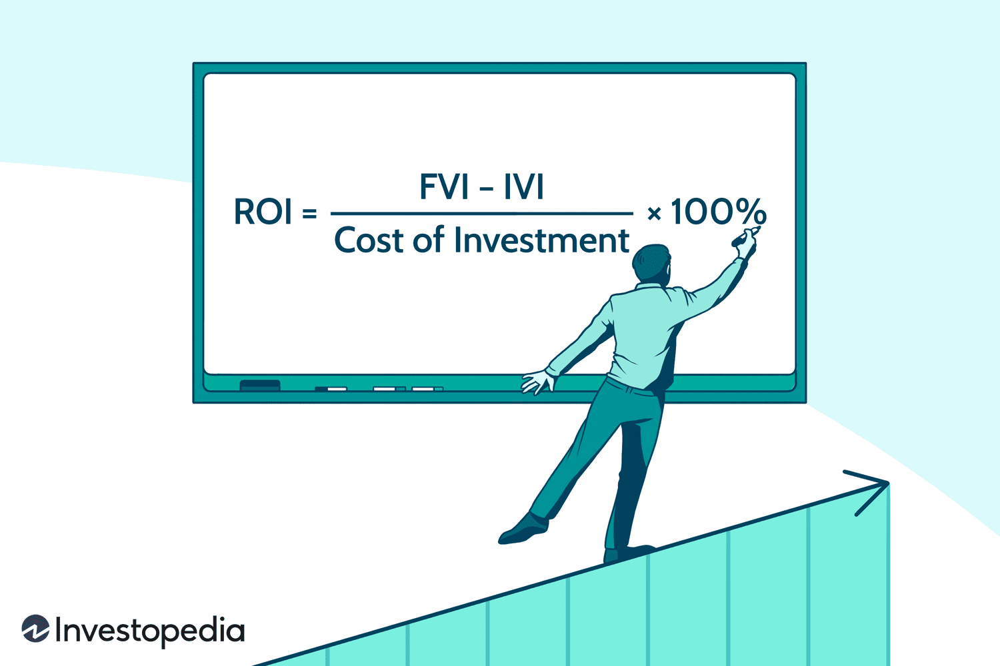

Algorithmic trading, often regarded as the modern backbone of financial markets, leverages complex mathematical models and lightning-fast computer algorithms to execute trades with precision. This approach allows traders to capitalize on fleeting market opportunities that manual execution might miss. The algorithms employed are designed to analyze large volumes of data swiftly, identify patterns or anomalies, and execute trades at optimal times. By relying on a data-driven approach, traders can reduce human error and emotional influence, thus potentially increasing the success rate of trades.

This article focuses on a critical aspect of algorithmic trading: achieving specific returns. Achieving specific returns involves tailoring trading strategies to meet predefined financial goals, such as achieving a certain percentage of annual profit or surpassing a particular benchmark index. These objectives are pursued through a combination of data analysis, market prediction, and risk management techniques. By doing so, traders can align their algorithmic strategies with individual financial aspirations, be it capital growth, risk mitigation, or market outperformance.



Whether you are a seasoned trader or new to the world of algorithmic trading, understanding how to aim for specific returns is crucial. It can significantly enhance your trading strategy by providing a clear framework of goals and the necessary steps to achieve them. With a solid grasp of targeted return strategies, traders can better navigate the complexities of financial markets, leveraging algorithmic trading's computational power for improved outcomes.

## Table of Contents

## Understanding Specific Returns in Algorithmic Trading

Specific returns in [algorithmic trading](/wiki/algorithmic-trading) involve setting clear financial targets that trading algorithms aim to achieve within specified time frames. This process is integral for traders who seek to operate within defined objectives, such as securing a fixed annual percentage gain or surpassing a particular benchmark index like the S&P 500. This goal-oriented approach requires traders to meticulously craft algorithms capable of executing strategies in alignment with their financial aspirations.

Customizing algorithms for specific returns necessitates a multifaceted strategy that includes rigorous planning, thorough [backtesting](/wiki/backtesting), and continuous strategy refinement. Planning involves defining precise return targets and the period over which these targets should be achieved. Traders need to consider the level of risk they are willing to accept and the [volatility](/wiki/volatility-trading-strategies) of the markets they are engaging with.

Backtesting is a critical component, entailing the historical testing of trading strategies to evaluate their likelihood of success under different market conditions. This involves using historical price data to simulate how a strategy would have performed in the past. Python libraries such as Pandas and NumPy can be employed to handle data manipulation and analysis during this process. A typical backtesting setup might look as follows:

```python
import pandas as pd
import numpy as np

# Assuming data is a DataFrame with columns [‘Date’, ‘Price’]
def simulate_strategy(data, strategy_params):
    # Define strategy logic here
    # Example: Simple Moving Average Crossover
    short_window = strategy_params['short_window']
    long_window = strategy_params['long_window']

    signals = pd.DataFrame(index=data.index)
    signals['signal'] = 0.0
    signals['short_mavg'] = data['Price'].rolling(window=short_window, min_periods=1, center=False).mean()
    signals['long_mavg'] = data['Price'].rolling(window=long_window, min_periods=1, center=False).mean()

    signals['signal'][short_window:] = np.where(signals['short_mavg'][short_window:] 
                                                  > signals['long_mavg'][short_window:], 1.0, 0.0)   

    signals['positions'] = signals['signal'].diff()
    return signals

# Example usage:
data = pd.read_csv('historical_prices.csv')
strategy_params = {'short_window': 40, 'long_window': 100}
signals = simulate_strategy(data, strategy_params)
```

The continuous optimization of trading strategies requires algorithms to be adaptable to changing market conditions. By leveraging advancements in [machine learning](/wiki/machine-learning), traders can enhance their models to recognize patterns and predict future market movements, further assisting in achieving specific returns. This adaptive approach allows for continuous fine-tuning of the algorithms as new data becomes available and market conditions shift.

Ultimately, the pursuit of specific returns in algorithmic trading is a sophisticated endeavor combining quantitative analysis, strategic foresight, and technological prowess. It demands an iterative approach, where strategies are constantly monitored, assessed, and refined to align with the trader's financial targets and the dynamic nature of financial markets.

## Designing Algorithmic Strategies for Targeted Returns

Designing algorithmic strategies for targeting specific returns involves a systematic approach that starts with setting clear objectives. It is crucial to determine the specific return goals, such as a target percentage of annual gain, and the time frame for achieving these goals. Establishing well-defined objectives serves as the foundation for the subsequent development and testing of trading algorithms.

### Setting Clear Objectives

The first step in designing algorithmic strategies for specific returns is to outline precise return targets. This requires a comprehensive understanding of an investor's financial goals, risk tolerance, and market outlook. For instance, an investor may aim to outperform a benchmark index or achieve a specific compound annual growth rate (CAGR). By clearly establishing the desired outcome, traders can tailor their strategies to align with these objectives, providing a clear direction for the development and optimization of their algorithmic models.

### Strategic Backtesting

Backtesting is a critical component in designing effective algorithmic strategies. It involves testing potential trading strategies using historical market data to evaluate their performance and refine parameters. By simulating trades based on past data, traders can ascertain how well a strategy might have performed under various market conditions. This process helps in identifying strengths and weaknesses, allowing for modifications that enhance the probability of achieving the targeted returns.

Here's a simple example of how backtesting might be implemented using Python and a popular library like `pandas`:

```python
import pandas as pd

# Load historical market data
data = pd.read_csv('historical_stock_prices.csv')

# Define a simple strategy, e.g., moving average crossover
short_window = 40
long_window = 100

# Calculate the moving averages
data['Short_MA'] = data['Close'].rolling(window=short_window, min_periods=1).mean()
data['Long_MA'] = data['Close'].rolling(window=long_window, min_periods=1).mean()

# Generate signals
data['Signal'] = 0
data['Signal'][short_window:] = \
    np.where(data['Short_MA'][short_window:] > data['Long_MA'][short_window:], 1, 0)

# Calculate returns
data['Position'] = data['Signal'].shift()
data['Strategy_Returns'] = data['Position'] * data['Close'].pct_change()

# Evaluate strategy performance
strategy_performance = data['Strategy_Returns'].cumsum().iloc[-1]
```

In this example, a simple moving average crossover strategy is tested to assess its potential effectiveness in achieving specific returns.

### Risk Management

Risk management is integral to ensuring capital protection while striving for targeted returns. Robust risk management tools must be embedded into algorithmic strategies to mitigate potential losses. Implementing stop-loss orders, which automatically sell a security when its price falls below a predefined level, is one common technique. This can prevent significant drawdowns that might derail achieving the target returns.

Position sizing is another critical aspect of risk management. By carefully determining the amount of capital allocated to each trade, traders can effectively control the level of risk based on their specific return objectives. Employing mathematical models such as the Kelly Criterion can optimize position sizing by balancing potential returns against potential losses.

The combination of clear goal setting, thorough backtesting, and diligent risk management provides a structured framework for designing algorithmic strategies aimed at achieving specific financial returns. By adhering to these principles, traders can enhance their likelihood of success within the complex and dynamic landscape of financial markets.

## Key Factors to Consider for Specific Returns

Algorithmic trading strategies tailored for specific returns require careful consideration of several critical factors to ensure their effectiveness and adaptability. Algorithmic flexibility, market conditions, and cost considerations are paramount in optimizing these strategies.

**Algorithmic Flexibility**: The ability of algorithms to adapt to varying market conditions is crucial to achieving specific returns. Financial markets are inherently dynamic, and factors such as volatility, liquidity, and volume can significantly impact trading outcomes. An algorithm that can adjust its parameters in real-time and respond to shifts in market behavior is more likely to stay aligned with predefined financial goals. This adaptability can be achieved through machine learning techniques, where algorithms are trained to recognize patterns and adjust trading strategies accordingly. Reinforcement learning, for instance, allows algorithms to learn optimal trading behaviors through trial and error, continuously improving decisions based on feedback from trading performance.

**Market Conditions**: To meet specific return objectives, strategies must be continually monitored and fine-tuned in response to current market trends. Variables such as interest rates, geopolitical events, and economic data releases can create fluctuations that affect asset prices. A thorough understanding of these conditions and their potential impact on trading strategies is essential. Utilizing quantitative analysis, such as regression models and time-series forecasting, traders can predict market movements and adjust their algorithms accordingly. Additionally, sentiment analysis of news data and social media can offer insights into market psychology, aiding in strategic adjustments.

**Cost Considerations**: Transaction costs, slippage, and other fees can erode the profitability of algorithmic trading strategies, making it essential to incorporate these factors into the strategy design. Transaction costs include broker fees and the bid-ask spread, which can vary based on the trading volume and market liquidity. Slippage, the difference between expected and actual trade execution prices, can occur in volatile markets and must be accounted for in performance metrics. One way to mitigate these costs is by optimizing trade execution using algorithms designed for efficient order management, such as VWAP (Volume Weighted Average Price) and TWAP (Time Weighted Average Price) strategies. These algorithms aim to execute trades at average prices, minimizing market impact and slippage.

By focusing on these key factors, traders can enhance their algorithmic trading strategies to achieve specific returns effectively. Remaining vigilant and adaptive to market conditions, while rigorously managing costs, provides a robust foundation for pursuing precise financial goals.

## Case Studies: Examples of Algorithms Aiming for Specific Returns

### Momentum Strategies

Momentum strategies in algorithmic trading involve taking advantage of existing trends in the market. By identifying securities that are moving significantly in one direction with high [volume](/wiki/volume-trading-strategy), traders attempt to capture gains as the trends continue. These strategies can be optimized by algorithms to target specific return levels over set periods.

A typical [momentum](/wiki/momentum) strategy may rely on indicators such as Moving Average Convergence Divergence (MACD) or Relative Strength Index (RSI) to identify potential entry points. The trading algorithm can be programmed to enter a long position if the momentum indicator surpasses a predefined threshold, indicating a strong upward trend, or a short position in the case of a strong downward trend.

Here is a simple Python code snippet demonstrating a basic momentum strategy using RSI:

```python
import pandas as pd

def calculate_rsi(data, periods=14):
    delta = data.diff()
    gain = (delta.where(delta > 0, 0)).rolling(window=periods).mean()
    loss = (-delta.where(delta < 0, 0)).rolling(window=periods).mean()
    rs = gain / loss
    rsi = 100 - (100 / (1 + rs))
    return rsi

# Example usage
data = pd.Series([your_price_data])
rsi = calculate_rsi(data)

# Trading signal
if rsi.iloc[-1] < 30:
    print("Consider buying as the stock is oversold")
elif rsi.iloc[-1] > 70:
    print("Consider selling as the stock is overbought")
```

By incorporating strategies like dynamic position sizing and stop-loss orders, these algorithms can be refined to better align with specific return targets.

### Mean Reversion Techniques

Mean reversion strategies are predicated on the assumption that asset prices will eventually revert to their long-term mean or average level. Algorithms employing mean reversion principles use historical price data to calculate an expected average price and then trade when the actual price deviates significantly from that average.

A common approach involves calculating the Bollinger Bands, which are based on standard deviations from a moving average. A mean reversion algorithm might thus buy a security when its price hits the lower band and sell when it reaches the upper band, aiming to profit as the price reverts to the mean.

Mathematically, this can be expressed as:
$$
Z_t = \frac{(P_t - \bar{P})}{\sigma}
$$
where $Z_t$ is the z-score, $P_t$ is the current price, $\bar{P}$ is the historical mean price, and $\sigma$ is the standard deviation of the prices.

### Pairs Trading

Pairs trading is a market-neutral strategy that involves simultaneously buying and selling two correlated assets to achieve targeted returns while mitigating market risks. The premise is that the two assets, which historically move together, will eventually realign even if they diverge temporarily. Traders seek to profit from the convergence of the pair back to its mean spread.

An example of pairs trading involves two stocks from the same industry. An algorithm may track the price spread between these stocks and place trades when deviations from the historical spread reach a statistically significant level.

The spread can be modeled as:
$$
S_t = \alpha + \beta_1 X_{1t} + \beta_2 X_{2t} + \epsilon_t
$$
where $S_t$ is the price spread, $X_{1t}$ and $X_{2t}$ are the prices of the two assets, and $\alpha$, $\beta_1$, $\beta_2$ are coefficients estimated from historical data.

By carefully selecting asset pairs and employing automated trading systems, algorithms aim to generate consistent returns that align with specific financial goals outlined by the trader. Each of these strategies requires rigorous backtesting to determine their efficacy in various market conditions and ensure they meet the desired performance criteria.

## Challenges in Achieving Specific Returns

Overfitting Risks: One of the primary challenges in achieving specific returns through algorithmic trading is the risk of overfitting. Overfitting occurs when a trading algorithm is excessively tailored to historical data, capturing noise rather than the underlying pattern. As a result, these algorithms may perform exceptionally well during backtesting but fail to deliver in live trading situations because they lack the flexibility to adapt to new market conditions. To mitigate overfitting, traders should adopt a robust model validation strategy. Techniques such as cross-validation and the use of out-of-sample testing data can help ensure that the algorithm generalizes well to unseen data. Regularization methods, such as L1 and L2 penalty terms, can also be implemented to prevent overfitting by simplifying the model, thereby enhancing its predictive capability without depending excessively on historical peculiarities.

Dynamic Market Forces: The unpredictability of financial markets is another significant hurdle when striving for specific returns. Market dynamics are influenced by a myriad of factors, including macroeconomic indicators, geopolitical events, and investor sentiment, which can all swiftly alter market conditions. These changes can render existing algorithmic strategies ineffective if they are not designed to adapt. For instance, an algorithm that thrives in a bullish market may suffer in a bearish one. To address this, trading strategies should incorporate adaptive mechanisms. Employing machine learning techniques that update the model parameters in real-time based on the latest market data can enhance the strategy's responsiveness to evolving market conditions. Reinforcement learning, where models learn optimal actions through interactions with the market environment, is particularly promising in this regard.

Emphasizing Realistic Goals: Finally, while setting specific return targets is vital for strategic clarity, these goals must be rooted in realistic expectations derived from comprehensive market research. Overly ambitious targets may lead to poor decision-making and heightened risk exposure, as traders might be tempted to employ aggressive strategies to meet unrealistic objectives. Establishing realistic goals involves analyzing historical market data, understanding prevailing economic conditions, and recognizing the inherent uncertainties in trading. Traders should also [factor](/wiki/factor-investing) in transaction costs, taxes, and fees, which can significantly impact net returns. By aligning goals with a thorough understanding of these elements, traders can construct trading strategies that not only aim for specific returns but do so with a balanced approach that prioritizes capital preservation and long-term profitability.

## Conclusion

Targeted returns in algorithmic trading go beyond the aspiration for high returns; they necessitate precise execution, robust strategy design, and continuous adaptation to align with specific financial goals. The primary advantage of algorithmic trading lies in its ability to systematically apply complex models and swiftly react to market changes, potentially enhancing the accuracy and efficiency of achieving predefined returns.

Understanding market dynamics is crucial. Traders must be adept at analyzing data and interpreting market trends to refine their strategies continuously. This entails not only harnessing historical data but also incorporating real-time information to optimize trading algorithms. The integration of machine learning techniques can further augment these strategies by improving predictive accuracy and adaptability. For example, employing algorithms optimized through techniques like [reinforcement learning](/wiki/reinforcement-learning) can enable traders to refine decision-making processes iteratively, thereby aligning more closely with specific return objectives.

Moreover, embracing a journey of constant improvement is essential. The landscape of algorithmic trading is ever-evolving, driven by technological advancements and shifting market conditions. Traders should foster a mindset of perpetual learning and refinement, utilizing backtesting and forward-testing methodologies to anticipate potential pitfalls and adapt to unforeseen challenges.

In conclusion, the efficacy of achieving targeted returns is rooted in a trader's ability to blend strategic foresight with technical execution. By continually enhancing their approach and leveraging computational tools effectively, traders can not only meet but potentially exceed their specified financial objectives, thereby increasing both the sophistication and success rate of their algorithmic trading strategies.

## References & Further Reading

[1]: Bergstra, J., Bardenet, R., Bengio, Y., & Kégl, B. (2011). ["Algorithms for Hyper-Parameter Optimization."](https://papers.nips.cc/paper/4443-algorithms-for-hyper-parameter-optimization) Advances in Neural Information Processing Systems 24.

[2]: ["Advances in Financial Machine Learning"](https://www.amazon.com/Advances-Financial-Machine-Learning-Marcos/dp/1119482089) by Marcos Lopez de Prado

[3]: ["Evidence-Based Technical Analysis: Applying the Scientific Method and Statistical Inference to Trading Signals"](https://www.amazon.com/Evidence-Based-Technical-Analysis-Scientific-Statistical/dp/0470008741) by David Aronson

[4]: ["Machine Learning for Algorithmic Trading"](https://github.com/stefan-jansen/machine-learning-for-trading) by Stefan Jansen

[5]: ["Quantitative Trading: How to Build Your Own Algorithmic Trading Business"](https://books.google.com/books/about/Quantitative_Trading.html?id=j70yEAAAQBAJ) by Ernest P. Chan