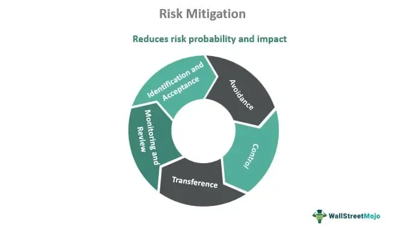

In financial markets, managing risks is crucial for the success of any investment strategy, particularly in algorithmic trading. This form of trading, characterized by its high speed and automatic decision-making, requires traders to have an acute awareness and management of specific risks unique to this methodology. Algorithmic trading systems, often referred to as 'algos,' utilize complex algorithms to execute orders based on variables such as timing, price, and volume, thereby necessitating robust risk management strategies to navigate the volatility and uncertainties inherent in financial markets.

In this article, we will explore the concept of specific risks in investments, which differ from broader market risks and are unique to individual companies or sectors. Understanding these risks is paramount, as they can significantly impact the performance of an investment portfolio if not properly hedged or diversified against. Within the scope of algorithmic trading, effective risk management is not just a means of preserving capital but also a strategic approach to leveraging the inherent opportunities presented by automated systems while minimizing potential losses.



Our discussion will extend to various strategies aimed at mitigating these specific risks, emphasizing the delicate balance required between harnessing profit opportunities and safeguarding against potential financial setbacks. In the scope of automated and systematic trading, achieving this balance is crucial for sustained success. Such strategies are vital for ensuring that the safeguarding mechanisms align with the rapid pace of technological advancements and fluctuating market conditions. Through this exploration, readers can expect to gain insights into creating a more resilient and adaptable trading strategy in the ever-evolving financial landscape.

## Table of Contents

## Understanding Specific Risk in Investment

Specific risk, also called unsystematic risk, is the type of risk that pertains to a particular company or industry. It represents the uncertainties and potential negative factors that can affect a company's performance and, subsequently, its stock price. Unlike systematic risk, which impacts the entire market and cannot be mitigated through diversification, specific risk is unique to a single firm or sector.

Investors often manage specific risks by diversifying their portfolios. Diversification involves spreading investments across various assets to reduce the impact of volatility associated with any single asset. By holding a mix of assets, the positive performance of some investments can offset the negative performance of others. This strategy aims to minimize exposure to the idiosyncratic fluctuations of individual securities. Mathematically, diversification can be understood through the concept of the variance of a portfolio. The variance $\sigma_p^2$ of a portfolio with weights $w_i$ for each asset $i$ can be calculated as:

$$
\sigma_p^2 = \sum_{i=1}^{N} w_i^2 \sigma_i^2 + \sum_{i=1}^{N} \sum_{j=1, j \neq i}^{N} w_i w_j \sigma_i \sigma_j \rho_{ij}
$$

where $\sigma_i^2$ is the variance of asset $i$, and $\rho_{ij}$ is the correlation coefficient between assets $i$ and $j$. Lower correlation among assets results in reduced portfolio variance, illustrating the benefit of diversification in managing specific risk.

Specific risks stem from various internal and external factors affecting an entity. Business risks, for example, arise from internal operations such as management decisions, business model, innovation capacity, and operational efficiency. Financial risks involve factors such as capital structure, [interest rate](/wiki/interest-rate-trading-strategies) exposure, and [liquidity](/wiki/liquidity-risk-premium) management. Additionally, external factors, such as regulatory changes, competitive pressures, and shifts in consumer preferences, can contribute to specific risk.

By carefully analyzing these factors and adjusting investment strategies accordingly, investors can better manage specific risks and enhance the resilience of their portfolios.

## The Role of Risk Management in Algo Trading

Algorithmic trading, commonly known as algo trading, involves the use of automated systems to execute trades at [high frequency](/wiki/high-frequency-trading), thereby significantly amplifying exposure to both market and specific risks. The success of [algorithmic trading](/wiki/algorithmic-trading) heavily depends on effective risk management, which provides stability and sustainability amidst market [volatility](/wiki/volatility-trading-strategies). Given the rapid pace and automated nature of these trades, establishing systematic protocols and strategies is crucial for minimizing potential adverse impacts.

Effective risk management in algo trading primarily revolves around three key aspects: mitigating market volatility, preserving capital, and adapting to dynamic market conditions. 

Firstly, mitigating market volatility is essential because algo trading strategies can be highly susceptible to abrupt and unpredictable price movements. These price fluctuations can result from unforeseen market events or changes in market sentiment. By employing strategies such as diversification, setting stop-loss orders, and using derivatives for hedging, traders can protect their portfolios from significant losses. For instance, diversification reduces reliance on any single asset, spreading the risk across various instruments, thus cushioning against sharp market movements.

Secondly, preserving capital is a fundamental aim of risk management in algo trading. Losing capital can severely compromise trading strategies, and hence, implementing measures to protect it is critical. Capital preservation strategies include setting predefined risk limits for trades, employing conservative leverage, and using automated risk management tools to promptly respond to emerging threats. For example, setting a maximum loss threshold for each trade ensures that traders do not exceed a certain level of risk exposure, automatically limiting potential losses during adverse market conditions.

Lastly, adapting to dynamic market conditions is vital for maintaining an edge in algorithmic trading. Markets are constantly evolving, influenced by economic indicators, geopolitical events, and technological advancements. Traders must continuously monitor their strategies and adjust them in response to these changes to remain competitive and profitable. Utilizing data analytics and [machine learning](/wiki/machine-learning) models can significantly enhance a trader's ability to detect and adapt to subtle shifts in market dynamics. 

In conclusion, the role of risk management in algo trading is indispensable for ensuring the long-term success and viability of trading strategies. By focusing on mitigating market volatility, preserving capital, and continuously adapting to market changes, algo traders can optimize their performance and safeguard their portfolios against potential risks.

## Types of Risks in Algo Trading

Algorithmic trading, or algo trading, operates at the intersection of finance and technology, and while it offers substantial opportunities for profit, it is also fraught with various types of risks. These risks span technical, market, operational, and behavioral categories, each presenting unique challenges that traders must manage to optimize their trading strategies effectively.

Technical risks in algo trading primarily pertain to system failures or programming errors. These can arise from hardware malfunctions, network connectivity issues, or software bugs that disrupt trading operations. For instance, a poorly coded algorithm might fail to execute trades as intended, leading to significant financial losses. Ensuring the reliability of trading systems requires robust software development practices, comprehensive testing, and regular maintenance to minimize the potential for technical failures.

Market risks, on the other hand, are associated with unforeseen events and price fluctuations that can affect the performance of trading algorithms. These risks are inherent in the financial markets and can result from unexpected economic announcements, geopolitical events, or changes in market sentiment. For example, a sudden market downturn can lead to unanticipated losses if an algorithm is heavily invested in affected assets. To mitigate market risks, traders employ strategies such as diversification and hedging to cushion against adverse market movements.

Operational risks encompass issues related to regulatory compliance and cybersecurity threats. Regulatory risks include non-compliance with trading laws and financial regulations, which can result in legal penalties or operational restrictions. To manage these risks, traders must ensure their algorithms comply with relevant financial regulations. Cybersecurity threats, such as hacking attempts or data breaches, pose significant risks to algorithmic trading platforms. Implementing robust cybersecurity measures and maintaining up-to-date security protocols are crucial for safeguarding trading systems against such threats.

Behavioral risks stem from the psychological aspects of trading and decision-making biases that can influence an algorithm’s performance. Despite being automated, trading algorithms are designed by humans and can reflect the biases of their creators. For instance, over-optimistic bias may lead to setting overly aggressive trading parameters, increasing exposure to risk. Addressing behavioral risks involves continuously refining algorithms to eliminate biases and incorporating machine learning techniques to adapt to new market conditions objectively.

In summary, recognizing and managing the different types of risks in algo trading is vital for maintaining effective trading operations. By implementing robust risk management strategies across technical, market, operational, and behavioral dimensions, traders can enhance the resilience and performance of their algorithmic trading systems.

## Principles and Techniques of Risk Management

Setting clear investment goals and establishing return and risk parameters are foundational steps in guiding algorithmic trading strategies. These benchmarks serve as a roadmap, paving the way for decisions on what investments to pursue and how aggressively to trade. Defining such parameters helps in aligning trading actions with broader financial objectives, ensuring that the portfolio's growth is in tandem with the investor's risk tolerance.

One of the primary techniques in risk management is diversification. This strategy involves spreading investments across various asset classes or financial instruments to mitigate the impact of a downturn in any single investment. By doing so, investors reduce the risk of significant losses, as the negative performance of one asset can be offset by the positive performance of others. Diversification is summarized by the adage, "Don't put all your eggs in one basket."

Another crucial strategy is setting stop-loss orders. These orders automatically sell a security when it reaches a predetermined price, thereby limiting the investor's loss on a position. For instance, if a particular stock is purchased at $100, a stop-loss order might be set at $90. If the stock price falls to this level, the order is triggered, and the stock is sold, potentially preventing further losses if the stock continues to decline.

Hedging strategies also play a pivotal role in risk management. Hedging involves taking offsetting positions in related assets to minimize potential losses. For example, an investor who owns a portfolio of stocks may purchase put options on a stock index. If stock prices decline, the value of the options will increase, compensating for the losses in the stock portfolio. It's a way to create a "safety net" that protects investments from unfavorable market movements.

Continuous monitoring and evaluation are essential to risk management efficacy. Market dynamics are inherently volatile and can change rapidly. By regularly analyzing trading strategies, investors can identify areas of underperformance or excessive risk. This proactive approach allows for timely adjustments, aligning trading strategies with current market conditions and improving overall risk management.

Traders and investors can use Python programming to automate the monitoring and evaluation process. For example, a Python script can be set to regularly compute the Value at Risk (VaR) for a portfolio:

```python
import numpy as np
import pandas as pd

def calculate_var(portfolio_returns, confidence_level=0.05):
    """
    Calculate the Value at Risk (VaR) of a portfolio.

    :param portfolio_returns: Pandas Series of daily portfolio returns.
    :param confidence_level: Confidence level for VaR calculation (e.g., 0.05 for 95% confidence).
    :return: VaR value.
    """
    # Sort returns from low to high
    sorted_returns = np.sort(portfolio_returns)

    # Calculate the VaR index
    var_index = int((1 - confidence_level) * len(sorted_returns))

    # Return the VaR number
    return sorted_returns[var_index]

# Example usage with hypothetical daily returns
portfolio_returns = pd.Series(np.random.normal(0, 0.01, 1000))  # Simulating 1000 days of returns
var_95 = calculate_var(portfolio_returns)
print(f"The 95% Value at Risk (VaR) is: {var_95}")
```

This code snippet demonstrates a simple way to calculate the VaR, enabling traders to quantify potential losses and adjust their strategies accordingly. By embracing such principles and techniques, investors can better navigate the complexities of financial markets, balancing opportunity with security.

## Advanced Risk Management Strategies

Portfolio diversification and rebalancing are fundamental strategies in advanced risk management. Diversification involves spreading investments across various asset classes, sectors, or geographic regions to reduce exposure to any single risk. By minimizing the impact of specific risks associated with individual assets, diversification can enhance the risk-adjusted returns of a portfolio.

Rebalancing is the process of realigning the weightings of a portfolio's assets periodically. This strategy ensures that the asset allocation remains aligned with the investor's risk tolerance and investment goals. For example, if one asset class in a portfolio performs significantly better than others, the portfolio may become overweight in that asset. Rebalancing involves selling some of the overweight assets and buying others to maintain the desired asset mix.

Quantitative risk techniques such as Value at Risk (VaR) and stress testing are crucial for estimating and managing financial risks. VaR provides a probabilistic estimate of the potential loss in value of a portfolio over a defined period for a given confidence interval. Mathematically, VaR can be expressed as:

$$
\text{VaR}_{\alpha}(X) = \inf \{ x \in \mathbb{R} : P(X \le x) \ge \alpha \}
$$

where $\alpha$ represents the confidence level, and $X$ is the portfolio's return distribution.

Stress testing evaluates the resilience of portfolios under adverse economic scenarios. It simulates extreme market conditions to assess portfolio vulnerabilities and potential losses, aiding in preparing for market shocks.

Employing [artificial intelligence](/wiki/ai-artificial-intelligence) (AI) and machine learning (ML) in algorithmic trading enhances risk management frameworks. AI and ML algorithms can analyze vast amounts of data to identify patterns and predict market movements with greater precision. These technologies facilitate the development of adaptive trading models that can respond dynamically to market changes.

Python is a popular language for implementing AI and ML models in trading strategies due to its ease of use and extensive libraries. For example, the following Python code snippet demonstrates how to use the `pandas` library to calculate a simple moving average, an essential part of many trading algorithms:

```python
import pandas as pd

def calculate_moving_average(data, window):
    return data.rolling(window=window).mean()

# Assuming 'prices' is a pandas Series of asset prices
window_size = 20
moving_average = calculate_moving_average(prices, window_size)
```

By integrating diversification, quantitative techniques like VaR and stress testing, and leveraging AI and ML, traders can form robust risk management strategies. This sophisticated approach not only helps in minimizing potential losses but also optimizes the exploitation of emerging opportunities in financial markets.

## Conclusion

Algorithmic trading presents significant opportunities for profit maximization and strategic advantages in the financial markets by leveraging speed and precision beyond human capabilities. However, it simultaneously introduces particular challenges, notably the heightened exposure to specific risks. These risks, arising from technological dependencies, market fluctuations, and operational intricacies, necessitate meticulous management.

Prioritizing risk management is crucial to extracting potential gains from algorithmic trading while ensuring enduring success. Robust risk management involves the implementation of systematic protocols to anticipate, identify, and mitigate risks efficiently. This requires a multi-faceted approach encompassing technical safeguards, strategic planning, and continuous adaptation to evolving market conditions.

Adhering to principles of effective risk management enables traders to navigate the volatility inherent in algorithmic trading. Techniques such as diversification help distribute risk across various assets, reducing the impact of adverse movements in a single asset. Further, leveraging quantitative methods like Value at Risk (VaR) can provide insights into potential loss scenarios, guiding decision-making processes.

Incorporating advanced technologies, such as artificial intelligence and machine learning, can enhance the sophistication of trading strategies and risk management frameworks. These tools facilitate real-time data analysis and predictive modeling, offering more refined risk assessments and adaptive responses to market changes.

Ultimately, the goal of these practices is to support traders in maintaining a balance between leveraging opportunities and minimizing potential losses, thus enhancing overall performance. By establishing a robust risk management framework and remaining flexible to market dynamics, traders can secure long-term profitability and sustain success amid the challenges presented by algorithmic trading.

## References & Further Reading

[1]: Bergstra, J., Bardenet, R., Bengio, Y., & Kégl, B. (2011). ["Algorithms for Hyper-Parameter Optimization."](https://dl.acm.org/doi/10.5555/2986459.2986743) Advances in Neural Information Processing Systems 24.

[2]: ["Advances in Financial Machine Learning"](https://www.amazon.com/Advances-Financial-Machine-Learning-Marcos/dp/1119482089) by Marcos Lopez de Prado

[3]: ["Evidence-Based Technical Analysis: Applying the Scientific Method and Statistical Inference to Trading Signals"](https://www.amazon.com/Evidence-Based-Technical-Analysis-Scientific-Statistical/dp/0470008741) by David Aronson

[4]: ["Machine Learning for Algorithmic Trading"](https://github.com/stefan-jansen/machine-learning-for-trading) by Stefan Jansen

[5]: ["Quantitative Trading: How to Build Your Own Algorithmic Trading Business"](https://www.amazon.com/Quantitative-Trading-Build-Algorithmic-Business/dp/1119800064) by Ernest P. Chan