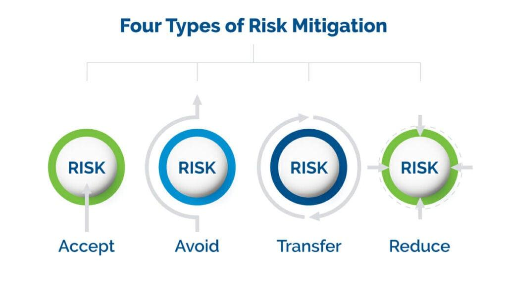

## Table of Contents

## What is specific risk?

Specific risk, also known as unsystematic risk, is the risk that comes from factors that are unique to a particular company or industry. It's the kind of risk that you can reduce by spreading your investments across different companies and sectors. For example, if you invest all your money in one tech company, you face the specific risk that something bad could happen to that company, like a product failure or a lawsuit.

By diversifying your investments, you can lower your exposure to specific risk. This means instead of putting all your money into one stock, you spread it out over many different stocks or types of investments. This way, if one company or industry does poorly, it won't hurt your entire portfolio. Specific risk is different from market risk, which affects the whole market and can't be eliminated through diversification.

## How does specific risk differ from systematic risk?

Specific risk and systematic risk are two different types of risks that investors face. Specific risk, also called unsystematic risk, is the risk that comes from things that can happen to a single company or industry. For example, if a company's factory burns down or if a new law hurts a specific industry, those are specific risks. You can lower your specific risk by not putting all your money into one company or industry. Instead, you can spread your investments across many different companies and sectors, which is called diversification.

On the other hand, systematic risk, also known as market risk, is the risk that affects the whole market or a large part of it. This type of risk comes from things like economic recessions, changes in interest rates, or big events like wars or natural disasters. Unlike specific risk, you can't get rid of systematic risk by diversifying your investments. No matter how you spread your money, if the whole market goes down, your investments will likely be affected too. So, while you can manage specific risk, systematic risk is something you have to live with when you invest in the market.

## What are common sources of specific risk in investments?

Specific risk comes from things that can happen to a single company or industry. For example, a company might lose a big lawsuit, which could hurt its stock price. Or, a new CEO might make bad decisions that affect the company's performance. Another source of specific risk could be a product recall if a company's product turns out to be unsafe. These are all things that can happen to one company and not others, so they are specific to that company.

Another common source of specific risk is related to the industry a company is in. For example, if new laws are passed that make it harder for companies in a certain industry to make money, that's a specific risk for those companies. Or, if there's a big change in what people want to buy, like if they stop buying cars and start using bikes more, that's a specific risk for car companies. By understanding these risks, investors can try to avoid putting too much money into one company or industry.

## Can you provide examples of specific risk in different industries?

In the tech industry, a specific risk could be a major data breach. If a tech company like a social media platform or an online retailer has its users' information stolen, it can lose a lot of trust and money. This could make its stock price drop. Another specific risk in tech could be if a company's new product, like a new smartphone, doesn't work well or people don't like it. That can hurt the company's sales and its stock price.

In the energy industry, specific risk might come from an oil spill. If an oil company has a big spill, it can cost a lot of money to clean up and can lead to lawsuits and fines. This can hurt the company's profits and stock price. Another specific risk in energy could be if a new law is passed that makes it harder for companies to drill for oil or use certain types of energy. This can make it harder for those companies to make money.

In the food and beverage industry, a specific risk could be a product recall. If a company finds out that its food product, like a type of cereal or a drink, is making people sick, it has to take it off the shelves. This can cost a lot of money and can hurt the company's reputation and stock price. Another specific risk in this industry could be if a company's main ingredient, like sugar or coffee, becomes much more expensive. This can make it harder for the company to keep its prices low and make money.

## How can an investor identify specific risks in their portfolio?

To identify specific risks in their portfolio, an investor needs to look closely at each company they've invested in. They should start by reading the company's annual reports and any news about the company. These documents can tell them about things like lawsuits, product recalls, or changes in leadership that could hurt the company's performance. It's also helpful to keep an eye on the industry the company is in. If new laws or big changes in what people want to buy could affect the industry, that's a specific risk to watch out for.

Once an investor knows about these risks, they can think about how much they affect their investments. If one company or industry makes up a big part of their portfolio, the specific risks for that company or industry could have a big impact. By understanding these risks, the investor can decide if they want to spread their money out more to lower their specific risk. This means investing in different companies and industries so that if something bad happens to one, it won't hurt their whole portfolio.

## What are the basic strategies for mitigating specific risk?

One of the main ways to lower specific risk is by spreading your investments across different companies and industries. This is called diversification. If you put all your money into one company and something bad happens to it, like a lawsuit or a product recall, you could lose a lot of money. But if you spread your money out, a problem with one company won't hurt your whole investment. For example, if you own stocks in ten different companies, a problem with one won't be as big of a deal.

Another way to reduce specific risk is by doing your homework on the companies you invest in. This means reading their reports and keeping up with news about them. If you know about the risks a company faces, like new laws that could hurt its industry or a change in leadership, you can decide if those risks are too big for you. By understanding these risks, you can make smarter choices about where to put your money and how much to invest in each company.

## How does diversification help in reducing specific risk?

Diversification helps in reducing specific risk by spreading your investments across different companies and industries. When you put your money into many different places, you're not relying on just one company to do well. If something bad happens to one company, like a factory burning down or a product recall, it won't hurt your whole investment. Instead, the other companies in your portfolio can help balance things out. This way, the specific risk of one company doesn't have a big impact on your overall investment.

By diversifying, you're also spreading your risk across different industries. If you invest in companies from different sectors, like technology, healthcare, and energy, you're less likely to be affected by problems in just one industry. For example, if new laws make it harder for energy companies to make money, your investments in technology and healthcare can help protect your portfolio. Diversification doesn't get rid of all risk, but it does make it less likely that one specific problem will hurt your whole investment.

## What role do financial instruments like options and futures play in managing specific risk?

Financial instruments like options and futures can help manage specific risk by allowing investors to hedge their bets. When you buy an option, you're getting the right to buy or sell a stock at a certain price in the future. If you own a stock and you're worried about its price going down because of a specific risk, like a lawsuit against the company, you can buy a put option. This gives you the right to sell the stock at a set price, even if the market price drops. This way, you can limit your losses if the specific risk turns into a real problem.

Futures work a bit differently but serve a similar purpose. A future is a contract to buy or sell an asset at a set price on a specific date. If you're worried about the price of a commodity, like oil, going down because of a specific risk in the energy industry, you can sell a futures contract. This means you agree to sell the oil at today's price in the future, protecting you from a price drop. By using options and futures, investors can protect themselves from the ups and downs caused by specific risks, making their investments more stable.

## How can advanced statistical models be used to predict and manage specific risk?

Advanced statistical models can help investors predict and manage specific risk by looking at a lot of data and finding patterns that might not be easy to see. For example, these models can use past information about a company's performance, like its stock price and how much money it makes, to guess what might happen in the future. They can also look at news and social media to see if there are any signs of trouble coming up, like a lawsuit or a product recall. By putting all this information together, the models can give investors a better idea of the specific risks they might face.

Once these models predict the specific risks, investors can use this information to make smarter choices about their investments. If the model says there's a high chance of a problem for a certain company, an investor might decide to sell some of their stock in that company or buy options to protect themselves. They can also use the model's predictions to spread their investments out more, so they're not too dependent on one company or industry. This way, advanced statistical models help investors manage specific risk by giving them a clearer picture of what might happen and how they can protect their money.

## What are the limitations of specific risk mitigation strategies?

Even though there are ways to lower specific risk, like spreading your investments or using options and futures, these strategies have their limits. Diversification can't protect you from all risks. If the whole market goes down because of something big like a recession, your investments can still lose value, even if they're spread out. Also, it's hard to know exactly how to spread your money. You might think you've covered all your bases, but you could still end up with too much money in one industry or company without realizing it.

Using options and futures to hedge against specific risks can be tricky too. These financial tools can be hard to understand and use correctly. If you don't know what you're doing, you could end up losing money instead of protecting it. Plus, options and futures cost money to buy, so you might spend a lot on them and still face losses if the specific risk you're worried about doesn't happen. In the end, while these strategies can help, they can't get rid of all specific risk, and they come with their own set of challenges.

## How do regulatory changes impact specific risk management?

Regulatory changes can make specific risk management harder or easier. When new laws come out, they can change how companies work and make money. For example, if a new law makes it harder for a company to do business, like stricter rules on pollution for an energy company, that's a specific risk. Investors need to keep up with these changes to know how they might affect their investments. If they don't, they might not see the risks coming and could lose money.

On the other hand, some regulatory changes can help with specific risk management. For instance, if new rules make companies share more information about their risks, investors can make better choices. They can see what might go wrong and decide if they want to invest in that company or not. But even with these rules, it's still hard to predict everything. So, investors need to stay alert and keep learning about the companies they invest in to manage specific risks as well as they can.

## What are the latest trends and technologies in specific risk analysis and mitigation?

The latest trends in specific risk analysis and mitigation include the use of big data and artificial intelligence (AI). Big data allows investors to look at a huge amount of information from many different places, like company reports, news articles, and social media. By using this data, investors can find patterns and signs of trouble that they might not see otherwise. AI helps make sense of all this data even faster. It can learn from past events and predict what might happen next, helping investors see specific risks before they become big problems.

Another trend is the use of [machine learning](/wiki/machine-learning) models. These models can get better over time as they see more data. They can look at how companies have done in the past and guess how they might do in the future. This can help investors see specific risks coming and decide what to do about them. For example, if a machine learning model sees that a company often has problems after a certain event, like a change in leadership, it can warn investors to be careful. By using these new technologies, investors can manage specific risks better and protect their money.

## What is Specific Risk in Investment and How Can It Be Understood?

Specific risk, also called unsystematic risk, is the type of risk that pertains to a particular company or industry. It represents the uncertainties and potential negative factors that can affect a company's performance and, subsequently, its stock price. Unlike systematic risk, which impacts the entire market and cannot be mitigated through diversification, specific risk is unique to a single firm or sector.

Investors often manage specific risks by diversifying their portfolios. Diversification involves spreading investments across various assets to reduce the impact of [volatility](/wiki/volatility-trading-strategies) associated with any single asset. By holding a mix of assets, the positive performance of some investments can offset the negative performance of others. This strategy aims to minimize exposure to the idiosyncratic fluctuations of individual securities. Mathematically, diversification can be understood through the concept of the variance of a portfolio. The variance $\sigma_p^2$ of a portfolio with weights $w_i$ for each asset $i$ can be calculated as:

$$
\sigma_p^2 = \sum_{i=1}^{N} w_i^2 \sigma_i^2 + \sum_{i=1}^{N} \sum_{j=1, j \neq i}^{N} w_i w_j \sigma_i \sigma_j \rho_{ij}
$$

where $\sigma_i^2$ is the variance of asset $i$, and $\rho_{ij}$ is the correlation coefficient between assets $i$ and $j$. Lower correlation among assets results in reduced portfolio variance, illustrating the benefit of diversification in managing specific risk.

Specific risks stem from various internal and external factors affecting an entity. Business risks, for example, arise from internal operations such as management decisions, business model, innovation capacity, and operational efficiency. Financial risks involve factors such as capital structure, [interest rate](/wiki/interest-rate-trading-strategies) exposure, and [liquidity](/wiki/liquidity-risk-premium) management. Additionally, external factors, such as regulatory changes, competitive pressures, and shifts in consumer preferences, can contribute to specific risk.

By carefully analyzing these factors and adjusting investment strategies accordingly, investors can better manage specific risks and enhance the resilience of their portfolios.

## What are Advanced Risk Management Strategies?

Portfolio diversification and rebalancing are fundamental strategies in advanced risk management. Diversification involves spreading investments across various asset classes, sectors, or geographic regions to reduce exposure to any single risk. By minimizing the impact of specific risks associated with individual assets, diversification can enhance the risk-adjusted returns of a portfolio.

Rebalancing is the process of realigning the weightings of a portfolio's assets periodically. This strategy ensures that the asset allocation remains aligned with the investor's risk tolerance and investment goals. For example, if one asset class in a portfolio performs significantly better than others, the portfolio may become overweight in that asset. Rebalancing involves selling some of the overweight assets and buying others to maintain the desired asset mix.

Quantitative risk techniques such as Value at Risk (VaR) and stress testing are crucial for estimating and managing financial risks. VaR provides a probabilistic estimate of the potential loss in value of a portfolio over a defined period for a given confidence interval. Mathematically, VaR can be expressed as:

$$
\text{VaR}_{\alpha}(X) = \inf \{ x \in \mathbb{R} : P(X \le x) \ge \alpha \}
$$

where $\alpha$ represents the confidence level, and $X$ is the portfolio's return distribution.

Stress testing evaluates the resilience of portfolios under adverse economic scenarios. It simulates extreme market conditions to assess portfolio vulnerabilities and potential losses, aiding in preparing for market shocks.

Employing [artificial intelligence](/wiki/ai-artificial-intelligence) (AI) and machine learning (ML) in [algorithmic trading](/wiki/algorithmic-trading) enhances risk management frameworks. AI and ML algorithms can analyze vast amounts of data to identify patterns and predict market movements with greater precision. These technologies facilitate the development of adaptive trading models that can respond dynamically to market changes.

Python is a popular language for implementing AI and ML models in trading strategies due to its ease of use and extensive libraries. For example, the following Python code snippet demonstrates how to use the `pandas` library to calculate a simple moving average, an essential part of many trading algorithms:

```python
import pandas as pd

def calculate_moving_average(data, window):
    return data.rolling(window=window).mean()

# Assuming 'prices' is a pandas Series of asset prices
window_size = 20
moving_average = calculate_moving_average(prices, window_size)
```

By integrating diversification, quantitative techniques like VaR and stress testing, and leveraging AI and ML, traders can form robust risk management strategies. This sophisticated approach not only helps in minimizing potential losses but also optimizes the exploitation of emerging opportunities in financial markets.

## References & Further Reading

[1]: Bergstra, J., Bardenet, R., Bengio, Y., & Kégl, B. (2011). ["Algorithms for Hyper-Parameter Optimization."](https://dl.acm.org/doi/10.5555/2986459.2986743) Advances in Neural Information Processing Systems 24.

[2]: ["Advances in Financial Machine Learning"](https://www.amazon.com/Advances-Financial-Machine-Learning-Marcos/dp/1119482089) by Marcos Lopez de Prado

[3]: ["Evidence-Based Technical Analysis: Applying the Scientific Method and Statistical Inference to Trading Signals"](https://www.amazon.com/Evidence-Based-Technical-Analysis-Scientific-Statistical/dp/0470008741) by David Aronson

[4]: ["Machine Learning for Algorithmic Trading"](https://github.com/stefan-jansen/machine-learning-for-trading) by Stefan Jansen

[5]: ["Quantitative Trading: How to Build Your Own Algorithmic Trading Business"](https://www.amazon.com/Quantitative-Trading-Build-Algorithmic-Business/dp/1119800064) by Ernest P. Chan