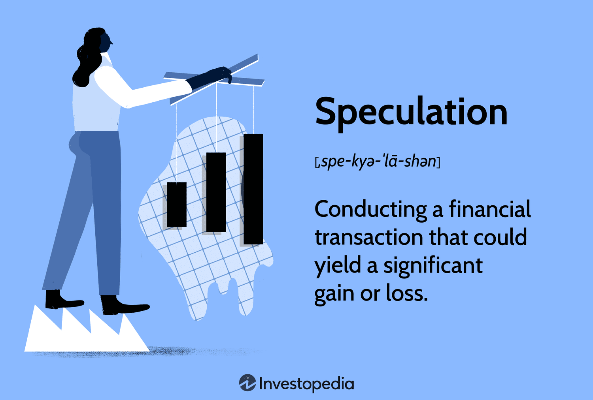

## Table of Contents

## What is speculation in finance?

Speculation in finance is when people buy and sell things like stocks, currencies, or commodities hoping to make money from price changes. They are not interested in using these items themselves but want to profit from the difference in buying and selling prices. For example, someone might buy a stock thinking its price will go up soon, and then sell it for a profit.

This kind of trading can be risky because prices can go down as well as up. Speculators often use a lot of information and predictions to make their decisions, but there's always a chance they could lose money. Speculation is different from investing, where people usually hold onto their assets for a longer time and focus on steady growth rather than quick profits.

## How does speculation differ from investing?

Speculation and investing are two different ways people try to make money with their money. Speculation is when someone buys something, like a stock or a piece of land, hoping to sell it quickly for more money. They are not interested in keeping it for a long time. They want to make a quick profit from price changes. This can be risky because if the price goes down instead of up, they could lose money.

Investing, on the other hand, is when someone buys something with the plan to keep it for a long time. They are looking for steady growth over time, not quick profits. For example, someone might buy stocks in a company they believe will do well over many years. They are more patient and usually take less risk than speculators. The main difference is the time frame and the level of risk they are willing to take.

## What are the common types of financial instruments used for speculation?

People who speculate often use different kinds of financial instruments to try and make money. One common type is stocks. Speculators buy stocks hoping their price will go up quickly so they can sell them for a profit. Another type is commodities, like gold or oil. People might buy these hoping to sell them later at a higher price. Currencies are also used for speculation. Traders buy and sell different currencies, trying to make money from changes in exchange rates.

Another popular instrument for speculation is options. Options give people the right, but not the obligation, to buy or sell something at a set price before a certain date. This can be a way to make big profits if the price moves in the right direction. Futures are similar; they are agreements to buy or sell something at a future date for a price set today. Speculators use futures to bet on what prices will do in the future. These instruments can be risky, but they offer the chance for big gains if the speculator guesses right.

## What are the potential benefits of speculation?

Speculation can help make markets work better. When people speculate, they add more buyers and sellers to the market. This can make it easier for everyone to buy and sell things like stocks or commodities. More people trading can also help prices be more accurate because they reflect what a lot of people think something is worth. This can make the market more fair and efficient.

Another benefit of speculation is that it can help the economy grow. When speculators make money, they often spend it or invest it in other ways. This can create jobs and help businesses grow. Also, speculation can bring new money into markets, which can help companies raise money to do new projects or expand. So, even though speculation can be risky, it can also have good effects on the economy.

## What are the risks associated with speculation?

Speculation can be very risky. When people speculate, they are betting that prices will go up. But if prices go down instead, they can lose a lot of money. This is because speculators often use borrowed money to make bigger bets. If their guess is wrong, they have to pay back the money they borrowed, which can be more than they have. This can lead to big financial losses and even bankruptcy.

Another risk is that speculation can make markets unstable. When a lot of people are speculating, prices can go up and down a lot. This can make it hard for regular investors and businesses to plan. If too many people are betting on prices going up and they all try to sell at the same time, it can cause a big drop in prices. This can hurt the economy and lead to financial crises. So, while speculation can help markets in some ways, it can also make them more risky and unpredictable.

## How can someone start speculating in financial markets?

To start speculating in financial markets, someone first needs to learn about different financial instruments like stocks, commodities, currencies, options, and futures. They should understand how these work and how prices can change. It's important to study the market and read news to see what might affect prices. A good way to learn is by starting with small amounts of money to practice and see how the market moves. Many people also use online platforms or apps that let them trade easily from their computer or phone.

Once someone feels ready, they can open an account with a broker. A broker is a company that helps people buy and sell things in the market. The person will need to put some money into this account to start trading. It's smart to only use money they can afford to lose because speculation can be risky. They should also think about setting limits on how much they are willing to lose on each trade. This can help them manage their risk and keep their speculation from getting out of control.

## What are some famous examples of speculation in history?

One famous example of speculation in history is the Tulip Mania in the Netherlands during the early 1600s. People started buying and selling tulip bulbs, thinking their prices would keep going up. Some bulbs became very expensive, costing as much as a house. But then, suddenly, people realized the prices were too high and started selling their bulbs. This caused the prices to crash, and many people lost a lot of money. This event is often called the first big speculative bubble in history.

Another example is the South Sea Bubble in England in 1720. The South Sea Company promised big profits from trade with South America. People bought a lot of the company's stock, hoping to make money. The stock price went very high, but the company wasn't making as much money as people thought. When people realized this, they started selling their stock quickly. The price crashed, and many people lost their savings. This event showed how dangerous speculation can be when people get too excited about something without checking the facts.

## How do speculators impact financial markets?

Speculators can have a big impact on financial markets. When they buy and sell things like stocks or commodities, they can make prices go up or down. This can make the market more lively because more people are trading. Sometimes, speculators can help make prices more accurate. They do a lot of research and use that information to decide what to buy and sell. This can help show what a lot of people think something is worth, which can make the market work better.

But speculators can also make markets more risky. If a lot of speculators think prices will go up and start buying, prices can go up a lot. But if they all decide to sell at the same time, prices can fall quickly. This can make the market unstable and hard to predict. If too many people are betting on prices going up and they are wrong, it can cause big problems. This can hurt regular investors and even affect the whole economy. So, while speculators can help markets in some ways, they can also make them more dangerous.

## What strategies do professional speculators use?

Professional speculators use different strategies to try and make money. One common strategy is called technical analysis. This is when they look at charts and past price movements to guess where prices might go next. They look for patterns and use special tools to help them decide when to buy and sell. Another strategy is [fundamental analysis](/wiki/fundamental-analysis). This is when they study things like a company's earnings, the economy, and news events to see if something is a good buy. They try to find things that are undervalued and might go up in price.

Another strategy professional speculators use is called [arbitrage](/wiki/arbitrage). This is when they buy something in one place and sell it in another place where the price is higher. They make money from the difference in prices. Some speculators also use leverage, which means they borrow money to make bigger bets. This can make their profits bigger if they are right, but it can also make their losses bigger if they are wrong. They have to be very careful and manage their risk well.

Some speculators also use strategies like hedging to protect themselves from big losses. Hedging is when they make another trade that will make money if their first trade loses money. This can help them balance out their risks. Overall, professional speculators use a mix of these strategies and always try to stay informed about the market. They know that speculation can be risky, so they work hard to make smart decisions and manage their money carefully.

## How can speculation be regulated to prevent market manipulation?

Governments and financial watchdogs use rules to stop people from cheating in financial markets through speculation. They make laws that say what speculators can and can't do. For example, they might limit how much someone can buy or sell in a short time to stop them from making prices go crazy. They also watch the market closely to catch anyone trying to trick others by spreading false information or working together to control prices. If someone breaks these rules, they can get fined or even go to jail.

Another way to control speculation is by making sure everyone has the same information. This is called transparency. If everyone knows the same things about a company or a market, it's harder for speculators to cheat. Regulators also make sure that trading platforms are fair and that no one can use secret tricks to get an advantage. By keeping a close eye on the market and making sure everyone plays by the rules, regulators can help stop bad speculation and keep the market safe for everyone.

## What role does speculation play in economic bubbles and crashes?

Speculation can help create economic bubbles. A bubble happens when prices go up a lot because a lot of people are buying something, thinking the price will keep going up. Speculators can make this worse by buying a lot of something, like stocks or houses, hoping to sell them later for more money. When a lot of people are doing this, it can make prices go up even more. But if too many people are betting on prices going up and they're wrong, the bubble can pop. This means prices suddenly fall a lot, and people who bought at the high prices can lose a lot of money.

When a bubble pops, it can cause an economic crash. This is because when prices fall, people lose confidence and stop spending and investing. Businesses might have a hard time selling things, and some might even go bankrupt. This can make the whole economy slow down or even go into a recession. Speculators can make crashes worse by selling everything quickly when prices start to fall, which makes prices fall even faster. So, while speculation can help make markets lively, it can also lead to big problems if it gets out of control.

## How does speculation influence commodity prices and global trade?

Speculation can change the prices of things like oil, gold, and food. When speculators think the price of a commodity will go up, they start buying a lot of it. This makes the price go up because there are more people wanting to buy it. But if they think the price will go down, they start selling it. This can make the price go down because there are more people wanting to sell it. So, speculation can make commodity prices move a lot, which can be hard for farmers, miners, and other people who need to sell these things to make a living.

These price changes can also affect global trade. If the price of oil goes up because of speculation, it can make it more expensive for countries to buy oil from other countries. This can make things like shipping and making products more expensive. On the other hand, if the price of a commodity like wheat goes down because of speculation, it can make it cheaper for countries to buy food from other places. But this can hurt farmers in countries that sell wheat because they get less money for their crops. So, speculation can make global trade more complicated and unpredictable.

## References & Further Reading

[1]: Bergstra, J., Bardenet, R., Bengio, Y., & Kégl, B. (2011). ["Algorithms for Hyper-Parameter Optimization."](https://papers.nips.cc/paper/4443-algorithms-for-hyper-parameter-optimization) Advances in Neural Information Processing Systems 24.

[2]: ["Advances in Financial Machine Learning"](https://www.amazon.com/Advances-Financial-Machine-Learning-Marcos/dp/1119482089) by Marcos Lopez de Prado

[3]: ["Evidence-Based Technical Analysis: Applying the Scientific Method and Statistical Inference to Trading Signals"](https://www.amazon.com/Evidence-Based-Technical-Analysis-Scientific-Statistical/dp/0470008741) by David Aronson

[4]: ["Machine Learning for Algorithmic Trading"](https://github.com/stefan-jansen/machine-learning-for-trading) by Stefan Jansen

[5]: ["Quantitative Trading: How to Build Your Own Algorithmic Trading Business"](https://www.amazon.com/Quantitative-Trading-Build-Algorithmic-Business/dp/1119800064) by Ernest P. Chan