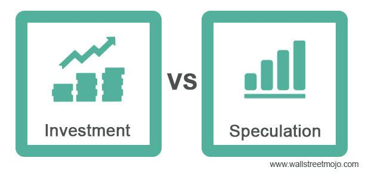

In the fast-paced world of finance, investment strategies and technologies are continuously evolving. As markets become more sophisticated, the ability to anticipate trends and execute trades effectively is increasingly critical. Among innovations, speculation and algorithmic trading are particularly noteworthy due to their profound impact on market dynamics. Speculation involves making high-risk trades to profit from expected market movements, often over short time frames, while algorithmic trading, or algo trading, employs advanced algorithms to execute trades with high speed and precision. 

These practices are reshaping how financial markets operate, influencing both market efficiency and volatility. Understanding these concepts is crucial for anyone looking to thrive in today's trading environments. As speculation introduces new liquidity and volatility into the markets, algorithmic trading enhances trading efficiency and cost-effectiveness. 



Furthermore, the intersection of speculation and algorithmic trading provides both opportunities and challenges for investors and traders. Effective investment decisions and risk management now often require navigating these complex systems. We'll explore how these components affect investment decisions, emphasizing strategic planning and risk consideration. 

By integrating traditional investment techniques with modern trading technologies, market participants can optimize their strategies for better outcomes and adapt to the rapidly evolving financial landscape.

## Table of Contents

## Understanding Investment Finance

Investment finance focuses on the strategic allocation of resources to achieve returns from various financial instruments. This process encompasses a comprehensive analysis of markets, asset classes, and economic indicators. Such an analytical approach enables investors to make informed decisions aimed at optimizing their financial outcomes.

Investors, in their quest to maximize returns, typically manage their portfolios by balancing diverse risk profiles. This strategy involves spreading investments across different asset classes, such as equities, bonds, and real estate. By diversifying, investors mitigate potential risks and enhance their ability to reach financial goals. The role of the investor is fundamentally about maximizing returns while systematically managing risks. This requires thorough analysis and strategic planning, informed by both historical data and future market forecasts.

Technological advancements, notably [algorithmic trading](/wiki/algorithmic-trading) (algo trading), have significantly influenced modern investment finance. Algo trading employs computer algorithms to execute trades at speeds and volumes unfeasible for human traders. These systems rely on complex mathematical models and vast datasets to inform trading decisions. For instance, an investor might use Python to implement a simple moving average crossover strategy as follows:

```python
import pandas as pd

# Assume stock_data is a DataFrame with 'Date' and 'Close' columns
stock_data['SMA_20'] = stock_data['Close'].rolling(window=20).mean()
stock_data['SMA_50'] = stock_data['Close'].rolling(window=50).mean()

# Generate buy/sell signals
stock_data['Signal'] = 0
stock_data['Signal'][20:] = np.where(stock_data['SMA_20'][20:] > stock_data['SMA_50'][20:], 1, 0)
stock_data['Position'] = stock_data['Signal'].diff()
```

Such advancements enable investors to conduct sophisticated analyses and implement strategies that were previously inaccessible. By leveraging technology, investors can refine their approach to risk management and returns optimization, enhancing their capacity to navigate the complexities of today's financial markets.

## Speculation in Financial Markets

Speculation involves engaging in transactions of financial instruments with the intention of profiting from changes in market prices. Unlike traditional investing, which focuses on long-term value growth and income generation through dividends or interest, speculation typically embraces shorter time frames and involves higher levels of risk. Speculators capitalize on price [volatility](/wiki/volatility-trading-strategies), leveraging fluctuations that might arise from changes in market conditions, economic events, or shifts in investor sentiment.

A distinguishing feature of speculation is its capacity to inject [liquidity](/wiki/liquidity-risk-premium) into financial markets. By participating actively in the buying and selling of securities, speculators enhance market liquidity, contributing to smoother transactions and narrowing bid-ask spreads. This liquidity is crucial, especially during periods of high market activity, as it facilitates the execution of trades without causing significant price alterations. However, the same speculative activity that bolsters liquidity can also exacerbate market volatility. Rapid trading based on speculative motives may lead to large price swings, as evidenced during events such as the 2008 financial crisis or the dot-com bubble of the late 1990s.

The role of speculation is a subject of significant debate among economists and market participants. Proponents argue that speculation enhances market efficiency by ensuring that prices reflect all available information rapidly. This market discipline theoretically aids in the optimal allocation of resources across the economy. Moreover, speculators can serve as counterbalances to over-enthusiastic traders by short-selling overvalued assets, potentially preventing inflated bubbles.

Conversely, critics contend that speculation can lead to destabilizing outcomes, particularly when it detaches asset prices from their fundamental values. In some scenarios, the pursuit of short-term gains can result in phenomena such as asset bubbles, where rapid increases in asset prices are followed by dramatic declines, causing economic disruptions and financial losses. The case of the housing market prior to the 2008 financial crisis exemplifies how speculative investments can drive unsustainable price increases.

To effectively navigate financial markets, it is essential to comprehend speculation's dual impact: its ability to introduce both liquidity and volatility. As such, understanding the motives and behavior of speculators provides insights into broader market dynamics and sentiment. Traders, investors, and policymakers must remain vigilant of speculative trends to mitigate potential risks while capitalizing on the opportunities arising from efficient and liquid markets.

## The Rise of Algorithmic Trading

Algorithmic trading, commonly referred to as algo trading, utilizes computer algorithms to execute trades at velocities and frequencies beyond the capability of human traders. These algorithms are designed to make trading decisions based on complex mathematical models and data analysis. The core of algo trading lies in its ability to process vast amounts of market data, identify trading opportunities, and execute orders with precision and speed.

Historically, algorithmic trading was predominantly the domain of institutional investors, such as hedge funds and investment banks, primarily due to the substantial technological and financial resources required to develop and maintain trading algorithms. However, technological advancements and increased market competition have driven the democratization of algo trading, making it more accessible to retail traders. This shift has been facilitated by the rise of online trading platforms and algorithmic trading software, which offer retail traders the tools to design and implement their own trading strategies.

The introduction of algorithmic trading has had a transformative impact on financial markets. One of the most significant benefits is enhanced market liquidity. By facilitating a higher [volume](/wiki/volume-trading-strategy) of trades with minimal human intervention, algo trading contributes to tighter bid-ask spreads and more efficient price discovery. Additionally, by automating the trading process, algorithmic trading reduces transaction costs, which can be particularly advantageous for high-frequency trading strategies that rely on executing a large number of small, quick trades.

Despite its advantages, algorithmic trading presents several challenges and considerations. The speed and automation inherent in algo trading can lead to market anomalies, such as "flash crashes," where rapid, algorithm-driven trading activity triggers abrupt and significant market movements. Such events highlight concerns regarding market stability and the sufficiency of existing regulatory frameworks to manage the risks associated with algorithmic trading.

Furthermore, ethical considerations arise from the use of sophisticated algorithms, particularly regarding transparency and fairness. Retail traders and less technologically advanced market participants may find themselves at a disadvantage compared to well-resourced institutional entities deploying cutting-edge algorithms, potentially resulting in an uneven playing field.

In conclusion, while algorithmic trading continues to revolutionize financial markets, it underscores the importance of balancing innovation with oversight to mitigate potential risks and ensure equitable market participation for all investors.

## The Interplay Between Speculation and Algo Trading

Algorithmic trading significantly amplifies speculation by executing numerous trades rapidly through speculative strategies. This type of trading employs sophisticated algorithms to identify and capitalize on short-term market inefficiencies. Among the most common strategies employed by algorithmic traders is the [momentum](/wiki/momentum) strategy, which speculates on the continuation of existing market trends. In essence, it aims to profit by buying assets that have shown an upward trend and selling those that have shown a decline. This strategy is grounded in the belief that stocks which are rising will continue to do so, and that stocks declining will similarly continue their trajectory. 

Python code exemplifying a simple momentum strategy might look like this:

```python
import numpy as np

def momentum_strategy(prices, window=5):
    signals = np.zeros(len(prices))
    for i in range(window, len(prices)):
        if prices[i] > prices[i-window]:
            signals[i] = 1  # Buy signal
        elif prices[i] < prices[i-window]:
            signals[i] = -1  # Sell signal
    return signals

prices = [100, 102, 104, 103, 105, 107, 110, 108, 112, 115]
signals = momentum_strategy(prices)

print(signals)
```

This strategy feeds on market movements and can exacerbate volatility as algorithms quickly react to speculative signals. As a consequence, large volumes of trades executed at high speed can result in significant short-term price swings. The impact is palpable in events like the "Flash Crash" of May 6, 2010, when the Dow Jones Industrial Average plunged nearly 1,000 points within minutes, mainly due to algorithmic trading. 

Heightened volatility and rapid price fluctuations underscore the complexity of markets influenced by both speculation and algorithmic trading. Market participants must understand this dynamic to navigate effectively, requiring advanced analytical tools and a comprehensive grasp of algorithmic functions. Anticipating market movements, therefore, becomes a task of not only identifying trends but also recognizing the potential for algorithmic influence on those trends.

In conclusion, the intersection of speculation and algorithmic trading is a defining feature of contemporary financial markets, magnifying both opportunities and risks. The ability to understand and anticipate these interactions is crucial in managing the fast-paced dynamics of today's trading environments.

## Implications for Investors

Investors must grasp the implications of speculation and algorithmic trading on market behavior and volatility. These elements demand that investment strategies evolve to manage the risks introduced by rapid market changes effectively. Diversification and risk management are paramount, particularly in markets heavily influenced by algorithmic trading.

Diversification involves spreading investments across various asset classes to mitigate risk. This strategy reduces the impact of any single investment's poor performance on the overall portfolio. In the context of algorithmic trading, diversification can help buffer the portfolio against the swift price movements characteristic of algorithm-driven markets.

Investors may also consider incorporating algorithmic strategies directly into their investment practices. Algorithmic strategies can range from simple mean-reversion techniques to sophisticated [machine learning](/wiki/machine-learning) models. Retail investors now have increasing access to platforms and tools that allow them to employ complex algorithmic strategies once reserved for institutional traders. Alternatively, investors might engage managed algorithmic trading services, which deploy algorithms to trade on behalf of clients, thereby accessing the benefits of algo trading without requiring in-depth technical knowledge or infrastructure investment.

To exploit the potential of speculation and algorithmic trading while mitigating their risks, staying informed about market conditions, emerging technologies, and regulatory changes is crucial. Continuous education and adaptation can help investors remain agile, enabling them to harness the opportunities presented by these innovations. In conclusion, mastering the influences of speculation and algo trading is key for investors aiming to succeed in today's dynamic financial markets.

## Conclusion

The convergence of speculation and algorithmic trading continues to significantly impact the field of investment finance, offering a transformative approach to how markets function. Despite inherent risks, including heightened volatility and the potential for market disruptions, these technologies also present unprecedented opportunities. Investors who are prepared to embrace these advancements can leverage enhanced liquidity, reduced transaction costs, and innovative investment strategies.

In rapidly evolving markets, maintaining awareness and the ability to adapt are critical for success. Engaging with speculation and algorithmic trading requires a robust understanding of their mechanics and potential impacts. This knowledge enables investors to better navigate financial market complexities and make informed decisions, even amidst rapid changes.

Continued learning and strategic adaptation are essential to thrive in this dynamic environment. By staying informed about emerging trends and continuously refining their strategies, investors can maximize the benefits while mitigating associated risks. The ability to anticipate and respond to market developments will ultimately pave the way for success in the ever-changing landscape of investment finance.

## References & Further Reading

[1]: Bergstra, J., Bardenet, R., Bengio, Y., & Kégl, B. (2011). ["Algorithms for Hyper-Parameter Optimization."](https://papers.nips.cc/paper/4443-algorithms-for-hyper-parameter-optimization) Advances in Neural Information Processing Systems 24.

[2]: ["Advances in Financial Machine Learning"](https://www.amazon.com/Advances-Financial-Machine-Learning-Marcos/dp/1119482089) by Marcos Lopez de Prado

[3]: ["Evidence-Based Technical Analysis: Applying the Scientific Method and Statistical Inference to Trading Signals"](https://www.amazon.com/Evidence-Based-Technical-Analysis-Scientific-Statistical/dp/0470008741) by David Aronson

[4]: ["Machine Learning for Algorithmic Trading"](https://github.com/stefan-jansen/machine-learning-for-trading) by Stefan Jansen

[5]: ["Quantitative Trading: How to Build Your Own Algorithmic Trading Business"](https://www.amazon.com/Quantitative-Trading-Build-Algorithmic-Business/dp/1119800064) by Ernest P. Chan