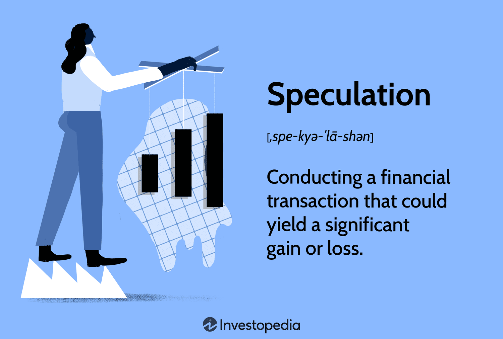

## Table of Contents

## What is speculation in financial markets?

Speculation in financial markets is when people buy and sell things like stocks, currencies, or commodities hoping to make a profit from price changes. They guess that the price will go up or down and try to make money from that guess. Speculators are different from investors because they are more focused on short-term gains rather than long-term growth.

Speculation can make markets more lively because it increases the number of trades. But it can also make markets more risky. If many people are speculating, prices can become very unstable. This can lead to big price swings, which can be good or bad for the market. It's important for people to understand the risks before they start speculating.

## How does speculation differ from investing?

Speculation and investing are two ways people try to make money in financial markets, but they are different. Investing is when you buy things like stocks, bonds, or real estate because you believe they will grow in value over time. Investors usually look at the long term. They want to own a piece of a company or a property that will become more valuable as time goes on. They might also get money from dividends or rent.

Speculation is more like betting on quick price changes. Speculators buy and sell things hoping to make a profit from short-term ups and downs in the market. They are not as interested in the long-term value of what they are buying. Instead, they try to guess if the price will go up or down soon and make money from that guess. Because of this, speculation can be riskier than investing.

## What are the common types of financial instruments used for speculation?

Speculators often use stocks to try and make quick profits. They buy shares of a company hoping the price will go up soon so they can sell them for more than they paid. Sometimes, they even borrow money to buy more stocks, which can make their gains bigger but also riskier. Another common way to speculate is with options and futures. These are contracts that give you the right to buy or sell something at a set price in the future. Speculators use them to bet on whether prices will go up or down without having to own the actual thing.

Currencies are also popular for speculation. People trade different countries' money, like dollars or euros, trying to make money from changes in exchange rates. This is called [forex](/wiki/forex-system) trading. Commodities, like oil, gold, or wheat, are another type of financial instrument used for speculation. Traders buy and sell these goods hoping to profit from price changes. All these methods can be profitable but also come with a lot of risk because prices can be hard to predict.

## What are the potential benefits of speculation for the market?

Speculation can help make markets more lively. When lots of people are buying and selling, it can make it easier for others to trade too. This is because there are more people willing to buy or sell at any time, which means you can usually find someone to trade with quickly. This can also help make prices more accurate because all the buying and selling helps show what people think things are worth right now.

Another benefit is that speculation can bring more money into the market. When speculators invest money, it can help companies grow or help people buy things they need. This extra money can lead to more jobs and help the economy get stronger. So, even though speculation can be risky, it can also help the market in some good ways.

## What are the risks associated with speculation?

Speculation can be very risky because it's like guessing what will happen in the future. If you guess wrong, you can lose a lot of money. Prices can go up and down a lot, and if they go down after you buy something, you might have to sell it for less than you paid. This is called a loss. Sometimes, people even borrow money to speculate, which can make the losses even bigger if things don't go their way.

Another risk is that speculation can make markets unstable. When lots of people are speculating, it can cause big price swings. These swings can make it hard for other people to know what things are really worth. This can scare people and make them not want to invest or trade, which can hurt the market. So, while speculation can help the market in some ways, it can also cause problems if it gets out of control.

## How can someone start speculating in financial markets?

To start speculating in financial markets, first, you need to learn about the different ways you can speculate. You can use stocks, options, futures, currencies, or commodities. Each of these has its own rules and risks, so it's important to understand them before you start. You can read [books](/wiki/algo-trading-books), take online courses, or even talk to people who know about speculating to learn more. Once you feel ready, you'll need to choose a broker. A broker is a company that helps you buy and sell things in the market. Make sure to pick a broker that is trusted and has good tools for speculating.

After you've chosen a broker, you'll need to open an account and put some money in it. This money is called your capital, and it's what you'll use to buy and sell things. Start small, because speculating can be risky. It's a good idea to only use money you can afford to lose. Once your account is set up, you can start making trades. Remember to keep learning and stay updated on what's happening in the market, because things can change quickly. Speculating can be exciting, but always be careful and think about the risks.

## What are some popular strategies used by speculators?

One popular strategy speculators use is called [day trading](/wiki/day-trading-spy). This is when they buy and sell things like stocks or currencies within the same day. They try to make small profits from the tiny changes in price that happen all the time. Day traders need to watch the market closely and be ready to make quick decisions. It can be exciting but also stressful because you need to be right a lot to make money.

Another strategy is called swing trading. Swing traders hold onto their investments for a few days or weeks. They try to make money from bigger price changes that happen over a short time. They look for patterns in the market and try to guess where prices will go next. This strategy is a bit less stressful than day trading because you don't need to watch the market every second, but it still needs a lot of research and patience.

Some speculators also use a strategy called [trend following](/wiki/trend-following). They look for trends in the market, like if a stock's price is going up or down over time. They buy when they think the trend will keep going and sell when they think it will change. This strategy can work well if you're good at spotting trends, but it can be hard because trends can change suddenly.

## How do economic indicators influence speculation?

Economic indicators are like clues that help speculators guess what might happen in the market. Things like unemployment rates, inflation, and how much people are spending can show if the economy is doing well or not. If the unemployment rate goes down, it might mean more people have jobs and can spend more money, which could make stock prices go up. On the other hand, if inflation is high, it might mean prices for everything are going up, which could make people nervous and cause stock prices to go down. Speculators watch these indicators closely to try and make smart guesses about what will happen next.

These indicators can also change how people feel about the market. For example, if a report shows that the economy is growing fast, speculators might feel more confident and start buying more stocks, hoping to make money from the good news. But if a report shows that the economy is slowing down, speculators might get worried and start selling their investments to avoid losing money. So, economic indicators not only give speculators information but also affect their emotions and decisions, which can lead to big changes in the market.

## What role do speculators play in market liquidity?

Speculators help make markets more liquid. Liquidity means how easy it is to buy or sell something without changing its price too much. When lots of speculators are trading, there are more people willing to buy and sell at any time. This means if you want to sell something, you can usually find someone to buy it quickly, and if you want to buy something, you can usually find someone to sell it to you fast. This makes the market work better because people can trade more easily.

Speculators also help by adding more money to the market. When they buy and sell things, they bring in more cash, which can help keep the market moving. This extra money can make it easier for other people to trade too. So, even though speculators are trying to make a profit for themselves, they end up helping the whole market by making it more liquid and easier for everyone to trade.

## How can advanced technical analysis tools aid in speculation?

Advanced technical analysis tools can help speculators make better guesses about what will happen in the market. These tools look at past price movements and other data to find patterns. For example, they might use charts to see if a stock's price is going up or down in a certain way. They can also use indicators like moving averages or the Relative Strength Index (RSI) to see if a stock is overbought or oversold. By understanding these patterns and indicators, speculators can decide when to buy or sell to make a profit.

These tools also help speculators manage their risks better. They can set up automatic alerts to tell them when certain conditions are met, like if a stock's price hits a certain level. This can help them act quickly to buy or sell. Some tools even let speculators test their strategies using past data to see how well they might work in the future. This can help them make more informed decisions and avoid big losses. So, while technical analysis tools don't guarantee success, they can give speculators an edge in the fast-moving world of financial markets.

## What are the regulatory considerations for speculators?

Speculators need to know about the rules that governments and other groups set up to make sure trading is fair and safe. These rules can be different depending on where you live and what you are trading. For example, in the United States, the Securities and Exchange Commission (SEC) makes rules for trading stocks. They want to stop people from doing things that could hurt the market, like lying about a company to make its stock price go up or down. Speculators also need to follow rules from other groups, like the Commodity Futures Trading Commission (CFTC), if they are trading things like oil or wheat.

These rules can affect how speculators trade. For example, some rules might limit how much you can buy or sell in a short time to stop the market from getting too crazy. Other rules might say you need to keep some money in your account to cover any losses. Speculators need to understand these rules and follow them, or they could get in trouble. It's a good idea for speculators to learn about the rules in their area and maybe even talk to a lawyer to make sure they are doing everything right.

## How do global events impact speculation strategies?

Global events can change the way speculators make their guesses about the market. Things like wars, elections, or big changes in the weather can make prices go up or down a lot. For example, if there's a war in a country that makes a lot of oil, speculators might think the price of oil will go up because it might be harder to get. They might buy oil hoping to sell it later for more money. Or if there's a big election coming up, speculators might try to guess how the new leaders will change the economy and buy or sell things based on those guesses.

These events can also make speculators change their plans quickly. If something unexpected happens, like a big earthquake or a new law, speculators need to think fast and decide if they should buy, sell, or do nothing. They might use news and other information to help them make these decisions. Because global events can be hard to predict, speculators need to be ready to change their strategies and be careful about the risks they take.

## References & Further Reading

1. Aldridge, I. (2013). *High-Frequency Trading: A Practical Guide to Algorithmic Strategies and Trading Systems*. Wiley. This book provides a comprehensive overview of high-frequency trading (HFT), including the design and operation of trading systems and algorithms.

2. Chan, E. (2013). *Algorithmic Trading: Winning Strategies and Their Rationale*. Wiley. Chan's work focuses on the development and implementation of quantitative trading strategies, with an emphasis on systematic and algorithmic approaches.

3. Hendershott, T., Jones, C. M., & Menkveld, A. J. (2011). "Does Algorithmic Trading Improve Liquidity?" *The Journal of Finance*, 66(1), 1-33. This paper examines the impact of algorithmic trading on market liquidity, suggesting that it generally enhances market efficiency.

4. Kirilenko, A. A., Kyle, A. S., Samadi, M., & Tuzun, T. (2017). "The Flash Crash: The Impact of High-Frequency Trading on an Electronic Market." *The Journal of Finance*, 72(3), 967-998. An analysis of the 2010 Flash Crash, exploring the role of high-frequency trading and its effects on market stability.

5. López de Prado, M. (2018). *Advances in Financial Machine Learning*. Wiley. This book covers the application of machine learning techniques in finance, particularly in developing trading algorithms and models.

6. Shleifer, A., & Summers, L. H. (1990). "The Noise Trader Approach to Finance." *The Journal of Economic Perspectives*, 4(2), 19-33. A foundational paper discussing the impact of noise traders on financial markets and the resulting implications for market efficiency and volatility.

7. Treleaven, P., Galas, M., & Lalchand, V. (2013). "Algorithmic Trading Review." *Communications of the ACM*, 56(11), 76-85. An overview of algorithmic trading technologies, their evolution, and the regulatory challenges associated with their use.

8. Zhang, S., & Powell, R. J. (2021). "Algorithmic Trading in Cryptocurrency Markets." *Journal of Risk and Financial Management*, 14(10), 471. This article extends the scope of algorithmic trading to cryptocurrency markets, analyzing trading strategies and market dynamics.

