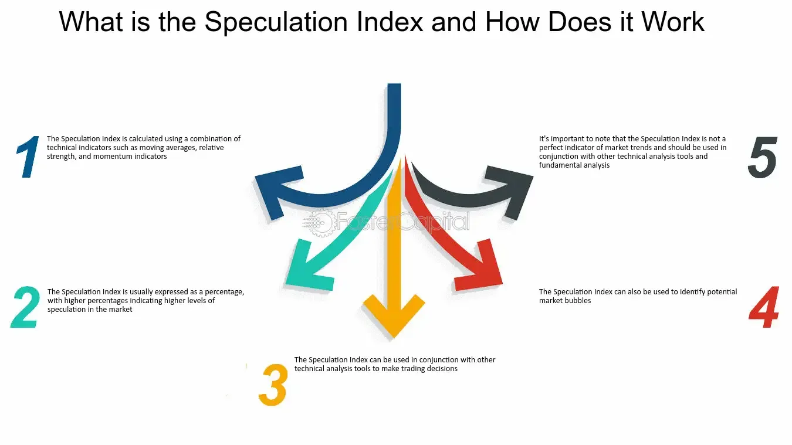

## Table of Contents

## What is a Speculation Index?

A Speculation Index is a tool that helps people understand how much people are guessing about the future prices of things like stocks or real estate. It looks at how much people are buying and selling these things, and how much they are willing to pay for them. If the index is high, it means that a lot of people are making big guesses about future prices, which can be risky.

This index is important because it can show if the market is getting too excited or too worried. When too many people start guessing and making big bets, it can lead to big changes in prices, sometimes causing bubbles or crashes. By watching the Speculation Index, investors and policymakers can make better decisions and try to keep the market stable.

## Why is the Speculation Index important in financial markets?

The Speculation Index is important in financial markets because it helps people see how much guessing is happening about future prices. When the index is high, it means a lot of people are making big bets on what they think prices will do next. This can be risky because if everyone is guessing the same way, it can make prices go up or down a lot, which might not be good for the market.

By keeping an eye on the Speculation Index, investors can make smarter choices about when to buy or sell. If the index shows that too many people are guessing, it might be a good time to be careful. Also, people who make rules for the market can use the index to help keep things stable. They can see when the market might be getting too excited or too worried and take steps to calm things down.

## How is the Speculation Index calculated?

The Speculation Index is calculated by looking at how much people are buying and selling things like stocks or real estate, and how much they are willing to pay. It uses data from trading volumes, which is how many shares or properties are being traded, and price changes over time. If a lot of trading is happening and prices are going up and down a lot, it might mean people are guessing more about future prices.

To make the index, experts take all this data and put it into a special formula. This formula helps turn the numbers into a score that shows how much speculation is happening. A high score means a lot of guessing, and a low score means less guessing. By watching this score over time, people can see if the market is getting more or less risky.

## What are the common uses of the Speculation Index for investors?

Investors use the Speculation Index to see if the market is getting too excited or worried. If the index is high, it means a lot of people are guessing about future prices. This can be a warning sign for investors to be careful. They might decide to sell some of their investments to avoid big losses if the market suddenly changes. By watching the index, investors can make smarter choices about when to buy or sell.

The Speculation Index also helps investors understand market trends. If the index shows that speculation is increasing, it might mean that prices could go up or down a lot soon. This can help investors plan their next moves. For example, they might choose to wait before making big investments if the index is very high. By using the index, investors can better manage their risks and try to make more money over time.

## Can you explain the components that make up the Speculation Index?

The Speculation Index is made up of a few important parts. One part is trading volume, which is how many shares or properties are being bought and sold. When a lot of trading is happening, it can mean that people are guessing more about future prices. Another part is price changes. If prices are going up and down a lot, it might show that people are making big bets on what they think will happen next.

These parts are put together using a special formula to make the Speculation Index. The formula looks at the trading volume and price changes over time and turns them into a score. A high score means there is a lot of guessing going on in the market, and a low score means less guessing. By watching this score, people can see if the market is getting more or less risky.

## What are some historical examples where the Speculation Index predicted market trends?

In the late 1990s, the Speculation Index showed a big jump. This was around the time of the dot-com bubble. A lot of people were buying internet company stocks because they thought the prices would keep going up. The high Speculation Index warned that too many people were guessing about future prices. Soon after, the bubble burst, and stock prices fell a lot. People who watched the Speculation Index might have sold their stocks before the big drop.

Another time was before the 2008 financial crisis. The Speculation Index was high, showing that many people were betting on housing prices. They thought the prices would keep rising, so they bought a lot of houses and took out big loans. But the high Speculation Index showed the market was risky. When the housing bubble burst, it led to a big crash. Investors who paid attention to the Speculation Index could have been more careful and maybe avoided some losses.

## What criticisms have been leveled against the Speculation Index?

Some people say the Speculation Index is not always right. They think it can be hard to tell if the index is really showing guessing or just normal market changes. Sometimes, the index might go up because of big news or events, not just because people are guessing. This can make it hard for investors to know if they should be worried or not.

Another criticism is that the Speculation Index only looks at numbers like trading volume and price changes. It does not think about other important things, like what people are saying or feeling about the market. These things can also affect how much people guess about future prices. So, some people think the index might miss important signs that the market is getting risky.

## How reliable is the Speculation Index as a predictive tool?

The Speculation Index can be a helpful tool for guessing what might happen in the market, but it is not always perfect. It looks at how much people are buying and selling and how prices are changing. If the index is high, it means a lot of people are guessing about future prices. This can be a warning that the market might be getting too excited or worried. For example, before the dot-com bubble burst in the late 1990s and before the 2008 financial crisis, the Speculation Index was high, which helped some people see that the market was risky.

However, the Speculation Index is not always right. Sometimes, it might go up because of big news or events, not just because people are guessing. This can make it hard to know if the market is really risky or if it is just reacting to something else. Also, the index only looks at numbers like trading volume and price changes. It does not think about other important things, like what people are saying or feeling about the market. So, while the Speculation Index can be a good guide, it is best to use it with other information to make the best guesses about the market.

## What alternatives exist to the Speculation Index for measuring market speculation?

One way to measure market speculation besides the Speculation Index is by looking at the Volatility Index, also known as the VIX. The VIX shows how much people expect prices to go up and down in the future. If the VIX is high, it means people think the market will be more unpredictable, which can be a sign that a lot of guessing is happening. Investors use the VIX to see if the market might be getting too risky, just like they use the Speculation Index.

Another tool is the Put/Call Ratio. This looks at how many people are buying options to protect against falling prices (puts) compared to how many are buying options to bet on rising prices (calls). If more people are buying puts, it might mean they are worried about the market and think prices will go down. This can show that people are guessing a lot about what will happen next. The Put/Call Ratio helps investors see if the market is feeling nervous or confident.

A third way is to use Sentiment Surveys. These surveys ask investors and traders what they think about the market. If a lot of people say they are very hopeful or very worried, it can mean they are guessing a lot about future prices. Sentiment Surveys give a different view of the market because they look at what people are thinking and feeling, not just numbers like trading volume or price changes.

## How do different economic theories view the Speculation Index?

Some economic theories see the Speculation Index as a good way to check how much people are guessing about future prices. These theories, like Keynesian economics, think that when the Speculation Index is high, it means the market might be getting too excited or worried. They believe this can lead to bubbles or crashes, so watching the index can help keep the market stable. For example, if the index shows a lot of guessing, policymakers might step in to calm things down.

On the other hand, some economic theories, like those from the Efficient Market Hypothesis, think the Speculation Index is not that important. They believe that all the information people need is already in the prices of stocks and other things. So, guessing by people is just part of how markets work and does not need special attention. These theories say that trying to predict the market using tools like the Speculation Index is not very useful because the market is always right in the end.

## What advanced statistical methods can be used to enhance the analysis of the Speculation Index?

One way to make the Speculation Index better is by using something called time series analysis. This method looks at how the index changes over time. It can help find patterns and trends that are hard to see just by looking at the numbers. For example, time series analysis can show if the index goes up and down in a certain way, like every few months or years. By understanding these patterns, people can guess better what might happen next in the market. They can use special math tools, like ARIMA models, to make these guesses even more accurate.

Another advanced method is [machine learning](/wiki/machine-learning). This is when computers learn from past data to make better guesses about the future. Machine learning can look at a lot of different things at the same time, like trading volume, price changes, and even news or social media. By doing this, it can find links between these things and the Speculation Index that people might miss. For example, machine learning can see if certain news stories make the index go up or down. This can help investors and policymakers understand the market better and make smarter choices.

## How can the Speculation Index be integrated into a comprehensive investment strategy?

The Speculation Index can be a helpful tool in a big investment plan. It shows how much people are guessing about future prices, which can help investors know if the market is getting too excited or worried. If the index is high, it might be a good time to be careful and maybe sell some investments to avoid big losses if the market changes suddenly. By watching the Speculation Index, investors can make smarter choices about when to buy or sell and manage their risks better.

To use the Speculation Index in a full investment plan, it's good to look at it along with other tools and information. For example, investors can also use the Volatility Index (VIX) to see how much people expect prices to change, or the Put/Call Ratio to see if people are betting on prices going up or down. By combining these tools, investors get a better picture of the market. They can also look at news, economic reports, and even what other investors are saying to make the best guesses about what might happen next. Using the Speculation Index this way helps investors plan their next moves and try to make more money over time.

## What is the Speculation Index: Definition and Calculation?

The Speculation Index is a metric designed to quantify the level of speculative trading activity by comparing trading volumes between different types of exchanges. Specifically, it is calculated by taking the [volume](/wiki/volume-trading-strategy) of trades on the NYSE American, an exchange typically characterized by smaller, riskier, and more speculative stocks, and dividing it by the volume of trades on the New York Stock Exchange (NYSE), which represents more stable and less volatile equities. The formula for the Speculation Index can be expressed as:

$$
\text{Speculation Index} = \frac{\text{Trading Volume on NYSE American}}{\text{Trading Volume on NYSE}}
$$

This index thus provides an indication of the relative trading activity focused on speculative assets. A higher ratio implies that a larger proportion of market activity is being funneled towards riskier investments, which is often associated with bullish market conditions. This correlation arises because increased speculation typically reflects investor optimism about potential gains in the stock market, prompting greater risk tolerance. However, it is crucial to interpret this metric with caution, as an elevated Speculation Index might also signal excessive speculation, which could precede market corrections or downturns. The Speculation Index serves as a valuable tool for investors and analysts, offering insights into market sentiment and the balance between speculative and stable investments.

## References & Further Reading

[1]: Shreve, S. E. (2004). ["Stochastic Calculus for Finance I: The Binomial Asset Pricing Model"](https://link.springer.com/book/10.1007/978-0-387-22527-2). Springer.

[2]: Aldridge, I. (2013). ["High-Frequency Trading: A Practical Guide to Algorithmic Strategies and Trading Systems"](https://www.amazon.com/High-Frequency-Trading-Practical-Algorithmic-Strategies/dp/1118343506). Wiley.

[3]: Amsden, R. L., & Litterman, R. B. (2020). ["The New Science of Asset Allocation: Risk Management in a Multi-Asset World"](https://onlinelibrary.wiley.com/doi/book/10.1002/9781118268223). Wiley.

[4]: Chan, E. P. (2009). ["Quantitative Trading: How to Build Your Own Algorithmic Trading Business"](https://github.com/ftvision/quant_trading_echan_book). Wiley Trading.

[5]: Fabozzi, F. J., Focardi, S. M., & Kolm, P. N. (2010). ["Quantitative Equity Investing: Techniques and Strategies"](https://www.semanticscholar.org/paper/Quantitative-Equity-Investing%3A-Techniques-and-Fabozzi-Focardi/1c49a2a53919f7e65cb96f16691b8ff726fd3cd7). Wiley.