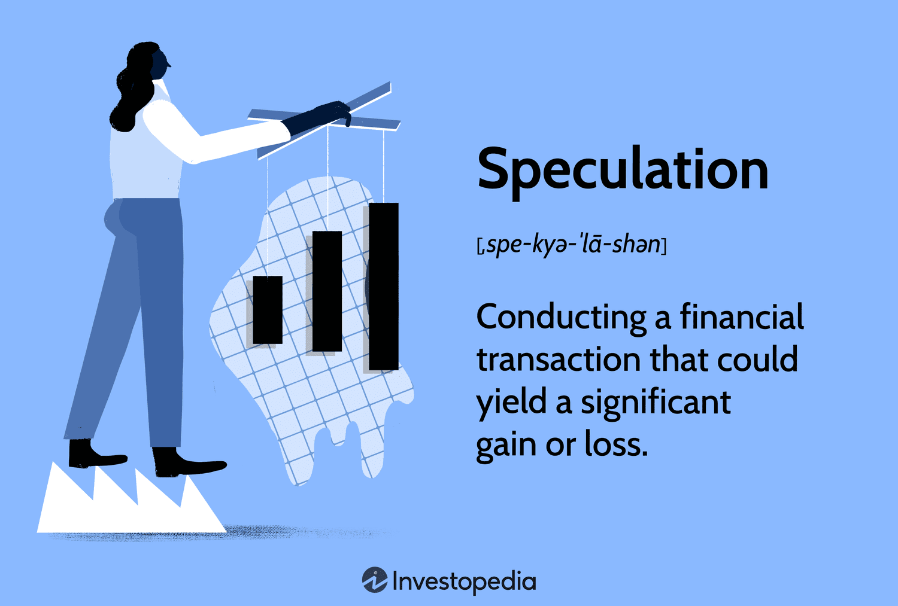

## Table of Contents

## What is speculation in trading?

Speculation in trading is when people buy and sell things like stocks, currencies, or commodities hoping to make a profit from price changes. They are not interested in using the items they trade, but instead, they want to guess the future price and make money from the difference. For example, if someone thinks the price of gold will go up, they might buy gold now and sell it later at a higher price.

This kind of trading can be risky because it's hard to predict the future. Prices can go up or down unexpectedly due to many reasons like news events, economic reports, or even rumors. Because of this, speculators might make a lot of money, but they can also lose a lot. It's important for people who speculate to understand the risks and be ready for the possibility of losing money.

## How does speculation differ from investing?

Speculation and investing are both ways people try to make money with their money, but they are different in how they work and what people expect. When someone invests, they usually look for steady growth over a long time. They might buy stocks, bonds, or real estate because they believe these will become more valuable over years or even decades. Investors often get money from things like dividends or rent, and they usually want to use their money to build wealth slowly and safely.

On the other hand, speculation is more like a short-term bet on price changes. Speculators try to make quick profits by guessing if the price of something, like a stock or a commodity, will go up or down soon. They might not care about the long-term value of what they're trading. Instead, they focus on making money from quick price swings, which can be exciting but also very risky because prices can be hard to predict and can change suddenly.

In summary, the main difference is the time frame and the level of risk. Investing is usually about playing it safe and growing wealth over time, while speculation is about taking bigger risks for the chance of making money quickly. Both approaches can work, but they suit different kinds of people with different goals and comfort levels with risk.

## What are the basic risks associated with speculation?

Speculation involves a lot of risks because it's all about guessing what will happen to prices in the short term. One big risk is losing money. Since speculators are trying to make quick profits, they might buy something hoping its price will go up, but if the price goes down instead, they can lose a lot of money. This can happen because of many reasons like unexpected news, changes in the market, or even just because other people are selling.

Another risk is that speculation can be very emotional. When people see prices moving quickly, they can get excited or scared, which might make them make bad choices. For example, they might buy more when prices are already high because they're excited, or they might sell everything when prices start to drop because they're scared, even if waiting a bit might have been better. This emotional rollercoaster can lead to big losses if speculators don't keep their feelings in check.

Lastly, speculation can also lead to what's called a market bubble. This happens when a lot of people start speculating on something, driving its price way up, but without any real reason for the price to be so high. When the bubble bursts, the price can crash down, and people who speculated can lose a lot of money. This is why it's important for anyone thinking about speculating to understand these risks and be ready for the possibility of losing money.

## What potential rewards can speculators expect?

Speculators can make a lot of money if they guess right about price changes. If they buy something and its price goes up quickly, they can sell it for a big profit. For example, if someone buys a stock for $100 and it goes up to $150 in a short time, they can make a 50% profit. This kind of quick money is what attracts many people to speculation. It's exciting to see money grow fast, and some speculators enjoy the thrill of making successful bets in the market.

However, the rewards of speculation are not just about making money. Some speculators also enjoy the challenge and the learning that comes with trying to predict market movements. They might study a lot about different markets, learn about economic trends, and get better at understanding how news and events can affect prices. This knowledge can be rewarding in itself, even if they don't always make money. So, while the main reward might be financial gain, there's also the personal satisfaction of mastering a complex skill.

## What are some common speculative trading strategies?

One common speculative trading strategy is day trading. This is when people buy and sell stocks or other things within the same day, trying to make money from small price changes. Day traders watch the market closely all day, looking for the right moments to buy low and sell high. They often use tools like charts and technical analysis to help them decide when to trade. It's a fast-paced way to trade that can be exciting but also stressful because things can change quickly.

Another strategy is swing trading. This is a bit slower than day trading but still focuses on making money from short-term price movements. Swing traders might hold onto their trades for a few days or weeks, trying to catch "swings" in the market where prices go up or down a lot. They look for patterns or news that might cause these price swings and try to buy before the price goes up and sell before it goes down. It's less intense than day trading but still needs a good understanding of the market and patience.

A third strategy is scalping. This is a very quick type of trading where people try to make small profits from tiny price changes, often holding trades for just seconds or minutes. Scalpers might make many trades in a day, each one trying to make a little bit of money. They need to be very focused and use special tools to help them see small price movements. Scalping can add up to big profits if done right, but it's also very hard work and can be risky because it's so fast.

## How can beginners start speculating safely?

For beginners, starting to speculate safely means learning a lot before jumping in. They should read books, take online courses, or watch videos about trading and speculation. It's important to understand how markets work, what can make prices go up or down, and what different trading strategies are. Beginners should also practice with a demo account, where they can trade with fake money to see how it feels without risking real money. This way, they can try out different strategies and see what works without losing anything.

Once they feel ready, beginners should start with a small amount of money they can afford to lose. This is called "risk capital." They should set clear goals for how much they want to make and how much they're okay with losing. It's also a good idea to stick to one or two simple strategies at first, like day trading or swing trading, and not try to do too many things at once. By starting small and learning as they go, beginners can slowly get better at speculating without taking big risks right away.

## What are the psychological challenges faced by speculators?

Speculating can be tough on the mind because it's easy to get caught up in emotions. When prices go up and down quickly, speculators might feel excited or scared. This can make them do things they wouldn't normally do, like buying more when prices are already high because they're excited, or selling everything when prices start to drop because they're scared. These emotional decisions can lead to big losses if speculators don't learn to control their feelings.

Another challenge is dealing with the stress of not knowing what will happen next. Speculating is all about guessing the future, and it's hard to be right all the time. This uncertainty can make speculators feel anxious or worried, especially if they've lost money before. To handle this, it's important for speculators to have a plan and stick to it, even when things get tough. Learning to stay calm and think clearly, no matter what the market does, is a big part of being a successful speculator.

## How do market conditions affect speculation?

Market conditions can really change how speculators act and what they do. When the market is going up and everyone feels good about it, speculators might feel more confident and take bigger risks. They might buy more things, hoping to make a lot of money quickly. But if the market starts to go down, speculators can get scared and start selling things to avoid losing money. This can make prices drop even more, which is called a "bear market." So, the mood of the market can make speculators act differently, either taking more risks or trying to be safer.

Also, big news or events can shake up the market and affect speculation. For example, if there's good news about a company, its stock price might go up, and speculators might rush to buy it, hoping to make money from the rise. But if there's bad news, like a company doing poorly or the economy slowing down, prices might fall, and speculators might sell to cut their losses. These changes in the market can make it hard for speculators to guess what will happen next, so they need to stay on top of the news and be ready to change their plans if things shift.

## What are the advanced tools and techniques used by expert speculators?

Expert speculators use many advanced tools to help them make better guesses about the market. One big tool is technical analysis, which is like studying charts and numbers to find patterns that might show what prices will do next. They use special software that can draw lines and shapes on price charts to spot trends. Another tool is algorithmic trading, where they use computer programs to buy and sell things automatically based on certain rules. This can help them trade faster and more accurately than they could by themselves. They also use something called risk management tools, which help them figure out how much they could lose and set limits to stop trading if things go badly.

Another technique that expert speculators use is called fundamental analysis. This is when they look at the real value of a company or a thing they want to trade. They study things like how much money a company makes, its debts, and what's happening in the world that might affect it. This helps them decide if something is a good buy or not. Experts also use news feeds and data services to stay up to date with everything happening in the market. They might even use social media and special websites to see what other people are saying and doing, which can give them more clues about where prices might go next. By mixing all these tools and techniques, expert speculators try to make the best guesses they can about the market.

## How can one manage risk effectively in speculative trading?

Managing risk in speculative trading means being careful and smart about how much you can lose. One good way to do this is by setting stop-loss orders. This is like telling the computer to sell something if its price drops to a certain level, so you don't lose too much money. Another way is to only use money you can afford to lose, called "risk capital." This way, even if you lose it all, it won't hurt your life too much. It's also important to spread out your money, or "diversify," by trading different things instead of putting all your money in one thing. This can help because if one thing goes down, the others might go up and balance it out.

Another important part of managing risk is to have a clear plan and stick to it. This means deciding ahead of time how much you want to make and how much you're okay with losing. If the market starts going against you, it can be hard to stick to your plan, but it's really important. It's also good to keep learning and getting better at what you do. This can mean reading books, taking classes, or talking to other traders to learn from their experiences. By always trying to get better and being ready to change your plan if things aren't working, you can handle the ups and downs of speculative trading more safely.

## What role does leverage play in speculation, and what are its dangers?

Leverage in speculation is like borrowing money to trade with more than you actually have. It's like using a lever to lift something heavy with less effort. When you use leverage, you can control a bigger amount of money with a smaller amount of your own money. This can make your profits bigger if things go well. For example, if you use leverage to buy a stock and its price goes up, you can make more money than if you had just used your own money.

But leverage is also very risky. If the price goes down instead of up, you can lose a lot more money than you started with. This is because you have to pay back the money you borrowed, plus any losses. If you lose too much, you might end up owing more money than you can pay back. This is why using leverage can be dangerous, and it's important to understand these risks before you start using it in speculation.

## How have regulatory changes impacted speculative trading practices?

Regulatory changes have made a big difference in how people do speculative trading. Governments and other groups that watch over trading have made new rules to make sure trading is fair and safe. These rules can stop people from doing things that might hurt the market or other traders. For example, some rules limit how much leverage people can use, which can make trading less risky but also less exciting. Other rules might make traders share more information about what they're doing, so everyone can see what's happening and make better choices.

These changes can also make it harder for some people to speculate. New rules might mean more paperwork or more checks before someone can start trading. This can slow things down and make it more expensive to trade. But the goal is to protect people and keep the market working well. Even though these rules can be a hassle, they help make sure that speculative trading is done in a way that's good for everyone in the long run.

## References & Further Reading

[1]: Hendershott, T., Jones, C. M., & Menkveld, A. J. (2011). ["Does Algorithmic Trading Improve Liquidity?"](https://onlinelibrary.wiley.com/doi/full/10.1111/j.1540-6261.2010.01624.x) Journal of Finance, 66(1), 1-33.

[2]: Bergstra, J., Bardenet, R., Bengio, Y., & Kégl, B. (2011). ["Algorithms for Hyper-Parameter Optimization."](https://proceedings.neurips.cc/paper/2011/file/86e8f7ab32cfd12577bc2619bc635690-Paper.pdf) Advances in Neural Information Processing Systems 24.

[3]: ["Advances in Financial Machine Learning"](https://www.amazon.com/Advances-Financial-Machine-Learning-Marcos/dp/1119482089) by Marcos Lopez de Prado

[4]: ["Evidence-Based Technical Analysis: Applying the Scientific Method and Statistical Inference to Trading Signals"](https://www.amazon.com/Evidence-Based-Technical-Analysis-Scientific-Statistical/dp/0470008741) by David Aronson

[5]: ["Machine Learning for Algorithmic Trading"](https://github.com/stefan-jansen/machine-learning-for-trading) by Stefan Jansen

[6]: ["Quantitative Trading: How to Build Your Own Algorithmic Trading Business"](https://github.com/LucindaYa/quant-resources/blob/master/Quantitative%20Trading%20How%20to%20Build%20Your%20Own%20Algorithmic%20Trading%20Business.pdf) by Ernest P. Chan