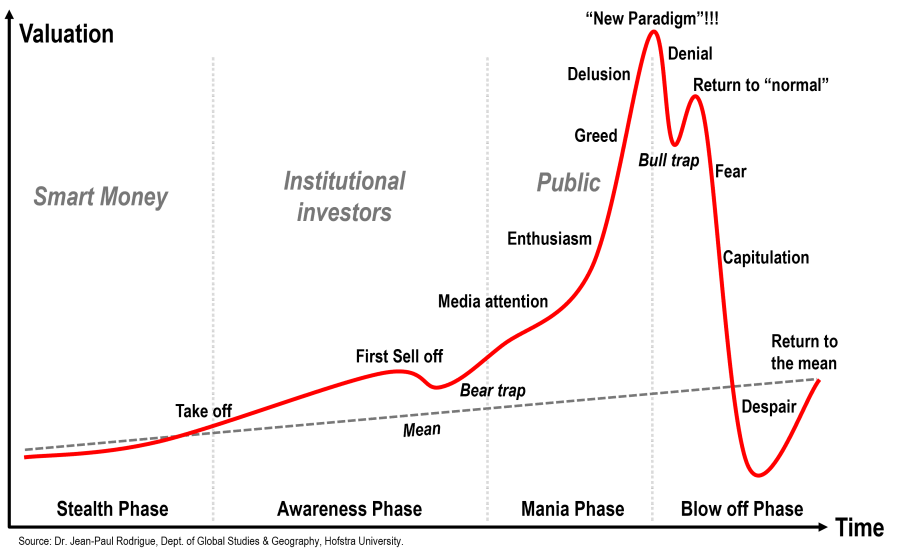

In recent years, financial markets have been subject to significant volatility and uncertainty. Two major phenomena that have profoundly influenced these markets are speculative bubbles and economic bubbles. Speculative bubbles occur when asset prices rise rapidly, exceeding their intrinsic value due to market sentiment and speculative trading rather than underlying economic fundamentals. This detachment from fundamental valuation often results in sharp corrections when reality sets in and prices adjust to reflect true value.

In parallel with traditional trading, the rise of algorithmic trading, or 'algo trading,' has marked a transformative phase in modern financial markets. This method involves using complex algorithms to execute trades at high speed and volume. While algorithmic trading has the potential to enhance market efficiency by providing liquidity and reducing transaction costs, it also bears the risk of exacerbating market bubbles. The rapid execution and high-frequency nature of algo trading can amplify price movements and potentially contribute to creating or inflating bubbles.

This article aims to explore the intricate relationship between speculative bubbles, economic bubbles, and algorithmic trading within financial markets. We will analyze the causes of these bubbles, their stages of development, and their impacts on both the economy and individual investors. Understanding these concepts is essential for investors who wish to navigate the various risks and opportunities that exist in today's financial markets. By recognizing the characteristics and implications of speculative and economic bubbles, market participants can make more informed decisions, thereby better positioning themselves to manage risks and capitalize on potential gains.

## Table of Contents

## Understanding Speculative and Economic Bubbles

A speculative bubble arises when asset prices experience rapid appreciation, driven largely by market speculation rather than the intrinsic value of the assets. These bubbles are often confined to specific industries or asset classes, where optimistic sentiment and speculative trading prevail over fundamental analysis. Typically, speculative bubbles are characterized by an excessive enthusiasm for a particular asset, be it stocks, real estate, or commodities, as investors chase perceived high returns.

Economic bubbles, in contrast, involve broader market phenomena, affecting entire economies or economic sectors with unsustainable valuation growth. These bubbles are not limited to a single asset class but encompass a wider economic scope, often precipitated by an alignment of favorable economic conditions that create an environment for excessive speculation. An economic bubble may be fueled by factors such as low interest rates, expansive credit policies, or new technologies that capture the public's imagination.

Both speculative and economic bubbles share common traits, the most prominent being irrational exuberance—a term popularized by economist Robert Shiller. This exuberance manifests when investors collectively abandon caution, leading to asset prices reaching unsustainable levels far detached from their fundamental value. The progression of a bubble often follows a predictable pattern, characterized by stages of increasing asset prices, frenzied market activity, and eventual realization of overvaluation.

The inevitable correction or crash that follows serves as a reality check, driving asset prices back towards their fundamental values. This correction is typically accompanied by a widespread sell-off as investors attempt to [exit](/wiki/exit-strategy) their positions, often intensifying the downward shift in prices. One notable example of this phenomenon is the Dot-Com Bubble of the late 1990s, where investors excessively valued internet-based companies, leading to a sharp market downturn when their true potential did not match the inflated valuations.

In summary, the understanding of speculative and economic bubbles is crucial for investors and policymakers alike. Recognizing the common features and drivers of these bubbles can aid in anticipating their formation and mitigating the economic damage upon their collapse.

## The Five Stages of a Bubble

Economist Hyman P. Minsky identified five stages characterizing the formation and collapse of financial bubbles: displacement, boom, euphoria, profit-taking, and panic.

1. **Displacement**: This initial stage involves a shift in economic paradigms, either through innovation or a significant change in market conditions, like low interest rates or new technologies. Such displacements attract investor attention, setting the stage for increased asset demand.

2. **Boom**: During this phase, asset prices climb steadily. The upward trend draws more investors, driven by the fear of missing out on potential gains. This influx of capital further inflates asset prices, reinforcing the optimistic sentiment in the market.

3. **Euphoria**: At this stage, enthusiastic buying reaches its peak as the market experiences irrational exuberance. Investors generally disregard risk, and asset prices soar to unsustainable heights, often justified by speculative theories such as the 'greater fool' theory, where investors buy overpriced assets expecting to sell them at even higher prices.

4. **Profit-taking**: Savvy investors, recognizing the overvaluation, begin to sell off their assets, securing profits. This selling begins to destabilize the inflated asset prices, introducing increased volatility and uncertainty into the market.

5. **Panic**: As prices start to decline, fear pervades the market. A rush to exit ensues, with a majority of investors attempting to offload their holdings simultaneously. This mass liquidation causes a sharp drop in asset prices, culminating in the bubble's burst.

Understanding these stages helps investors identify the signals of an emerging bubble, aiding in risk management and strategic decision-making.

## Role of Algo Trading in Bubbles

Algorithmic trading, commonly known as algo trading, employs complex algorithms to automate and execute trades at high speed and [volume](/wiki/volume-trading-strategy) in global financial markets. This approach utilizes pre-programmed instructions that make decisions based on variables such as price, timing, and volume, enabling rapid execution that is beyond human capabilities.

While [algorithmic trading](/wiki/algorithmic-trading) can enhance market efficiency and [liquidity](/wiki/liquidity-risk-premium) by narrowing bid-ask spreads and executing large volumes of trades swiftly, it also holds the potential to exacerbate speculative bubbles. One of the primary concerns is the amplification of price movements and increased market [volatility](/wiki/volatility-trading-strategies) that can result from these high-frequency strategies. As algorithms operate on pre-set conditions and react to market signals almost instantaneously, they often contribute to rapid price spikes. This is particularly true for high-frequency trading ([HFT](/wiki/high-frequency-trading-strategies)) algorithms, which can execute thousands of trades per second. Their high speed and volume create an environment where temporary price dislocations can occur, leading to cascading effects as automated systems trigger a succession of buy or sell orders.

Moreover, the automated nature of algo trading can lead to a phenomenon known as a feedback loop. In such cases, the execution of large orders can influence prices, which in turn, activates more orders that follow the same [momentum](/wiki/momentum). This can lead to self-reinforcing price trends that distort the asset's true value and contribute to bubble formation. 

Effective regulatory oversight and robust risk management systems are essential to mitigate the detrimental effects of algorithmic trading on market stability. Regulatory frameworks must address the systemic risks associated with high-speed automated trading by implementing measures such as circuit breakers, which halt trading temporarily to prevent flash crashes. Additionally, trading algorithms should be subjected to rigorous testing and monitoring to ensure they do not engage in manipulative market practices or exacerbate volatility unnecessarily.

Risk management systems play a crucial role in maintaining market integrity by setting limits on order sizes, leveraging stop orders to limit potential losses, and employing kill switches to shut down trading programs in case of malfunction or market distress. By integrating these controls, financial markets can harness the benefits of algorithmic trading while minimizing the risks of contributing to speculative bubbles.

## Historical Examples of Speculative Bubbles

Throughout history, speculative bubbles have recurrently influenced financial markets, often with substantial economic consequences. Among the most notable examples are the Tulip Mania of the 1630s, the South Sea Bubble of the early 18th century, and the Dot-Com Bubble of the late 1990s to early 2000s.

**Tulip Mania (1630s):** Often cited as the first recorded speculative bubble, Tulip Mania swept through the Dutch Republic during the 1630s. Rapidly escalating tulip bulb prices were driven by speculative fervor, with particularly rare varieties reaching exorbitant prices. At the peak, some tulip bulbs purportedly traded for more than ten times the annual income of a skilled artisan. However, by 1637, the market crashed dramatically as buyers could no longer afford the inflated prices, leading to a widespread economic fallout. Historical accounts, such as those from Charles Mackay's *Memoirs of Extraordinary Popular Delusions and the Madness of Crowds*, highlight how speculative bubbles can detach prices from intrinsic values.

**South Sea Bubble (1720):** The South Sea Bubble is another archetype of financial speculation gone awry. The South Sea Company, established in 1711, was granted a monopoly on trade with Spanish South America in exchange for assuming the national debt of Great Britain. Fueled by speculative enthusiasm, the company's stock price surged from £100 to over £1,000 in early 1720. However, the bubble burst in September 1720 as reality dawned that the anticipated profits were unattainable. The crash not only ruined thousands of investors but also had severe repercussions for the British economy. The South Sea Bubble underlines the impact of political and speculative factors on market dynamics.

**Dot-Com Bubble (Late 1990s - Early 2000s):** A more modern example is the Dot-Com Bubble, which emerged with the advent of the internet and the proliferation of technology companies in the late 1990s. Investors poured capital into internet-based startups, many of which had no viable business model, leading to excessively high valuations. The NASDAQ Composite index peaked in March 2000, driven by speculation rather than fundamentals. The subsequent crash wiped out trillions in market value and highlighted the perils of speculative excess. The Dot-Com Bubble underscores the significance of investor sentiment and technology-driven speculation.

These historical instances illustrate the cyclical nature of speculative bubbles and the pivotal role of market psychology. Understanding these past events provides insight into the patterns and underlying drivers of speculative bubbles, offering valuable lessons for contemporary investors and policymakers in managing and mitigating similar occurrences in the future.

## Implications for Investors and the Economy

Speculative bubbles can profoundly affect both individual investors and the economy at large. These phenomena result from significant overvaluation of assets, leading to unsustainable price levels. When bubbles burst, they often trigger severe losses and widespread economic instability.

For individual investors, the primary risk of a speculative bubble is financial loss. Bubble markets are typically characterized by rapid increases in asset prices driven by exuberance rather than fundamentals. When the bubble inevitably bursts, asset prices plummet, which can catch many investors off guard. Investors who fail to exit their positions before the crash may incur substantial losses, significantly eroding their portfolios. This underscores the importance of maintaining a disciplined investment strategy and being cautious of herd mentality. A strategy focused on diversified investments and careful risk management can help mitigate these risks.

At the macroeconomic level, the consequences of a bubble burst can be far-reaching, often leading to economic recessions or, in severe cases, depressions. The 2008 financial crisis, triggered by the collapse of the housing bubble, serves as a stark example. The repercussions included massive financial institution failures, widespread unemployment, and global economic downturn. Such scenarios highlight the vital role of regulatory oversight and risk management in maintaining economic stability. Regulatory measures such as stricter lending standards or increased transparency in financial markets can help reduce the likelihood of bubbles forming.

Both investors and policymakers must learn from past bubbles to recognize early warning signs and take appropriate preventive measures. This could involve closely monitoring asset price trends, leveraging sentiment indicators, and employing quantitative models to detect potential overvaluation. By adopting a proactive approach, the negative impacts of future bubbles can be significantly minimized, benefiting both individual investors and the economy as a whole.

## Conclusion

Understanding the dynamics of speculative bubbles, economic bubbles, and the role of algorithmic trading is crucial for effectively navigating today's financial markets. Speculative bubbles, often fueled by irrational investor behavior and amplified by algorithmic trading, can lead to significant asset mispricing. As history demonstrates, these bubbles do not remain contained; they can have extensive impacts, reaching well beyond individual investors to affect entire economies. The bursting of a bubble can lead to severe economic downturns, as seen with the housing bubble of 2008, which resulted in a global financial crisis.

For investors, vigilance and caution are essential. Identifying the signs of a burgeoning bubble—such as rapid, unsustainable price increases and euphoric market sentiment—can help investors avoid aligning with the herd mentality that often precedes a market crash. A balanced investment strategy that includes thorough risk assessments is critical. This involves diversifying portfolios, setting stop-loss orders, and incorporating [fundamental analysis](/wiki/fundamental-analysis) into investment decisions, which can help mitigate the risks posed by speculative and economic bubbles.

Algorithmic trading, while offering advantages in terms of market liquidity and efficiency, also poses the risk of exacerbating bubble conditions due to its capability for rapid, high-volume trades that can distort market trends. Therefore, regulatory oversight and robust risk management practices are imperative to reduce these risks and enhance market stability.

By recognizing potential indications of an impending bubble and maintaining a disciplined investment approach, investors can position themselves to minimize possible losses and capitalize on emerging opportunities. Through informed decision-making and strategic planning, market participants are better equipped to manage the complexities of modern financial systems and safeguard their financial future.

## References & Further Reading

[1]: Shiller, R. J. (2000). ["Irrational Exuberance."](https://press.princeton.edu/books/paperback/9780691173122/irrational-exuberance) Princeton University Press.

[2]: Mackay, C. (1841). ["Memoirs of Extraordinary Popular Delusions and the Madness of Crowds."](https://en.wikipedia.org/wiki/Extraordinary_Popular_Delusions_and_the_Madness_of_Crowds) Richard Bentley.

[3]: Minsky, H. P. (1986). ["Stabilizing an Unstable Economy."](https://archive.org/details/stabilizingunsta0000mins) McGraw-Hill.

[4]: DeLong, J. B., & Summers, L. H. (1986). ["The Keynesian Tradition."](https://economics.ucsd.edu/~vramey/research/DeLong%20%20Summers-Fiscal%20Policy%20in%20a%20Depressed%20Economy.pdf) Journal of Economic Perspectives, 87-95.

[5]: Lopez de Prado, M. (2018). ["Advances in Financial Machine Learning."](https://www.amazon.com/Advances-Financial-Machine-Learning-Marcos/dp/1119482089) Wiley.

[6]: Jarrow, R. A. (2012). ["The Role of the Speculative Bubble."](https://onlinelibrary.wiley.com/doi/full/10.1111/j.1467-9965.2011.00497.x) Journal of Financial and Quantitative Analysis, 47(1), 77-108.

[7]: Johnson, N. F., Jefferies, P., & Hui, P. M. (2003). ["Financial Market Complexity."](https://academic.oup.com/book/9066) Oxford University Press.