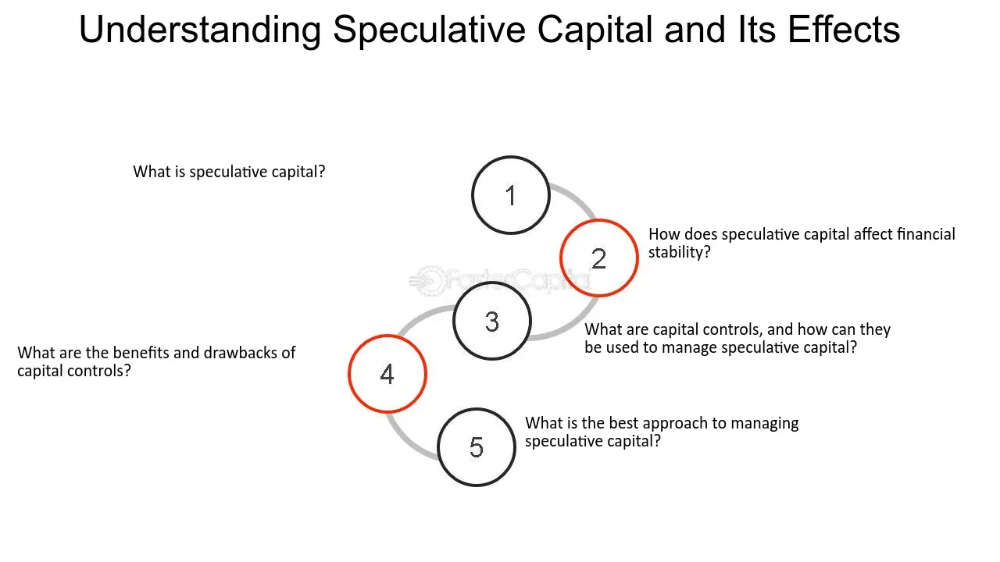

## Table of Contents

## What is speculative capital?

Speculative capital is money that people invest in things they hope will increase in value quickly. This kind of investment is risky because the value can go up or down a lot. People often use speculative capital to buy stocks, cryptocurrencies, or real estate, hoping to sell them later for a profit. The goal is to make money fast, but there's no guarantee it will work out.

Sometimes, speculative capital can cause big changes in the market. When a lot of people start investing in the same thing, it can drive up the price. But if everyone decides to sell at the same time, the price can drop suddenly. This can lead to bubbles, where prices get too high and then crash. So, while speculative capital can offer big rewards, it also comes with big risks.

## How does speculative capital differ from other types of capital?

Speculative capital is different from other types of capital because it's used to make quick profits from things that might go up in value. People using speculative capital often buy things like stocks, cryptocurrencies, or real estate hoping to sell them later for more money. This is different from other types of capital, like investment capital, which people use to start or grow a business over a longer time. Investment capital focuses on steady growth and building something lasting, not just making a quick profit.

Another type of capital is working capital, which businesses use to cover their day-to-day expenses, like paying for supplies or salaries. Working capital helps keep a business running smoothly and is not meant for making quick profits like speculative capital. Speculative capital is all about taking big risks for the chance of big rewards, while other types of capital are more about stability and long-term growth. So, while speculative capital can lead to fast gains, it's much riskier than other forms of capital.

## What are the main mechanisms through which speculative capital operates?

Speculative capital works mainly through buying and selling things that people think will go up in value fast. This can be things like stocks, cryptocurrencies, or real estate. People buy these things hoping to sell them later for more money. They often use information and guesses about what might happen in the market to decide what to buy. If a lot of people start buying the same thing, the price can go up quickly. This is called a "bubble," and it can make the thing seem more valuable than it really is.

But there's a big risk with speculative capital. If everyone decides to sell at the same time, the price can drop suddenly. This can cause a lot of people to lose money. Speculative capital also relies a lot on market trends and news. For example, if there's good news about a company, more people might want to buy its stock, pushing the price up. But if there's bad news, people might want to sell, and the price can go down. So, while speculative capital can lead to big profits, it's very risky and depends a lot on what other people in the market are doing.

## Can you explain the role of speculation in financial markets?

Speculation plays a big part in financial markets. It's when people buy things like stocks or cryptocurrencies hoping they will go up in value fast so they can sell them for a profit. This can make prices go up and down a lot. When a lot of people start buying the same thing, it can create a bubble where the price gets too high. This can lead to big changes in the market. Speculation can make the market more exciting but also more risky.

At the same time, speculation can help make markets work better. It brings more people into the market, which can make it easier for companies to get money to grow. Speculators can also help by taking risks that others might not want to take. This can lead to new ideas and opportunities. But, if too many people are speculating, it can cause problems. If everyone starts selling at the same time, prices can crash, and this can hurt the whole market. So, speculation is important but needs to be balanced to keep the market stable.

## What are some common instruments used in speculative capital?

Speculative capital often uses things like stocks, cryptocurrencies, and commodities. Stocks are pieces of a company that people can buy and sell. If a lot of people think a company will do well, they might buy its stock, making the price go up. Cryptocurrencies like Bitcoin are digital money that people hope will become more valuable over time. Commodities are things like gold or oil that people buy and sell, hoping to make money if the price changes.

Another common instrument is real estate. People buy houses or land hoping to sell them later for more money. Options and futures are also used a lot. Options give people the right to buy or sell something at a certain price in the future. Futures are agreements to buy or sell something at a set price on a certain date. These instruments are all about trying to make money fast by guessing what will happen in the market.

## How does leverage affect speculative capital?

Leverage is when people borrow money to invest more than they have. It can make speculative capital even riskier. When someone uses leverage, they can buy more stocks, cryptocurrencies, or other things than they could with just their own money. If the price goes up, they can make a lot more money. But if the price goes down, they can lose a lot more too. This is because they have to pay back the money they borrowed, plus interest, no matter what happens to the price.

Leverage can make the ups and downs in the market even bigger. When a lot of people use leverage to buy the same thing, it can push the price up quickly. But if the price starts to drop, everyone might want to sell at the same time to cut their losses. This can make the price drop even faster. So, while leverage can help people make more money with speculative capital, it also makes the risks much bigger.

## What are the risks associated with speculative capital?

Speculative capital comes with a lot of risks. One big risk is that you can lose all your money. When you buy things like stocks or cryptocurrencies hoping they will go up fast, there's no guarantee they will. If the price goes down instead, you might not be able to sell them for as much as you paid, or maybe not at all. This can be even worse if you borrowed money to invest, because you still have to pay back what you borrowed, even if you lose everything.

Another risk is that the whole market can be affected by speculation. When a lot of people start buying the same thing, it can create a bubble where the price gets too high. If everyone decides to sell at the same time, the price can crash, and this can hurt not just the people who were speculating, but also others in the market. So, while speculative capital can lead to big profits, it can also cause big problems for everyone involved.

## How do regulatory frameworks impact speculative capital?

Regulatory frameworks are rules made by governments or organizations to keep financial markets fair and safe. These rules can impact speculative capital by making it harder or easier for people to take big risks. For example, some rules might limit how much money people can borrow to invest, which is called leverage. If there are strict rules about leverage, it can make speculative capital less risky because people can't borrow as much money to invest. On the other hand, if the rules are relaxed, more people might use leverage, which can make the market more exciting but also more dangerous.

Regulations can also affect how much information people have about what they are investing in. If there are strong rules about transparency, people might feel more confident about making speculative investments because they have more information. But if the rules are weak, it can be harder to know if an investment is a good idea, which can make speculative capital riskier. Overall, regulatory frameworks try to balance the excitement and potential profits of speculative capital with the need to keep the market stable and protect people from losing too much money.

## What historical events highlight the impact of speculative capital on economies?

One big example of how speculative capital can affect an economy is the South Sea Bubble in the early 1700s. People in England got really excited about a company called the South Sea Company. They thought it would make them rich, so they bought a lot of its stock. The price of the stock went up and up because so many people wanted to buy it. But then, people realized the company wasn't as good as they thought. Everyone started selling their stock at the same time, and the price crashed. A lot of people lost a lot of money, and it hurt the whole economy.

Another famous example is the 1929 stock market crash in the United States, which led to the Great Depression. In the years before the crash, a lot of people were buying stocks hoping to make quick money. They used a lot of borrowed money to buy more stocks, which is called leverage. When the stock market started to go down, everyone tried to sell their stocks to pay back what they borrowed. But there were too many sellers and not enough buyers, so the prices kept falling. This caused a lot of banks to fail and led to a big economic crisis that lasted for years. These examples show how speculative capital can lead to big problems if too many people are taking big risks at the same time.

## How can speculative capital influence asset price bubbles?

Speculative capital can create asset price bubbles by making a lot of people want to buy the same thing. When people think something like a stock or a piece of real estate will go up in value fast, they rush to buy it. This makes the price go up because everyone is trying to get in on the action. The more people who join in, the higher the price goes, even if the thing isn't really worth that much. This creates a bubble where the price is much higher than it should be.

But bubbles can pop. If something happens to make people think the price won't keep going up, everyone might want to sell at the same time. When everyone tries to sell, there are too many sellers and not enough buyers, so the price drops fast. This can cause a lot of people to lose money and can hurt the whole economy. So, while speculative capital can make prices go up quickly, it can also lead to big problems when the bubble bursts.

## What strategies do investors use to manage risks in speculative capital?

Investors use different strategies to manage risks when they use speculative capital. One common strategy is diversification. This means they don't put all their money into one thing. Instead, they spread it out over different stocks, cryptocurrencies, or other investments. If one thing goes down in price, the others might stay the same or go up, so they don't lose all their money. Another strategy is setting stop-loss orders. This means they tell their broker to sell something if the price drops to a certain level. This can help them limit how much money they lose if the price goes down a lot.

Another way investors manage risk is by doing a lot of research. They try to learn as much as they can about what they're investing in. This can help them make better guesses about what will happen in the market. They also pay attention to how much they're using leverage. Leverage is when they borrow money to invest more than they have. Using less leverage can make their investments less risky because they won't lose as much if the price goes down. By using these strategies, investors try to balance the excitement and potential profits of speculative capital with the need to protect their money.

## How does speculative capital contribute to market efficiency or inefficiency?

Speculative capital can make markets more efficient by bringing in more people and money. When a lot of people are buying and selling, it can help set prices that are more accurate. Speculators often look for new opportunities and take risks that others might not. This can lead to new ideas and help companies get the money they need to grow. So, in some ways, speculative capital can make the market work better by making it more active and helping to find the right price for things.

But speculative capital can also make markets less efficient. When a lot of people start buying the same thing hoping to make quick money, it can create bubbles where prices get too high. These bubbles can lead to big changes in the market that don't really make sense. If everyone starts selling at the same time, prices can crash, and this can hurt the whole market. So, while speculative capital can help in some ways, it can also cause problems by making prices go up and down a lot for no good reason.

## What are the investment strategies for speculation?

Speculative investment strategies encompass a range of financial instruments and techniques designed to capitalize on market volatility and price fluctuations. Understanding and employing these strategies require a solid grasp of financial markets and an appetite for risk.

Options trading provides investors with the opportunity to speculate on the direction of asset prices with limited risk exposure. An option is a contract that grants the holder the right, but not the obligation, to buy (call option) or sell (put option) an underlying asset at a predetermined price before a specific expiration date. This flexibility allows traders to leverage their positions, potentially amplifying profits while capping potential losses to the premium paid for the option.

Futures contracts, on the other hand, compel participants to execute a transaction at a set future date. These agreements can pertain to commodities, currencies, or financial indices. By locking in prices, futures traders can hedge against unfavorable price movements, thereby engaging in speculative bets on future market trends.

In addition to these instruments, derivatives such as swaps and warrants offer further avenues for speculation. These financial instruments derive their value from an underlying asset or benchmark, providing sophisticated traders with tools to hedge risks or speculate on various market conditions.

Evaluating market indicators is a crucial aspect of speculative trading. Tools such as moving averages and the Relative Strength Index (RSI) help traders identify potential entry and exit points. A moving average smooths price data to create a constantly updated average price, revealing underlying trends. The formula for a simple moving average (SMA) is:

$$
\text{SMA} = \frac{P_1 + P_2 + \cdots + P_n}{n}
$$

where $P_1, P_2, \ldots, P_n$ represent the prices over a time period $n$.

The RSI is a [momentum](/wiki/momentum) oscillator that measures the speed and change of price movements, providing insight into overbought or oversold conditions. It is calculated using the formula:

$$
\text{RSI} = 100 - \left( \frac{100}{1 + \frac{\text{average gain}}{\text{average loss}}} \right)
$$

Effective speculative strategies are also characterized by strategic diversification and meticulous position sizing. Diversification involves spreading investments across various asset classes to reduce exposure to any single market event. Meanwhile, position sizing entails determining the appropriate amount of capital allocated to a specific trade based on risk tolerance and market conditions. By balancing these elements, traders can mitigate potential losses while still pursuing significant returns.

Ultimately, successful speculative trading requires a combination of analytical skills, strategic planning, and disciplined risk management. Investors should continuously assess market dynamics and adapt their strategies to align with evolving financial environments.

## References & Further Reading

[1]: Lopez de Prado, M. (2018). ["Advances in Financial Machine Learning."](https://www.amazon.com/Advances-Financial-Machine-Learning-Marcos/dp/1119482089) John Wiley & Sons.

[2]: Chan, E. P. (2008). ["Quantitative Trading: How to Build Your Own Algorithmic Trading Business."](https://github.com/ftvision/quant_trading_echan_book) John Wiley & Sons.

[3]: Jansen, S. (2018). ["Machine Learning for Algorithmic Trading."](https://github.com/stefan-jansen/machine-learning-for-trading) Packt Publishing.

[4]: Aronson, D. R. (2007). ["Evidence-Based Technical Analysis: Applying the Scientific Method and Statistical Inference to Trading Signals."](https://onlinelibrary.wiley.com/doi/book/10.1002/9781118268315) John Wiley & Sons.

[5]: Kissell, R. (2014). ["The Science of Algorithmic Trading and Portfolio Management."](https://www.sciencedirect.com/book/9780124016897/the-science-of-algorithmic-trading-and-portfolio-management) Academic Press.

[6]: Hull, J. C. (2017). ["Options, Futures, and Other Derivatives."](https://www.semanticscholar.org/paper/Options%2C-Futures%2C-and-Other-Derivatives-Hull/89bdee500c8623864fc9eb7a471546aa713acc44) Pearson.

[7]: Tharp, V. K. (1998). ["Trade Your Way to Financial Freedom."](https://www.amazon.com/Trade-Your-Way-Financial-Freedom/dp/007147871X) McGraw-Hill Education.