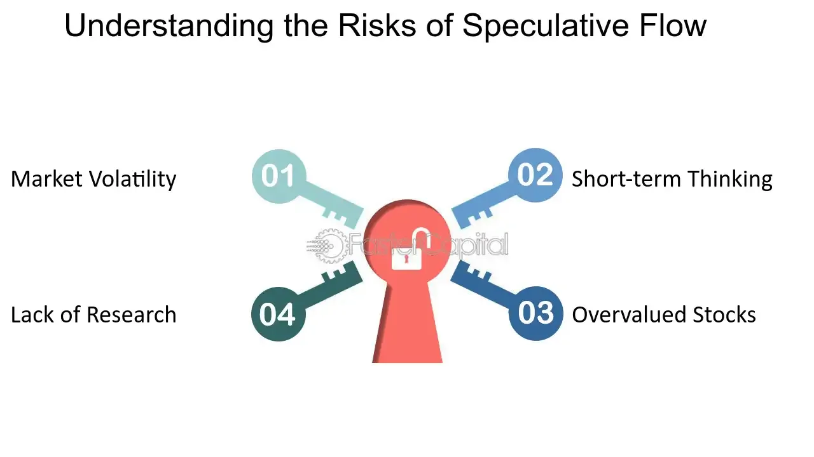

## Table of Contents

## What is Speculative Flow?

Speculative Flow is a way to think about how money moves around in the world. It's about guessing where money will go next, based on what people are doing and what they might do in the future. This can help people make better choices about where to put their money, like in stocks, bonds, or other investments.

People use Speculative Flow to try to predict big changes in the economy. For example, if a lot of people start buying houses, it might mean that the housing market will grow. By watching these flows, investors can try to get ahead of the trends and make money. But it's not always easy, because the future is hard to predict, and sometimes guesses can be wrong.

## How does Speculative Flow differ from traditional workflow management?

Speculative Flow and traditional workflow management are different in what they focus on and how they work. Traditional workflow management is all about making sure tasks get done in the right order and on time. It's like a map that shows how work should move from one step to the next, making sure everything is organized and efficient. This kind of management is used a lot in businesses to keep projects running smoothly.

On the other hand, Speculative Flow is more about guessing where things are going next, especially with money. Instead of just managing what's happening now, it tries to predict future trends and movements. It's like trying to see into the future to decide where to put money or resources. While traditional workflow management is about controlling the present, Speculative Flow is about anticipating the future and making decisions based on those guesses.

## What are the key components of a Speculative Flow system?

The first key part of a Speculative Flow system is data collection. This means gathering a lot of information about what people are doing with their money right now. This can include things like how much they're spending, what they're buying, and where they're putting their money. The more data you have, the better you can guess what might happen next. This data can come from banks, markets, and even social media, where people talk about their plans and hopes for the future.

The second key part is analysis. Once you have all this data, you need to look at it closely to find patterns and trends. This can be done with computers and special software that can handle big amounts of information. By studying these patterns, you can start to predict where money might move next. For example, if you see a lot of people starting to buy electric cars, you might guess that the electric car market will grow.

The third key part is decision-making. With the predictions from your analysis, you can make choices about where to put your money or resources. This could mean buying stocks in a company that's likely to do well, or investing in a new technology that's becoming popular. The goal is to make smart choices based on your guesses about the future, but it's important to remember that these guesses can sometimes be wrong, so you need to be ready to change your plans if things don't go as expected.

## Can you explain the basic principles behind Speculative Flow?

Speculative Flow is all about trying to guess where money will go next. It's like looking at a map of how money is moving right now and trying to predict where it will move in the future. To do this, you need to gather a lot of information about what people are doing with their money. This can include things like how much they're spending, what they're buying, and where they're investing. By looking at this information, you can start to see patterns and trends that might help you guess what will happen next.

Once you have all this information, the next step is to analyze it. This means using computers and special software to look at the data and find patterns. For example, if you see a lot of people starting to buy electric cars, you might guess that the electric car market will grow. With these predictions, you can then make decisions about where to put your money. This could mean buying stocks in a company that's likely to do well, or investing in a new technology that's becoming popular. But remember, these are just guesses, and sometimes they can be wrong, so you need to be ready to change your plans if things don't go as expected.

## What industries benefit most from implementing Speculative Flow?

The finance industry benefits a lot from using Speculative Flow. Banks and investment firms use it to guess where money will move next. They look at data like how much people are spending and where they're investing. This helps them decide which stocks or bonds to buy, or where to put their money to make the most profit. It's like trying to see into the future to make smart choices about money.

Another industry that benefits is technology. Tech companies use Speculative Flow to predict which new gadgets or software will be popular. They gather information about what people are buying and talking about online. This helps them decide where to focus their efforts and money. For example, if they see a lot of interest in electric cars, they might decide to invest in making parts for those cars. By guessing where trends are going, they can stay ahead of the competition.

## How can Speculative Flow improve efficiency in a business?

Speculative Flow can help a business become more efficient by guessing where money and resources will be needed in the future. By collecting data on what people are buying and where they are investing, a business can see patterns and trends. This helps them decide where to put their money to make the most profit. For example, if a business sees that more people are buying electric cars, they might decide to invest in making parts for those cars. This way, they can be ready for what customers will want next, instead of just reacting to what's happening now.

Using Speculative Flow can also help a business save time and money. Instead of waiting to see what happens, they can make plans based on their guesses about the future. This means they can start working on new projects or products before everyone else does. By being ahead of the trends, a business can avoid wasting resources on things that won't be popular. This makes their operations smoother and more efficient, because they're always ready for what's coming next.

## What are the common challenges faced when adopting Speculative Flow?

One of the biggest challenges in adopting Speculative Flow is getting enough good data. You need a lot of information about what people are doing with their money right now to make guesses about the future. But collecting this data can be hard. It might be spread out in different places, like banks, markets, and social media. Plus, the data has to be accurate and up-to-date, or your guesses won't be very good. This means you need to spend time and money to gather and check all this information.

Another challenge is making sense of all the data. Once you have it, you need to use computers and special software to look for patterns and trends. This can be tricky because there's so much information to go through. And even if you find some patterns, they might not always lead to good guesses about the future. The economy and people's behavior can change in ways that are hard to predict. So, you need to be ready to change your plans if your guesses turn out to be wrong.

Lastly, there's the risk that comes with making decisions based on guesses. Even with a lot of data and good analysis, the future is still hard to predict. If your guesses are wrong, you could lose money or miss out on good opportunities. This means you need to be careful and ready to adjust your plans. It's not easy to balance the need to make decisions quickly with the risk that those decisions might not work out.

## What tools or software support Speculative Flow methodologies?

There are several tools and software that help with Speculative Flow. One popular tool is data analytics software like Tableau or Power BI. These programs help you gather and look at a lot of information from different places. They make it easier to see patterns and trends in what people are doing with their money. Another useful tool is predictive analytics software, like SAS or IBM SPSS. These programs use special math to make guesses about what might happen next based on the data you have.

Another type of software that supports Speculative Flow is financial modeling tools, like Excel or more advanced platforms like Bloomberg Terminal. These tools help you make detailed plans and guesses about where to put your money. They can run different scenarios to see what might happen if you make certain choices. Also, machine learning platforms like TensorFlow or scikit-learn can be used to make even better guesses by learning from past data and finding new patterns that might not be easy to see otherwise.

All these tools help make Speculative Flow easier and more accurate. But remember, even with the best software, guessing the future is still hard. You need to keep checking your guesses and be ready to change your plans if things don't go the way you thought they would.

## How does Speculative Flow integrate with existing project management systems?

Speculative Flow can work together with existing project management systems by adding a way to guess where things are going next. Project management systems help keep track of tasks and make sure everything is done on time. Speculative Flow adds to this by looking at data about what people are doing with their money and trying to predict future trends. This means project managers can use Speculative Flow to make better plans. For example, if they see that more people are buying electric cars, they might decide to start a new project to make parts for those cars. This way, the project management system can be used to keep the project on track, while Speculative Flow helps decide what projects to start in the first place.

To make Speculative Flow work with project management systems, you need to gather and analyze data about money and trends. This can be done using special software that looks at data from banks, markets, and social media. Once you have this information, you can use it to make guesses about the future and decide which projects to start. The project management system then helps you plan out the steps to make those projects happen. By combining Speculative Flow with project management, businesses can be more ready for what's coming next and make smarter choices about where to put their time and money.

## What are some advanced strategies for optimizing Speculative Flow?

One advanced strategy for optimizing Speculative Flow is to use machine learning to make better guesses about the future. Machine learning can look at a lot of data and find patterns that might be hard for people to see. By using this technology, you can make more accurate predictions about where money will move next. For example, machine learning can help you see if more people are starting to buy electric cars, even if the trend is just beginning. This way, you can make smarter choices about where to put your money before everyone else does.

Another strategy is to keep checking and updating your guesses. The economy and people's behavior can change quickly, so it's important to keep an eye on new data and adjust your plans if needed. This means you should always be ready to change your mind if your guesses turn out to be wrong. By staying flexible and updating your predictions often, you can make sure you're always making the best choices based on the latest information.

## Can you discuss case studies where Speculative Flow significantly impacted business outcomes?

One case study where Speculative Flow made a big difference is in the tech industry. A company called Tesla used Speculative Flow to guess that more people would want electric cars in the future. They looked at data about what people were buying and talking about online. This helped them decide to focus on making electric cars, even when not many people were buying them yet. Because they guessed right, Tesla was ready when the demand for electric cars grew. They became a leader in the electric car market and made a lot of money.

Another example is in the finance industry. A big investment firm called BlackRock used Speculative Flow to predict that more people would start investing in green energy. They gathered data about where people were putting their money and saw a trend towards renewable energy. Based on this, they decided to invest a lot in green energy companies. When the green energy market grew, BlackRock made a lot of profit from their investments. This showed how guessing where money will go next can help a business make smart choices and do well.

## What future trends are expected in the evolution of Speculative Flow?

In the future, Speculative Flow is expected to get even better at guessing where money will go next. This will happen because of new technology like artificial intelligence and machine learning. These tools can look at a lot of data very quickly and find patterns that people might miss. This means businesses will be able to make more accurate predictions about what people will want to buy or invest in. As more and more data becomes available, Speculative Flow will become a bigger part of how businesses make decisions.

Another trend is that Speculative Flow will be used in more industries. Right now, it's mostly used in finance and technology, but in the future, it could help businesses in healthcare, retail, and even farming. For example, a grocery store might use Speculative Flow to guess what kinds of food people will want to buy next. This way, they can make sure they have the right products in stock. As more businesses see how useful Speculative Flow can be, it will become a common tool for making smart choices about where to put time and money.

## What are the Dynamics of Speculative Flow?

Speculative flow describes the capital movement motivated by the anticipation of future price changes rather than the intrinsic value of assets. This type of flow can heavily influence asset prices, often pushing them beyond their true worth, and is driven by investor sentiment and market expectations. When capital moves rapidly towards specific assets based on speculative reasoning, it can lead to the formation of price bubbles—situations where asset prices surpass their fundamental values due to high demand fueled by optimism rather than economic indicators.

The process of speculative flow can be described using simple economic models. Suppose $P_t$ represents the price of an asset at time $t$, and $D_t$ the demand based primarily on speculative intent. The relationship between speculative demand and pricing can be expressed as:

$$
P_t = f(D_t, I_t)
$$

where $I_t$ represents intrinsic factors, such as financial performance or macroeconomic indicators. In speculative markets, the function $f$ often shows that changes in $D_t$ have a disproportionate impact on $P_t$, leading to excessive volatility.

Understanding speculative flow is crucial for investors, as it provides insights into market sentiment and potential risk areas. By analyzing patterns in speculative capital movements, investors can identify bubbles at risk of bursting and adapt their strategies to mitigate potential losses. For instance, historical speculative bubbles, such as the dot-com bubble of the late 1990s, illustrate how speculation-heavy sectors can suffer swift price corrections, impacting broader market stability.

Identifying speculative flow involves keeping track of both qualitative and quantitative data. Market indicators such as trading volumes, price [momentum](/wiki/momentum), and investor sentiment indices are essential tools in gauging speculative intensity. Anomalies in these factors can signal speculative flow, providing early warnings of potential market corrections.

In practical terms, investors might use historical [volatility](/wiki/volatility-trading-strategies) or variance in pricing to quantify speculative risk. Algorithms can aid in this analysis, implementing statistical techniques to discern abnormal price increases driven by speculation, compared to standard market movements based on underlying economic factors. By recognizing these patterns, speculative flow analysis becomes a crucial tool for anticipating and reacting to potential disruptions in asset pricing, allowing investors to better navigate volatile markets.

## What are the strategies for investors in a speculative environment?

Investors operating within speculative environments face inherent risks due to the volatile nature of financial markets influenced by speculation. Effective strategies are essential for mitigating these risks and maintaining portfolio stability. Two vital approaches include diversification and hedging.

**Diversification** is a fundamental risk management strategy. By spreading investments across a broad range of asset classes, sectors, or geographic regions, investors can reduce the impact of adverse price movements in any single investment. This strategy operates on the principle that not all markets or asset types respond similarly to economic events or market speculation. For example, when equity markets experience volatility due to speculative activities, fixed-income securities or commodities might remain unaffected or could even perform better, balancing the portfolio.

**Hedging** involves taking positions in financial instruments to offset potential losses in another investment. Common hedging techniques include using derivatives such as options and futures. For instance, an investor holding a substantial stock position might purchase put options to protect against potential downside risk caused by speculative selling pressure. This can be mathematically represented as:

$$
\text{Net Position} = \text{Original Position} - \text{Hedging Position}
$$

where the original position might be the value of stocks held, and the hedging position is the value of the options contract.

Understanding **technical and fundamental indicators** is crucial for making informed investment decisions during speculation-driven times. Technical analysis involves examining price charts and statistical indicators to predict future price movements. Traders often look for patterns or signals such as moving averages, relative strength index (RSI), or Bollinger Bands to identify potential buying or selling opportunities.

Alternatively, **[fundamental analysis](/wiki/fundamental-analysis)** focuses on evaluating a company's intrinsic value based on financial statements, management efficacy, economic conditions, and industry position. By analyzing indicators such as price-to-earnings ratio (P/E), return on equity (ROE), and earnings per share (EPS), investors can assess whether a stock is undervalued or overvalued, allowing them to make strategic decisions based on its long-term potential rather than temporary speculative influences.

Finally, **risk management** practices, including establishing stop-loss orders and maintaining liquidity reserves, are essential. Stop-loss orders automatically sell a security when its price falls to a pre-determined level, thus maintaining control over potential losses. Liquidity reserves ensure that investors have enough cash or cash equivalents to meet immediate obligations or take advantage of sudden market opportunities, thereby avoiding forced selling in a down market.

By adopting these strategies, investors can navigate the complexities and uncertainties of speculative environments, potentially enhancing both their stability and profitability in market conditions characterized by high volatility and rapid price shifts.

## References & Further Reading

[1]: LeBaron, B. (2001). ["Empirical regularities from interacting long-and short-memory investors in an agent-based stock market."](https://ieeexplore.ieee.org/document/956709) IEEE Transactions on Evolutionary Computation.

[2]: Aldridge, I. (2013). ["High-Frequency Trading: A Practical Guide to Algorithmic Strategies and Trading Systems."](https://www.amazon.com/High-Frequency-Trading-Practical-Algorithmic-Strategies/dp/1118343506) Wiley.

[3]: Shleifer, A., & Summers, L. H. (1990). ["The Noise Trader Approach to Finance."](https://www.aeaweb.org/articles?id=10.1257/jep.4.2.19) Journal of Economic Perspectives.

[4]: Farmer, J. D., & Skouras, S. (2013). ["An ecological perspective on the future of computer trading."](https://www.tandfonline.com/doi/full/10.1080/14697688.2012.757636) Quantitative Finance.

[5]: Hendershott, T., Jones, C. M., & Menkveld, A. J. (2011). ["Does Algorithmic Trading Improve Liquidity?"](https://onlinelibrary.wiley.com/doi/full/10.1111/j.1540-6261.2010.01624.x) The Review of Financial Studies.