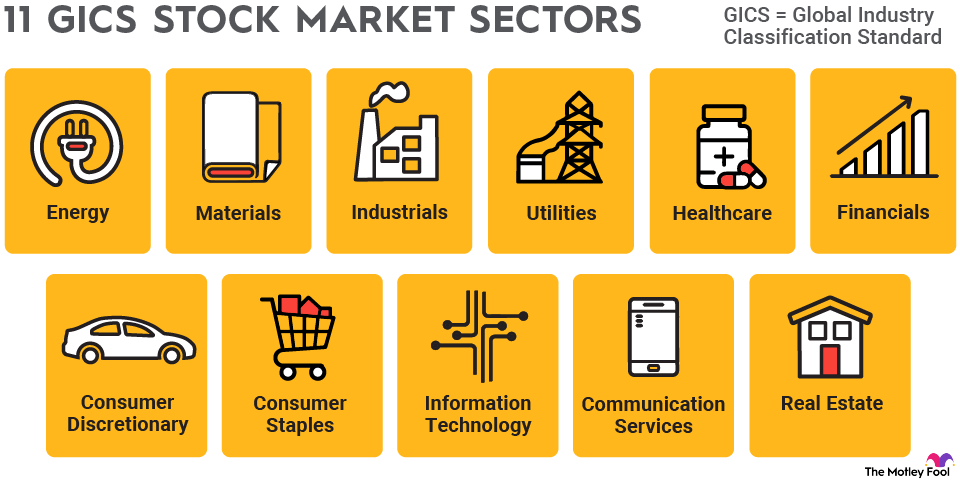

## Table of Contents

## What is a speculative stock?

A speculative stock is a type of stock that people buy because they think its price might go up a lot in the future. These stocks are usually from smaller or newer companies that might not be making money yet. People who buy these stocks are taking a big risk because there's a chance the company might not do well, and the stock price could go down instead of up.

Investors who are interested in speculative stocks are usually looking for big gains in a short amount of time. They might hear about a new technology or a new product that sounds exciting, and they want to invest in it before it becomes popular. But because these stocks are risky, it's important for investors to do a lot of research and be ready to lose their money if things don't go as planned.

## How do speculative stocks differ from other types of stocks?

Speculative stocks are different from other types of stocks because they are riskier. They come from smaller or newer companies that might not be making money yet. People buy these stocks hoping that the company will grow a lot and the stock price will go up quickly. This is different from stocks of big, stable companies that already make money and grow slowly but steadily. Those stocks are seen as safer because the companies are already successful and less likely to fail.

Another way speculative stocks differ is in their potential for big gains or big losses. With speculative stocks, you might make a lot of money if the company does well, but you could also lose a lot if it doesn't. This is different from stocks of established companies, where the gains might be smaller but more predictable. Investors in speculative stocks are often looking for quick profits and are willing to take the risk, while investors in other stocks might be more interested in long-term, steady growth.

## What are the risks associated with investing in speculative stocks?

Investing in speculative stocks is risky because these stocks come from smaller or newer companies that might not be making money yet. If the company fails to grow or runs into problems, the stock price can drop a lot. This means you could lose a big part of the money you invested. Unlike stocks from big, stable companies, speculative stocks don't have a long history of success to fall back on, so they are more likely to fail.

Another risk is that speculative stocks can be very unpredictable. Their prices can go up and down a lot in a short time, which makes it hard to know when to buy or sell. Sometimes, the price can be affected by rumors or news that might not even be true. This can make it really hard to make good decisions about when to invest. If you're not ready for these ups and downs, you might end up selling at the wrong time and losing money.

Lastly, it can be hard to get good information about speculative stocks. Since these companies are smaller, they might not share as much information with the public. This makes it harder to do research and understand if the company is a good investment. Without enough information, you might make a decision based on guesses rather than facts, which increases the risk of losing money.

## What are the potential rewards of investing in speculative stocks?

Investing in speculative stocks can lead to big rewards if the company does well. If you buy shares in a small company that grows a lot, the price of the stock can go up very quickly. This means you could make a lot of money in a short time. For example, if you bought shares in a tech startup that becomes very popular, you could see your investment grow by a lot. This kind of quick growth is much harder to find with stocks from big, stable companies that grow slowly over time.

Another reward is the chance to be part of something new and exciting. When you invest in a speculative stock, you're often betting on a new idea or technology that could change the world. If that idea takes off, not only do you make money, but you also get to feel like you were part of something big from the start. This can be really exciting and satisfying for investors who like to take risks and be on the cutting edge of new developments.

## Which sectors are most commonly associated with speculative stocks?

Speculative stocks are often found in the technology sector. This is because tech companies, especially startups, are usually working on new ideas or products that could become very popular. Investors buy these stocks hoping that the company will grow quickly and the stock price will go up a lot. Examples include companies working on new apps, artificial intelligence, or other cutting-edge technology.

Another sector where you find a lot of speculative stocks is in biotechnology. Biotech companies are often working on new drugs or treatments that could be very valuable if they work. But it's risky because it can take a long time to find out if the new drug is successful. Investors in biotech stocks are betting that the company will discover something big, which could lead to huge profits.

Other sectors with speculative stocks include renewable energy and cannabis. Renewable energy companies are trying to find new ways to produce clean energy, which could be very important in the future. Cannabis companies are betting on the growing legalization of marijuana. Both of these sectors can be risky but also offer the chance for big rewards if things go well.

## Can you provide examples of speculative stocks in the technology sector?

In the technology sector, one example of a speculative stock is a company like Palantir Technologies. Palantir works on big data analytics and AI, helping businesses and governments make sense of lots of information. It's a speculative stock because it's a newer company that's trying to grow a lot. Investors buy Palantir stock hoping that more and more people will use its services, making the stock price go up quickly.

Another example is a company called Rivian Automotive. Rivian makes electric trucks and SUVs, which is a new and exciting part of the car industry. It's a speculative stock because Rivian is still a small company compared to big car makers like Ford or Toyota. People who buy Rivian stock are betting that electric vehicles will become more popular and that Rivian will grow a lot in the future, which could make the stock price go up a lot.

## How do market conditions affect the performance of speculative stocks?

Market conditions can really change how speculative stocks do. When the economy is doing well and people feel good about spending money, they might be more willing to take risks. This can make speculative stocks go up because more people want to buy them. But if the economy starts to slow down or if there's bad news, people might get scared and sell their stocks. This can make speculative stocks drop a lot because they're riskier and people don't want to lose money.

Another thing that affects speculative stocks is how easy it is to borrow money. When interest rates are low, it's cheaper for companies to borrow money to grow. This can help speculative stocks because it gives the companies a better chance to do well. But if interest rates go up, it can be harder for these companies to borrow money, which might make their stocks go down. So, the overall mood of the market and how easy it is to get money can make a big difference in how speculative stocks perform.

## What are the key indicators to look for when identifying a speculative stock?

When looking for a speculative stock, one key thing to watch is the size and age of the company. Speculative stocks often come from smaller or newer companies that might not be making money yet. These companies could be working on new ideas or products that could be big in the future, but they don't have a long history of success. So, if you see a company that's small and just starting out, it might be a speculative stock.

Another indicator is how much the stock price goes up and down. Speculative stocks can be very unpredictable, with their prices changing a lot in a short time. This is because they are riskier and people might buy or sell them based on rumors or news that might not even be true. If you see a stock that seems to jump around a lot, it could be a speculative stock. Also, if the stock is in a sector like technology or biotech, where companies are often working on new and risky ideas, it's more likely to be speculative.

## How should a beginner approach investing in speculative stocks?

If you're new to investing and thinking about buying speculative stocks, it's important to start slow and learn a lot first. Speculative stocks can be very risky because they come from smaller or newer companies that might not be making money yet. So, before you put any money into them, take time to read about how the stock market works and what makes a stock speculative. Look for information about the company, like what they do and if they have any new products or ideas that could make them grow a lot. Also, try to understand the risks, like how the stock price can go up and down a lot and how you could lose your money if the company doesn't do well.

Once you feel ready, start with a small amount of money that you can afford to lose. Don't put all your money into one stock, especially if it's a speculative one. Instead, spread your money out over different stocks to lower your risk. It can also help to talk to someone who knows a lot about investing, like a financial advisor, to get their advice. Remember, investing in speculative stocks can be exciting because you might make a lot of money if the company does well, but it's also risky, so always be careful and do your homework before you buy.

## What advanced strategies can be used to mitigate risks when investing in speculative stocks?

One advanced strategy to lower the risks of investing in speculative stocks is to use stop-loss orders. A stop-loss order is like a safety net that you set up when you buy a stock. It tells your broker to sell the stock if it drops to a certain price. This can help you limit how much money you could lose if the stock price goes down a lot. Another strategy is to do a lot of research and keep up with news about the company. If you know what's going on with the company, you can make better decisions about when to buy or sell the stock. This can help you avoid big losses if the company runs into problems.

Another way to manage the risks is to use a strategy called dollar-cost averaging. This means you spread out your investment over time instead of putting all your money into the stock at once. For example, you might buy a little bit of the stock each month. This way, if the price goes down, you can buy more shares at a lower price, which can lower your average cost per share. It's also important to diversify your investments. Instead of putting all your money into one speculative stock, you can spread it out over different stocks or even different types of investments. This can help protect you if one of your speculative stocks doesn't do well.

## How do regulatory changes impact the speculative stock market?

Regulatory changes can have a big impact on the speculative stock market. When the government makes new rules or changes old ones, it can affect how companies operate and how investors see them. For example, if the government makes it easier for new tech companies to get money, more people might want to invest in those companies, which can make their stock prices go up. But if the government makes new rules that make it harder for these companies to do business, people might be less interested in buying their stocks, and the prices could go down.

These changes can be especially important for speculative stocks because they often come from smaller or newer companies that are more affected by new rules. If a new regulation makes it harder for a biotech company to test a new drug, for example, that could make investors worried and cause the stock price to drop. On the other hand, if a new rule helps a renewable energy company get more funding, that could make investors more excited and push the stock price up. So, keeping an eye on regulatory changes is really important for anyone investing in speculative stocks.

## What role does investor sentiment play in the valuation of speculative stocks?

Investor sentiment is really important for the value of speculative stocks. These stocks come from smaller or newer companies that might not be making money yet. So, their value can go up and down a lot based on what people think about them. If investors feel good about a company and think it will do well in the future, they might buy a lot of its stock. This can make the stock price go up, even if the company isn't making money right now. On the other hand, if people start to worry about the company or hear bad news, they might sell the stock, which can make the price go down quickly.

Because speculative stocks are so affected by what people think, they can be very unpredictable. Sometimes, the price can change a lot just because of rumors or news that might not even be true. For example, if there's a rumor that a tech startup is about to launch a new product, the stock price might go up a lot. But if the product doesn't do well or the rumor turns out to be false, the price can drop just as fast. So, understanding how people feel about a company is key to figuring out how its speculative stock might do.

## What is the Nature of Speculative Stocks?

Speculative stocks are equities in companies whose financial performance or stability is not yet proven. These stocks attract investors due to their potential for high returns. They are predominantly found in sectors with prospects for significant innovation or growth, such as avant-garde technology and sustainable energy. 

Investors often seek speculative stocks in technology sectors, where nascent companies are developing groundbreaking products or services. For instance, start-ups focusing on [artificial intelligence](/wiki/ai-artificial-intelligence) or blockchain technology might offer shares that appeal to speculative investors. Similarly, the sustainable energy sector, which includes companies developing new renewable energy solutions or electric vehicle technologies, presents numerous opportunities for speculation due to its growth potential and alignment with global sustainability trends.

Investing in speculative stocks can be particularly rewarding during strong bull markets. In such market conditions, investor confidence is high, and the economic environment supports growth, often leading to substantial appreciation in stock prices. However, it is crucial for investors to understand that these stocks also come with elevated risks, especially during market downturns. Economic contractions or shifts in investor sentiment can lead to significant losses, as speculative stocks are more volatile compared to shares of established companies with proven track records.

One must also consider the market dynamics that influence the performance of speculative stocks. Factors such as [interest rate](/wiki/interest-rate-trading-strategies) movements, technological advances, regulatory changes, and macroeconomic trends play pivotal roles in dictating their valuation and investor interest. It is essential for investors to remain vigilant and informed about these factors, as they can dramatically impact the potential returns and risks associated with speculative investments.

Furthermore, the impact of speculation can be quantified using illustrative formulas. For example, the expected return of a speculative stock could be modeled based on probabilities of various outcomes:

$$
E(R) = \sum_{i=1}^{n} P_i \times R_i
$$

where $E(R)$ is the expected return, $P_i$ is the probability of outcome $i$, and $R_i$ is the return associated with outcome $i$. This formula emphasizes the need to assess potential scenarios that could influence speculative stock performance.

Investors targeting speculative stocks should maintain a diversified portfolio to mitigate risk. Additionally, they must stay informed about market conditions and trends to make strategic investment decisions. While the allure of high returns is significant, the associated risks highlight the necessity for cautious and informed investment strategies.

## References & Further Reading

[1]: Bergstra, J., Bardenet, R., Bengio, Y., & Kégl, B. (2011). ["Algorithms for Hyper-Parameter Optimization."](https://proceedings.neurips.cc/paper/2011/file/86e8f7ab32cfd12577bc2619bc635690-Paper.pdf) Advances in Neural Information Processing Systems 24.

[2]: ["Advances in Financial Machine Learning"](https://www.amazon.com/Advances-Financial-Machine-Learning-Marcos/dp/1119482089) by Marcos Lopez de Prado

[3]: ["Evidence-Based Technical Analysis: Applying the Scientific Method and Statistical Inference to Trading Signals"](https://www.amazon.com/Evidence-Based-Technical-Analysis-Scientific-Statistical/dp/0470008741) by David Aronson

[4]: ["Machine Learning for Algorithmic Trading"](https://github.com/stefan-jansen/machine-learning-for-trading) by Stefan Jansen

[5]: ["Quantitative Trading: How to Build Your Own Algorithmic Trading Business"](https://books.google.com/books/about/Quantitative_Trading.html?id=j70yEAAAQBAJ) by Ernest P. Chan