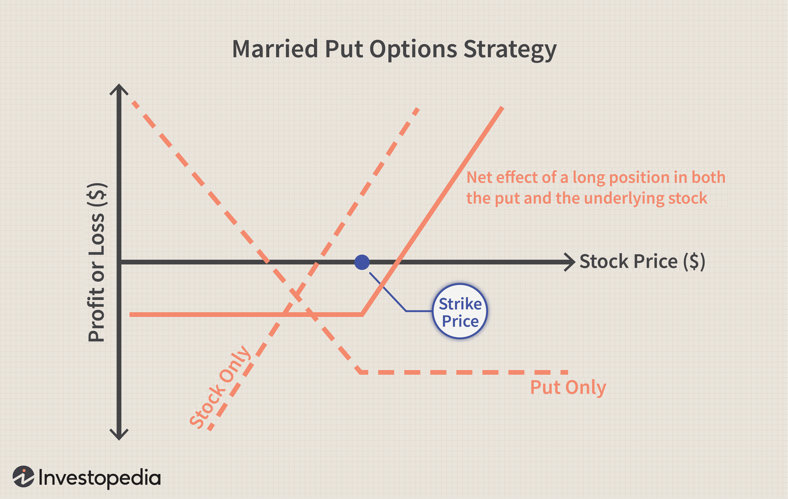

Options trading is a compelling facet of financial markets, offering unique opportunities for speculators to capitalize on price movements. Options, as derivative instruments, come primarily in two forms: calls and puts. A call option provides the holder the right, but not the obligation, to buy an underlying asset at a predetermined price within a specified time frame. Conversely, a put option grants the holder the right to sell under similar conditions. This flexibility allows speculators to bet on market directions, anticipating whether an asset's price will rise or fall.

Speculation plays a pivotal role in financial markets by providing liquidity and the potential for substantial profits. The allure of options lies in their leverage, which enables traders to control a larger position with a comparatively smaller capital outlay. This characteristic can amplify returns, making options trading attractive to speculators who seek out profit by anticipating price changes. However, it's essential to acknowledge the inherent risks, as this leverage can also lead to significant losses.

Algorithmic trading, or algo trading, emerges as a transformative force within this landscape. By employing computer algorithms to execute trades, algos enhance trading through precision, speed, and an ability to process vast datasets swiftly. This technology revolutionizes options trading by automating execution and reducing the emotional biases that can cloud judgment during manual trading. The speed and efficiency of algorithmic trading serve well in a market where timing can be a critical component of a successful strategy.

Options trading's accessibility and leverage make it an appealing avenue for speculators. Still, integrating algorithmic strategies positions traders to harness both traditional and modern techniques effectively. This combination promises sophisticated strategies that minimize risk and maximize opportunity by blending conventional trading concepts with cutting-edge technology. This article will explore how the intersection of these approaches can refine and revolutionize options trading for speculators.

## Table of Contents

## Understanding Options and Speculation

Options are derivative financial instruments that provide the holder the right, but not the obligation, to buy or sell an underlying asset at a predetermined price before or at expiration. There are primarily two types of options: calls and puts. A call option gives the holder the right to purchase an asset, whereas a put option allows the holder to sell an asset at the specified strike price. Options are a versatile tool often employed by speculators to capitalize on anticipated price movements.

### Speculation with Options

Speculation involves making trades that anticipate market movements in a bid to earn profits. Speculators utilize options to express directional views on underlying assets, such as stocks, indices, or commodities. For instance, if a speculator expects a stock price to rise, they might purchase call options, gaining the right to buy the stock at a favorable price. Conversely, purchasing put options could express a bearish view, betting on the asset’s price decline.

### Leverage and Its Allure

Options trading is particularly appealing due to the leverage it offers. Leverage allows speculators to control larger positions with relatively small amounts of capital. For example, buying a call option might cost significantly less than purchasing the same amount of the underlying asset, yet provides exposure to price movements as though the asset itself was owned. If the market moves in the speculator’s favor, the potential returns on the invested capital are amplified.

### Risks in Speculative Trading

While leverage enhances potential profits, it also magnifies potential losses. The inherent risks in options trading are significant due to the speculative nature. Options have expiry dates, and if the anticipated price movement does not occur within this timeframe, the options can expire worthless, resulting in a total loss of the premium paid. Given these dynamics, it is crucial for speculators to understand not only the potential gains but also the extent of losses that options trading can incur.

### Examples of Speculative Strategies

1. **Bullish Strategy: Call Buying**  
   A speculator bullish on a stock might buy a call option, providing them the right to purchase the stock at a strike price. If the stock's market price exceeds the strike price before expiration, the speculator can execute the option for a profit.

2. **Bearish Strategy: Put Buying**  
   For a bearish market outlook, a speculator might purchase put options, giving the right to sell the asset at the strike price. Should the asset's market price fall below this level, they can sell at a higher price, reaping the speculative reward.

3. **Straddle**  
   Speculators anticipating significant price [volatility](/wiki/volatility-trading-strategies), but uncertain of the direction, might employ a straddle strategy. This involves buying both a call and a put option with the same strike price and expiration. Profits can be made if the asset experiences substantial movements in either direction.

Understanding options and their speculative uses requires a thorough grasp of market dynamics, risk management, and strategic implementation, making them a sophisticated financial tool for experienced traders seeking returns through informed speculation.

 to Algorithmic Trading

Algorithmic trading, often referred to as algo trading, involves the use of computer algorithms to execute trades at optimal conditions. These automated systems are designed to follow pre-set instructions to complete tasks like buying or selling a security based on timing, price, or quantity parameters. The adoption of [algorithmic trading](/wiki/algorithmic-trading) has revolutionized financial markets by introducing speed, efficiency, and precision that manual trading cannot match. 

**Benefits of Algorithmic Trading**

The primary advantages of algorithmic trading include the elimination of human biases and the ability to process large datasets rapidly. Algorithms can place thousands of trades simultaneously across different markets, thus optimizing the speed and accuracy of executions. This capacity to swiftly analyze and act on complex data empowers traders to exploit intricate trading strategies that were previously impossible.

**Infrastructure Requirements**

Implementing algorithmic trading necessitates a robust infrastructure. At its core, an algorithmic trading setup requires reliable data feeds, state-of-the-art computing power, and access to trading platforms that facilitate low-latency order execution. Data feeds from stock exchanges and financial news services provide real-time market information, which the algorithms use to make informed decisions. High-frequency trading, a subset of algorithmic trading, specifically depends on minimal latency for its success.

**Common Misconceptions**

One common misconception about algorithmic trading is that it is accessible only to large institutional traders due to its complexity and cost. However, the rise of technology has democratized access to algorithmic trading tools, allowing retail traders to participate in markets more competitively. Nonetheless, the assumption that algos always guarantee profit is misleading; algorithmic trading bears inherent risks, such as over-optimization of strategies and exposure to unforeseen market events that can lead to substantial losses.

**Backtesting and Strategy Refinement**

Backtesting is a crucial component of developing any algorithmic strategy. It involves testing a trading strategy on historical data to assess its viability before deploying it in real-time markets. By iterating over historical datasets, traders can refine their strategies to enhance robustness and reliability. Strategy refinement continues through regular performance assessments, ensuring that the algorithm adapts effectively to ongoing market changes.

In conclusion, while algorithmic trading offers unprecedented opportunities for precision and efficiency in financial markets, its adoption requires a deliberate consideration of infrastructure needs, continuous strategy refinement, and a careful understanding of the potential risks involved.

## Combining Options Trading with Algorithmic Strategies

Algorithmic trading has revolutionized the field of options trading by bringing automation, speed, and precision to the process. By automating the execution of trades, algorithms significantly reduce emotional biases that can influence trading decisions. This section explores how algorithmic techniques enhance options trading and discusses popular strategies like trend-following, mean reversion, and volatility trading. Furthermore, it highlights the advantages of algorithms in strategies such as [arbitrage](/wiki/arbitrage) and straddles, presents successful case studies, and reviews technological tools that facilitate algorithmic trading in options markets.

## Algorithmic Trading Strategies in Options

**Trend-Following Strategies:**
Trend-following algorithms aim to capture gains through the analysis of an asset's directional movement. In options trading, such strategies can identify options that are expected to increase or decrease in value based on underlying price trends. For example, if a stock shows a bullish trend, a trading algorithm might automatically buy call options, anticipating further price increases.

**Mean Reversion Strategies:**
Mean reversion strategies are based on the idea that asset prices will revert to their historical averages over time. Algorithms employing mean reversion in options trading can identify overbought or oversold conditions, allowing traders to sell options when prices are deemed excessively high and purchase them when prices are low. A simple moving average could serve as a benchmark for determining when an asset or option is likely to revert to its mean.

**Volatility Trading:**
Options are fundamentally linked to volatility. Algorithmic strategies can exploit this by executing trades based on predicted changes in market volatility. For example, a volatility algorithm might engage in straddle or strangle positions to profit from anticipated increases in volatility, regardless of the direction of price change.

## Advantages in Arbitrage and Straddles

**Arbitrage Strategies:**
Arbitrage strategies involve exploiting price discrepancies between markets or instruments. Algorithmic trading is particularly suited for arbitrage as it requires rapid execution and continuous monitoring to capitalize on fleeting opportunities. Algorithms can quickly identify and execute trades across different markets or exchanges to lock in profits from price differentials.

**Straddle Strategies:**
A straddle involves buying both a call and put option on the same asset with the same strike price and expiration date, betting on significant price movement in either direction. The success of a straddle depends on timely execution, which algorithmic trading facilitates by continuously monitoring market conditions and executing trades at the optimal moment.

## Successful Integration Examples

Several investment firms and individual traders have successfully integrated algorithmic strategies into their options trading. For instance, Renaissance Technologies, known for its Medallion Fund, uses complex algorithms and statistical models to guide its trading strategies, including options.

## Tools and Platforms for Algorithmic Options Trading

Various technological tools and platforms have been developed to support algorithmic options trading, offering APIs and development environments for customizing and testing algorithms. Notable platforms include:

- **Interactive Brokers API:** Provides flexibility in designing custom trading solutions with market data and order execution capabilities.
- **QuantConnect:** A cloud-based algorithmic trading platform that supports backtesting and deployment of trading strategies in Python and C#.
- **MetaTrader 5:** Although more focused on forex, MetaTrader 5 supports options trading and offers algorithmic trading capabilities via its MQL5 language.

These platforms enable traders to design, test, and deploy trading algorithms efficiently, empowering them to leverage the benefits of algorithmic trading in the options market.

In conclusion, algorithmic trading enhances options trading through precision, speed, and reduced emotional influence, employing strategies such as trend-following and mean reversion. Tools and platforms supporting these strategies have made algorithmic trading accessible and efficient, paving the way for more sophisticated and profitable trading approaches.

## Risks and Challenges in Algorithmic Options Trading

Algorithmic options trading, while offering numerous advantages, also presents several risks and challenges that traders must navigate. One of the primary concerns is technical glitches. These can arise from software bugs or failures in trading systems, which may result in unintended trading actions. For example, an algorithm might execute trades at incorrect prices due to miscalculations or parameter errors. Additionally, data feed issues can lead to incomplete or incorrect market information, impacting decision-making processes and potentially leading to financial losses.

To mitigate such risks, robust risk management strategies are imperative. Traders often implement stop-loss orders to limit potential losses from adverse market movements. A stop-loss order automatically sells an asset when it reaches a predetermined price, thus capping the trader's loss. Furthermore, setting appropriate leverage levels is crucial as excessive leverage can amplify losses. For instance, if a trade is leveraged at a 10:1 ratio and the market moves unfavorably, the trader's losses could be ten times greater than the initial investment.

Market manipulation is another significant challenge in the context of high-frequency trading ([HFT](/wiki/high-frequency-trading-strategies)). Algorithms can inadvertently contribute to market manipulation strategies such as spoofing, where fake orders are placed to create false market [momentum](/wiki/momentum). Ethical concerns also arise from the disproportionate advantage that sophisticated algorithms offer to certain market participants, potentially leading to an uneven trading landscape.

Examining real-world instances of algorithmic failures provides valuable lessons. One notable example is the Flash Crash of May 6, 2010, where the Dow Jones Industrial Average plummeted nearly 1,000 points within minutes, only to recover shortly thereafter. The incident highlighted vulnerabilities in HFT systems and the potential for algorithms to interact in unforeseen ways, leading to extreme market volatility.

Regulatory compliance is crucial for algorithmic traders. Regulations often require traders to ensure their algorithms do not contribute to market destabilization. This includes maintaining records of trades, conducting regular audits of trading systems, and having controls in place to halt or modify trading algorithms swiftly during market disturbances. Additionally, certain jurisdictions may impose specific rules regarding the disclosure of algorithmic strategies and require testing under simulated market conditions before deployment. 

Overall, while algorithmic options trading can enhance efficiency and decision-making, understanding and managing its associated risks are essential for its responsible and successful utilization.

## Future Trends in Options Trading and Algorithmic Strategies

The integration of [artificial intelligence](/wiki/ai-artificial-intelligence) (AI) and [machine learning](/wiki/machine-learning) (ML) in algorithmic trading is advancing options trading. These technologies enable traders to parse vast datasets, uncover patterns, and make more informed trading decisions. AI algorithms can learn from historical data and adapt to real-time market changes, offering a significant edge in predictive analytics for options trading. Machine learning models, especially [deep learning](/wiki/deep-learning) and neural networks, are increasingly being used to predict price movements and volatility, enhancing decision-making accuracy.

Technological advancements promise to further transform options trading dynamics. Quantum computing, though still in nascent stages, presents the potential to exponentially increase computation speeds. This advancement can lead to more sophisticated algorithms that can optimize complex option portfolios in real-time, thus accelerating trading processes. Moreover, the development of distributed ledger technologies might enhance transparency and security in trading transactions, reshaping the framework within which options trading operations are conducted.

The widespread adoption of algorithmic trading is likely to usher in shifts in market structure and [liquidity](/wiki/liquidity-risk-premium). With algorithms executing trades in microseconds, markets could become more liquid and efficient, as bid-ask spreads narrow, and mispricings are quickly arbitraged away. However, this hyper-efficiency has the potential to disrupt traditional human-paced trading activities, rendering some market practices obsolete. As algorithmic trading becomes more prevalent, there may be increased volatility during market disruptions or "flash crashes," requiring robust regulatory mechanisms to maintain market stability.

In a technological trading landscape, the role of human traders is expected to evolve. While algorithmic systems can efficiently handle high-frequency trading and arbitrage opportunities, human intuition and strategic foresight remain invaluable. Traders will likely shift towards higher-level oversight roles, focusing on strategy development, risk management, and the interpretation of complex market signals that algorithms may not fully comprehend. Additionally, human expertise will be crucial in the ethical oversight and responsible deployment of trading algorithms.

To adapt to these evolving trends, traders should invest in continuous education, particularly in data science, AI, and ML, to enhance their technological proficiency. Familiarity with programming languages such as Python, essential for developing and understanding algorithms, will be increasingly important. Traders should also focus on developing strategic thinking capabilities to interpret algorithmic outputs effectively. A forward-looking approach that embraces technological change while maintaining robust risk management practices will position traders to navigate the future of options trading successfully.

## Conclusion

In conclusion, the integration of options trading with algorithmic strategies offers substantial benefits for speculators seeking to enhance their market performance. As highlighted throughout the discussion, algorithmic trading not only streamlines the execution of trades but also mitigates emotional biases and harnesses vast datasets for informed decision-making. This approach optimizes potential returns by leveraging speed, precision, and advanced data analysis techniques. 

Algorithmic trading, with its ability to automate complex strategies like arbitrage and volatility trading, presents a unique opportunity for those invested in speculative markets such as options. It empowers traders to efficiently manage leverage and assess market trends, thus maximizing profit opportunities in both bullish and bearish conditions. However, the complexities inherent in these strategies underscore the need for educated risk-taking. Successful algorithmic options trading demands a commitment to continuous learning, as market dynamics and technological capabilities are ever-evolving.

Encouragingly, traders who marry technological proficiency with solid financial understanding can effectively navigate these waters. Mastery in managing algorithmic tools and platforms, along with astute financial acumen, forms the bedrock of success in this sphere. Thus, it is crucial for traders to continually seek out educational resources, professional courses, and simulation platforms to hone their skills and deepen their knowledge of algorithmic trading. In doing so, they can better position themselves to take advantage of emerging trends and maintain a competitive edge in the dynamic landscape of options trading.

## References & Further Reading

[1]: Bergstra, J., Bardenet, R., Bengio, Y., & Kégl, B. (2011). ["Algorithms for Hyper-Parameter Optimization."](https://dl.acm.org/doi/10.5555/2986459.2986743) Advances in Neural Information Processing Systems 24.

[2]: ["Advances in Financial Machine Learning"](https://www.amazon.com/Advances-Financial-Machine-Learning-Marcos/dp/1119482089) by Marcos Lopez de Prado

[3]: ["Evidence-Based Technical Analysis: Applying the Scientific Method and Statistical Inference to Trading Signals"](https://www.amazon.com/Evidence-Based-Technical-Analysis-Scientific-Statistical/dp/0470008741) by David Aronson

[4]: ["Machine Learning for Algorithmic Trading"](https://github.com/stefan-jansen/machine-learning-for-trading) by Stefan Jansen

[5]: ["Quantitative Trading: How to Build Your Own Algorithmic Trading Business"](https://github.com/LucindaYa/quant-resources/blob/master/Quantitative%20Trading%20How%20to%20Build%20Your%20Own%20Algorithmic%20Trading%20Business.pdf) by Ernest P. Chan