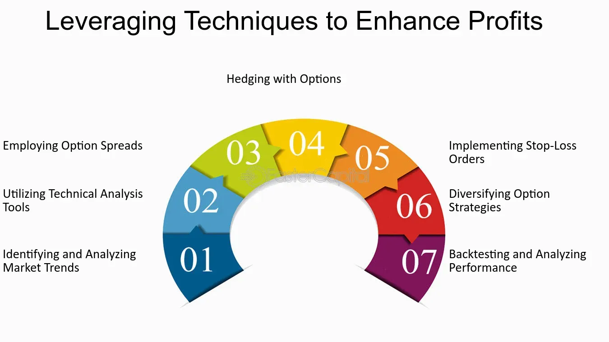

## Table of Contents

## What is options trading and how does it differ from stock trading?

Options trading involves buying and selling contracts that give you the right, but not the obligation, to buy or sell an asset at a specific price before a certain date. These contracts are called options, and they can be used to bet on the future price movements of stocks, commodities, or other financial instruments. Options are popular because they can offer higher potential returns and allow for more flexible trading strategies compared to directly owning stocks.

Stock trading, on the other hand, involves buying and selling shares of a company. When you buy a stock, you own a piece of that company and can profit if the stock price goes up. Unlike options, stocks give you ownership and potential dividends, but they also come with more risk because your investment is directly tied to the company's performance. Options trading can be less risky if used correctly, as you can limit your potential losses to the price you paid for the option, whereas with stocks, you could lose your entire investment if the stock price drops to zero.

## Who are speculators in the context of options trading?

Speculators in options trading are people who try to make money by guessing how the price of something, like a stock, will change in the future. They buy options because they think the price will go up or down a lot, and if they're right, they can make a big profit. Speculators don't plan to actually buy or sell the stock; they just want to make money from the option itself.

Options are attractive to speculators because they can control a lot of stock for a small amount of money. For example, instead of buying 100 shares of a stock, they can buy an option that gives them the right to buy those 100 shares. This means they can make a big profit if the stock price moves in the direction they predicted, but they also risk losing the money they spent on the option if they're wrong.

## What are the basic types of options and how do they work?

There are two basic types of options: call options and put options. A call option gives you the right to buy a stock at a certain price, called the strike price, before a certain date, known as the expiration date. If you think the stock price will go up, you might buy a call option. If the stock price goes above the strike price before the expiration date, you can buy the stock at the lower strike price and then sell it at the higher market price to make a profit. If the stock price doesn't go up, you can just let the option expire and you only lose the money you paid for the option.

A put option gives you the right to sell a stock at the strike price before the expiration date. If you think the stock price will go down, you might buy a put option. If the stock price drops below the strike price before the expiration date, you can buy the stock at the lower market price and then sell it at the higher strike price to make a profit. If the stock price doesn't go down, you can let the option expire and you only lose the money you paid for the option. Both call and put options can be used to make money from your predictions about stock price movements, but they work in opposite ways.

## What are the common profit strategies used by speculators in options trading?

One common profit strategy used by speculators in options trading is buying call options when they think a stock's price will go up. They pay a small amount to buy the option, which gives them the right to buy the stock at a set price, called the strike price. If the stock's price goes above the strike price before the option expires, they can buy the stock at the lower strike price and then sell it at the higher market price, making a profit. If the stock price doesn't go up, they just lose the money they paid for the option.

Another strategy is buying put options when speculators think a stock's price will go down. They pay a small amount for the option, which gives them the right to sell the stock at the strike price. If the stock's price falls below the strike price before the option expires, they can buy the stock at the lower market price and then sell it at the higher strike price, making a profit. If the stock price doesn't go down, they only lose the money they paid for the option.

Speculators can also use strategies like selling options, which is called writing options. When they sell a call option, they get money upfront but must sell the stock at the strike price if the buyer decides to use the option. When they sell a put option, they get money upfront but must buy the stock at the strike price if the buyer decides to use the option. These strategies can be more risky but can also make money if the stock price stays the same or moves in the opposite direction of what the buyer expected.

## How can speculators use call options to profit from rising stock prices?

Speculators can use call options to make money when they think a stock's price will go up. They buy a call option, which gives them the right to buy the stock at a set price, called the strike price, before a certain date. If the stock's price goes above the strike price before the option expires, the speculator can buy the stock at the lower strike price and then sell it at the higher market price. This difference is their profit. If the stock price doesn't go up, they just lose the money they paid for the option, which is usually less than what it would cost to buy the stock outright.

For example, if a speculator thinks a stock currently priced at $50 will go up to $60, they might buy a call option with a strike price of $55 for $2. If the stock price goes to $60, they can buy the stock at $55 and sell it at $60, making a $3 profit per share after subtracting the $2 they paid for the option. If the stock price stays below $55, they lose the $2 they paid for the option, but that's all they lose. This way, they can make a big profit if they're right about the stock going up, but their risk is limited to the cost of the option.

## How can speculators use put options to profit from falling stock prices?

Speculators can use put options to make money when they think a stock's price will go down. They buy a put option, which gives them the right to sell the stock at a set price, called the strike price, before a certain date. If the stock's price goes below the strike price before the option expires, the speculator can buy the stock at the lower market price and then sell it at the higher strike price. This difference is their profit. If the stock price doesn't go down, they just lose the money they paid for the option, which is usually less than what it would cost to buy the stock outright.

For example, if a speculator thinks a stock currently priced at $50 will drop to $40, they might buy a put option with a strike price of $45 for $2. If the stock price falls to $40, they can buy the stock at $40 and sell it at $45, making a $3 profit per share after subtracting the $2 they paid for the option. If the stock price stays above $45, they lose the $2 they paid for the option, but that's all they lose. This way, they can make a big profit if they're right about the stock going down, but their risk is limited to the cost of the option.

## What are some advanced options strategies like straddles and strangles, and how do they work?

A straddle is an options strategy where you buy both a call option and a put option at the same time, with the same strike price and expiration date. You use a straddle when you think a stock's price will move a lot, but you're not sure which way it will go. If the stock price goes up a lot, you make money from the call option. If the stock price goes down a lot, you make money from the put option. The trick is that the stock needs to move enough to cover the cost of both options, or you'll lose money. It's like betting on big changes in the stock price without betting on the direction.

A strangle is similar to a straddle, but you buy a call option with a higher strike price and a put option with a lower strike price. Both options still have the same expiration date. You use a strangle when you think the stock's price will move a lot, but you want to spend less money upfront than with a straddle. The stock needs to move even more than with a straddle to make money because the options are further away from the current stock price. If the stock price stays in the middle, you lose the money you paid for both options. It's a way to bet on big moves in the stock price while keeping your initial cost lower.

## How do speculators manage risk when using options?

Speculators manage risk when using options by carefully choosing which options to buy or sell and by using strategies that limit how much they can lose. One way they do this is by only risking a small amount of money on each option. Since options are cheaper than buying stocks outright, speculators can control a lot of stock for less money. This means if they're wrong about the stock's price movement, they only lose the money they paid for the option, not the full value of the stock.

Another way speculators manage risk is by using strategies like buying options instead of selling them. When you buy an option, your risk is limited to the price you paid for it. But if you sell an option, you could lose more money if the stock price moves against you. Speculators might also use stop-loss orders, which automatically sell an option if its price drops to a certain level, helping to limit losses. By combining these strategies, speculators can try to make money while keeping their risk under control.

## What role does market volatility play in options trading strategies?

Market volatility is really important for options trading because it shows how much a stock's price might move up or down. When the market is more volatile, the prices of options go up because there's a bigger chance that the stock will move a lot before the option expires. This means speculators might pay more for options during volatile times, but they could also make more money if they guess right about the stock's price movement. On the other hand, when the market is calm and not very volatile, options are cheaper because there's less chance of big price swings. This can make it harder to make big profits from options, but it also means less risk.

Speculators use market volatility to decide on their trading strategies. For example, if they think the market will be very volatile, they might use strategies like straddles or strangles, which can make money if the stock moves a lot in either direction. These strategies are good for volatile times because they bet on big price changes. If the market is expected to be calm, speculators might choose different strategies, like buying call or put options if they have a strong guess about which way the stock will move. Understanding and predicting market volatility helps speculators pick the right options and manage their risks better.

## How can speculators use options to hedge their investments?

Speculators can use options to hedge their investments by buying options that protect them from big losses. For example, if a speculator owns a stock and is worried that its price might go down, they can buy a put option. This put option gives them the right to sell the stock at a set price, even if the market price drops lower. If the stock price does fall, the speculator can use the put option to sell the stock at the higher set price, which helps limit their losses. This way, they can still make money if the stock goes up, but they're protected if it goes down.

Another way speculators use options to hedge is by buying call options on stocks they don't own but might want to buy later. If they think a stock they're interested in might go up a lot, they can buy a call option to lock in a price to buy it. If the stock price goes up, they can use the call option to buy the stock at the lower set price and then sell it at the higher market price, making a profit. If the stock price doesn't go up, they only lose the money they paid for the option, which is usually less than buying the stock outright. This helps them manage risk while still having the chance to make money if the stock goes up.

## What are the tax implications of profits from options trading?

When you make money from options trading, you have to pay taxes on your profits. The tax you owe depends on how long you held the option before selling it. If you held the option for less than a year, your profits are considered short-term capital gains. These are taxed at the same rate as your regular income, which can be anywhere from 10% to 37% depending on how much money you make. If you held the option for more than a year, your profits are long-term capital gains, which are taxed at a lower rate, usually 0%, 15%, or 20%, depending on your income.

It's important to keep good records of when you bought and sold your options, and how much money you made or lost. This will help you figure out your taxes correctly. Sometimes, if you lose money on options trading, you can use those losses to reduce the taxes you owe on other gains or even your regular income. But there are rules about how much you can deduct, so it's a good idea to talk to a tax professional to make sure you're doing everything right.

## How can expert speculators use options to create synthetic positions and what are the benefits of doing so?

Expert speculators can use options to create synthetic positions, which are strategies that mimic the payoff of other investments without actually owning them. For example, a synthetic long stock position can be created by buying a call option and selling a put option with the same strike price and expiration date. This setup acts just like owning the stock itself because it profits when the stock price goes up and loses money when the stock price goes down. Another example is a synthetic short stock position, which can be created by buying a put option and selling a call option with the same strike price and expiration date. This setup profits when the stock price goes down and loses money when the stock price goes up, just like shorting the stock.

The benefits of using synthetic positions include flexibility and potentially lower costs. By using options, speculators can control a large amount of stock for a smaller amount of money compared to buying the stock outright. This can be especially useful when the speculator wants to take a position but doesn't have enough money to buy the stock. Synthetic positions also allow speculators to tailor their risk and reward profiles more precisely. For example, they can adjust the strike prices and expiration dates of the options to match their market predictions and risk tolerance. This flexibility can help them manage their investments more effectively and potentially increase their profits.

## References & Further Reading

[1]: Bergstra, J., Bardenet, R., Bengio, Y., & Kégl, B. (2011). ["Algorithms for Hyper-Parameter Optimization."](https://dl.acm.org/doi/10.5555/2986459.2986743) Advances in Neural Information Processing Systems 24.

[2]: ["Advances in Financial Machine Learning"](https://www.amazon.com/Advances-Financial-Machine-Learning-Marcos/dp/1119482089) by Marcos Lopez de Prado

[3]: ["Evidence-Based Technical Analysis: Applying the Scientific Method and Statistical Inference to Trading Signals"](https://www.amazon.com/Evidence-Based-Technical-Analysis-Scientific-Statistical/dp/0470008741) by David Aronson

[4]: ["Machine Learning for Algorithmic Trading"](https://github.com/stefan-jansen/machine-learning-for-trading) by Stefan Jansen

[5]: ["Quantitative Trading: How to Build Your Own Algorithmic Trading Business"](https://github.com/LucindaYa/quant-resources/blob/master/Quantitative%20Trading%20How%20to%20Build%20Your%20Own%20Algorithmic%20Trading%20Business.pdf) by Ernest P. Chan