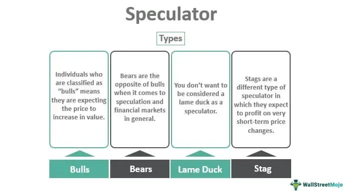

In today's dynamic financial landscape, a myriad of investment types interact to shape market behaviors. Traditional investment vehicles such as stocks and bonds remain foundational elements. Stocks offer investors a piece of ownership in a company, with potential for capital gains and dividends, while bonds provide fixed-income returns through interest payments. These traditional forms are complemented by modern financial instruments like cryptocurrencies and exchange-traded funds (ETFs), which bring new dimensions to investing. Cryptocurrencies, digital or virtual currencies utilizing cryptography for security, introduce higher volatility and substantial risk, yet offer significant growth potential. ETFs, which pool money from multiple investors to invest in a diversified portfolio of assets, offer flexibility and reduced costs compared to individual stock picking.

The actions of speculators and the rise of algorithmic trading add additional layers of complexity. Speculators, who engage in market activities with the primary objective of profit from short-term price fluctuations, play a pivotal role in offering liquidity and aiding in price discovery within financial markets. However, their presence can sometimes lead to elevated market volatility, and in certain scenarios, contribute to the formation of price bubbles. Algorithmic trading is another key component, leveraging computer algorithms to execute trades at speeds and frequencies beyond human capability. This advancement allows for rapid responses to market conditions and enhances market efficiency, although it can also lead to sudden market fluctuations if not properly managed.

This article explores how these elements integrate and influence the markets. It examines various investment types, the involvement of speculators and their impact on the markets, and the emerging world of algorithmic trading. Understanding this interplay is essential for investors looking to navigate the complex, fast-moving financial ecosystem effectively.

## Table of Contents

## Types of Investments

Financial instruments available to investors encompass a diverse range of assets, including stocks, bonds, mutual funds, ETFs, commodities, and cryptocurrency. Each of these offers a unique blend of risk and reward characteristics, catering to different investment strategies and objectives.

Stocks are equity securities that represent ownership in a corporation. Stockholders may benefit from capital gains, which arise from selling the stock at a higher price than the purchase price, and dividends, which are portions of a company's earnings distributed to shareholders. Stocks can be volatile, with prices affected by company performance, industry trends, and overall market conditions.

Bonds are debt securities where investors lend money to an entity (government, municipality, or corporation) in return for periodic interest payments and the return of principal at maturity. Bonds are considered less risky than stocks because they provide fixed income returns, but they are subject to interest rate risk. When interest rates rise, bond prices typically fall, and vice versa.

Exchange-Traded Funds (ETFs) and mutual funds are collective investment vehicles that pool resources from numerous investors. These funds invest in diversified portfolios, reducing individual asset risk. Mutual funds are typically actively managed, with fund managers making decisions about how to allocate assets. ETFs, on the other hand, generally track a specific index or sector and trade on exchanges like individual stocks. Both provide investors with access to a wide variety of asset classes and sectors.

Commodities include physical goods such as oil, gold, agricultural products, and other raw materials. Investing in commodities can serve as a hedge against inflation and currency fluctuations, as their prices are often influenced by macroeconomic factors, geopolitical events, and supply-demand dynamics. Commodity investing can be done directly through futures contracts or indirectly through commodity-focused ETFs and mutual funds.

Cryptocurrency represents a modern asset class centered around digital currencies operating independently of a centralized authority. Bitcoin, Ethereum, and other cryptocurrencies offer potential high returns but come with substantial [volatility](/wiki/volatility-trading-strategies) and regulatory uncertainty. They provide diversification potential but require investors to manage unique risks, such as technological changes and cybersecurity threats.

Different investment types influence market volatility and investor behavior in various ways. For example, stocks may exhibit more pronounced price fluctuations due to changes in economic forecasts, while bonds might react more sensitively to [interest rate](/wiki/interest-rate-trading-strategies) adjustments. The unique characteristics of each asset class allow investors to tailor their portfolios to their risk tolerance and financial goals, impacting overall market dynamics and investor sentiment.

## Market Impact of Speculators

Speculators play a significant role in financial markets, primarily by assuming risk with the expectation of profiting from anticipated price changes. Their primary objectives are to capitalize on market fluctuations rather than long-term value gains. This activity can significantly enhance market [liquidity](/wiki/liquidity-risk-premium), facilitating more transactions and encouraging price discovery by reflecting collective market expectations and sentiment.

### Positive Contributions

Speculators increase market liquidity due to their willingness to buy or sell based on anticipated future price movements. This results in tighter bid-ask spreads, allowing for more efficient market operations. Liquidity is essential for markets to function smoothly, as it ensures that buyers and sellers can execute trades quickly with minimal price impact. Moreover, speculators contribute to price discovery, aiding in the reflection of the latest information in the asset prices. They do this by incorporating diverse forecasts and expectations about future market situations into their trading strategies.

### Potential Risks

Despite these benefits, excessive speculative activity can distort asset prices, leading to severe economic implications. One such risk is the creation of price bubbles. During a bubble, speculative demand drives asset prices to levels that exceed their intrinsic value, creating an unsustainable valuation. Eventually, when the asset prices correct, the bubble bursts, often leading to market crashes. Historical examples include the Dotcom Bubble of the late 1990s and the Housing Bubble leading up to the 2008 financial crisis.

These events highlight the tendency of speculators to amplify market trends through herd behavior and irrational exuberance. When speculation turns overwhelmingly positive, it can lead to overvaluation, while negative sentiment can contribute to crashes, exacerbating market volatility.

### Strategies Employed by Speculators

Speculators employ various strategies to enhance returns, leveraging complex financial instruments. Two common strategies include leverage and derivatives.

1. **Leverage**: This involves borrowing funds to increase the potential return on investment. By using leverage, speculators magnify both gains and losses, thereby impacting market volatility. For example, if an investor uses 2x leverage, a 10% increase in asset value translates to a 20% gain. However, a 10% decline yields a 20% loss, presenting an intrinsic risk.
$$
   \text{Leveraged Return} = \left(\frac{\text{Asset Return} \times \text{Leverage Ratio}}{\text{Initial Investment}}\right) - \text{Cost of Borrowing}

$$

2. **Derivatives**: These financial contracts derive their value from underlying assets and are used to hedge risk or speculate on price movements. Common derivatives include options, futures, and swaps. For instance, options allow speculators to gamble on an asset's future price with limited upfront costs, enabling substantial gains or losses depending on the price movement.

In conclusion, while speculators inject liquidity and facilitate price discovery, their activities can lead to excessive risk-taking, resulting in market bubbles and crashes. This duality necessitates careful market monitoring and, potentially, regulatory measures to mitigate adverse outcomes while maintaining the beneficial aspects of speculative trading.

## Algorithmic Trading

Algorithmic trading leverages computer algorithms to automate and optimize trading decisions, significantly accelerating execution times and often removing the need for direct human intervention. This automated approach allows traders and financial institutions to respond to market events almost instantaneously, taking advantage of minor price fluctuations that could elude manual traders due to the rapid pace required for such activities. 

The primary advantage of [algorithmic trading](/wiki/algorithmic-trading) lies in its ability to enhance market efficiency and liquidity. By quickly processing large volumes of data and executing high-frequency trades, algorithms can reduce bid-ask spreads and increase the overall trading [volume](/wiki/volume-trading-strategy). This efficiency minimizes transaction costs and tightens the spreads, contributing to a more liquid and dynamic market environment.

However, the heightened speed and efficiency of algorithmic trading are accompanied by potential risks, including increased market volatility and the occurrence of flash crashes. Flash crashes are temporary yet intense sell-offs triggered by automated trading systems, which can initiate rapid and dramatic price declines in a matter of minutes. One notable incident occurred on May 6, 2010, when the U.S. stock market experienced a sudden and unprecedented decline, wiping out nearly $1 trillion in market value, before rebounding just as quickly.

The proliferation of algorithmic trading presents challenges and opportunities for market regulation and strategic positioning by investors. Regulatory bodies face the task of balancing the benefits of such technology with the need to maintain market stability and protect against systemic risks. To this end, measures such as circuit breakers and minimum order resting times have been implemented to provide checks against excessive volatility induced by algorithmic trades.

For investors, the rise of algorithmic trading necessitates adaptations in strategy and technology. Traders must develop sophisticated algorithms capable of executing trades with precision and adapting to market signals rapidly. Moreover, the competitive landscape encourages continuous innovation in trading strategies and technological advancements to maintain an edge in execution speed and decision-making accuracy.

Overall, while algorithmic trading contributes real-time adaptability and improved market functionality, its role in magnifying both opportunities and risks highlights the need for a nuanced and balanced approach to leveraging this powerful tool in modern financial markets.

## The Interplay of Speculators and Algorithms

The convergence of speculators and algorithmic trading is significantly reshaping modern financial markets. Speculators, who often seek to profit from market inefficiencies, are increasingly leveraging algorithmic trading to optimize their strategies. This synergy allows them to execute trades with greater speed and precision, enhancing their ability to capitalize on short-term market fluctuations.

Algorithmic trading has substantial implications for market liquidity. By executing trades rapidly and efficiently, algorithms facilitate higher trading volumes and narrower bid-ask spreads, which are crucial for creating a liquid market environment. This increased liquidity benefits not only algorithmic traders and speculators but also traditional investors, as it can lead to more stable and predictable market conditions. However, there is a downside. The speed and efficiency of algorithmic trading can also amplify market volatility, especially during periods of high uncertainty or stress. Rapid, large-scale trades executed by algorithms can exacerbate price swings, potentially fueling speculative bubbles. These bubbles occur when asset prices deviate significantly from their intrinsic values, driven by exuberant trading behavior rather than [fundamental analysis](/wiki/fundamental-analysis).

The interdependencies between speculative activities and algorithmic trading strategies continue to evolve, influencing overall market volatility and resilience. Speculators may employ algorithms not just for execution efficiency, but also for sophisticated strategic modeling. This could involve using [machine learning](/wiki/machine-learning) models to anticipate market moves or employing hedging strategies that dynamically adapt to shifting market conditions. As such advancements continue, the relationship between algorithmic systems and speculators grows increasingly complex, often requiring regulatory oversight to ensure market stability.

The increasing reliance on algorithms by speculators represents both an opportunity and a challenge for financial markets. While enhancing market liquidity and providing tools for strategic advantage, these technologies also underscore the importance of robust risk management frameworks. Policymakers and market participants continue to assess the need for regulations that address the potential impact of high-frequency and algorithmic trading on market stability.

## Conclusion

Financial markets serve as intricate ecosystems where diverse investment types, speculative activities, and advancements in algorithmic trading converge. These elements create a multifaceted landscape that is both dynamic and unpredictable, challenging participants to continuously adapt.

Each component contributes its own advantages and challenges to the financial ecosystem. Investment types such as stocks, bonds, and cryptocurrencies offer varied risk and reward profiles, appealing to different investor preferences and strategies. Stocks, for instance, provide opportunities for capital appreciation and dividend income, whereas bonds offer more stable, fixed-income returns. Cryptocurrencies introduce a novel asset class with high volatility and potential for significant gains or losses.

Speculators introduce additional complexity by taking calculated risks to profit from market fluctuations. Their activities can enhance market liquidity and facilitate price discovery, yet they also pose the risk of inflating asset bubbles or triggering market crashes when sentiment shifts abruptly. Speculators often employ techniques such as leverage and derivatives, adding layers of complexity to market dynamics while presenting both opportunities and dangers.

Algorithmic trading, leveraging computer algorithms for rapid decision-making and execution, transforms how markets operate. By quickly identifying and acting on price discrepancies, algorithms enhance market efficiency and liquidity. However, their capability for high-frequency trading can also precipitate abrupt market events, such as flash crashes, which pose significant challenges to market stability and regulatory frameworks.

The interplay between speculators and algorithmic trading further reshapes the financial landscape. Speculators increasingly deploy algorithms to fine-tune their strategies, optimizing reaction times and execution precision. While these algorithms create more liquid markets by narrowing bid-ask spreads and enabling high-speed trades, they also have the potential to magnify speculative bubbles, raising concerns about systemic risk.

For investors seeking to navigate these complexities, a profound understanding of how investment types, speculative behavior, and algorithmic advancements interact is crucial. Informed decision-making hinges on recognizing these dynamics, enabling investors to capitalize on opportunities while effectively managing inherent risks. Therefore, a holistic grasp of these intertwined elements not only empowers investors but also contributes to the resilience and efficiency of financial markets.

## References & Further Reading

[1]: Marcos Lopez de Prado, ["Advances in Financial Machine Learning"](https://www.amazon.com/Advances-Financial-Machine-Learning-Marcos/dp/1119482089), Wiley, 2018.

[2]: Ernest P. Chan, ["Quantitative Trading: How to Build Your Own Algorithmic Trading Business"](https://www.amazon.com/Quantitative-Trading-Build-Algorithmic-Business/dp/0470284889), Wiley, 2008.

[3]: Stefan Jansen, ["Machine Learning for Algorithmic Trading"](https://github.com/stefan-jansen/machine-learning-for-trading), Packt Publishing, 2018.

[4]: David Aronson, ["Evidence-Based Technical Analysis: Applying the Scientific Method and Statistical Inference to Trading Signals"](https://www.amazon.com/Evidence-Based-Technical-Analysis-Scientific-Statistical/dp/0470008741), Wiley, 2006.

[5]: James Bergstra, Rémi Bardenet, Yoshua Bengio, and Balázs Kégl, ["Algorithms for Hyper-Parameter Optimization."](https://dl.acm.org/doi/10.5555/2986459.2986743) Advances in Neural Information Processing Systems 24, 2011.