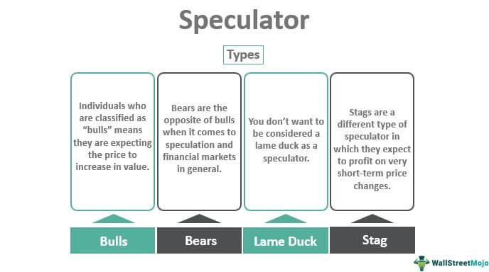

## Table of Contents

## What is a speculator in financial markets?

A speculator in financial markets is someone who tries to make money by guessing how the prices of things like stocks, currencies, or commodities will change. They do not buy these things to use or keep them, but to sell them later at a higher price or buy them back at a lower price. Speculators take risks because they hope to earn a profit from the price differences.

Speculators can affect the market a lot. When many speculators think the price of something will go up, they start buying it, which can actually make the price go up. On the other hand, if they think the price will go down, they might sell it, which can make the price go down. This can sometimes make the market more unstable, but it can also make it easier for others to buy and sell things quickly.

## How do speculators differ from investors?

Speculators and investors both put money into the market, but they do it for different reasons. An investor usually buys things like stocks or real estate because they believe these will grow in value over time. They are often looking to hold onto their investments for a long time, maybe even years, and they might also get money from things like dividends or rent. Investors are more focused on the long-term growth and stability of their investments.

On the other hand, speculators are more interested in making quick profits from short-term price changes. They might buy something and then sell it just a few days or weeks later if they think the price will go up. Speculators are willing to take bigger risks because they are trying to make money from the ups and downs of the market. They don't usually care about the long-term value of what they are buying; they just want to buy low and sell high as fast as possible.

## What are the main types of speculators?

There are a few main types of speculators. One type is called a day trader. Day traders buy and sell things like stocks or currencies within the same day. They try to make money from small changes in price that happen very quickly. They need to watch the market closely and make fast decisions.

Another type of speculator is a position trader. Position traders hold onto their investments for a longer time, like weeks or months. They try to guess bigger changes in price that happen over time. They might not watch the market as closely as day traders, but they still need to keep an eye on it.

There are also scalpers, who are a bit like day traders but focus on even smaller price changes. Scalpers might make lots of trades in a day, trying to make a little bit of money from each one. All these types of speculators are trying to make money from the market, but they do it in different ways and over different amounts of time.

## Can you explain the role of day traders as speculators?

Day traders are a type of speculator who buy and sell things like stocks or currencies within the same day. They try to make money from small changes in price that happen very quickly. Day traders need to watch the market closely all day long. They use special tools and charts to help them decide when to buy and sell. Their goal is to make a profit by the end of the day, so they don't keep their investments overnight.

Because day traders focus on short-term price changes, they take a lot of risks. They might make many trades in one day, hoping to earn a little bit of money from each one. This can be exciting but also stressful. Day traders need to be good at making quick decisions and managing their money carefully. They play an important role in the market by adding a lot of buying and selling activity, which can help make the market more active and liquid.

## How do position traders contribute to speculation?

Position traders are speculators who hold onto their investments for a longer time, like weeks or months. They try to guess bigger changes in price that happen over time. Unlike day traders, position traders do not need to watch the market every second of the day. Instead, they look at bigger trends and patterns. They might use things like economic reports or news about companies to help them decide when to buy or sell.

Position traders help the market by adding to its stability over longer periods. Because they hold their investments for weeks or months, they can help smooth out the big ups and downs that day traders might cause. By focusing on longer-term trends, position traders can make the market less wild and more predictable. This can be good for other people in the market who want to invest for the long term.

## What is the impact of speculators on market liquidity?

Speculators help make the market more liquid. Liquidity means how easy it is to buy or sell something without changing its price too much. When speculators buy and sell a lot, it means there are always people ready to trade. This makes it easier for everyone else to buy or sell quickly, because there are more people in the market. If there were no speculators, it might be harder to find someone to trade with, and the market could become less active.

The actions of speculators can also help set prices more accurately. Because they are always trying to guess where prices will go, they help make sure that the prices in the market reflect what people think things are worth. This can be good for everyone, because it makes the market more fair and efficient. But, it's important to remember that too much speculation can sometimes make the market too wild and unstable.

## How do speculators influence price volatility?

Speculators can make prices in the market go up and down a lot. This is called price [volatility](/wiki/volatility-trading-strategies). When many speculators think that the price of something, like a stock or a currency, will go up, they start buying it. This can make the price go up fast because there are so many people trying to buy. But if they all suddenly think the price will go down, they might start selling, which can make the price drop quickly. So, speculators can make the market more exciting but also more unpredictable.

However, not all speculation leads to more volatility. Some speculators, like position traders, hold onto their investments for longer times. They might help make the market more stable by smoothing out the big ups and downs. When they buy or sell based on longer-term trends, it can help balance out the quick changes caused by day traders. So, while speculators can make the market more volatile, they can also help keep it steady in some ways.

## What are the potential benefits of speculation in the market?

Speculation can help the market by making it easier to buy and sell things. When speculators trade a lot, there are always people ready to buy or sell. This makes the market more liquid, which means it's easier for everyone to trade quickly without changing the price too much. It's like having a busy marketplace where you can always find someone to trade with. This can be good for everyone, because it makes the market more active and fair.

Speculation can also help set prices more accurately. Speculators are always trying to guess where prices will go, and their buying and selling can help make sure that the prices in the market show what people think things are really worth. This can make the market more efficient, because prices reflect all the information and opinions out there. So, even though speculation can make the market go up and down a lot, it can also help keep things balanced and fair.

## What are the risks associated with speculation for the market?

Speculation can make the market go up and down a lot. This is called volatility. When many speculators buy or sell at the same time, it can make prices change very quickly. This can be scary for people who want to invest for a long time, because they might lose money if the market drops suddenly. Big changes in price can also make the whole market feel unstable, which can make people less likely to invest.

Another risk is that speculators might make the market less fair. If a lot of speculators have the same idea about where prices will go, they can push the market in one direction. This can make it hard for regular people to buy or sell at a good price. Also, if speculators make big bets and lose a lot of money, it can cause problems for the whole market. This happened in the past, like during the 2008 financial crisis, when too much speculation helped cause a big crash.

## How do regulatory bodies view the activities of speculators?

Regulatory bodies keep a close eye on speculators because they can affect the market a lot. They want to make sure that speculators don't make the market too wild or unfair. So, they set rules to control how much risk speculators can take and how much they can trade. For example, they might limit how much someone can borrow to buy stocks, or they might watch big speculators closely to make sure they're not doing anything that could hurt the market.

Sometimes, regulators think speculators can be good for the market. They help make the market more active and can make it easier for people to buy and sell things. But, regulators also worry about the risks. If too many speculators make big bets and lose a lot of money, it can cause big problems for everyone. So, regulators try to find a balance, making rules that let speculators help the market but also stop them from causing too much trouble.

## Can you discuss a historical event where speculators significantly impacted the market?

One big event where speculators had a huge impact on the market was the 1929 stock market crash, which led to the Great Depression. Before the crash, many people were buying stocks hoping to make quick money. They used a lot of borrowed money to buy more stocks, thinking the prices would keep going up. But when people started to worry and sell their stocks, the prices fell fast. Speculators who had borrowed a lot of money to buy stocks couldn't pay back their loans, and this caused panic. The market crashed, and it hurt the whole economy for years.

Another example is the 2008 financial crisis. Speculators were betting a lot on the housing market. They bought and sold things called mortgage-backed securities, which are tied to home loans. Many speculators thought that house prices would keep going up, so they took big risks. But when house prices started to fall, these securities lost a lot of value. This caused big problems for banks and other big companies that had invested in them. The crisis spread around the world and led to a big economic downturn. Speculators helped make the problem worse by taking too many risks.

## What advanced strategies do expert speculators use to gain an edge in the market?

Expert speculators use some smart tricks to do well in the market. One of their big tricks is called [algorithmic trading](/wiki/algorithmic-trading). This is when they use computers and special math formulas to buy and sell things really fast. The computers can look at a lot of information and make decisions in just a few seconds. This helps speculators take advantage of small price changes that happen very quickly. They might also use something called high-frequency trading, where they make a lot of trades in a short time to make a little bit of money from each one.

Another trick that expert speculators use is called hedging. This is like a safety net for them. They might buy or sell something that will protect them if the market goes the wrong way. For example, if they think the price of a stock will go down, they might buy something that will make them money if the stock price does go down. This helps them not lose as much money if things don't go as planned. They also pay close attention to news and economic reports, using this information to guess where prices might go next. By mixing these strategies, expert speculators try to make the best decisions and stay ahead in the market.

## What is the market impact of speculators?

Speculators play a significant role in financial markets, primarily by assuming risk with the expectation of profiting from anticipated price changes. Their primary objectives are to capitalize on market fluctuations rather than long-term value gains. This activity can significantly enhance market [liquidity](/wiki/liquidity-risk-premium), facilitating more transactions and encouraging price discovery by reflecting collective market expectations and sentiment.

### Positive Contributions

Speculators increase market liquidity due to their willingness to buy or sell based on anticipated future price movements. This results in tighter bid-ask spreads, allowing for more efficient market operations. Liquidity is essential for markets to function smoothly, as it ensures that buyers and sellers can execute trades quickly with minimal price impact. Moreover, speculators contribute to price discovery, aiding in the reflection of the latest information in the asset prices. They do this by incorporating diverse forecasts and expectations about future market situations into their trading strategies.

### Potential Risks

Despite these benefits, excessive speculative activity can distort asset prices, leading to severe economic implications. One such risk is the creation of price bubbles. During a bubble, speculative demand drives asset prices to levels that exceed their intrinsic value, creating an unsustainable valuation. Eventually, when the asset prices correct, the bubble bursts, often leading to market crashes. Historical examples include the Dotcom Bubble of the late 1990s and the Housing Bubble leading up to the 2008 financial crisis.

These events highlight the tendency of speculators to amplify market trends through herd behavior and irrational exuberance. When speculation turns overwhelmingly positive, it can lead to overvaluation, while negative sentiment can contribute to crashes, exacerbating market volatility.

### Strategies Employed by Speculators

Speculators employ various strategies to enhance returns, leveraging complex financial instruments. Two common strategies include leverage and derivatives.

1. **Leverage**: This involves borrowing funds to increase the potential return on investment. By using leverage, speculators magnify both gains and losses, thereby impacting market volatility. For example, if an investor uses 2x leverage, a 10% increase in asset value translates to a 20% gain. However, a 10% decline yields a 20% loss, presenting an intrinsic risk.
$$
   \text{Leveraged Return} = \left(\frac{\text{Asset Return} \times \text{Leverage Ratio}}{\text{Initial Investment}}\right) - \text{Cost of Borrowing}

$$

2. **Derivatives**: These financial contracts derive their value from underlying assets and are used to hedge risk or speculate on price movements. Common derivatives include options, futures, and swaps. For instance, options allow speculators to gamble on an asset's future price with limited upfront costs, enabling substantial gains or losses depending on the price movement.

In conclusion, while speculators inject liquidity and facilitate price discovery, their activities can lead to excessive risk-taking, resulting in market bubbles and crashes. This duality necessitates careful market monitoring and, potentially, regulatory measures to mitigate adverse outcomes while maintaining the beneficial aspects of speculative trading.

## References & Further Reading

[1]: Marcos Lopez de Prado, ["Advances in Financial Machine Learning"](https://www.amazon.com/Advances-Financial-Machine-Learning-Marcos/dp/1119482089), Wiley, 2018.

[2]: Ernest P. Chan, ["Quantitative Trading: How to Build Your Own Algorithmic Trading Business"](https://www.amazon.com/Quantitative-Trading-Build-Algorithmic-Business/dp/0470284889), Wiley, 2008.

[3]: Stefan Jansen, ["Machine Learning for Algorithmic Trading"](https://github.com/stefan-jansen/machine-learning-for-trading), Packt Publishing, 2018.

[4]: David Aronson, ["Evidence-Based Technical Analysis: Applying the Scientific Method and Statistical Inference to Trading Signals"](https://www.amazon.com/Evidence-Based-Technical-Analysis-Scientific-Statistical/dp/0470008741), Wiley, 2006.

[5]: James Bergstra, Rémi Bardenet, Yoshua Bengio, and Balázs Kégl, ["Algorithms for Hyper-Parameter Optimization."](https://dl.acm.org/doi/10.5555/2986459.2986743) Advances in Neural Information Processing Systems 24, 2011.