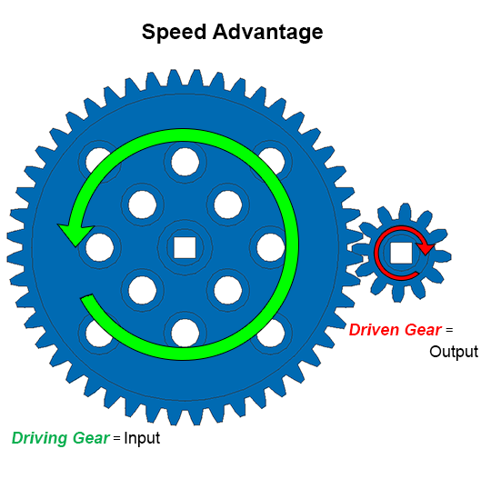

## Table of Contents

## What is speed advantage?

Speed advantage means being faster than others in doing something. It can help in sports, business, or everyday life. For example, a faster runner can win races, or a company that delivers products quicker can get more customers.

Having a speed advantage can make a big difference. In sports, it can mean the difference between winning and losing. In business, being faster can help a company beat competitors and make more money. Speed can also save time in daily tasks, making life easier and more efficient.

## Why is speed important in various fields?

Speed is important in sports because it can help athletes win games and competitions. When someone is faster than others, they can run quicker, swim faster, or react more quickly. This can make a big difference in sports like running, swimming, or even soccer where being fast can help score goals or stop the other team from scoring.

In business, speed is key because it can help companies do things faster than their competitors. For example, a company that can deliver products faster can make customers happier and get more business. Speed can also help in making decisions quickly, which can be important in a fast-changing business world.

In everyday life, speed can make things easier and save time. For instance, cooking a meal faster means more time for other activities. Speed can also help in getting to places on time, like school or work. Overall, being fast can make life more efficient and less stressful.

## How can speed advantage be measured?

Speed advantage can be measured by comparing how fast someone or something is compared to others. For example, in a race, you can time how long it takes each runner to finish. The person who finishes in the least amount of time has a speed advantage. In sports like swimming or cycling, you can use stopwatches or electronic timing systems to see who is the fastest.

In business, speed advantage can be measured by looking at how quickly a company can do things compared to other companies. For example, you can measure how fast a company can deliver a product to a customer. If one company can deliver in two days and another takes five days, the first company has a speed advantage. You can also measure how quickly a company can make decisions or bring a new product to the market.

In everyday life, speed advantage can be seen in simple tasks. For example, if one person can cook a meal in 20 minutes and another takes 40 minutes, the first person has a speed advantage in cooking. You can also measure speed in how quickly someone can get ready in the morning or how fast they can complete chores. By comparing times, you can see who has the speed advantage in different activities.

## What are common techniques to improve speed in sports?

To improve speed in sports, athletes often focus on strength training. This means working out to make their muscles stronger, especially the legs. Stronger muscles help athletes run or move faster. They can do exercises like squats, lunges, and weightlifting. Another important part is improving their running technique. This means learning how to move their arms and legs in the best way to go faster. Coaches often help athletes with this by giving them tips and watching them practice.

Another technique is doing speed drills. These are short, fast exercises that help athletes get quicker. For example, they might do sprints, where they run as fast as they can for a short distance. They can also practice quick changes in direction, which helps in sports like soccer or basketball. Doing these drills regularly can make a big difference in how fast an athlete can move.

Rest and recovery are also key to improving speed. Athletes need to give their bodies time to rest after hard workouts. This helps their muscles get stronger and reduces the chance of getting hurt. Eating the right foods is important too. Foods with lots of protein help muscles grow, and staying hydrated keeps the body working well. By combining all these techniques, athletes can get faster and perform better in their sports.

## How does speed advantage affect performance in business?

Speed advantage in business means a company can do things faster than its competitors. This can help the company make more money and be more successful. For example, if a company can deliver products to customers faster than other companies, customers will be happier and more likely to buy from them again. This can lead to more sales and a bigger market share. Speed can also help in making quick decisions, which is important in a fast-changing business world where being slow can mean losing opportunities.

Another way speed advantage affects business performance is by helping companies bring new products to the market faster. When a company can develop and launch a new product quickly, it can stay ahead of competitors and meet customer needs before others. This can lead to more sales and a stronger position in the market. Overall, having a speed advantage can make a big difference in how well a business does, helping it grow and succeed in a competitive environment.

## What role does technology play in enhancing speed advantage?

Technology helps a lot in making things faster in business. For example, computers and the internet let companies share information quickly. This means they can make decisions faster and get products to customers quicker. Tools like automation can do repetitive tasks faster than people, saving time and money. Also, technology like drones and fast delivery systems can get products to customers in just a few hours, which makes customers happy and gives the company an advantage over others.

In sports, technology also helps improve speed. Special equipment like high-tech running shoes can make athletes run faster. Sensors and wearables can track how fast someone is going and help them train better. Video analysis lets coaches see exactly how an athlete moves and give them tips to get faster. Technology can also help with recovery, like using special machines to help muscles heal faster after hard workouts. Overall, technology plays a big role in helping both businesses and athletes get faster and do better.

## Can speed training benefit everyone, regardless of age or fitness level?

Speed training can help people of all ages and fitness levels, but it needs to be done the right way. For young people and those who are already fit, speed training can make them faster and better at sports. They can do exercises like sprints and strength training to get faster. But they need to be careful not to get hurt and should rest enough between workouts.

For older people or those who are not as fit, speed training can still be good, but it should be done slowly and safely. They can start with easy exercises and slowly do more as they get stronger. It's important for them to listen to their bodies and not push too hard. Speed training can help them move better in everyday life and stay healthy, but they should always talk to a doctor before starting any new exercise program.

## What are the psychological aspects of gaining a speed advantage?

Gaining a speed advantage can make people feel more confident. When someone knows they are faster than others, they feel good about themselves. This can help them do better in sports or at work. For example, a fast runner might feel more sure they can win a race. In business, a company that can deliver products quickly might feel more confident they can beat their competitors. This confidence can make people try harder and do their best.

But there can also be pressure when trying to gain a speed advantage. People might feel stressed about always having to be the fastest. This can make them worry a lot and feel nervous before a race or a big business decision. It's important for people to find a balance and not let the pressure get too big. Taking breaks and staying calm can help them keep their speed advantage without feeling too stressed.

## How do professional athletes maintain and enhance their speed advantage?

Professional athletes work hard to keep and improve their speed advantage. They do this by training a lot and using special techniques. They focus on strength training to make their muscles stronger, especially their legs. They also practice their running or moving technique to make sure they are doing it the best way possible. Coaches help them with this by giving them tips and watching them practice. Athletes also do speed drills, like short, fast runs called sprints, to get quicker. These drills help them move faster in their sport.

Rest and recovery are also important for athletes to keep their speed advantage. They need to rest after hard workouts so their muscles can get stronger and they don't get hurt. Eating the right foods, like those with lots of protein, helps their muscles grow. Staying hydrated is also important to keep their body working well. By using all these methods together, professional athletes can stay fast and perform well in their sports.

## What are the potential risks associated with pursuing speed advantage?

Trying to get faster can be risky. One big risk is getting hurt. When people try to go too fast, they might push their bodies too hard and end up with injuries like muscle strains or even broken bones. This can happen in sports if athletes don't rest enough between workouts or if they don't use the right techniques. In business, trying to work too fast can lead to mistakes that can cost a lot of money or damage the company's reputation.

Another risk is feeling too much pressure. When someone is always trying to be the fastest, they can feel stressed out. This stress can make them worry a lot and feel nervous before a big event. It can also make it hard for them to enjoy what they are doing. Over time, this pressure can lead to burnout, where they feel so tired and stressed that they don't want to keep trying. It's important for people to find a balance and take breaks to avoid these risks.

## How has the concept of speed advantage evolved in different industries over time?

The idea of speed advantage has changed a lot in different industries over time. In the past, speed was mostly about how fast someone could move or how quickly a company could make something. For example, in sports, being a fast runner was a big advantage. In business, a company that could make and deliver products faster than others could do better. But as technology got better, the way we think about speed changed. Now, speed is also about how quickly information can be shared and how fast decisions can be made. Computers and the internet have made it possible for businesses to work faster and for athletes to train better with new tools.

In sports, the focus on speed has grown to include not just running fast, but also quick reactions and fast recovery. Athletes use high-tech equipment and data to get faster and stay ahead. In business, speed advantage now includes things like fast delivery services and quick problem-solving. Companies use automation and digital tools to do things faster than ever before. Overall, the concept of speed advantage has become more complex and important in many industries as technology has advanced.

## What future trends might impact the importance of speed advantage in various sectors?

In the future, speed advantage will become even more important in many sectors because of new technology. For example, in business, things like drones and self-driving cars could make deliveries much faster. This means companies that use these technologies can get their products to customers quicker than others. Also, better computers and internet will let businesses share information and make decisions faster. This can help them stay ahead of their competitors and meet customer needs more quickly.

In sports, new technology will also change how athletes train and compete. Wearable devices and sensors will give more detailed information about how fast athletes are going and how they can improve. This can help them get faster and perform better. Also, virtual reality and other new tools might let athletes practice in new ways, making them quicker and more skilled. Overall, as technology keeps getting better, the importance of speed advantage will grow in many different areas.

## What is the importance of speed in trading?

Speed is a critical [factor](/wiki/factor-investing) in trading, enabling traders to capture fleeting market opportunities before they vanish. The transient nature of market conditions means that even a delay of milliseconds can significantly impact the success of a trade. By swiftly reacting to favorable conditions, traders can enhance their profitability and gain a competitive edge.

Minimizing market impacts is crucial for efficient trading. Speed allows traders to execute large orders without substantially affecting market prices, which optimizes execution costs. This is achieved by entering and exiting positions so rapidly that the market does not have time to adjust, preventing any adverse effects on prices.

Increased speed also leads to improved market [liquidity](/wiki/liquidity-risk-premium). When trades are executed quickly, the frequency of order placements rises, thereby narrowing the bid-ask spread. A narrow spread indicates that the price difference between buyers and sellers is small, which enhances overall market efficiency. This efficiency signifies a healthy market environment where transactions can happen seamlessly, benefiting all market participants.

Arbitrage opportunities are inherently time-sensitive, requiring immediate action to capture price discrepancies across different markets. Speed enables traders to exploit these differences effectively. For example, if an asset is priced lower in one market compared to another, a trader can simultaneously buy it in the cheaper market and sell it in the more expensive one. By doing so almost instantaneously, they profit from the price anomaly before market conditions align.

To illustrate the importance of speed mathematically, consider a simple [arbitrage](/wiki/arbitrage) scenario: let $P_1$ and $P_2$ represent the prices of an asset in two different markets. An arbitrage opportunity exists when $P_1 < P_2$. The profit from executing arbitrage in this situation can be calculated as:

$$
\text{Profit} = (P_2 - P_1) \times Q
$$

where $Q$ represents the quantity traded. The faster the execution, the less likely it is for $P_1$ and $P_2$ to converge, preserving the profit potential. 

In summary, speed is crucial for optimizing trade execution, maintaining market liquidity, and exploiting arbitrage opportunities. Traders equipped with fast, efficient systems can better navigate the fast-paced environment of modern financial markets, maximizing their chances of success.

## References & Further Reading

[1]: Aldridge, I. (2013). ["High-Frequency Trading: A Practical Guide to Algorithmic Strategies and Trading Systems."](https://www.amazon.com/High-Frequency-Trading-Practical-Algorithmic-Strategies/dp/1118343506) Wiley Finance.

[2]: Narang, R. (2013). ["Inside the Black Box: A Simple Guide to Quantitative and High Frequency Trading."](https://onlinelibrary.wiley.com/doi/book/10.1002/9781118662717) Wiley Finance.

[3]: Lauer, C. (2010). ["Algorithmic Trading & DMA: An Introduction to Direct Access Trading Strategies."](https://archive.org/details/algorithmictradi0000john) 4Myeloma Press.

[4]: Kissell, R. (2013). ["The Science of Algorithmic Trading and Portfolio Management."](https://www.sciencedirect.com/book/9780124016897/the-science-of-algorithmic-trading-and-portfolio-management) Academic Press.

[5]: Johnson, B. (2010). ["Algorithmic Trading & High-Frequency Trading."](https://assets.cambridge.org/97811070/91146/frontmatter/9781107091146_frontmatter.pdf) Mercatus Center at George Mason University.