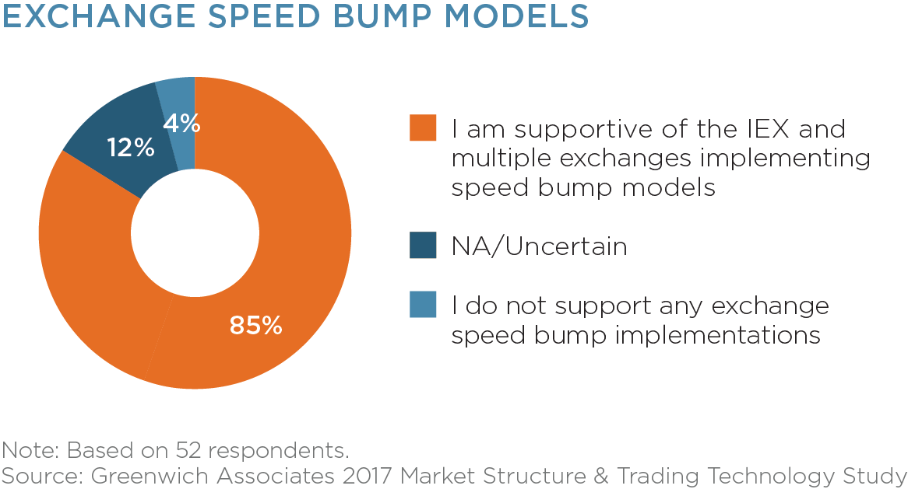

## Table of Contents

## What are speed bumps in trading?

Speed bumps in trading are delays that stock exchanges put in place on purpose. They slow down how fast trades can happen. The idea is to make trading a bit slower so that everyone has a fairer chance. Without speed bumps, some traders with really fast computers and technology might get an advantage over others.

These speed bumps are meant to help smaller traders and make the market more equal. Big traders with fancy technology can usually trade very quickly. But with speed bumps, everyone has to wait a bit longer before their trade goes through. This can stop the big traders from using their speed to make more money than others. Some people think speed bumps are good for fairness, but others think they might make trading less efficient.

## How do speed bumps affect the trading process?

Speed bumps in trading make the process a bit slower on purpose. When you want to buy or sell something on an exchange with speed bumps, you have to wait a little bit before your trade goes through. This delay is usually just a few milliseconds, but it can change how people trade. Big traders with fast computers might not be able to use their speed to get ahead of others as easily. This means everyone has to think a bit more before they make a trade, because they can't rely on being the fastest.

This change can make the market feel more fair to smaller traders who don't have fancy technology. They get a better chance to compete because everyone has to wait the same amount of time. But, some people think that speed bumps might make trading less efficient. They argue that slowing down trades can make the market less lively and might stop people from trading as much. So, while speed bumps aim to level the playing field, they also bring some challenges to how smoothly and quickly trading happens.

## Why were speed bumps introduced in financial markets?

Speed bumps were introduced in financial markets to make trading more fair for everyone. Before speed bumps, big traders with fast computers could make trades very quickly. This gave them an advantage over smaller traders who didn't have the same technology. By adding a small delay to all trades, speed bumps help level the playing field. Now, everyone has to wait the same amount of time before their trade goes through, so no one can use super fast technology to get ahead.

Some people think speed bumps are a good idea because they help smaller traders compete better. But others worry that these delays might make trading less efficient. When trades are slowed down, the market might not be as lively, and some traders might not want to trade as much. So, while speed bumps aim to make trading fairer, they also bring some challenges to how smoothly and quickly the market works.

## What are the benefits of speed bumps for traders?

Speed bumps help make trading fairer for everyone. Big traders with fast computers used to be able to make trades very quickly, which gave them an advantage over smaller traders. But with speed bumps, everyone has to wait a little bit before their trade goes through. This means smaller traders have a better chance to compete because they aren't at a speed disadvantage anymore. It levels the playing field so that everyone can trade on more equal terms.

Another benefit is that speed bumps can reduce the chaos in the market. When everyone is trying to trade as fast as possible, it can lead to a lot of quick buying and selling that can make the market feel unpredictable. By slowing things down a bit, speed bumps help create a more stable environment where traders can make more thoughtful decisions. This can lead to a more orderly market where prices are less likely to swing wildly due to rapid trading.

## Can speed bumps be considered a form of market manipulation?

Speed bumps are not usually seen as a form of market manipulation. They are rules set by stock exchanges to make trading fairer for everyone. Big traders with fast computers used to have an advantage over smaller traders. Speed bumps slow down trades a little bit so everyone has to wait the same amount of time. This helps level the playing field and stops big traders from using their speed to make more money than others.

Some people might think that speed bumps could be a type of manipulation because they change how the market works. But the main goal of speed bumps is to make the market more fair, not to trick or harm traders. They are meant to help smaller traders and make the market more stable. So, while speed bumps do change how trading happens, they are not usually seen as a bad kind of manipulation.

## How do speed bumps impact high-frequency trading?

Speed bumps make it harder for high-frequency traders to do what they do best: trade very fast. High-frequency trading uses super fast computers to buy and sell things in just a few milliseconds. But with speed bumps, everyone has to wait a little bit before their trade goes through. This means high-frequency traders can't use their speed to make money as easily as before. They have to think more about their trades because they can't rely on being the fastest anymore.

This change can be frustrating for high-frequency traders because their whole strategy is based on being quick. They might find it harder to make a profit if they can't trade at lightning speed. But, speed bumps help make the market more fair for everyone. Smaller traders who don't have fancy technology get a better chance to compete because everyone has to wait the same amount of time. So, while speed bumps might slow down high-frequency trading, they help make the market more equal for all traders.

## What are the different types of speed bumps used in trading?

There are a few different types of speed bumps used in trading. One type is called a "random delay." This means that when you want to trade, you have to wait for a random amount of time before your trade goes through. This makes it hard for traders with fast computers to predict when their trades will happen, so they can't use their speed to get ahead. Another type is a "fixed delay," where everyone has to wait the same amount of time before their trade is processed. This makes the market more fair because no one can trade faster than anyone else.

Another type of speed bump is called a "queue-based delay." With this type, trades are put in a line and processed one at a time. This means that even if you have a fast computer, you still have to wait your turn. This helps stop big traders from flooding the market with lots of quick trades. All these types of speed bumps aim to make trading more fair for everyone by slowing things down a bit.

## How do exchanges implement speed bumps?

Exchanges implement speed bumps by adding a small delay to trades. This delay can be random, where each trade has to wait a different amount of time before it goes through. This makes it hard for traders with fast computers to predict when their trades will happen, so they can't use their speed to get ahead. Another way is to use a fixed delay, where everyone has to wait the same amount of time. This makes the market more fair because no one can trade faster than anyone else.

Another method exchanges use is called a queue-based delay. With this type, trades are put in a line and processed one at a time. Even if you have a fast computer, you still have to wait your turn. This helps stop big traders from flooding the market with lots of quick trades. All these methods aim to make trading more fair for everyone by slowing things down a bit.

## What are the regulatory perspectives on speed bumps in trading?

Regulators have different views on speed bumps in trading. Some regulators think speed bumps are good because they make the market more fair. They help smaller traders who don't have fancy technology to compete better with big traders. By slowing down trades a little bit, speed bumps stop big traders from using their speed to make more money than others. This can make the market feel more equal for everyone.

But other regulators worry that speed bumps might make trading less efficient. They think that slowing down trades can make the market less lively and might stop people from trading as much. Some also worry that speed bumps could be seen as a type of market manipulation because they change how the market works. So, while some regulators support speed bumps for fairness, others are concerned about their impact on the market's efficiency and overall health.

## How do speed bumps influence market liquidity?

Speed bumps can make the market less liquid. Liquidity means how easy it is to buy or sell things without changing the price too much. When trades are slowed down, some traders might not want to trade as much. They might think it's too hard or too slow to make money. This can mean fewer people are buying and selling, which makes the market less lively and can make it harder to trade quickly.

On the other hand, speed bumps can also help keep the market stable. When everyone is trying to trade very fast, it can lead to a lot of quick buying and selling that can make prices go up and down a lot. Speed bumps slow things down and help create a more orderly market. This can make some traders feel more comfortable trading, which might help keep [liquidity](/wiki/liquidity-risk-premium) at a good level. So, while speed bumps might reduce some quick trading, they can also help keep the market calm and steady.

## What are the global variations in the use of speed bumps?

Different countries have different ways of using speed bumps in trading. In the United States, the IEX (Investors Exchange) was one of the first to use speed bumps. They added a small delay to trades to make the market more fair for everyone. This idea became popular, and other exchanges in the U.S. started thinking about it too. But not all countries use speed bumps the same way. For example, in Europe, some exchanges like the London Stock Exchange have talked about using speed bumps, but they haven't used them as much as in the U.S.

In Asia, the use of speed bumps is still pretty new. Some exchanges in places like Hong Kong and Singapore are looking at using them, but they are still figuring out if it's a good idea. They want to make sure that speed bumps will help their markets without causing too many problems. Overall, the use of speed bumps around the world is different because each country has its own rules and ideas about what makes a fair and efficient market.

## What are the future trends and potential developments regarding speed bumps in trading?

In the future, more stock exchanges around the world might start using speed bumps. They see that speed bumps can make trading more fair for everyone, especially for smaller traders who don't have fancy technology. But, they also want to make sure that speed bumps don't make trading too slow or less efficient. So, they might try different types of speed bumps, like random delays or fixed delays, to see what works best for their markets. They might also use technology to make speed bumps smarter, so they can change how long the delay is based on what's happening in the market.

Another trend could be that regulators will have more to say about speed bumps. Some regulators like the idea of speed bumps because they help make the market more fair. But others worry that speed bumps might make trading less lively and could be seen as a type of market manipulation. So, in the future, regulators might set new rules about how speed bumps can be used. They might also work with exchanges to find the best way to use speed bumps without causing too many problems. This could lead to a more balanced approach where speed bumps help make trading fair but don't hurt the market's overall health.

## References & Further Reading

[1]: Budish, E., Cramton, P., & Shim, J. (2015). ["The High-Frequency Trading Arms Race: Frequent Batch Auctions as a Market Design Response."](https://academic.oup.com/qje/article/130/4/1547/1916146) The Quarterly Journal of Economics, 130(4), 1547–1621.

[2]: Aldridge, I. (2013). ["High-Frequency Trading: A Practical Guide to Algorithmic Strategies and Trading Systems."](https://www.wiley.com/en-us/High+Frequency+Trading%3A+A+Practical+Guide+to+Algorithmic+Strategies+and+Trading+Systems%2C+2nd+Edition-p-9781118343500) John Wiley & Sons.

[3]: MacKenzie, D. (2019). ["Material signals: A historical sociology of high-frequency trading."](https://www.sps.ed.ac.uk/sites/default/files/assets/pdf/material-signals.pdf) Theory, Culture & Society, 36(4), 105–126.

[4]: Angel, J. J., Harris, L. E., & Spatt, C. S. (2015). ["Equity Trading in the 21st Century."](https://papers.ssrn.com/sol3/papers.cfm?abstract_id=1584026) Review of Financial Studies, 24(4), 1365-1403.

[5]: Easley, D., & O'Hara, M. (1987). ["Price, Trade Size, and Information in Securities Markets."](https://www.sciencedirect.com/science/article/pii/0304405X87900298) Journal of Financial Economics, 19(1), 69–90.