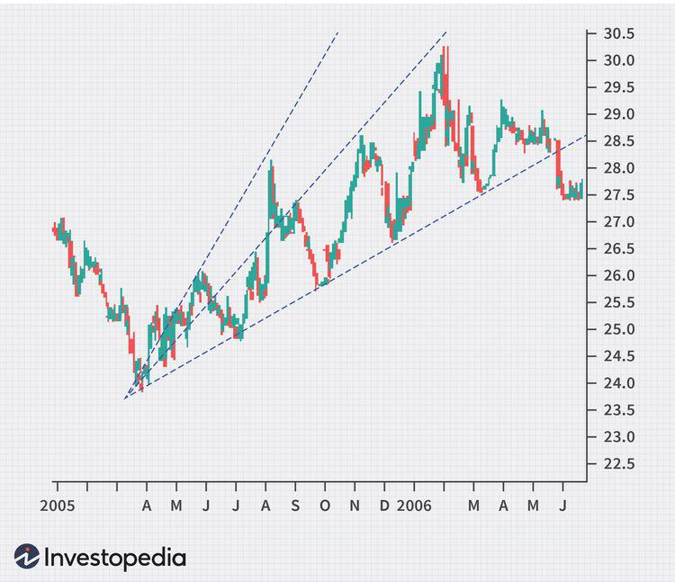

## Table of Contents

## What are Speed Resistance Lines and how are they used in technical analysis?

Speed Resistance Lines, often called Speed Lines, are a tool used in technical analysis to predict future price movements of stocks or other financial assets. They were developed by Edson Gould, who believed that prices tend to move in predictable patterns. To create Speed Lines, you first identify a significant price peak or trough on a chart. Then, you draw three lines from that point: one at a 45-degree angle, one at a 60-degree angle, and one at a 30-degree angle. These lines help traders see where prices might go next based on past movements.

Traders use Speed Resistance Lines to spot potential support and resistance levels. If the price of an asset hits one of these lines and bounces off it, that line is acting as support or resistance. For example, if the price touches the 45-degree line and starts to go up again, traders might see this as a buying opportunity, thinking the price will keep rising. On the other hand, if the price breaks through a Speed Line, it could mean a bigger change in the trend is coming. By watching how prices interact with these lines, traders can make better decisions about when to buy or sell.

## Who developed Speed Resistance Lines and what was their original purpose?

Speed Resistance Lines were developed by a man named Edson Gould. He was an analyst who wanted to help people predict where stock prices might go next. Gould thought that by looking at past price movements, you could draw lines that would show where prices might hit in the future.

The original purpose of Speed Resistance Lines was to help traders find good times to buy or sell stocks. Gould believed these lines could show where prices might stop or change direction. By drawing these lines on a chart, traders could see if a stock's price was likely to go up, down, or stay the same, and make their trading decisions based on that.

## How do you construct Speed Resistance Lines on a price chart?

To construct Speed Resistance Lines on a price chart, you first need to pick a big high or low point on the chart. This could be the highest price a stock reached in the last few months or the lowest price it dropped to. Once you have that point, you draw three lines from it. The first line goes straight up or down at a 45-degree angle. The second line is steeper, at a 60-degree angle, and the third line is less steep, at a 30-degree angle. These lines help you see where the price might go next.

After you draw these lines, you watch how the price moves around them. If the price touches one of these lines and then starts going the other way, that line is acting like a wall, either holding the price up or pushing it down. Traders use these lines to decide when to buy or sell. If the price hits the 45-degree line and bounces back up, it might be a good time to buy because the price could keep going up. But if the price breaks through one of these lines, it might mean the price is going to keep moving in that direction, so traders might want to sell or buy more based on that.

## What are the key levels of Speed Resistance Lines and what do they signify?

Speed Resistance Lines have three main levels: the 45-degree line, the 60-degree line, and the 30-degree line. These lines help traders see where the price of a stock might go next. The 45-degree line is the middle line and is often seen as the most important because it shows a balanced move in the price. The 60-degree line is steeper and shows a faster move in the price, while the 30-degree line is less steep and shows a slower move.

When the price of a stock touches one of these lines and then bounces back, it means the line is acting like a wall. For example, if the price hits the 45-degree line and goes back up, it might be a good time to buy because the price could keep going up. If the price breaks through one of these lines, it might mean the price will keep moving in that direction. Traders use these lines to decide when to buy or sell based on how the price is moving around them.

## Can Speed Resistance Lines be applied to any financial market or asset?

Yes, Speed Resistance Lines can be used in many different financial markets and for different assets. This includes stocks, [forex](/wiki/forex-system), commodities, and even cryptocurrencies. The idea behind Speed Resistance Lines is to look at past price movements and predict where the price might go next. Because this idea works the same way in different markets, traders can use Speed Resistance Lines no matter what they are trading.

The key is to find a big high or low point on the price chart and then draw the lines from there. Whether you're looking at a chart for gold prices, the value of the Euro against the Dollar, or the price of a tech stock, the process is the same. By watching how the price moves around these lines, traders can make decisions about buying or selling. This makes Speed Resistance Lines a useful tool for anyone trading in financial markets.

## How do Speed Resistance Lines help in identifying potential support and resistance levels?

Speed Resistance Lines help traders find where the price of a stock or other asset might stop going up or down. These lines are drawn from a big high or low point on a chart. When the price touches one of these lines and then bounces back, it means the line is acting like a wall. This wall is called a support if it stops the price from falling more, or resistance if it stops the price from going up more. Traders watch these lines to see if the price will hit them and change direction, which can help them decide when to buy or sell.

For example, if the price hits the 45-degree line and starts going up again, traders might see this as a buying opportunity because the price might keep rising. On the other hand, if the price breaks through a Speed Line, it could mean a bigger change in the trend is coming. By watching how prices interact with these lines, traders can get a better idea of where the price might go next and make better decisions about their trades.

## What are the common strategies traders use with Speed Resistance Lines?

Traders use Speed Resistance Lines to find good times to buy or sell. One common strategy is to wait for the price to hit the 45-degree line. If the price touches this line and then starts going up again, traders might buy the stock because they think the price will keep rising. This is because the 45-degree line often acts like a support level, stopping the price from falling more. On the other hand, if the price breaks through the 45-degree line and keeps going down, traders might sell because they think the price will keep falling.

Another strategy is to watch the 60-degree and 30-degree lines. If the price hits the 60-degree line and bounces back, it might mean the price is moving fast and could keep going up. Traders might buy more to take advantage of this quick move. But if the price breaks through the 60-degree line, it could be a sign that the price will keep going up even faster, so traders might buy even more. If the price touches the 30-degree line and bounces back, it might mean the price is moving slowly, and traders might not want to buy as much because the price might not go up as fast.

By using these lines, traders can make better guesses about where the price might go next. They can use this information to decide when to buy or sell, helping them make more money in the market.

## How do Speed Resistance Lines compare to other technical analysis tools like Fibonacci retracement?

Speed Resistance Lines and Fibonacci retracement are both tools used in technical analysis to help traders predict where prices might go next, but they work in different ways. Speed Resistance Lines are drawn from a big high or low point on a chart at angles of 45, 60, and 30 degrees. Traders use these lines to find where the price might stop or change direction. If the price hits one of these lines and bounces back, it could be a good time to buy or sell. On the other hand, Fibonacci retracement uses a set of numbers called the Fibonacci sequence to find levels where the price might stop. Traders draw lines at these levels, like 23.6%, 38.2%, 50%, 61.8%, and 100%, to see where the price might find support or resistance.

While both tools help traders spot potential support and resistance levels, they are based on different ideas. Speed Resistance Lines look at the speed of price movements and use fixed angles to predict future moves. This can be helpful for traders who want to see how fast the price is moving and make quick decisions. Fibonacci retracement, however, is based on the idea that prices often retrace a part of their previous move before continuing in the same direction. This tool can be useful for traders who want to see how far the price might pull back before moving again. Both tools can be used together to get a better picture of where the price might go next.

## What are the limitations and potential pitfalls of using Speed Resistance Lines?

Speed Resistance Lines are helpful, but they have some limits. One big problem is that they are not always right. The price might not always stop at the lines you draw, so you can't always trust them to tell you exactly where the price will go. Also, these lines depend a lot on the point you pick to start drawing them. If you pick a different high or low point, the lines will be different, and you might get different ideas about where the price will go. This can make it hard to know which lines to trust.

Another thing to watch out for is that Speed Resistance Lines work best when the market is moving in a clear direction. If the market is moving up and down a lot without a clear trend, these lines might not help much. They are also not very good at predicting big, sudden changes in the market. If something unexpected happens, like a big news event, the price can move in ways that the lines don't predict. So, it's important to use Speed Resistance Lines along with other tools and to always be ready for surprises in the market.

## How can one adjust Speed Resistance Lines to account for different market conditions?

Speed Resistance Lines can be tweaked to work better in different market conditions by changing the starting point you use to draw them. If the market is moving fast, you might want to start your lines from a recent high or low point. This way, the lines will be more in line with the current market speed. But if the market is moving slowly or not much at all, you might want to use a high or low point from further back. This can help you see longer-term trends and where the price might go in the future.

Another way to adjust Speed Resistance Lines is to watch how the price acts around them. If the price keeps breaking through the lines you drew, it might mean you need to draw new lines from a different point. Also, you can use other tools like moving averages or trend lines to help you see what the market is doing. By mixing Speed Resistance Lines with other tools, you can get a better idea of where the price might go next and make smarter trading choices.

## What advanced techniques can be used to enhance the effectiveness of Speed Resistance Lines?

One advanced technique to make Speed Resistance Lines more effective is to use them with other technical analysis tools. For example, you can combine Speed Resistance Lines with moving averages to get a better picture of the market trend. Moving averages help smooth out price data over time, so by using them with Speed Resistance Lines, you can see if the price is following the trend or if it's about to change direction. Another tool that can help is the Relative Strength Index (RSI), which shows if a stock is overbought or oversold. If the RSI shows the stock is overbought and the price hits a Speed Resistance Line, it might be a good time to sell.

Another way to improve the use of Speed Resistance Lines is to adjust them based on different time frames. For short-term trading, you might draw Speed Resistance Lines on a daily chart to catch quick price movements. But for longer-term investing, you could use a weekly or monthly chart to see bigger trends. By looking at different time frames, you can get a better idea of where the price might go next. Also, you can try drawing multiple sets of Speed Resistance Lines from different high and low points to see if they all point to the same support and resistance levels. If they do, it can give you more confidence in your trading decisions.

## How do you backtest the performance of Speed Resistance Lines in trading strategies?

To backtest the performance of Speed Resistance Lines in trading strategies, you need to look at past price data and see how well the lines would have worked if you used them to make trading decisions. Start by [picking](/wiki/asset-class-picking) a time period and a stock or asset to study. Then, draw Speed Resistance Lines on the chart for that time period, using big highs or lows as your starting points. Next, set up rules for when you would buy or sell based on the lines. For example, you might decide to buy when the price hits the 45-degree line and starts going up again, or sell if the price breaks through the line and keeps going down. After setting your rules, go through the price data and see how your trades would have turned out.

Once you have your results, you can see if using Speed Resistance Lines would have made you money or not. Look at things like how much you would have made or lost on each trade, how often your trades were successful, and how long you had to wait for the price to move in your favor. If the results are good, it might mean that Speed Resistance Lines could work well in your trading strategy. But if the results are bad, you might need to change your rules or use other tools along with Speed Resistance Lines to make better trading decisions. Backtesting helps you see what works and what doesn't before you start using the strategy with real money.

## References & Further Reading

[1]: ["Technical Analysis of the Financial Markets: A Comprehensive Guide to Trading Methods and Applications"](https://www.amazon.com/Technical-Analysis-Financial-Markets-Comprehensive/dp/0735200661) by John J. Murphy

[2]: ["Technical Analysis Explained: The Successful Investor's Guide to Spotting Investment Trends and Turning Points"](https://www.amazon.com/Technical-Analysis-Explained-Fifth-Successful/dp/0071825177) by Martin J. Pring

[3]: Bulkowski, T. (2005). ["Encyclopedia of Chart Patterns."](https://www.wiley.com/en-us/Encyclopedia+of+Chart+Patterns,+3rd+Edition-p-9781119739685) Wiley Trading.

[4]: Wilder Jr, J. W. (1978). ["New Concepts in Technical Trading Systems."](https://archive.org/details/newconceptsintec00wild) Trend Research.

[5]: [Investopedia's Guide on Technical Analysis](https://www.investopedia.com/technical-analysis-basic-education-4689655)