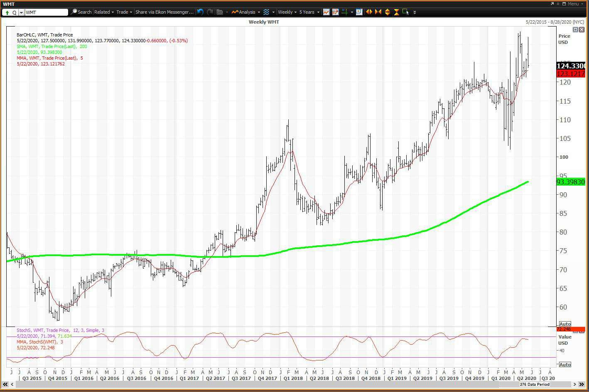

In the fast-paced world of financial markets, volatility and price spikes are common phenomena that traders and investors encounter frequently. These fluctuations can be both daunting and rewarding, affecting decision-making processes and market strategies. Understanding these fluctuations is crucial for anyone involved in the financial markets to make informed decisions. Failure to grasp the nature of volatility and sudden price movements can lead to substantial financial losses, especially in highly dynamic trading environments.

This article explores the dynamics of market volatility, the occurrence of price spikes, and the role of algorithmic trading in shaping these events. Volatility is inherent in financial markets due to various factors such as economic indicators, geopolitical tensions, and investor sentiment. These variables, when combined with technological advancements in trading, create a complex landscape that requires careful navigation.

Algorithmic trading, a significant advancement in recent decades, plays a crucial role in how volatility and price spikes are manifested. These automated trading strategies can execute large volumes of trades with speed and precision, consequently influencing market stability. By analyzing the interplay between human and algorithm-driven trades, we aim to provide valuable insights into how these factors interact and influence market behavior.

By the end of this article, you will have a better grasp of volatility, spikes, and how to navigate them effectively. Whether you are an experienced trader or a novice investor, understanding these elements is key to capitalizing on market opportunities while mitigating associated risks. As we proceed, we will unravel the intricacies of market dynamics to equip you with the knowledge necessary for strategic decision-making in the ever-evolving financial landscape.

## Table of Contents

## Understanding Financial Market Volatility

Volatility refers to the degree of variation in the price of a financial instrument over time. This characteristic is a statistical measure often quantified through metrics such as standard deviation or variance of returns. High volatility generally signals heightened uncertainty within the market, resulting in larger price changes over short periods. 

The relevance of understanding volatility extends to all financial instruments, including stocks, bonds, and commodities. It is integral for investors to grasp the dynamics of volatility to both anticipate market movements and manage investment risks effectively. For example, stock market volatility can often be captured through the computation of historical or implied volatility. Historical volatility is derived from past market prices, whereas implied volatility is derived from market prices of options, reflecting the market's view on future volatility.

A key mathematical representation of [volatility](/wiki/volatility-trading-strategies) is the standard deviation of returns, calculated as:

$$
\sigma = \sqrt{\frac{1}{N-1} \sum_{i=1}^{N} (R_i - \bar{R})^2}
$$

Where $\sigma$ represents the standard deviation, $N$ is the total number of observations, $R_i$ is the return for each period, and $\bar{R}$ is the mean return over the periods considered.

Volatility is influenced by several factors, including changes in macroeconomic indicators, interest rates, corporate earnings reports, geopolitical events, and changes in market sentiment. For instance, unexpected economic announcements or geopolitical tensions can lead to elevated levels of volatility. Similarly, shifts in investor sentiment or financial crises can heighten market uncertainty, leading to significant price swings.

Understanding volatility and its underlying causes allows market participants to implement risk management strategies, such as diversification and hedging. Furthermore, employing tools like the Cboe Volatility Index (VIX), often referred to as the "fear index," can be beneficial in gauging market expectations of near-term volatility conveyed by S&P 500 option prices.

In conclusion, comprehending financial market volatility is paramount for anticipating market dynamics and devising strategies to mitigate associated risks.

## What Causes Price Spikes?

Price spikes are defined by abrupt and pronounced changes in market prices, either upwards or downwards. These fluctuations are frequently instigated by unforeseen occurrences, such as pivotal economic reports, geopolitical tensions, or significant corporate announcements. Economic reports can introduce spikes by revealing information that contradicts market expectations, leading investors to adjust their positions swiftly. For instance, an unexpected change in employment figures or [interest rate](/wiki/interest-rate-trading-strategies) announcements can sharply impact financial markets, causing rapid price adjustments.

Geopolitical tensions, such as conflicts or diplomatic shifts, can likewise provoke anxiety among market participants, resulting in abrupt changes in asset pricing. Similarly, corporate announcements, particularly those relating to financial results, mergers, or regulatory scrutiny, can suddenly alter investor sentiment, either positively or negatively.

A price spike can be further exacerbated by a high [volume](/wiki/volume-trading-strategy) of trades executed within a compressed timeframe, which can overwhelm the market’s [order book](/wiki/order-book-trading-strategies). When the demand for an asset suddenly surpasses available supply, or vice versa, it leads to rapid price movements. Algorithmic trading also plays a pivotal role in causing price spikes. These algorithms execute large volumes of trades based on pre-established criteria, and they operate at speeds much faster than human traders. During periods of market stress or anomalies, [algorithmic trading](/wiki/algorithmic-trading) systems can potentially amplify price movements by executing numerous transactions in fractions of a second, responding instantaneously to market conditions.

Understanding the root causes of such price dynamics provides traders with the ability to either capitalize on or avoid potential market pitfalls. By deploying strategies that account for the triggers of price spikes, traders can better position themselves to navigate volatile markets. For example, if a trader anticipates a significant economic announcement, they might adopt a cautious stance or utilize derivative instruments like options to hedge against potential adverse movements. Thus, the ability to recognize and respond to the catalysts of price spikes is a valuable skill in market strategy.

## The Role of Algorithmic Trading in Market Volatility

Algorithmic trading, commonly referred to as 'algo trading,' utilizes computer algorithms to execute trading orders at high speed and frequency, reacting swiftly to market data. The primary advantage of algorithmic trading lies in its ability to process vast amounts of data and execute trades within fractions of a second, far beyond human capabilities. This speed and efficiency make algo trading a dominant force in today's financial markets.

Despite its advantages, algorithmic trading is often associated with increased market volatility. The rapid execution of trades, often in response to market anomalies, can lead to significant price fluctuations. Algorithms can execute thousands of trades per second, magnifying errors or unforeseen events and potentially exacerbating market swings. For instance, during market stress, if multiple algorithms act simultaneously based on similar triggers, the ensuing flurry of buy or sell orders can amplify volatility.

However, algorithmic trading also contributes positively by enhancing market [liquidity](/wiki/liquidity-risk-premium). With the ability to provide continuous [market making](/wiki/market-making) and quick execution, algorithms help tighten bid-ask spreads, which can lead to more efficient pricing for all market participants. The presence of algorithmic traders can thus improve the overall market conditions by ensuring that buyers and sellers can transact more readily and at more favorable prices.

For traders and investors operating in a dynamic trading environment, understanding the mechanics of algorithmic trading is crucial. Algorithmic systems leverage various strategies, such as [arbitrage](/wiki/arbitrage), [trend following](/wiki/trend-following), and [statistical arbitrage](/wiki/statistical-arbitrage). Adapting trading strategies to align with these algorithmic behaviors can be advantageous. Traders might need to develop their own algorithmic strategies or ensure their trades are designed to work in harmony with prevailing market algorithms to avoid adverse impacts.

Moreover, the rise of [machine learning](/wiki/machine-learning) and [artificial intelligence](/wiki/ai-artificial-intelligence) in trading algorithms adds another layer of complexity. Advanced algorithms can learn and adapt their trading strategies based on past market behaviors and evolving conditions. This evolution necessitates that traders continuously enhance their understanding and adaptability to maintain efficacy in the marketplace.

In summary, while algorithmic trading plays a significant role in shaping market volatility, it also offers numerous benefits by providing liquidity and improving market efficiency. Traders must be agile and well-informed about how these algorithms function to effectively navigate the fast-paced and complex landscape of modern financial markets.

## Real-World Examples of Price Spikes and Volatility

Historical market events serve as critical touchpoints in understanding the dynamics of price spikes and volatility. Black Monday, on October 19, 1987, exemplifies extreme market volatility, where the Dow Jones Industrial Average (DJIA) plunged by about 22% in a single day.[^1^] This event was precipitated by a mix of factors, including panic selling and the widespread use of automated trading systems that triggered large-scale sell-offs, exacerbating the downward spiral.[^2^] The repercussions were widespread, leading to regulatory changes and the development of mechanisms like circuit breakers to mitigate future occurrences.

The 2020 COVID-19 pandemic crash provides a more recent example of market volatility on a global scale.[^3^] As the pandemic led to worldwide lockdowns and economic uncertainty, financial markets experienced dramatic declines. In March 2020, the S&P 500 endured several days of the steepest declines since the Great Depression, with algorithmic trading amplifying the rapid sell-offs.[^4^] Governments and central banks intervened by implementing fiscal and monetary measures to stabilize the markets, which underscored the interconnected nature of modern financial systems.

Positive events can also induce upward price spikes. For instance, the anticipation and subsequent launch of Bitcoin Exchange-Traded Funds (ETFs) have led to significant increases in Bitcoin's market value.[^5^] The perceived validation of [cryptocurrency](/wiki/cryptocurrency) as a legitimate asset class contributes to increased investor interest, driving up prices.

These instances underscore the impact of systemic events on market conditions and highlight the necessity of effective volatility management strategies. By analyzing historical events, traders and investors gain insights into market behavior, allowing them to prepare for future volatility. Understanding how past spikes and volatile periods unfolded aids in developing strategies for adaptation and mitigation, such as diversification and hedging, to better navigate unpredictable market dynamics.

[^1^]: R. Ferguson, "The Crash of 1987," The Journal of Economic History, vol. 48, no. 1, 1988.
[^2^]: E. French, "Stock Volatility and the Crash of 1987," Review of Financial Studies, vol. 3, no. 1, 1990.
[^3^]: K. Rogoff, "The Coronavirus Debt Threat," Project Syndicate, April 2020.
[^4^]: J. Müller, "COVID-19 and Financial Markets," Economic Policy Review, vol. 26, no. 1, 2020.
[^5^]: A. Balchunas, “Bitcoin ETF Mania Is Here: What You Really Need to Know,” Bloomberg, October 2021.

## Mitigating the Risks of Volatility and Price Spikes

To mitigate risks associated with volatility and price spikes, investors can employ a combination of strategic approaches to ensure stability and minimize potential losses. Diversification and hedging are two fundamental techniques that can help reduce exposure to volatile market movements. Diversification involves spreading investments across different asset classes, sectors, or geographical regions, thereby lowering the impact of any single asset's poor performance on the overall portfolio. Hedging, on the other hand, uses financial instruments like options and futures to offset potential losses in existing positions.

Using stop-loss orders is another critical strategy that safeguards against unforeseen adverse price movements. A stop-loss order automatically sells a security when its price falls below a specified level, thus limiting the investor's potential loss. Maintaining adequate liquidity also ensures that investors can react quickly to market changes without being forced to sell assets at unfavorable prices.

Staying informed about market trends and economic indicators is essential for anticipating changes in volatility and making informed decisions. By analyzing data such as interest rates, inflation, and employment figures, investors can gain valuable insights into market conditions and adjust their strategies accordingly.

Volatility indexes like the VIX, often referred to as the "fear gauge," are effective tools for assessing market volatility levels. The VIX reflects the market's expectation of volatility over the next 30 days and can serve as a benchmark for investors to prepare adequate risk management measures. A high VIX value indicates increased uncertainty, prompting investors to adjust their portfolios accordingly.

Successful traders recognize that volatility is an inherent part of financial markets and adapt their strategies to navigate uncertain periods effectively. By leveraging technology, continuously updating their knowledge, and implementing strategic planning, market participants can enhance their ability to manage risk and capitalize on volatility. As financial markets continue to evolve, maintaining flexibility and staying informed will be vital for successfully navigating the complexities of trading amidst volatility.

## Conclusion

Market volatility and price spikes are inherent traits of financial markets, driven by a myriad of factors including algorithmic trading. Recognizing and understanding these dynamics is crucial for traders and investors, as it empowers them to make informed and strategic decisions. A comprehensive understanding of how various elements such as economic indicators, geopolitical events, and trading technologies interplay allows market participants to anticipate potential market movements and react appropriately.

While market volatility can pose challenges, it concurrently offers opportunities for astute traders to exploit market inefficiencies and capitalize on price movements. For instance, during periods of high volatility, price discrepancies often arise, which can be leveraged for profit through strategies such as arbitrage or trend following. The key is to maintain a strategic approach that combines rigorous data analysis with timely execution.

In modern financial markets, leveraging technology and access to vast amounts of information is critical. By utilizing algorithmic trading systems, traders can not only execute trades with precision but also manage risk more effectively through techniques such as diversification and hedging. Creating algorithms that incorporate parameters for volatility thresholds and executing pre-defined strategies when these thresholds are met can help mitigate risks associated with sudden market swings.

As financial markets continue to evolve, staying agile and informed is essential for navigating the complexities of trading volatility. Continuous learning and adaptation to new trends, technologies, and market conditions will equip traders and investors with the tools necessary to maintain a competitive edge. It is vital for market participants to cultivate a mindset that embraces the dynamic nature of markets, allowing them to harness volatility to their advantage and sustain long-term success.

## References & Further Reading

[1]: Bergstra, J., Bardenet, R., Bengio, Y., & Kégl, B. (2011). ["Algorithms for Hyper-Parameter Optimization."](https://papers.nips.cc/paper/4443-algorithms-for-hyper-parameter-optimization) Advances in Neural Information Processing Systems 24.

[2]: ["Advances in Financial Machine Learning"](https://www.amazon.com/Advances-Financial-Machine-Learning-Marcos/dp/1119482089) by Marcos Lopez de Prado

[3]: ["Evidence-Based Technical Analysis: Applying the Scientific Method and Statistical Inference to Trading Signals"](https://www.amazon.com/Evidence-Based-Technical-Analysis-Scientific-Statistical/dp/0470008741) by David Aronson

[4]: ["Machine Learning for Algorithmic Trading"](https://github.com/stefan-jansen/machine-learning-for-trading) by Stefan Jansen

[5]: ["Quantitative Trading: How to Build Your Own Algorithmic Trading Business"](https://www.amazon.com/Quantitative-Trading-Build-Algorithmic-Business/dp/1119800064) by Ernest P. Chan