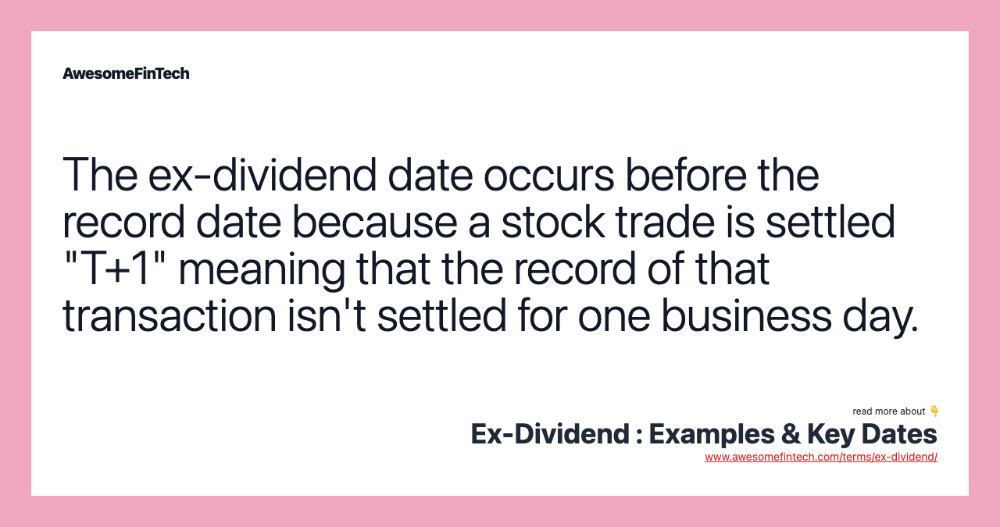

## Table of Contents

## What is a spillover dividend?

A spillover dividend is a type of dividend that a company pays out to its shareholders from the earnings of the previous year. This happens when a company has more earnings than it can distribute in the current year, so it carries over the extra earnings to the next year and pays them out as a dividend.

This kind of dividend is common in industries like real estate investment trusts (REITs), where companies are required to distribute most of their income to shareholders. Spillover dividends help these companies meet their distribution requirements and provide shareholders with a steady income stream.

## How does a spillover dividend differ from a regular dividend?

A spillover dividend and a regular dividend both give money to shareholders, but they come from different places. A regular dividend is paid out from the earnings of the current year. Companies decide how much of their current profits they want to share with shareholders, and that amount is the regular dividend.

On the other hand, a spillover dividend is paid from the earnings of the previous year. Sometimes a company can't pay out all its earnings in one year, so it saves the extra and gives it to shareholders the next year as a spillover dividend. This helps companies, especially in industries like real estate, to make sure they are sharing enough of their profits with shareholders over time.

## Why do companies issue spillover dividends?

Companies issue spillover dividends because they sometimes have more earnings than they can give out in one year. Instead of keeping all that extra money, they save it and give it to shareholders the next year. This helps them share their profits in a fair way over time.

Spillover dividends are especially important for companies in certain industries, like real estate investment trusts (REITs). These companies have rules that say they must give most of their income to shareholders. By using spillover dividends, these companies can make sure they follow the rules and keep their shareholders happy with regular payments.

## Can you explain the tax implications of receiving a spillover dividend?

When you get a spillover dividend, you need to think about taxes. The tax rules can be a bit different for spillover dividends compared to regular dividends. Usually, spillover dividends are taxed in the year you get them, not the year the company earned the money. This means you might have to pay taxes on money you receive in one year, even though the company made it in a different year.

The tax rate you pay on a spillover dividend depends on how the company classifies it. If it's considered a qualified dividend, you might pay a lower tax rate, similar to long-term capital gains. But if it's an ordinary dividend, you'll pay your regular income tax rate. It's a good idea to check with a tax professional to understand exactly how a spillover dividend will affect your taxes, because the rules can be tricky.

## What are the conditions under which a spillover dividend is declared?

Companies declare spillover dividends when they have extra earnings from the previous year that they couldn't pay out in that year. This happens because sometimes a company makes more money than it can share with shareholders right away. Instead of keeping all the extra money, they save it and give it to shareholders the next year as a spillover dividend.

This is important for companies that have to follow special rules about sharing their income, like real estate investment trusts (REITs). These companies need to give most of their money to shareholders every year. Spillover dividends help them meet these rules and keep their shareholders happy by giving them steady payments.

## How can investors identify if a dividend they receive is a spillover dividend?

Investors can find out if a dividend they get is a spillover dividend by looking at the company's financial reports. These reports will show if the dividend comes from the earnings of the previous year. Companies usually explain where the money for the dividend comes from in their announcements or financial statements.

Sometimes, the company might say directly that the dividend is a spillover dividend. This can happen in industries like real estate investment trusts (REITs), where companies have to share most of their income with shareholders. If you're not sure, you can always ask the company or check with a financial advisor to make sure you understand where the dividend money is coming from.

## What is the impact of spillover dividends on a company's financial statements?

When a company pays a spillover dividend, it shows up in its financial statements in a specific way. The money for the spillover dividend comes from the earnings of the previous year, not the current year. So, in the financial statements, you'll see that the company is using money it saved from last year to pay shareholders this year. This can affect the company's cash flow statement, showing a decrease in cash because of the dividend payment.

Spillover dividends also affect the retained earnings part of the balance sheet. Retained earnings are the profits a company keeps after paying dividends. When a company pays a spillover dividend, it reduces the retained earnings from the previous year. This helps the company follow rules about sharing profits, especially in industries like real estate investment trusts (REITs). By using spillover dividends, the company can make sure it's giving enough money to shareholders over time.

## How do spillover dividends affect a company's dividend policy?

Spillover dividends can change how a company thinks about its dividend policy. A dividend policy is like a plan that says how much money a company will give to its shareholders and when. When a company uses spillover dividends, it means they are using extra money from last year to pay shareholders this year. This can make the company's dividend payments more steady and predictable, which is good for shareholders who like to know when and how much money they will get.

For companies in special industries, like real estate investment trusts (REITs), spillover dividends are really important. These companies have rules that say they must give most of their money to shareholders every year. By using spillover dividends, these companies can make sure they follow the rules and keep their shareholders happy. So, spillover dividends can help a company make its dividend policy better by making sure they share their profits in a fair way over time.

## Can you provide historical examples of companies that have issued spillover dividends?

One example of a company that has issued spillover dividends is Realty Income Corporation, a real estate investment trust (REIT). Realty Income often uses spillover dividends to make sure they meet the rules that say they have to give most of their money to shareholders every year. By doing this, they can share their profits in a steady way, which makes their shareholders happy and keeps their dividend policy strong.

Another example is Vornado Realty Trust, also a REIT. Vornado has used spillover dividends to manage their earnings and make sure they follow the rules about sharing their income. This helps them keep their shareholders satisfied by giving them regular payments, even if some of the money comes from the previous year's earnings.

## What are the strategic reasons a company might choose to issue a spillover dividend over other types of dividends?

A company might choose to issue a spillover dividend because it helps them follow special rules about sharing their money. For example, real estate investment trusts (REITs) have to give most of their income to shareholders every year. If they can't pay everything in one year, they save the extra and give it as a spillover dividend the next year. This way, they can make sure they meet the rules and keep their shareholders happy by giving them steady payments.

Also, spillover dividends can make a company's dividend policy more predictable. Shareholders like knowing when and how much money they will get. By using spillover dividends, a company can smooth out its payments over time, which makes their dividend policy more reliable. This can help the company keep its shareholders satisfied and build trust with them.

## How do spillover dividends influence investor behavior and stock valuation?

Spillover dividends can make investors feel more confident about a company. When a company uses spillover dividends, it shows they are trying to share their profits in a fair way over time. This can make shareholders trust the company more because they know they will get regular payments, even if some of the money comes from the previous year's earnings. Investors like knowing when and how much money they will get, so spillover dividends can make them want to keep their shares or even buy more.

Spillover dividends can also affect how much people think a company's stock is worth. If investors see that a company is good at sharing its profits and following rules, they might think the stock is worth more money. This can make the stock price go up because more people want to buy it. On the other hand, if investors think the company is not sharing enough money or is not following the rules, they might think the stock is worth less, and the price could go down. So, spillover dividends can play a big role in how investors see a company and how much they are willing to pay for its stock.

## What are the regulatory considerations and compliance requirements for issuing spillover dividends?

When a company wants to issue a spillover dividend, they have to think about the rules they need to follow. For example, real estate investment trusts (REITs) have to give most of their income to shareholders every year. If they can't pay everything in one year, they save the extra and give it as a spillover dividend the next year. This helps them follow the rules set by the government, like the ones from the Internal Revenue Service (IRS) in the United States. The IRS says REITs must give out at least 90% of their taxable income to shareholders to avoid paying corporate taxes.

Companies also need to make sure they are clear and honest with their shareholders about spillover dividends. They have to explain where the money comes from and how it affects the company's finances. This is important because shareholders need to understand the company's dividend policy and how it might change their taxes. By being open and following the rules, companies can keep their shareholders happy and avoid any trouble with regulators.

## References & Further Reading

[1]: Bergstra, J., Bardenet, R., Bengio, Y., & Kégl, B. (2011). ["Algorithms for Hyper-Parameter Optimization."](https://dl.acm.org/doi/10.5555/2986459.2986743) Advances in Neural Information Processing Systems 24.

[2]: ["Advances in Financial Machine Learning"](https://www.amazon.com/Advances-Financial-Machine-Learning-Marcos/dp/1119482089) by Marcos Lopez de Prado

[3]: ["Evidence-Based Technical Analysis: Applying the Scientific Method and Statistical Inference to Trading Signals"](https://www.amazon.com/Evidence-Based-Technical-Analysis-Scientific-Statistical/dp/0470008741) by David Aronson

[4]: ["Machine Learning for Algorithmic Trading"](https://github.com/stefan-jansen/machine-learning-for-trading) by Stefan Jansen

[5]: ["Quantitative Trading: How to Build Your Own Algorithmic Trading Business"](https://www.amazon.com/Quantitative-Trading-Build-Algorithmic-Business/dp/1119800064) by Ernest P. Chan