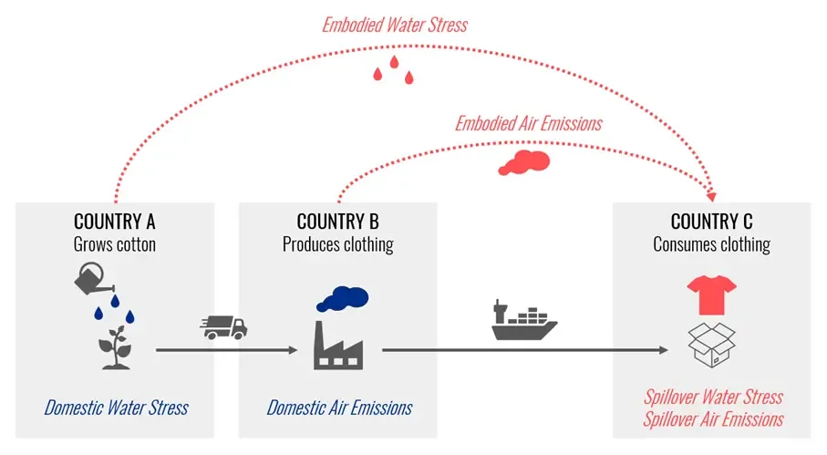

## Table of Contents

## What is the spillover effect in economics?

The spillover effect in economics is when the actions of one person or business affect others around them. Imagine a factory that starts polluting a river. The factory might make more money, but the people who use the river for fishing or drinking water are negatively affected. This is an example of a negative spillover, also called an externality.

But spillovers can also be positive. For example, if a new tech company moves into a neighborhood, it might bring new jobs and better services to the area. This can make the whole community better off. Understanding these spillover effects is important for making good economic policies that help everyone.

## Can you provide examples of the spillover effect in everyday life?

Imagine you decide to plant a beautiful garden in your front yard. Not only do you enjoy the flowers and greenery, but your neighbors also benefit from the improved look of the neighborhood. This makes the whole area more attractive, which can even increase property values for everyone living nearby. That's a positive spillover effect because your actions are helping others without you intending to.

On the other hand, think about someone who decides to have a loud party late at night. The noise from the party keeps their neighbors awake, making it hard for them to sleep and enjoy their homes. This is a negative spillover effect because the party-goer's actions are causing harm to others around them, even if that wasn't their intention. Both examples show how our actions can affect those around us in everyday life.

## How does the spillover effect influence local economies?

The spillover effect can have a big impact on local economies. When a new business opens in a town, it can bring more jobs and money to the area. This can make other businesses do better too. For example, if a new restaurant opens, it might attract more people to the area, which can help nearby shops and stores. This is a positive spillover because everyone in the local economy benefits from the new business.

But sometimes, the spillover effect can hurt the local economy. If a big factory starts polluting the air or water, it can make it hard for other businesses to operate. People might not want to visit or live in a polluted area, which can hurt shops, restaurants, and other local businesses. This is a negative spillover because one business's actions are making it harder for others to succeed. Understanding these effects helps local leaders make better decisions for their communities.

## What are the different types of spillover effects?

There are two main types of spillover effects: positive and negative. A positive spillover effect happens when someone's actions help others around them. For example, if a new park is built in a neighborhood, it can make the area nicer for everyone. People can enjoy the park, and it might even make nearby homes worth more money. This is good for the whole community.

A negative spillover effect is when someone's actions hurt others. Imagine a factory that starts polluting a river. The factory might save money, but the pollution makes it hard for people to fish or use the water. This can hurt local businesses and make life worse for people living nearby. Both types of spillover effects are important to understand because they can affect many people, even if they didn't cause the problem.

## How can businesses leverage positive spillover effects?

Businesses can use positive spillover effects to help themselves and their community. For example, a company might start a program to train local people for jobs. This not only helps the business by giving them skilled workers, but it also helps the community by giving people good jobs. This can make the whole area better off, with more money being spent at local shops and services.

Another way businesses can take advantage of positive spillover effects is by working with other local businesses. If a restaurant starts buying its ingredients from local farmers, it helps the farmers make more money. This can make the farmers' business grow, which can help the whole local economy. By doing good things for their community, businesses can create a cycle where everyone benefits.

## What role does government policy play in managing spillover effects?

Government policies are very important for dealing with spillover effects. They can help make sure that the good things that come from positive spillover effects are spread around and that the bad things from negative spillover effects are reduced. For example, the government might give money to a new business to help it start up. This can create jobs and help the local economy grow. By doing this, the government is making sure that more people can benefit from the new business.

On the other hand, the government can also make rules to stop negative spillover effects. For example, they might make laws to stop factories from polluting rivers or the air. This helps protect the community and other businesses from harm. By setting these rules, the government makes sure that one business's actions don't hurt others. In this way, government policies can help balance the effects of spillovers and make life better for everyone.

## How do spillover effects impact global trade?

Spillover effects can have a big impact on global trade. When a country starts making a product better or cheaper, it can affect other countries. For example, if one country figures out how to make solar panels cheaper, other countries might start buying more solar panels from them. This can help the country selling the solar panels grow their economy, but it might hurt other countries that also make solar panels because they can't compete as well. These changes in trade can spread to other industries and affect jobs and economies around the world.

On the other hand, negative spillover effects can also affect global trade. If a country starts polluting the ocean, it can harm fishing industries in other countries. This can lead to less fish being caught and sold, which hurts the economies of countries that rely on fishing. These problems can cause tensions between countries and lead to new rules or trade agreements to try to fix the issues. Understanding these spillover effects is important for countries to work together and make trade fair and beneficial for everyone.

## What are the challenges in measuring the economic impact of spillover effects?

Measuring the economic impact of spillover effects can be really hard. One big challenge is that spillover effects can be hard to see. They often happen over a long time and can affect many different parts of the economy. For example, if a new factory opens and brings jobs to a town, it might also make other businesses do better. But figuring out exactly how much of that improvement is because of the factory can be tricky. Economists have to use a lot of data and special methods to try to figure it out, but it's never perfect.

Another challenge is that spillover effects can be different in different places. What helps one community might not help another. For example, a new park might make one neighborhood nicer, but in another place, it might not make much difference. This means that economists have to look at each situation carefully and can't just use the same methods everywhere. It takes a lot of work to understand how spillover effects are working in different places and to measure their impact accurately.

## How do spillover effects contribute to economic growth or decline?

Spillover effects can help an economy grow when they are positive. For example, if a new company moves into a town and brings jobs, it can make the whole area better off. People with new jobs spend more money at local shops and services, which helps those businesses grow too. This can make the local economy stronger and help it grow. When lots of positive spillover effects happen, they can make a big difference and help the whole country's economy get better.

On the other hand, negative spillover effects can make an economy worse. If a factory starts polluting a river, it can hurt other businesses that depend on the river, like fishing companies. This can make it hard for those businesses to make money, which can hurt the local economy. If lots of negative spillover effects happen, they can slow down or even shrink the economy. Understanding and managing these spillover effects is important for keeping the economy healthy and growing.

## Can spillover effects lead to market failures? If so, how?

Yes, spillover effects can lead to market failures. A market failure happens when the market doesn't work well and can't fix a problem on its own. Negative spillover effects, like pollution, can cause market failures because the costs of the pollution are not paid by the company causing it. Instead, the costs are felt by the community, like people getting sick or businesses losing money. Because the company doesn't have to pay for the harm it causes, it might keep polluting, which makes the problem worse and stops the market from working right.

Positive spillover effects can also lead to market failures, but in a different way. For example, if someone invents a new technology and shares it, other people can use it to make their own products better. This helps the economy, but the person who invented the technology might not get paid for all the good they did. Because they don't get all the benefits, they might not want to keep inventing new things. This can slow down progress and stop the market from working as well as it could.

## What are some advanced economic models used to study spillover effects?

One advanced economic model used to study spillover effects is the Computable General Equilibrium (CGE) model. This model looks at how different parts of the economy, like businesses, households, and governments, all work together. It can show how a change in one part, like a new factory opening, can affect other parts, like jobs and prices. By using a lot of data and math, the CGE model helps economists understand how spillover effects spread through the whole economy and how they can help or hurt different groups of people.

Another model is the Input-Output (I-O) model. This model looks at how different industries depend on each other. For example, it can show how the car industry needs steel, and how the steel industry needs coal. By studying these connections, the I-O model can help economists see how a change in one industry, like a new technology, can affect other industries. This helps them understand how spillover effects can make some industries grow while others might shrink. Both models are important tools for figuring out how to manage spillover effects and make the economy work better for everyone.

## How can predictive analytics be used to anticipate spillover effects in economic planning?

Predictive analytics can help economists guess what might happen in the future by looking at data from the past. For example, if a new business is going to open in a town, predictive analytics can use information about similar businesses in other places to guess how it might affect the local economy. It can look at things like how many jobs the business might create, how much money people might spend at other local shops, and even how property values might change. By using this information, economists can plan better and make sure the new business helps the community as much as possible.

But predictive analytics isn't just about guessing good things. It can also help spot problems before they get too big. For example, if a factory is going to start polluting a river, predictive analytics can use data about similar factories to guess how bad the pollution might be and how it could hurt local businesses and people's health. By knowing this ahead of time, the government can make rules to stop the pollution or help the community deal with it. This way, predictive analytics helps make sure that the economy stays healthy and that everyone can benefit from growth without suffering from negative spillover effects.

## References & Further Reading

[1]: Bergstra, J., Bardenet, R., Bengio, Y., & Kégl, B. (2011). ["Algorithms for Hyper-Parameter Optimization."](https://papers.nips.cc/paper/4443-algorithms-for-hyper-parameter-optimization) Advances in Neural Information Processing Systems 24.

[2]: ["Advances in Financial Machine Learning"](https://www.amazon.com/Advances-Financial-Machine-Learning-Marcos/dp/1119482089) by Marcos Lopez de Prado

[3]: ["Evidence-Based Technical Analysis: Applying the Scientific Method and Statistical Inference to Trading Signals"](https://www.amazon.com/Evidence-Based-Technical-Analysis-Scientific-Statistical/dp/0470008741) by David Aronson

[4]: ["Machine Learning for Algorithmic Trading"](https://github.com/stefan-jansen/machine-learning-for-trading) by Stefan Jansen

[5]: ["Quantitative Trading: How to Build Your Own Algorithmic Trading Business"](https://www.amazon.com/Quantitative-Trading-Build-Algorithmic-Business/dp/1119800064) by Ernest P. Chan