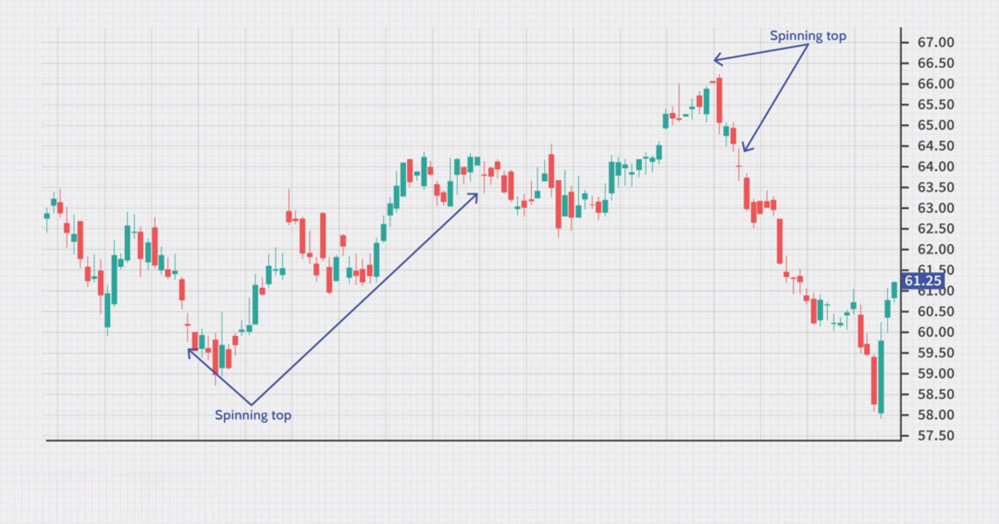

Candlestick patterns are an essential tool in technical analysis, providing traders and analysts with actionable insights into the dynamics of financial markets. These patterns, formed by the open, high, low, and close prices on a candlestick chart, depict the behavior of market participants and can indicate potential future price movements. One such pattern is the spinning top candlestick, which characteristically signifies market indecision. Recognized by its small real body and long upper and lower shadows, the spinning top indicates that neither bullish nor bearish forces have managed to assert control during the period it represents.

Spinning tops are particularly relevant to traders due to their potential to signal market turning points, especially when they appear after pronounced trends. Their appearance in an uptrend may suggest diminishing buying momentum, while their presence in a downtrend could hint at weakening selling pressure. The significance of these patterns becomes more pronounced when traders seek confirmation from subsequent candlesticks to ascertain the reliability of the signal.



This article aims to explore the characteristics of spinning tops comprehensively, their significance within the framework of technical analysis, and their integration with algorithmic trading systems. Algorithmic trading, which involves the use of computer programs to execute trades based on predefined strategies and patterns, can benefit from coding the recognition of spinning tops to optimize decision-making processes. These discussions will provide an understanding of how spinning tops can enhance trading strategies while considering their inherent limitations.

## Table of Contents

## Understanding Spinning Top Candlestick Patterns

Spinning top candlestick patterns are distinguishable by their small bodies and long shadows, a configuration that emerges when neither the bulls (buyers) nor the bears (sellers) gain enough control to steer the market significantly in one direction. The physical appearance of a spinning top—a short distance between the opening and closing prices, represented by the small body—demonstrates this equilibrium of market influence, where the high and low prices—reflected by the long shadows—show significant volatility during the trading period.

The primary interpretation of a spinning top pattern is indecision in the market. This state of uncertainty often emerges after a strong bullish or bearish trend, wherein market participants are assessing the sustainability of the existing trend. Spinning tops can therefore serve as early indicators of potential trend reversals or continuations, requiring additional confirmation through subsequent price movements.

For instance, suppose a stock is in a pronounced uptrend and a spinning top forms. This suggests that buyer momentum might be weakening. Conversely, if a spinning top appears during a strong downtrend, it can imply that selling pressure is declining. However, it is crucial for traders to observe what happens in the ensuing trading periods to validate the initial signal. Without confirmation, a single spinning top might not suffice to forecast significant market changes.

A spinning top forms when the opening and closing prices are very close, regardless of the overall price [volatility](/wiki/volatility-trading-strategies) within the period. Whether the candlestick is bullish or bearish is secondary to the overall structure of the small body and long shadows. This neutrality in closing compared to the opening suggests neither dominating victory for bulls nor bears, making it a pivotal point for traders to observe subsequent market behavior.

## Significance of Spinning Top Patterns in Technical Analysis

Spinning top candlestick patterns are pivotal in technical analysis due to their capacity to signal potential reversals or continuations in market trends. These patterns are characterized by their small real bodies and long upper and lower shadows, symbolizing a state of equilibrium between buyers and sellers. This balance can often precede a shift in market direction, contingent upon subsequent price action, making the pattern particularly significant when identified after a strong price trend.

During an uptrend, the appearance of a spinning top might indicate a reduction in buyer [momentum](/wiki/momentum). This waning force suggests that buyers are losing control, thus preparing the market for a potential reversal. Conversely, in a downtrend, a spinning top could imply diminishing seller power, offering the possibility of a shift towards a stabilization or an upward movement. It is essential to recognize that the spinning top itself does not provide a definitive signal; instead, it must be contextualized within the broader market environment.

To validate the implications of a spinning top pattern, confirmation from subsequent candlesticks is critical. Traders and analysts typically look for corroborating signals in the candlesticks that follow a spinning top to ascertain its true significance. For instance, a strong bullish or bearish candlestick following a spinning top can serve as confirmation of a reversal or continuation of the prevailing trend. Thus, while the spinning top provides an initial suggestion of market indecision, the subsequent candlesticks offer the necessary evidence to support an informed trading decision.

The interpretation of spinning top patterns requires a nuanced understanding of market dynamics and price action. By examining the interplay between spinning tops and following candlesticks, traders can better gauge the likelihood of market reversals or continuations, thereby enhancing their technical analysis and trading strategies.

## Algorithmic Trading and Candlestick Patterns

Algorithmic trading, or algo-trading, uses automated pre-set rules to execute trades based on specific market signals. This approach offers significant advantages, including speed, precision, and the elimination of emotional decision-making, which can cloud judgment in manual trading scenarios. When incorporated with candlestick patterns such as spinning tops, [algorithmic trading](/wiki/algorithmic-trading) systems can enhance the decision-making process by systematically identifying potential market turning points that signify indecision and possible trend reversals.

Candlestick patterns serve as accessible inputs for algorithms because they provide concise, visual summaries of price actions over a set period. For example, a spinning top pattern, characterized by a small body and long shadows, denotes a struggle between buyers and sellers, resulting in little net price movement. This feature makes it an essential signal for algorithms programmed to detect potential reversals or continuations of the trend.

Incorporating spinning top identification into a trading algorithm typically involves several steps. An algorithm must first collect and process real-time price data to generate candlestick patterns. This involves capturing opening, closing, high, and low prices within a time frame (like a minute, hour, or day) and creating a candlestick representation of this data. The spinning top pattern can then be detected by evaluating the body length relative to the shadow lengths, confirming that the body is small compared to the long shadows.

A basic algorithm to identify a spinning top in Python could look as follows:

```python
def identify_spinning_top(open_price, close_price, high_price, low_price):
    body_length = abs(close_price - open_price)
    shadow_length = high_price - low_price
    upper_shadow = high_price - max(open_price, close_price)
    lower_shadow = min(open_price, close_price) - low_price

    # Conditions for a spinning top: small body, longer shadows
    if 0.1 * shadow_length > body_length and upper_shadow > body_length and lower_shadow > body_length:
        return True
    return False
```

This function takes prices for a single candlestick and determines if it meets the spinning top criteria, returning a boolean value to signal its presence.

Once a spinning top is identified, traders must decide on the actionable insight it provides. Algorithms can be set to monitor for confirmation patterns, such as additional candlestick patterns indicating market bias or reversal. Furthermore, integrating spinning tops with indicators like the Relative Strength Index (RSI) or Moving Average Convergence Divergence (MACD) can refine signals and guide trading actions.

By effectively automating the identification of spinning tops within the broader context of algorithmic trading, traders can efficiently harness these patterns to capture potential market turning points. Sophisticated algorithms not only improve decision-making but also offer the agility needed to capitalize on fleeting market opportunities, thereby maximizing the potential for profitable outcomes.

## Trading Strategies Using Spinning Tops

Combining spinning top candlestick patterns with technical indicators like the Relative Strength Index (RSI) or the Moving Average Convergence Divergence (MACD) can yield more reliable trading signals. The RSI is a momentum oscillator that measures the speed and change of price movements on a scale of 0 to 100. When combined with a spinning top, which indicates market indecision, traders can better infer potential reversals when the RSI is in the overbought or oversold territories. For instance, if a spinning top appears after a prolonged uptrend and the RSI signals overbought conditions, it may suggest an impending bearish reversal.

Similarly, the MACD, an indicator that follows the trend and momentum of a security, can confirm signals derived from spinning tops. The MACD involves two lines: the MACD line and the signal line. A crossing of these lines following the appearance of a spinning top can offer insights into potential continuation or reversal of trends. If a spinning top is observed at the top of an uptrend and the MACD line crosses below the signal line, this crossover could indicate a bearish reversal opportunity.

Another crucial aspect of trading spinning tops is the consideration of broader market contexts, specifically support and resistance levels. Support levels are price points where a downward trend could pause due to a concentration of buying interest, while resistance levels are where an upward trend might pause due to selling interest. Observing spinning tops around these levels can give traders additional insights into market sentiment. For example, a spinning top near a resistance level could indicate an impending price reversal if it occurs after a strong upward trend, suggesting a sell signal.

Implementing risk management tools, such as stop-loss orders, is essential when trading spinning tops to mitigate potential trading losses. A stop-loss order is a pre-set order to sell a security when it reaches a particular price point, preventing excessive losses. Traders might place stop-loss orders slightly below the low of the spinning top when taking a long position or above the high when entering a short position. This approach allows traders to quantify potential downsides and secure profits efficiently, especially in unpredictable market environments.

In conclusion, combining spinning tops with complementary technical indicators while considering market contexts and applying risk management strategies provides traders with a robust framework for executing informed trading decisions.

## Limitations and Considerations

Spinning top candlestick patterns, while informative, come with several limitations that traders need to consider in their technical analysis. One primary limitation is their abundance in the market, which can lead to less significant price movements. Due to their frequent appearance, spinning tops may not always herald a major change in market direction, which might limit their utility as standalone indicators.

A prevalent issue with spinning top patterns is the occurrence of false signals. These patterns, by nature, represent indecision in the market. Without confirmation from subsequent market action, reliance on spinning tops can lead to misinterpretation. For instance, if a spinning top forms during an uptrend, it might suggest a potential reversal. However, if following candlesticks indicate continued buying pressure, the anticipated reversal might not materialize, leading to erroneous trading decisions.

To effectively use spinning tops in trading strategies, a comprehensive approach is required. This involves not only recognizing the pattern but also integrating it into a broader technical analysis framework. For example, traders might combine spinning top patterns with other indicators such as the Relative Strength Index (RSI) or Moving Average Convergence Divergence (MACD) to enhance signal accuracy and offer additional confirmation.

Moreover, successful implementation of spinning top patterns necessitates a well-defined trading plan and strategy. Traders should adopt risk management tools, like stop-loss orders, to mitigate potential losses stemming from false signals or unexpected market turns. A disciplined approach that includes continuous monitoring and adjustment of strategies based on market conditions is essential for leveraging spinning tops effectively in trading.

By considering these limitations and incorporating spinning top patterns into a holistic trading strategy, traders can potentially improve their market analysis and execution.

## Conclusion

Spinning top candlestick patterns, characterized by their small body and long shadows, offer valuable insights into market behavior when utilized effectively. These patterns highlight periods of indecision within the market, signaling potential shifts in trend that traders can capitalize on. However, their true worth is best realized when they are supplemented with other technical indicators, such as the Relative Strength Index (RSI) or Moving Average Convergence Divergence (MACD), to enhance predictive accuracy. This integration helps to confirm the signals generated by spinning tops, reducing the likelihood of false positives and increasing the robustness of trading strategies.

Moreover, successful trading with spinning tops goes beyond merely identifying the pattern; it requires a comprehensive trading plan that includes ongoing analysis and adaptation to current market conditions. Constantly evolving market dynamics necessitate that traders review and adjust their strategies to maintain their effectiveness. Tools such as algorithmic trading can be beneficial in this regard, as they allow for the systematic application of strategies and adaptation to new data inputs. However, even with automation, human oversight remains essential to interpret complex market nuances and execute strategic refinements as needed.

In summary, while spinning top candlestick patterns are a useful tool in technical analysis, their power is significantly enhanced when combined with other indicators and a well-structured trading plan. Traders who commit to continuous learning and strategy adaptation are better positioned to leverage these patterns successfully, thus optimizing their chances for sustained trading success.

## References & Further Reading

[1]: Nison, S. (2001). ["Japanese Candlestick Charting Techniques: A Contemporary Guide to the Ancient Investment Techniques of the Far East."](https://archive.org/details/japanesecandlest0000niso) Prentice Hall Press.

[2]: Pring, M. J. (2002). ["Technical Analysis Explained: The Successful Investor's Guide to Spotting Investment Trends and Turning Points."](https://www.amazon.com/Technical-Analysis-Explained-Fifth-Successful/dp/0071825177) McGraw-Hill Education.

[3]: Chan, E. P. (2008). ["Quantitative Trading: How to Build Your Own Algorithmic Trading Business."](https://github.com/ftvision/quant_trading_echan_book) John Wiley & Sons.

[4]: Lopez de Prado, M. (2018). ["Advances in Financial Machine Learning."](https://www.amazon.com/Advances-Financial-Machine-Learning-Marcos/dp/1119482089) John Wiley & Sons.

[5]: Aronson, D. (2006). ["Evidence-Based Technical Analysis: Applying the Scientific Method and Statistical Inference to Trading Signals."](https://www.wiley.com/en-us/Evidence+Based+Technical+Analysis%3A+Applying+the+Scientific+Method+and+Statistical+Inference+to+Trading+Signals-p-9780470008744) John Wiley & Sons.

[6]: Jansen, S. (2018). ["Machine Learning for Algorithmic Trading."](https://books.google.com/books/about/Hands_On_Machine_Learning_for_Algorithmi.html?id=tx2CDwAAQBAJ) Packt Publishing.