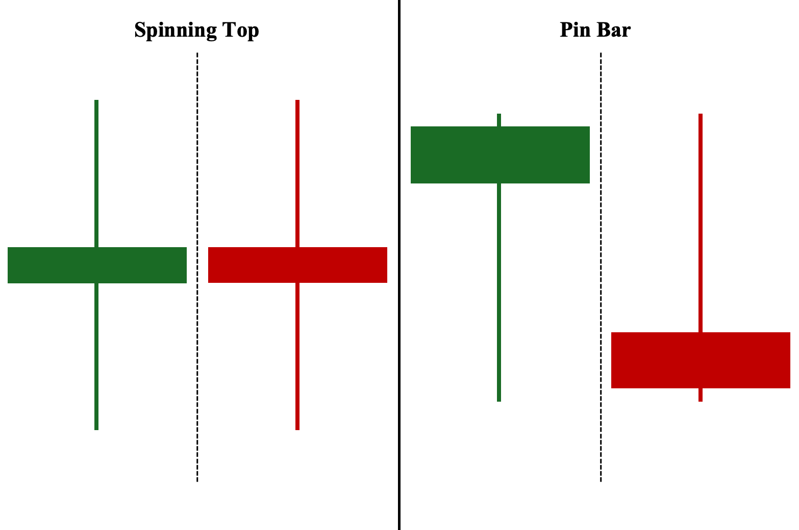

## Table of Contents

## What is a Spinning Top Candlestick?

A Spinning Top Candlestick is a type of candlestick pattern in stock market charts. It shows that the price of a stock moved a lot during the day but ended up close to where it started. The candlestick has a small body and long wicks on both ends. This means that buyers and sellers were fighting a lot, but neither side won by the end of the day.

Traders watch for Spinning Top Candlesticks because they can signal that the current trend might be losing strength. If you see this pattern after prices have been going up, it might mean the upward trend is getting weak. If it comes after prices have been falling, it could mean the downward trend is losing power. It's a sign that the market might be getting ready for a change in direction, so traders pay close attention to what happens next.

## How can you identify a Spinning Top Candlestick on a chart?

To identify a Spinning Top Candlestick on a chart, look for a candle with a small body in the middle and long wicks on both the top and bottom. The small body shows that the opening and closing prices were close together, while the long wicks indicate that the price moved a lot during the trading period but ended up near where it started. This pattern looks like a spinning top toy, which is where it gets its name.

You can find Spinning Top Candlesticks in both uptrends and downtrends. If you see one after a series of rising candles, it might mean that the upward trend is losing steam. On the other hand, if it appears after a series of falling candles, it could suggest that the downward trend is weakening. Traders use this pattern to get ready for possible changes in the market direction, so it's important to watch what happens in the candles that follow.

## What does a Spinning Top Candlestick indicate about market sentiment?

A Spinning Top Candlestick shows that the market is unsure about which way to go. It means that during the day, the price moved a lot, but by the end, it was almost back to where it started. This shows that buyers and sellers were fighting a lot, but neither could win. It's like they were pushing and pulling, but the price didn't change much in the end.

This kind of candlestick can tell us that the market might be getting ready to change direction. If you see a Spinning Top after prices have been going up, it might mean that the upward trend is getting weak. If it comes after prices have been going down, it could mean the downward trend is losing power. So, it's a sign to watch closely what happens next because the market might be about to switch its path.

## Can a Spinning Top Candlestick be bullish or bearish?

A Spinning Top Candlestick by itself is not clearly bullish or bearish. It shows that the market is unsure because the price moved a lot during the day but ended up close to where it started. This means that neither the buyers nor the sellers were able to take control, showing a balance between them.

To figure out if a Spinning Top is more bullish or bearish, you need to look at the candles around it and the trend before it. If you see a Spinning Top after prices have been going up, it might mean the upward trend is losing strength, which could be a bearish sign. On the other hand, if it comes after prices have been going down, it might suggest the downward trend is weakening, which could be a bullish sign. So, the context is important to understand if the Spinning Top leans more towards being bullish or bearish.

## How does a Spinning Top Candlestick differ from a Doji?

A Spinning Top Candlestick and a Doji look similar because they both show that the price moved a lot during the day but ended up close to where it started. The main difference is in their bodies. A Spinning Top has a small body, but you can still see it. This means the opening and closing prices were a bit different. On the other hand, a Doji has a very tiny body or no body at all, which means the opening and closing prices were almost the same.

Both patterns show that the market is unsure, but the Spinning Top shows a bit more action between buyers and sellers. It means they fought a lot, but the price didn't change much in the end. A Doji shows even more balance because the opening and closing prices were nearly the same, suggesting a stronger fight between buyers and sellers with no clear winner. Both can signal that a trend might be losing power, but the Doji is often seen as a stronger sign of market uncertainty.

## In what types of markets are Spinning Top Candlesticks most commonly observed?

Spinning Top Candlesticks can be seen in many different markets, like stocks, [forex](/wiki/forex-system), and commodities. They are most common in markets where there's a lot of trading and the prices change a lot during the day. This is because a Spinning Top shows that the price moved a lot but ended up close to where it started, which happens more often in active markets.

These candlesticks are especially useful in markets that are trending, either going up or down. When traders see a Spinning Top after a series of rising or falling candles, it can be a sign that the trend might be getting weaker. So, in markets where trends are important, like in stock markets or forex markets, Spinning Top Candlesticks are watched closely to understand if a change in direction might be coming.

## What are the key components of a Spinning Top Candlestick?

A Spinning Top Candlestick has three main parts: the body, the upper wick, and the lower wick. The body is the middle part of the candlestick, and it's small. This small body shows that the opening and closing prices were close to each other. The upper wick is the line above the body, and it shows how high the price went during the day. The lower wick is the line below the body, and it shows how low the price went. Both wicks are long, which means the price moved a lot during the day.

These long wicks and the small body together make the Spinning Top Candlestick look like a spinning top toy. This pattern tells us that the market was unsure because even though the price moved a lot, it ended up near where it started. This means buyers and sellers were fighting, but neither could win by the end of the day. Traders watch for Spinning Top Candlesticks because they can signal that the current trend might be losing strength, and the market might be getting ready for a change in direction.

## How should traders interpret a Spinning Top Candlestick in a trend?

When traders see a Spinning Top Candlestick during an uptrend, it means the price went up and down a lot during the day but ended up close to where it started. This can be a sign that the upward trend might be getting weak. The market is showing that buyers and sellers are fighting, and the buyers, who have been pushing the price up, are not as strong as before. Traders might start to think that the trend could change soon, so they watch what happens next very closely.

If a Spinning Top appears during a downtrend, it shows that the price moved a lot but ended near its starting point. This could mean the downward trend is losing power. It tells traders that sellers, who have been pushing the price down, are not as strong anymore. The market is unsure, and this might be a sign that the trend could reverse. Traders pay attention to the candles that follow to see if the market will indeed change direction.

## What are some trading strategies that incorporate Spinning Top Candlesticks?

One trading strategy that uses Spinning Top Candlesticks is to watch for them after a strong trend. If you see a Spinning Top after prices have been going up for a while, it might mean the upward trend is getting weak. Traders might decide to sell their stocks or take profits because they think the price might start to go down soon. They wait for the next candle to confirm this change. If the next candle goes down, it can give them more confidence that the trend is changing, and they can act on their sell decision.

Another strategy is to use Spinning Tops to find good times to buy. If you see a Spinning Top after prices have been falling for a while, it could mean the downward trend is losing power. Traders might start buying because they think the price might start going up. They look at the next candle to see if it goes up, which would confirm their idea that the trend is changing. This way, they can buy at a lower price before it starts to rise again.

Both strategies need traders to be patient and watch what happens after the Spinning Top. It's important to wait for the next candle to confirm the change in trend before making a big move. This helps traders make better decisions and avoid jumping into trades too early.

## How reliable is a Spinning Top Candlestick as a standalone indicator?

A Spinning Top Candlestick by itself is not very reliable as a standalone indicator. It shows that the price moved a lot during the day but ended up close to where it started. This means the market is unsure, but it doesn't tell us for sure if the price will go up or down next. Traders need to look at other things, like the trend before the Spinning Top and the candles that come after it, to make better guesses about what might happen next.

To use a Spinning Top well, traders should wait for more signs. If they see a Spinning Top after prices have been going up, it might mean the upward trend is getting weak. But they should wait for the next candle to see if it goes down, which would make them more sure that the trend is changing. The same goes for a Spinning Top after prices have been going down; it might mean the downward trend is losing power, but traders should wait for the next candle to go up before they decide to buy. So, while a Spinning Top can give some clues, it's best used with other indicators and patterns to make smarter trading choices.

## What other technical indicators should be used alongside a Spinning Top Candlestick for better analysis?

To get a better understanding of what a Spinning Top Candlestick means, traders often use other technical indicators to help them. One helpful indicator is the Moving Average, which shows the average price over a certain time. If a Spinning Top appears near a Moving Average, it can tell traders that the price might be about to change direction. Another useful tool is the Relative Strength Index (RSI), which measures how fast prices are going up or down. If the RSI is very high or very low when a Spinning Top shows up, it can be a sign that the price might soon go the other way.

Volume is also important to look at with a Spinning Top. If the [volume](/wiki/volume-trading-strategy) is high when you see a Spinning Top, it means a lot of people were trading, which can make the pattern more important. Traders also like to use trend lines to see where the price has been moving. If a Spinning Top happens near a trend line, it can be a stronger sign that the trend might be changing. By using these other indicators with a Spinning Top, traders can make better guesses about what the market might do next.

## Can you provide case studies or examples where Spinning Top Candlesticks led to significant market movements?

In early 2020, the stock market saw a lot of ups and downs because of the start of the global health crisis. One day, after a few days of the stock prices going up, a Spinning Top Candlestick appeared on the chart for the S&P 500. This Spinning Top showed that the price moved a lot during the day but ended up close to where it started. Traders saw this and thought the upward trend might be getting weak. The next few days, the market did start to go down, and the S&P 500 lost a lot of value. This showed that the Spinning Top was a good warning sign that the trend was about to change.

Another example happened with the stock of a big tech company in 2018. After a long time of the stock price going down, a Spinning Top appeared on the chart. This showed that the price moved a lot that day but ended near its starting point. Traders saw this and thought the downward trend might be losing power. They waited for the next candle, which went up. This made them feel more sure that the trend was changing. Over the next few weeks, the stock price did start to go up, showing that the Spinning Top was a good sign that the market was getting ready to move in a new direction.

## References & Further Reading

[1]: Nison, S. (2001). ["Japanese Candlestick Charting Techniques: A Contemporary Guide to the Ancient Investment Techniques of the Far East."](https://archive.org/details/japanesecandlest0000niso) Prentice Hall Press.

[2]: Pring, M. J. (2002). ["Technical Analysis Explained: The Successful Investor's Guide to Spotting Investment Trends and Turning Points."](https://www.amazon.com/Technical-Analysis-Explained-Fifth-Successful/dp/0071825177) McGraw-Hill Education.

[3]: Chan, E. P. (2008). ["Quantitative Trading: How to Build Your Own Algorithmic Trading Business."](https://github.com/ftvision/quant_trading_echan_book) John Wiley & Sons.

[4]: Lopez de Prado, M. (2018). ["Advances in Financial Machine Learning."](https://www.amazon.com/Advances-Financial-Machine-Learning-Marcos/dp/1119482089) John Wiley & Sons.

[5]: Aronson, D. (2006). ["Evidence-Based Technical Analysis: Applying the Scientific Method and Statistical Inference to Trading Signals."](https://www.wiley.com/en-us/Evidence+Based+Technical+Analysis%3A+Applying+the+Scientific+Method+and+Statistical+Inference+to+Trading+Signals-p-9780470008744) John Wiley & Sons.

[6]: Jansen, S. (2018). ["Machine Learning for Algorithmic Trading."](https://books.google.com/books/about/Hands_On_Machine_Learning_for_Algorithmi.html?id=tx2CDwAAQBAJ) Packt Publishing.