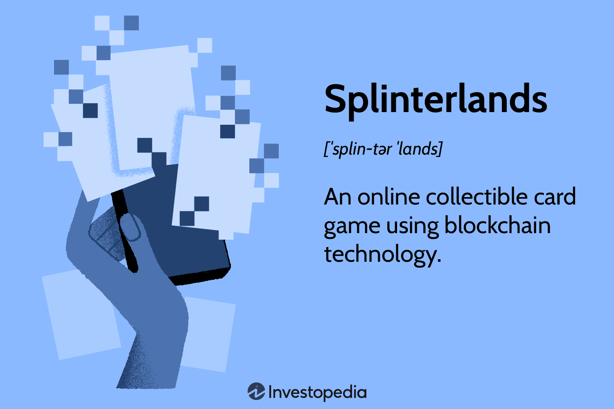

The world of digital gaming continues to evolve at a rapid pace, with advanced technologies like blockchain radically transforming user experiences. In this emerging landscape, Splinterlands stands out as a pioneering force, integrating the captivating mechanics of traditional card games with the innovative potential that blockchain technology offers. By digitizing card ownership through non-fungible tokens (NFTs), Splinterlands introduces a new dimension to gaming, enabling players to truly own and trade their in-game assets across different platforms. This convergence of digital card gaming with blockchain technology extends beyond mere gameplay, venturing into economic territories with opportunities akin to algorithmic trading.

As players engage with Splinterlands, they experience a dynamic interplay between strategic gaming and real-world financial elements, creating a novel ecosystem where skill and economic savvy can lead to tangible financial rewards. This article explores how Splinterlands intertwines digital gaming with blockchain and algorithmic trading, illustrating a future where digital leisure seamlessly integrates with financial growth possibilities, redefining the boundaries of both industries and offering intriguing prospects for gamers and investors alike.



## Table of Contents

## What is Splinterlands?

Splinterlands is an innovative online collectible card game that capitalizes on the burgeoning blockchain technology to enhance gaming and trading experiences. Unlike traditional card games, where physical ownership of cards is the norm, Splinterlands digitalizes the ownership process using non-fungible tokens (NFTs). These NFTs encapsulate each card, allowing players to have unequivocal ownership rights over their cards, which can be traded or sold across various platforms without the need for intermediaries.

The concept of ownership in Splinterlands is akin to that in tangible card games such as Magic: The Gathering or Pokémon. However, the game transcends the physical constraints by existing entirely online. This digital transformation empowers players with the ability to seamlessly engage in card transactions while ensuring authenticity and scarcity, courtesy of blockchain's immutable ledger technology.

In Splinterlands, each card is unique, embedded with specific attributes and abilities, and stored securely on the blockchain. This ensures that once a player acquires a card, it cannot be replicated, forged, or manipulated. The security and legitimacy of card ownership provided by blockchain technology amplify the traditional card gaming experience, making each play session an intersection of strategy and digital asset management.

Moreover, the game fosters a self-sustaining economy where players might trade NFTs, thereby unlocking new layers of strategy not traditionally present in physical card games. As the gaming industry continues to integrate digital assets, Splinterlands represents a pioneering approach, merging collectible card game mechanics with advanced blockchain innovations.

## Game Mechanics and Features

Players engage in Splinterlands by participating in strategic battles using a carefully selected deck of collectible cards, each possessing distinct attributes and capabilities. The game blends traditional card strategy elements with modern digital enhancements, ensuring each match is unique and challenging.

Splinterlands features six different character categories known as Splinters. Each Splinter represents a specific element or strength, such as Fire, Water, Earth, Life, Death, and Dragon. These elements imbue the characters with unique skills and tactics, allowing players to devise various strategies to outmaneuver their opponents. The player's success often depends on understanding the synergies between different cards and the strategic assembly of their deck.

A key feature of the game is the use of an in-game currency known as Dark Energy Crystals (DEC). Players earn DEC through battles and can also use it to purchase or upgrade cards, enhancing their capabilities. This currency enables transactions within the game environment, facilitating the trading and acquisition of new cards while also serving as an incentive for players to continually engage with the game. The presence of DEC adds an economic layer to the game, further enriching the player's experience by introducing elements of resource management and strategic economic planning.

## Economic Impact and Earning Potential

Splinterlands exemplifies the burgeoning play-to-earn model, an innovative approach in digital gaming that allows players to earn real-world value through gameplay. Central to this model are the in-game activities such as tournaments, ranked matches, and quests, which offer players the opportunity to earn rewards in the form of Dark Energy Crystals (DEC) and special collectible cards. These rewards not only enhance the gaming experience but also provide tangible economic benefits.

The in-game currency, Dark Energy Crystals, acts as a medium of exchange within the Splinterlands ecosystem. Players can earn DEC through various gameplay activities and use them for transactions such as purchasing new cards or enhancing their existing collection. The value of DEC is influenced by supply and demand dynamics within the game, mirroring real-world economic principles.

In addition to [earning](/wiki/earning-announcement) through gameplay, Splinterlands provides players the opportunity to profit by leveraging the blockchain's secure contract system to rent out rare cards. This card rental system is facilitated by smart contracts, ensuring secure and transparent transactions. By renting out valuable cards, players can generate passive income, diversifying their revenue streams beyond direct gameplay.

The play-to-earn model in Splinterlands has broader economic implications, as it enables players from around the world to participate in a digital economy with low entry barriers. This model democratizes access to economic opportunities by rewarding skill and strategic gameplay rather than financial investment alone.

The economic potential of Splinterlands extends to the secondary marketplace, where savvy players can trade cards and other assets. The blockchain ensures authenticity and scarcity of these digital collectibles, allowing them to hold intrinsic value. Players with a keen understanding of market trends and dynamics can capitalize on the buying and selling of cards, potentially yielding significant financial returns.

Overall, Splinterlands not only offers an engaging gaming experience but also serves as a platform for economic empowerment through its innovative integration of blockchain technology and the play-to-earn model. This dual benefit of gaming engagement and financial opportunity positions Splinterlands as a pioneer in the evolving landscape of digital gaming.

## The Role of Blockchain in Splinterlands

Blockchain technology is integral to Splinterlands, serving as the critical infrastructure that enables secure and verifiable digital ownership of in-game assets. By leveraging blockchain, Splinterlands ensures that each card within the game is a unique non-fungible token (NFT), which grants players true ownership over their digital assets. This ownership model ensures that players can trade cards safely and transparently across platforms, independent of any central authority. 

NFTs in Splinterlands function as unique cryptographic tokens that cannot be replicated. This ensures the rarity and authenticity of each card, supporting a secondary market where players can buy, sell, and trade their assets with confidence. The blockchain ledger records every transaction, providing an immutable history of ownership and transfers. This transparency in transactions fosters trust within the Splinterlands community, as players can verify the provenance of cards and their scarcity.

Furthermore, Splinterlands integrates with significant blockchains such as Ethereum and Hive, enhancing both the user experience and the game's operational efficiency. Ethereum, known for its robust smart contract capabilities, provides a widely-adopted platform for executing secure transactions and complex agreements. Hive, on the other hand, offers a high-speed blockchain environment with low transaction costs, making it suitable for frequent transactions typical in gaming scenarios. This multi-chain strategy allows Splinterlands to streamline transactions, reduce costs, and tap into a broader audience across different blockchain ecosystems. By doing so, Splinterlands not only expands its market reach but also enhances the [liquidity](/wiki/liquidity-risk-premium) and activity within its gaming ecosystem.

## Integrating Algo Trading with Splinterlands

Algorithmic trading is increasingly being explored to enhance profitability within the Splinterlands card trading ecosystem. Players can use algorithmic strategies to automate their buying and selling decisions, maximizing financial returns by leveraging market data and computational algorithms. 

In Splinterlands, market fluctuations and the rarity of cards create a dynamic environment similar to financial markets. This [volatility](/wiki/volatility-trading-strategies) opens the door for [algorithmic trading](/wiki/algorithmic-trading) by enabling players to capitalize on price differences and trends. By employing computer algorithms, users can execute trades automatically based on predefined criteria, such as historical price movements, trading volumes, or other technical indicators.

Marketplaces like OpenSea, where Splinterlands cards are traded as NFTs, facilitate the use of algo trading. By analyzing patterns and executing large volumes of trades faster than manual means, players can gain an advantage. Algorithms can be developed in Python using libraries like NumPy for numerical analysis, Pandas for data manipulation, and packages such as TA-Lib for technical analysis to identify optimal trading opportunities.

The dynamism in the NFT market also provides a fertile ground for [machine learning](/wiki/machine-learning) algorithms. Such algorithms can predict upcoming trends by analyzing large datasets collected from market activity, helping players to make data-driven decisions. 

Below is a basic Python example using a moving average strategy, which traders could use to determine buy/sell signals based on crossing averages:

```python
import pandas as pd

# Fetch historical price data (mock data in this example)
data = pd.DataFrame({
    'price': [0.7, 0.8, 0.75, 0.85, 0.9, 1.0, 0.95, 1.1]
})

# Calculate moving averages
data['short_mavg'] = data['price'].rolling(window=3).mean()
data['long_mavg'] = data['price'].rolling(window=5).mean()

# Buy signal: short MA crosses above long MA
data['buy_signal'] = data['short_mavg'] > data['long_mavg']

# Sell signal: short MA crosses below long MA
data['sell_signal'] = data['short_mavg'] < data['long_mavg']

print(data)
```

This code provides a basic framework for creating a signal when a shorter-term moving average crosses a longer-term moving average, which could indicate a change in market direction. More sophisticated models could incorporate machine learning techniques to improve accuracy and adapt to market changes.

Algorithmic trading in the Splinterlands NFT market offers substantial potential for automating trade execution, optimizing trade strategies, and potentially increasing profitability for adept traders who harness these tools effectively.

## Conclusion

Splinterlands presents a unique convergence of digital gaming and blockchain technology, offering both entertainment and financial opportunities. By leveraging non-fungible tokens (NFTs), it ensures players have verifiable ownership of their digital assets, thus enhancing their engagement and investment in the game. This ownership is not merely superficial; it translates to genuine economic prospects, as players can trade, sell, or rent their cards both within and outside the platform, facilitated by secure blockchain contracts.

The incorporation of blockchain fundamentally revolutionizes how digital games engage with economic ecosystems. Players gain not just enjoyment from gameplay but also the potential to earn cryptoassets, thereby transforming leisure into a viable earning activity. The algorithmic trading capabilities that are gradually being integrated into Splinterlands promise to redefine trading efficiency and profitability within the game. By automating transactions and leveraging data-driven strategies, players could optimize their trading portfolios, potentially increasing their returns in the evolving market of digital collectibles.

Looking forward, the integration of algorithmic trading strategies within Splinterlands could mark a significant progression. Not only does this provide a mechanism for optimizing financial outcomes, but it also sets a precedent for how digital card games might evolve. As the digital gaming industry continues to expand, platforms like Splinterlands highlight the innovative potential of blockchain and NFTs to create rich, immersive, and economically rewarding player experiences.

## References & Further Reading

[1]: Rosenfeld, A. (2018). ["Ethereum-based CryptoKitties Game Uses NFTs for Digital Collectibles"](https://en.wikipedia.org/wiki/CryptoKitties) CoinDesk.

[2]: Tiwari, S. (2019). ["Understanding the True Value of NFTs"](https://lawbhoomi.com/prabhakar-tiwari-vs-state-of-up/) Hacker Noon.

[3]: Thompson, J. (2020). ["Blockchain Technology in Gaming Industry"](https://www.mdpi.com/2073-431X/13/1/14) Forbes.

[4]: Malviya, H. (2017). ["A Beginner’s Guide to Understanding Decentralized Applications"](https://medium.com/@nikitamalviya/transformers-a-beginners-guide-194a8ad70c4a) Medium.

[5]: Jacques, E. (2021). ["The Rise of Play-to-Earn Games"](https://medium.com/exponential-era/the-rise-of-play-to-earn-games-5a3ed209160a) Gemini Crypto.

[6]: Hougan, M., & Lawant, D. (2020). ["Cryptoassets Emerge as Institutional Alternative"](https://www.amazon.com/Cryptoassets-Blockchain-Cryptocurrency-Investment-Professionals-ebook/dp/B08S7R2C4N) Forbes.

[7]: Nakamoto, S. (2008). ["Bitcoin: A Peer-to-Peer Electronic Cash System"](https://nakamotoinstitute.org/library/bitcoin/).

[8]: Veradittakit, P. (2021). ["NFT Marketplaces You Should Know"](https://hbr.org/2021/11/making-sense-of-the-nft-marketplace) Medium.

[9]: Buterin, V. (2013). ["Ethereum Whitepaper"](https://ethereum.org/en/whitepaper/) Ethereum Foundation.

[10]: CryptoKitties Team. (2017). ["CryptoKitties: Collectible and Breedable Cats Empowered by Blockchain Technology"](https://block3wire.org/wp-content/uploads/2023/01/CryptoKitties-Collectible-and-Breedable-Cats-Empowered-by-Blockchain-Technology.pdf) CryptoKitties.