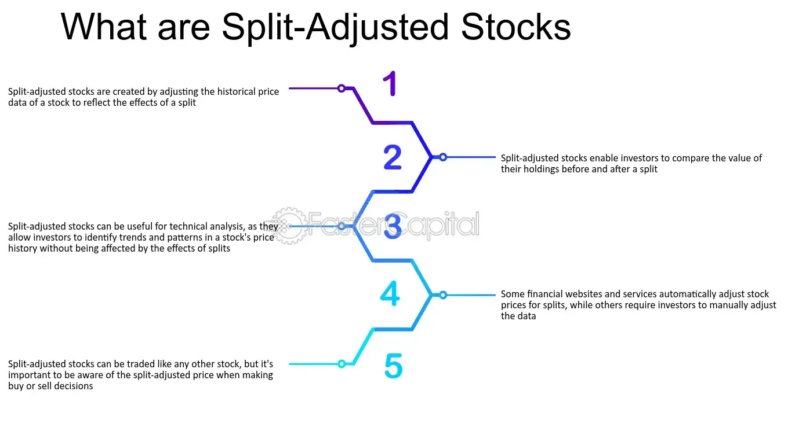

## Table of Contents

## What is a split-adjusted share price?

A split-adjusted share price is the price of a stock after it has been adjusted for any stock splits that have occurred. When a company does a stock split, it increases the number of shares outstanding and reduces the price per share, but the overall value of the investment remains the same. For example, in a 2-for-1 split, an investor who owned one share worth $100 would then own two shares worth $50 each. To make historical price data comparable, analysts adjust past prices as if the split had always been in effect.

This adjustment helps investors and analysts accurately compare stock performance over time, even if the company has undergone multiple splits. Without adjusting for splits, it would be misleading to compare the stock price from before a split to the price after a split. By using split-adjusted prices, someone can see the true trend in a stock's value, making it easier to analyze long-term performance and make informed investment decisions.

## Why do companies perform stock splits?

Companies perform stock splits to make their shares more affordable to the average investor. When a company's stock price gets very high, it can be too expensive for many people to buy even one share. By splitting the stock, the company lowers the price per share, which means more people can afford to buy it. This can increase the demand for the stock and make it more liquid, meaning it's easier to buy and sell.

Another reason for stock splits is to show that the company is doing well. When a company splits its stock, it often signals to the market that the company's management believes the stock price will continue to go up. This can boost investor confidence and make the stock more attractive. However, a stock split doesn't change the overall value of the company or the value of an investor's holdings; it just changes the number of shares and the price per share.

## How does a stock split affect the share price?

When a company does a stock split, it makes the price of each share go down. For example, if a company does a 2-for-1 split, the price of each share will be cut in half. This happens because the company gives out more shares, so the total value of the company is spread out over more pieces. If you owned one share worth $100 before the split, after the split you would own two shares, but each one would be worth $50.

Even though the price per share goes down, the total value of your investment stays the same right after the split. In the example, you still have $100 worth of stock, just in two $50 shares instead of one $100 share. Over time, if more people buy the stock because it's cheaper, the price might go up again. But the immediate effect of a stock split is to lower the price per share while keeping the overall value of the company the same.

## What is the formula to calculate a split-adjusted share price?

To calculate a split-adjusted share price, you need to know the original share price and the ratio of the stock split. For example, if a company does a 2-for-1 split, you divide the original share price by 2. If the original price was $100, the split-adjusted price would be $100 divided by 2, which equals $50. For a 3-for-1 split, you would divide the original price by 3.

Sometimes, companies do reverse splits, where they reduce the number of shares and increase the price per share. For a reverse split, you multiply the original price by the split ratio. If a company does a 1-for-2 reverse split and the original price was $10, the split-adjusted price would be $10 multiplied by 2, which equals $20. This simple formula helps you adjust the share price for any kind of stock split.

## Can you provide an example of calculating a split-adjusted share price?

Let's say a company called ABC Corp. had a stock price of $200 per share before they did a 2-for-1 stock split. To find the split-adjusted share price, you divide the original price by the split ratio. So, you take $200 and divide it by 2. That gives you a new price of $100 per share. This means if you owned one share worth $200 before the split, you would now own two shares, but each one would be worth $100.

Now, let's look at a different example with a 3-for-1 split. Imagine XYZ Inc. had a stock price of $150 before they did the split. To calculate the split-adjusted price, you divide $150 by 3. This gives you a new price of $50 per share. So, if you owned one share worth $150 before the split, you would now own three shares, but each one would be worth $50.

## How does a reverse stock split impact the split-adjusted share price?

A reverse stock split is when a company reduces the number of its shares and increases the price per share. If a company does a 1-for-2 reverse split, it means that for every two shares you owned before, you now have one share. To find the new price after a reverse split, you multiply the old price by the split ratio. For example, if a stock was $10 per share before a 1-for-2 reverse split, the new price would be $10 times 2, which equals $20 per share.

This means that while the number of shares you own goes down, the price of each share goes up. The total value of your investment stays the same right after the split. In our example, if you owned 200 shares worth $10 each before the split, you would own 100 shares worth $20 each after the split, still totaling $2000. A reverse split can make a stock look more attractive to investors if the price per share was too low, but it doesn't change the actual value of the company.

## What are the historical trends of stock splits and their impact on share prices?

Historically, stock splits have often been seen as a positive sign by investors. When a company does a stock split, it usually means the stock price has been going up and the company wants to make the shares more affordable to more people. This can lead to more people buying the stock, which can push the price up even more. For example, if a company's stock was trading at $100 per share and they did a 2-for-1 split, the price would drop to $50 per share, making it easier for more investors to buy in. Over time, this increased demand can cause the stock price to rise again, sometimes even higher than before the split.

However, the impact of a stock split on share prices isn't always straightforward. While stock splits can boost investor interest and lead to short-term price increases, they don't guarantee long-term gains. The real value of the company doesn't change because of a stock split; it just changes the number of shares and the price per share. If the company continues to perform well and grow, the stock price might go up after a split. But if the company faces challenges or the market turns against it, the stock price could still go down, even after a split. So, while stock splits can be a positive signal, they are just one piece of the puzzle when it comes to understanding stock performance.

## How do split-adjusted prices affect stock market indices?

When companies do stock splits, the price of their shares goes down. This can affect stock market indices like the Dow Jones Industrial Average or the S&P 500. These indices track the overall performance of a group of stocks. If a company in the index does a stock split, its lower price can make the index go down a little bit. But to keep things fair, the people who run the indices adjust for these splits. They change the way the index is calculated so that the split doesn't change the overall value of the index.

For example, if a company in the S&P 500 does a 2-for-1 stock split, the price of its stock will be cut in half. Without any adjustments, this would make the S&P 500 go down. But the index managers will adjust the weight of that company in the index. They do this by changing the divisor, which is a number used to calculate the index value. This way, even though the stock price goes down because of the split, the overall value of the S&P 500 stays the same. So, split-adjusted prices help keep stock market indices accurate and fair.

## What are the tax implications of stock splits on split-adjusted share prices?

Stock splits don't directly change how much tax you owe. When a company splits its stock, the total value of your investment stays the same right after the split. You just have more shares, but each one is worth less. So, you don't have to pay taxes on the split itself. It's only when you sell your shares that you might have to pay capital gains tax, and that's based on the difference between what you paid for the shares and what you sell them for.

However, keeping track of your cost basis can get a bit tricky after a stock split. The cost basis is what you originally paid for the shares. After a split, you need to adjust the cost basis for each share. For example, if you bought one share for $100 before a 2-for-1 split, your new cost basis for each of the two shares would be $50. This doesn't change your tax situation right away, but it's important for figuring out your capital gains when you sell the shares later.

## How do split-adjusted share prices influence investment strategies?

Split-adjusted share prices can help investors make better decisions. When a company does a stock split, the price of each share goes down, but the total value of the company stays the same. This can make the stock more affordable and attract more investors. If lots of people start buying the stock because it's cheaper, the price might go up again. So, some investors might see a stock split as a good sign and decide to buy the stock, hoping the price will keep going up.

But it's important for investors to look at more than just the split-adjusted price. A stock split doesn't change the real value of the company. Investors need to think about the company's overall health, how it's doing in its industry, and if it's likely to keep growing. Just because a stock splits doesn't mean it's a sure thing to go up in price. So, while split-adjusted prices can be a useful tool, they should be just one part of a bigger investment strategy.

## What are the differences between split-adjusted prices and unadjusted prices in financial analysis?

When looking at stock prices, you might see two different kinds of numbers: split-adjusted prices and unadjusted prices. Split-adjusted prices take into account any stock splits that have happened. This means if a company did a 2-for-1 split, the price before the split would be cut in half to make it fair to compare with prices after the split. This helps investors and analysts see the real trend in a stock's value over time, even if the company did a split. It's like making sure you're comparing apples to apples, not apples to oranges.

Unadjusted prices, on the other hand, are the raw prices you see day to day. They don't change when a company does a stock split. So, if you're looking at a stock's price history without adjusting for splits, you might see big jumps or drops that aren't really about the company's value changing. These unadjusted prices can be confusing if you're trying to understand how a stock has performed over a long time, especially if there have been a lot of splits. That's why analysts usually prefer to use split-adjusted prices when they're doing financial analysis.

## How can investors use split-adjusted share price data to analyze long-term stock performance?

Investors can use split-adjusted share price data to get a clear picture of how a stock has done over a long time. When a company does a stock split, the price of each share goes down, but the total value of the company stays the same. If you look at the raw prices without adjusting for splits, it might look like the stock price dropped a lot at the time of the split. But with split-adjusted prices, you can see the real trend in the stock's value. This helps you understand if the stock has been going up, down, or staying the same over many years.

Using split-adjusted prices makes it easier to compare how the stock did before and after the split. For example, if a stock was $100 before a 2-for-1 split, the split-adjusted price would show it as $50 before the split. This way, you can see if the stock has been growing over time without the split messing up your numbers. By looking at these adjusted prices, investors can make better decisions about whether to buy, hold, or sell a stock based on its long-term performance.

## What is a Stock Split?

A stock split is a corporate action where a company divides its existing shares into multiple new shares, thereby increasing the total number of shares outstanding while maintaining the overall value of the company. This process is primarily aimed at enhancing liquidity and making the stock more accessible to a broader range of investors.

### Types of Stock Splits

There are several types of stock splits, with the most common being the traditional forward split and the reverse split. 

1. **Forward Stock Split**: This is when a company increases its share count by issuing additional shares to current shareholders. A forward split is often expressed in ratios such as 2-for-1, 3-for-1, etc. In a 2-for-1 split, for example, each existing share is divided into two, doubling the number of shares held by each shareholder. The share price is adjusted accordingly, ensuring that the market capitalization of the company remains unchanged. If a stock is trading at $100 before a 2-for-1 split, it would trade at $50 afterward, assuming no other market factors influence the price.

2. **Reverse Stock Split**: This is the opposite of a forward split, wherein a company reduces the number of its outstanding shares, which often results in an increase in the share price. Companies may opt for a reverse split to boost the stock price, avoid delisting from exchanges, or signal financial stability. A common reverse split ratio might be 1-for-5, which means that for every five shares a shareholder owns, they receive one new share. If the stock was $1 before a 1-for-5 reverse split, it would trade at $5 afterward.

3. **Fractional Stock Split**: This type is less common and involves splits that don't fall into whole-number ratios such as 5-for-2. These appeal to specific financial strategies or market requirements.

### Execution of Stock Splits

To execute a stock split, a company must follow several steps, beginning with a proposal by the board of directors. Shareholders are typically notified, and the split is announced publicly. The execution date, known as the "split date," is set, after which new shares are distributed.

Stock splits do not affect the intrinsic value of a company. The split-adjusted value of shares in the market should theoretically result in the market capitalization remaining constant. The underlying formula is: 

$$
\text{Post-Split Share Price} = \frac{\text{Pre-Split Share Price}}{\text{Split Ratio}}
$$

$$
\text{Post-Split Number of Shares} = \text{Pre-Split Number of Shares} \times \text{Split Ratio}
$$

### Rationale Behind Stock Splits

Companies choose to initiate a stock split for several reasons:

- **Improved Liquidity**: By reducing the share price, stocks become more affordable to individual investors, increasing trading activity and liquidity.
- **Market Perception**: High share prices might be perceived as a barrier, so companies split stocks to maintain investor interest.
- **Index Inclusion**: Certain indices, such as the Dow Jones Industrial Average, are price-weighted. A stock split can align a company’s share price to fit better within such indices.

### Impact on Market Value

Stock splits do not directly affect the market value of a company since they do not change the firm's fundamental value. The total market capitalization remains the same; only the individual share price and the number of shares outstanding are adjusted. While the split itself is neutral in value, market perception following a split announcement can sometimes lead to increased investor interest, potentially driving the stock price higher. 

In summary, stock splits are a strategic tool used by companies to enhance [liquidity](/wiki/liquidity-risk-premium), adjust share price, and adhere to stock exchange listing requirements, all while maintaining the company’s market valuation.

## What is the relationship between Algorithmic Trading and Stock Splits?

Algorithmic trading is a form of trading where computers execute orders based on pre-defined criteria using automation and precise calculation, significantly enhancing trading efficiency in modern financial markets. This method leverages algorithms to process vast amounts of data rapidly, making decisions at speeds impossible for a human trader. A critical aspect of [algorithmic trading](/wiki/algorithmic-trading) is handling historical data, where adjustments for corporate actions, such as stock splits, are essential to maintain accuracy in trading strategies.

Stock splits do not alter the intrinsic value of a company; however, they impact the nominal share price and the number of outstanding shares. For effective trading strategies, algorithms must use split-adjusted data to ensure that any analysis or prediction based on historical prices remains accurate and relevant. Adjusted prices are recalculated to account for the adjustments caused by splits, preventing misleading interpretations of past performance.

### Computational Approach to Adjusting Data

For instance, if a stock undergoes a 2-for-1 split, the share price is halved while the number of shares outstanding is doubled. To maintain continuity in the dataset, historical prices must be adjusted. Suppose a stock was priced at $100 before the split; post-split, the price adjusts to $50. Historical data must reflect this adjustment to provide a consistent basis for analysis:

$$
\text{Adjusted\_Price} = \frac{\text{Historical\_Price}}{\text{Split\_Ratio}}
$$

Here is an example code snippet in Python using the pandas library to adjust historical stock prices for a stock split:

```python
import pandas as pd

# Sample DataFrame containing historical prices
data = {'Date': ['2023-01-01', '2023-01-02'],
        'Price': [100, 98]}
df = pd.DataFrame(data)

# Define the stock split ratio (e.g., 2-for-1 split)
split_ratio = 2

# Adjust the prices
df['Adjusted_Price'] = df['Price'] / split_ratio

print(df)
```

### Importance in Algorithm Testing and Strategy Development

Adjustments for stock splits are crucial in algorithm testing and strategy development. Backtesting strategies on unadjusted data can lead to incorrect conclusions, as the algorithms might interpret sudden drops or spikes in price as trading signals rather than artifacts of splits.

Moreover, many algorithms leverage [machine learning](/wiki/machine-learning) models that require accurate data for training. Models trained on unadjusted data risk being skewed or biased, which can lead to flawed real-time trading decisions, potentially resulting in financial loss.

### Conclusion

Thus, accurate data adjustment is vital for the integrity of algorithmic trading systems. The understanding and effective adjustment of data for stock splits ensure that strategies and trading decisions are based on correct and meaningful historical analyses, ultimately leading to more reliable and profitable trading outcomes.

## References & Further Reading

[1]: Damodaran, A. (2012). ["Investment Valuation: Tools and Techniques for Determining the Value of Any Asset."](https://archive.org/details/investmentvaluat0000damo_n6k9) John Wiley & Sons.

[2]: Chan, E. P. (2009). ["Quantitative Trading: How to Build Your Own Algorithmic Trading Business."](https://github.com/ftvision/quant_trading_echan_book) John Wiley & Sons.

[3]: Lopez de Prado, M. (2018). ["Advances in Financial Machine Learning."](https://www.amazon.com/Advances-Financial-Machine-Learning-Marcos/dp/1119482089) John Wiley & Sons.

[4]: Jansen, S. (2020). ["Machine Learning for Algorithmic Trading: Predictive models to extract signals from market and alternative data for systematic trading strategies with Python."](https://github.com/stefan-jansen/machine-learning-for-trading) Packt Publishing.

[5]: Aronson, D. R. (2007). ["Evidence-Based Technical Analysis: Applying the Scientific Method and Statistical Inference to Trading Signals."](https://onlinelibrary.wiley.com/doi/book/10.1002/9781118268315) Wiley.