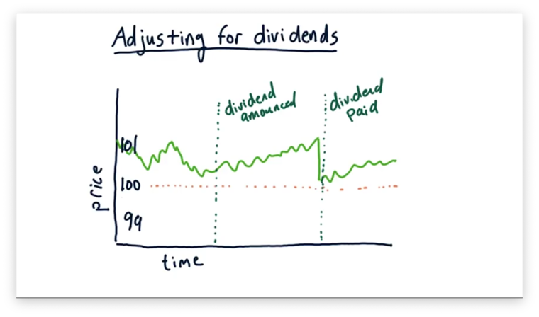

Algorithmic trading, a method of executing trades based on pre-defined criteria, hinges on the effective use of historical data. This data forms the backbone of strategy development and backtesting, ensuring that past patterns and trends can inform future trading decisions. At the heart of this process is understanding how corporate actions, such as stock splits and dividend payments, influence stock prices.

Stock splits and dividends are pivotal events in the life of a stock. A stock split, for instance, involves dividing existing shares into multiple ones, commonly seen in ratios like 2-for-1 or 3-for-1 splits. This action does not alter the overall market value of the company but affects the stock's price and number of shares outstanding. Similarly, dividends, which are payments made to shareholders, can cause fluctuations in stock prices, particularly around the ex-dividend date, when a stock begins trading without the value of its upcoming dividend.



For accurate backtesting, understanding these corporate actions is crucial. The adjustments for splits and dividends in historical data provide a realistic picture of a stock's performance over time. Without this understanding, traders risk basing decisions on distorted information, leading to flawed strategy development. This article highlights why it's important for algorithmic traders to use split and dividend-adjusted data, ensuring that the strategies they implement are both reliable and reflective of true market dynamics.

## Table of Contents

## Understanding Split and Dividend Adjustments

Stock splits and dividend adjustments are critical considerations in maintaining accurate historical stock performance data. These corporate actions can significantly affect stock prices, and understanding them is crucial for traders and analysts.

### Stock Splits

Stock splits occur when a company divides its existing shares into multiple new shares to increase [liquidity](/wiki/liquidity-risk-premium). For example, in a 2-for-1 split, each share is divided into two, effectively doubling the number of shares while halving the price, leaving the company's market capitalization unchanged. Similarly, in a 3-for-1 split, each share is split into three. While the face value of each share changes, a shareholder's overall investment remains the same, as the company's total valuation hasn't altered. The underlying goal of stock splits is often to make shares more affordable and attractive to investors without changing the fundamental value of the company.

Mathematically, a stock split can be represented as:

$$
\text{New Share Price} = \frac{\text{Old Share Price}}{\text{Split Ratio}}
$$

### Dividend Payments

Dividend payments are distributions of a portion of a company's earnings to its shareholders and can affect stock prices. Before the ex-dividend date, the stock price often reflects the forthcoming dividend payment. On or after the ex-dividend date, the stock usually drops by approximately the amount of the dividend. This is because new buyers on or after this date will not receive the dividend. The ex-dividend date is crucial for determining which shareholders are entitled to the dividend. Understanding this cycle of dividend distribution helps traders predict stock price adjustments and align their trading strategies accordingly.

### Importance of Adjustments

Without adjusting for splits and dividends, historical data may reflect misleading stock performances. Non-adjusted data would show discontinuities in price attributable to these corporate actions rather than actual value changes. Adjustments help normalize these abrupt changes, providing a realistic, smoothed historical price series vital for [backtesting](/wiki/backtesting) trading algorithms. By considering these adjustments, traders and analysts achieve a more accurate representation of a stock's historical return, aiding in the development of robust and reliable trading strategies.

## Importance of Adjusted Data in Algo Trading

In [algorithmic trading](/wiki/algorithmic-trading), adjusted data is fundamental to accurately assessing a stock's value over time. Adjustments for dividends and stock splits ensure that the data reflects a consistent price structure, vital for the precision of trading algorithms. Without these adjustments, an algorithm might interpret data incorrectly, leading to flawed trading decisions and strategies.

When algorithms rely on non-adjusted data, they might misconstrue corporate actions as legitimate changes in a stock's value, leading to significant errors. For instance, a stock split does not alter the intrinsic value of an investor's holdings; it merely increases the number of shares while proportionally decreasing the price per share. Without adjusting for such splits, historical data may suggest a sudden drop in price, which an algorithm might misunderstand as a negative market movement.

Furthermore, dividend adjustments are crucial for reflecting a stock's total return. Dividends represent a substantial portion of investors' returns over time. By failing to incorporate dividend adjustments, analysts might overestimate or underestimate a stock's performance. Ignoring these elements could lead to overstated returns if dividends aren't subtracted from the price movement or understated returns if they aren't included as reinvested gains.

The pitfalls of neglecting data adjustments are significant. For example, relying on raw data might result in algorithms that seemingly perform well in backtests because they do not account for dividends and splits, thus portraying an inaccurate picture of capital growth. These strategies may underperform in real market conditions where such corporate actions are regular occurrences.

Utilizing adjusted data means recognizing P_adj = (P_raw - D)/Split_factor, where $P_{adj}$ is the adjusted price, $P_{raw}$ is the raw price, $D$ is the dividend, and the split [factor](/wiki/factor-investing) adjusts for stock splits. Understanding and implementing this formula is crucial for ensuring that backtesting results reflect the true potential of an algorithm.

Therefore, the use of adjusted data in algorithmic trading is not just a matter of preference but a necessity for the development of reliable and effective trading strategies. Ignoring these adjustments can lead to an unrealistic perception of historical returns, potentially resulting in significant financial consequences when these strategies are applied to live trading.

## Real-World Implications of Using Adjusted Data

Using split and dividend-adjusted data has practical implications for algorithmic trading, as it leads to more reliable backtesting results and strategy performance. Adjusted data accounts for corporate actions that impact stock prices and dividends, creating a more accurate historical price series. This adjustment is crucial for developing trading strategies that rely on past performance to predict future behavior.

Traders and analysts often face challenges when using raw data, as it does not account for stock splits or dividend payouts. These corporate actions can lead to misleading price trends. For example, a stock split increases the number of shares available while reducing the price per share but does not change the company's market capitalization. Without adjusting the data, a decrease in stock price post-split might appear as a loss, skewing backtesting results.

Many traders use a combination of adjusted and raw data during different phases of strategy development. For instance, raw data might be used during initial exploratory analysis to understand raw price movements, while adjusted data is employed in backtesting to ensure strategy consistency through historical variations. This dual approach aids in comprehensively understanding how strategies perform under varying conditions.

Example case studies from firms like Renaissance Technologies highlight the successful leverage of adjusted data. Their Medallion Fund, known for incredibly high returns, purportedly utilizes complex models built on deeply adjusted and cleaned price data, emphasizing the importance of such datasets. Similarly, other successful traders use adjusted data to mitigate errors in historical performance projections.

In practice, traders can harness Python libraries such as Pandas alongside data sources like Yahoo Finance and Google Finance for accessing and manipulating adjusted data. With Python, data adjustments can involve re-calculating past closing prices to reflect corporate actions. Here's a simplified code snippet that demonstrates how one might adjust closing prices for stock splits using Pandas:

```python
import pandas as pd

# Sample data frame with stock data
data = {'Date': ['2023-01-01', '2023-02-01'],
        'Close': [100, 50],
        'SplitFactor': [1, 2]}

df = pd.DataFrame(data)
df['AdjustedClose'] = df['Close'] / df['SplitFactor']
print(df)
```
This snippet provides the adjusted closing prices after incorporating split factors, showcasing the practical steps traders need to implement for consistent strategy development.

In summary, employing adjusted data is not merely a technical adjustment but a critical component that aligns strategic forecasting with the realities of historical market behaviors, thus enhancing algorithmic trading models' reliability and accuracy.

## Tools and Resources for Adjusting Data

When selecting tools and resources for obtaining adjusted data for algorithmic trading, several platforms stand out due to their comprehensive datasets and reliable adjustment calculations. These platforms help traders ensure accuracy in backtesting and strategy development by accounting for stock splits, dividends, and other corporate actions.

### Popular Platforms for Adjusted Data

1. **Bloomberg Terminal**: Known for its extensive financial database, Bloomberg Terminal provides adjusted stock prices that factor in splits and dividends. Its data accuracy and reliability are highly regarded, making it a preferred choice for institutional traders.

2. **Thomson Reuters Eikon**: Similar to Bloomberg, Eikon offers a wide range of financial data, including adjusted historical stock prices. Eikon's interface allows traders to easily visualize how corporate actions have impacted stock performance over time.

3. **Yahoo Finance**: While considered less robust than professional tools like Bloomberg, Yahoo Finance remains a popular free resource for retail traders. It offers split and dividend-adjusted data, making it accessible for individual investors who wish to validate their trading strategies without significant financial investment.

4. **QuantConnect**: As a cloud-based platform for algo trading, QuantConnect provides a comprehensive suite for importing adjusted data. It supports various data providers, ensuring that traders can access accurate historical data for backtesting.

5. **Quandl**: Known for its wide variety of economic and financial datasets, Quandl offers adjusted price data sourced from reliable providers. Traders can access this data through APIs, making integration with trading algorithms seamless.

### Comparing Data Sources

When selecting a data provider, traders should consider:
- **Accuracy**: Precisely adjusted data ensures that backtests reflect true historical performance. Providers like Bloomberg and Thomson Reuters, with their stringent data verification processes, excel in this area.
- **Cost**: Commercial platforms often come with substantial fees, which might be prohibitive for individual traders. In contrast, platforms like Yahoo Finance provide a budget-friendly alternative, though with potentially less frequent updates.
- **Accessibility**: Some platforms offer user-friendly APIs and integration options that make it easier for traders to incorporate data into their algorithms. Quandl's API, for example, is known for its ease of use.

### Tips for Validating Adjusted Data

To ensure the reliability of adjusted historical data, traders can:

1. **Cross-Reference Sources**: Compare data from multiple providers to identify discrepancies. If Bloomberg and Thomson Reuters both report similar adjustments, the data can be considered more reliable.

2. **Track Corporate Actions**: Verify the recorded splits and dividends against official announcements from companies. This helps ensure that adjustments align with actual corporate events.

3. **Backtest Consistently**: Regularly validate the accuracy of backtests by using different datasets from various sources. Consistent results across different datasets can indicate reliable data adjustments.

4. **Use Statistical Methods**: Implement statistical techniques to check for anomalies or outliers in the adjusted data. For example, calculating the mean and standard deviation of adjusted returns can reveal inconsistencies.

By leveraging these tools and strategies, traders can enhance the reliability of their algorithmic trading models and improve their chances of achieving consistent trading performance.

## Conclusion

The critical role of split and dividend-adjusted data in algorithmic trading cannot be understated. This adjusted data is essential as it provides a more accurate representation of a stock's historical performance, allowing traders to develop algorithms based on realistic market conditions. Adjustments for corporate actions, such as stock splits and dividends, ensure that the continuity and integrity of the price series are maintained. Without these adjustments, the backtesting of trading strategies may yield misleading results, thus affecting the reliability and profitability of the strategies implemented.

Traders are encouraged to utilize adjusted data to enhance the accuracy and reliability of their backtesting. An accurate historical dataset enables the construction of robust trading models that can better simulate real market behaviors. For instance, using unadjusted data might incorrectly suggest significant changes in stock value due to a stock split, misleading traders about a company's actual performance.

Furthermore, ongoing improvements in data technology are continuously enhancing the quality and accessibility of adjusted historical data. Advanced software platforms and data providers constantly update their systems to incorporate the latest data adjustment methodologies, ensuring the availability of precise and timely records. This progress allows traders to refine their strategies effectively and stay competitive in the rapidly evolving financial markets.

In summary, the use of split and dividend-adjusted data is fundamental in algorithmic trading. Embracing these adjustments ensures data accuracy, leading to more reliable backtesting outcomes and more effective trading strategies. As data technology continues to advance, traders have increased opportunities to optimize their trading activities, benefiting from the enhanced accuracy of historical data.

## Further Reading and Resources

### Further Reading and Resources

For traders who aim to deepen their understanding of data adjustments in trading, several resources can provide further insights and practical knowledge:

1. **Books:**
   - *Trading Systems and Methods* by Perry J. Kaufman: This comprehensive text covers a wide variety of trading systems and includes information on how to handle corporate actions in your data.
   - *Algorithmic Trading* by Ernie Chan: Chan's book offers insights into strategy development and includes discussions on the importance of accurate historical data.

2. **Articles and Journals:**
   - "The Importance of Adjusted Data in Backtesting" - This article from the Journal of Financial Data Science discusses how data adjustments can impact the accuracy of backtested trading strategies.
   - "Historical Prices Adjustment Techniques" by QuantInsti provides an overview of various techniques to adjust historical data for splits and dividends.

3. **Online Forums and Communities:**
   - **Quantitative Finance Stack Exchange:** A question-and-answer platform where traders and analysts discuss various topics, including the technicalities of data adjustment.
   - **Elite Trader Forum:** This community offers discussions on algorithmic trading strategies and often addresses issues related to data accuracy and adjustments.

4. **Educational Platforms:**
   - **Coursera:** Offers courses such as "Machine Learning for Trading" by J.P. Morgan, which include modules on data preprocessing that touch on splits and dividends.
   - **Udacity's "AI for Trading" Nanodegree Program:** This program covers essential aspects of trading algorithms, including a focus on data preparation and adjustment techniques.

These resources are designed to cater to various learning preferences, whether through structured courses, interactive community forums, or in-depth [books](/wiki/algo-trading-books). As traders explore these materials, they will gain a comprehensive understanding of the critical role accurate data plays in the development and performance of trading strategies.

## References & Further Reading

[1]: ["Trading Systems and Methods"](https://www.amazon.com/Trading-Systems-Methods-Wiley/dp/1119605350) by Perry J. Kaufman

[2]: ["Algorithmic Trading"](https://www.investopedia.com/articles/active-trading/101014/basics-algorithmic-trading-concepts-and-examples.asp) by Ernie Chan

[3]: Chan, E. P. (2008). ["Quantitative Trading: How to Build Your Own Algorithmic Trading Business"](https://github.com/ftvision/quant_trading_echan_book).

[4]: Lopez de Prado, M. (2018). ["Advances in Financial Machine Learning"](https://books.google.com/books/about/Advances_in_Financial_Machine_Learning.html?id=oU9KDwAAQBAJ).

[5]: Aronson, D. R. (2006). ["Evidence-Based Technical Analysis: Applying the Scientific Method and Statistical Inference to Trading Signals"](https://www.amazon.com/Evidence-Based-Technical-Analysis-Scientific-Statistical/dp/0470008741).