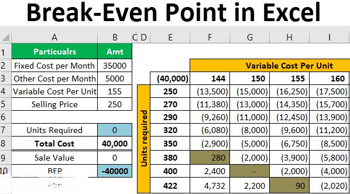

Split payment is a financial transaction mechanism where a payment is divided between multiple parties or split into several smaller transactions. It has particular relevance in today's digital economy as it facilitates seamless financial transactions, enhances customer convenience, and supports complex financial operations across sectors such as e-commerce, subscription services, and collaborative platforms. The ability to allocate payments efficiently and flexibly helps in managing cash flow and budgeting, crucial components in a rapidly changing financial landscape.

Algorithmic trading (also known as algo trading) is a modern trading strategy that employs computer algorithms to execute trades at high speeds and frequencies. These algorithms are designed to follow predefined sets of trading instructions based on factors such as timing, price, and volume. The significance of algorithmic trading lies in its reliance on speed and precision, allowing traders to capitalize on market opportunities that would be impossible to detect and act upon manually. It reduces the emotional component of trading, minimizes errors due to human intervention, and allows for the analysis and execution of broad market trends.



The focus of this examination is to explore the utility and potential application of split payment mechanisms within algorithmic trading. By understanding how split payments can be integrated into trading strategies, financial institutions and traders can enhance liquidity management, streamline transaction settlements, and optimize trade executions. This exploration aims to uncover new efficiencies and innovative applications of split payments to further advance the capabilities and effectiveness of algorithmic trading in the current financial ecosystem.

## Table of Contents

## Understanding Split Payments

A split payment is a financial transaction mechanism that allows a payment to be divided among multiple parties or accounts. This method can be particularly useful in situations where the costs need to be shared between different payers or when a single payment needs to be allocated to multiple recipients. 

Split payments are commonly applied in various transaction scenarios, including:

1. **E-commerce transactions**: In online marketplaces, a single transaction may involve multiple vendors. A split payment system can automatically direct respective portions of the customer's payment to each vendor involved.

2. **Subscription services**: When a user subscribes to a service that includes contributions from multiple providers, split payments can facilitate the distribution of subscription fees to each provider seamlessly.

3. **Retail transactions with multiple payment methods**: Consumers may wish to use a combination of payment methods, such as part cash and part credit, to complete a purchase. Split payments enable the transaction to be effortlessly processed across these different methods.

4. **Shared expenses**: In scenarios where costs are shared among individuals, such as group dinners or shared rides, split payments simplify the process of distributing the total expense among all parties involved.

The benefits of split payments in financial transactions are several-fold:

- **Efficiency**: By automating the division and distribution of payments, split payments reduce the administrative burden associated with manually processing each party's share. This ensures quicker settlement and reconciliation processes.

- **Improved cash flow**: For businesses involved in collaborative transactions or who distribute funds to multiple stakeholders, split payments ensure that each party receives their due amount promptly, mitigating cash flow issues.

- **Enhanced user experience**: For consumers, the convenience of utilizing split payments encourages smoother transactions, as they can use multiple payment sources or handle shared expenses without complex calculations.

- **Increased transparency and accuracy**: Automated splitting reduces the risk of human error, thereby increasing the accuracy of financial transactions and improving transparency in financial dealings.

- **Flexibility**: Businesses and consumers gain flexibility in managing payments, making it easier to handle complex transactions with various stakeholders or payment methods.

Overall, split payments offer significant utility by facilitating multi-party financial transactions, enhancing transactional accuracy, and improving both efficiency and user experience in the digital economy.

## Algorithmic Trading Overview

Algorithmic trading, commonly known as algo trading, refers to the use of computer algorithms to automate decision-making processes in the financial markets. This strategy employs a mathematical model to execute trades based on pre-determined criteria, which can include the timing, price, or quantity of orders. It is a hallmark of modern financial markets, capitalizing on the capabilities of computers to process large volumes of data with minimal human intervention.

The primary advantage of [algorithmic trading](/wiki/algorithmic-trading) lies in its speed and efficiency. Unlike traditional trading that requires human analysis and execution, algo trading can analyze market conditions and execute trades at a fraction of a second, faster than a human could manually respond. This allows traders to capitalize on high-frequency opportunities that might only exist for milliseconds. Algorithms can simultaneously monitor multiple market variables, ensuring that trading opportunities are not missed and that trades align perfectly with the trader's strategy. This type of trading is particularly beneficial in high-frequency trading scenarios, where every millisecond counts.

In determining trade execution, algorithms function based on specific entry, [exit](/wiki/exit-strategy), and risk management parameters set by the trader. These rules can be based on statistical measurements, technical indicators, or [machine learning](/wiki/machine-learning) models. For example, a simple moving average cross strategy may look as follows:

```python
def moving_average(price, window):
    return price.rolling(window=window).mean()

signal = {
    'short_window': 50,
    'long_window': 200
}

# Assuming df is a DataFrame with the price data
df['short_mavg'] = moving_average(df['close'], signal['short_window'])
df['long_mavg'] = moving_average(df['close'], signal['long_window'])

df['signal'] = 0.0
df.loc[df['short_mavg'] > df['long_mavg'], 'signal'] = 1.0  # Buy signal
df.loc[df['short_mavg'] < df['long_mavg'], 'signal'] = -1.0  # Sell signal
```

In this example, the algorithm generates buy signals when the short-term moving average crosses above the long-term moving average and sell signals when the opposite occurs. This script exemplifies the automated, rule-based nature of algorithmic trading.

Moreover, algorithms enhance market [liquidity](/wiki/liquidity-risk-premium) and reduce the bid-ask spread, facilitating more efficient price discovery processes. However, the reliance on speed and automation does not come without challenges, as it can sometimes lead to market [volatility](/wiki/volatility-trading-strategies) or flash crashes if not properly managed. Nonetheless, algorithmic trading continues to grow as a dominant force within financial markets, reshaping investment strategies through its promise of precision and rapid execution.

## Integration of Split Payments in Algo Trading

Split payments hold significant potential for application in algorithmic trading due to their capability to enhance the flexibility and precision of financial operations. This relevance is primarily because split payments can optimize resource allocation and risk management in trading strategies, making them attractive for quantitative traders.

**Relevance in Algorithmic Trading:**

Algorithmic trading involves the use of algorithms to execute trade orders automatically at high speed. The primary goal is to maximize profits by leveraging minimal delays and reacting swiftly to market changes. Split payments, which involve dividing a payment into multiple parts, can offer added benefits in terms of liquidity management and cost efficiency. For instance, large transactions can be divided into smaller, manageable portions to reduce the market impact and allow for better cash flow management. This can be particularly beneficial when executed via algorithmic processes that can react instantaneously to changing conditions.

**Benefits of Using Split Payments:**

1. **Improved Cash Flow Management:** Split payments ensure that the available capital is used efficiently without requiring large sums to be tied up at once, thereby enhancing liquidity. 

2. **Reduced Transaction Costs:** By executing smaller, split transactions, the overall costs associated with trading operations can potentially decrease. This is because larger transactions might incur higher fees or spread marks.

3. **Enhanced Risk Management:** Dividing payments enables traders to better hedge positions and limit exposure to volatile market conditions. It allows for gradual asset accumulation or divestment in a manner that minimizes potential losses.

4. **Market Impact Mitigation:** Large orders can disrupt market pricing. Breaking these orders into smaller transactions via split payments can help in maintaining market stability and achieving more favorable pricing.

**Hypothetical Examples in Trading:**

*Example 1:* Consider a scenario where a trading algorithm aims to accumulate a large volume of a particular stock. By employing split payments, the algorithm can purchase smaller volumes over multiple transactions. This strategy helps in reducing the visibility of large buy orders, thereby acquiring stocks at lower average prices due to reduced market impact.

*Example 2:* Suppose a trader is using a momentum-based algorithm that needs to sell a large position quickly. A split payment technique can be used to execute smaller, incremental sales. This can reduce the likelihood of significant price drops, optimizing the exit price over the duration of the trade execution.

*Example 3:* In foreign exchange trading, where currency conversions can lead to significant fees, split payments can be used to optimize currency allocation across different transactions, managing exposure to exchange rate fluctuations more effectively.

These examples illustrate how integrating split payments within algorithmic trading can improve efficiency, reduce costs, and manage risks effectively. As technological advancements continue to evolve, the synergy between financial technologies like split payments and algorithmic trading strategies is likely to become more pronounced, fostering innovative trade execution methods.

## Financial Technology and Split Payments

Financial technology, or fintech, has significantly transformed the landscape of digital transactions, making split payments a more seamless and accessible option for businesses and consumers alike. Advancements in fintech have propelled the development and adoption of split payments, a mechanism that allows for a single payment to be divided among multiple parties or accounts. This capability is pivotal for modern commerce, where transactions often involve multiple stakeholders.

Current technologies enabling split payments largely revolve around sophisticated payment processing systems and application programming interfaces (APIs). These technologies facilitate the breakdown and allocation of a transaction into parts, often in real-time, ensuring immediate distribution of funds to the appropriate parties. For instance, Stripe, a notable fintech company, provides APIs that allow businesses to implement split payments efficiently. Through Stripe Connect, companies can handle complex payouts to third-party receivers, an essential feature for marketplaces, crowdfunding platforms, and gig economy services. Similarly, PayPal has incorporated adaptive payments, which enable users to split funds automatically or manually between primary and secondary receivers during a transaction.

In addition to APIs, other technologies such as blockchain and smart contracts have emerged as significant enablers of split payments. Blockchain technology offers a decentralized ledger that ensures transparency and immutability in transactions. Smart contracts, which are self-executing contracts with the terms of the agreement directly written into code, can automate the execution of split payments. For example, in a supply chain network facilitated by blockchain, payment to suppliers can be automatically split and released upon verification of delivery milestones, eliminating the need for manual intervention.

Platforms where split payments are already in use showcase the versatility and demand for this functionality. E-commerce platforms like Shopify and Etsy use split payment systems to distribute earnings between sellers and the platform itself. Ride-sharing services like Uber and Lyft utilize split payments to manage fees and driver payouts dynamically. Additionally, subscription services may opt for split payments to allocate funds between content creators, platforms, and distributors based on consumption or engagement metrics.

The integration of split payments into various sectors provides numerous benefits, including improved cash flow management, enhanced transparency, and efficiency in financial transactions. As fintech continues to evolve, the proliferation of split payment solutions is expected to increase, driving further innovation in how digital transactions are processed and managed.

## Practical Examples of Split Payment Use Cases

Split payments have become an integral feature across various sectors, facilitating transactions in a manner that benefits both consumers and businesses. This section explores several real-world applications of split payments, highlighting their advantages and considering their potential adaptation into the context of algorithmic trading.

### Real-World Examples of Split Payments

**1. E-commerce Platforms:**
In e-commerce, split payments are commonly used to distribute funds to multiple parties secured by a single transaction. For instance, marketplace platforms like Etsy and Amazon allow sellers to receive their respective portion of a payment immediately after a customer purchase. This automated split ensures that sellers are promptly compensated, enhancing liquidity and financial management. 

**Benefits:**
   - **For Consumers:** Simplifies the purchasing process, ensuring a seamless checkout experience by not having to manage payments to individual sellers.
   - **For Businesses:** Provides immediate revenue distribution, reduces overhead on payment reconciliation, and enhances seller satisfaction, which is crucial for attracting more vendors.

**2. Ride-Sharing Applications:**
Companies like Uber employ split payments to divide the fare between the driver and the platform. The total fare collected from the user is automatically divided, ensuring that both the service provider and the platform receive their designated shares without manual intervention.

**Benefits:**
   - **For Consumers:** Transparent costing as users see the complete fare breakdown, fostering trust in pricing.
   - **For Businesses:** Streamlines payment processes and accountability, with reduced financial discrepancies, offering drivers clear insights into earnings.

**3. Subscription Services:**
Platforms such as Netflix can use split payments to handle royalties and licensing fees, dividing subscriber fees between the platform, content creators, and licensing bodies.

**Benefits:**
   - **For Consumers:** Access to diverse content by supporting a fair compensation model that encourages more creators to join the platform.
   - **For Businesses:** Enables better financial forecasting and budgeting and attracts more content creators by ensuring fair revenue distribution.

### Adaptation in Algorithmic Trading

In algorithmic trading, split payment mechanisms could address the distribution of profits across multiple trading partners or algorithms involved in generating a trade's outcome. By implementing split payment technology, trading systems could automate the allocation of profits based on pre-set rules, such as performance metrics or capital contribution ratios.

**Hypothetical Example:**
Consider a scenario where multiple algorithms collaborate on a trading strategy. Upon execution, the total profit from a trade could be divided using a split payment system according to the contribution of each algorithm. For instance, Algorithm A could receive 50%, while Algorithm B receives 30%, and Algorithm C gets 20%, based on their respective performance and input.

**Benefits in Trading Context:**
- Facilitates transparent and equitable distribution of returns among different trading systems.
- Reduces administrative burdens on traders by automating profit-sharing processes.
- Enhances collaboration between algorithm developers by offering a clear profit-sharing model, thus encouraging innovation and diverse strategy integrations.

By understanding and integrating established practices of split payments from diverse sectors, algorithmic trading could substantially benefit, fostering more efficient financial operations and innovative strategic collaborations.

## Benefits and Challenges

The integration of split payments within algorithmic trading presents several notable advantages and challenges that merit careful consideration.

### Advantages

1. **Increased Flexibility**: Split payments can enhance the flexibility of transactional management within algorithmic trading by allowing transactions to be divided across multiple accounts or instruments. This enables traders to optimize cash flow and hedge against risks more effectively.

2. **Risk Management**: By distributing payments, traders can mitigate risks associated with large single-point transactions. This distribution ensures that the impact of market volatility on individual trades is minimized, providing a more stable trading environment.

3. **Cost Efficiency**: Often, transacting in smaller increments can lead to reduced transaction fees, as some payment processors offer lower rates for microtransactions. This reduction in costs can be particularly advantageous in high-frequency trading scenarios where numerous transactions occur in rapid succession.

4. **Improved Liquidity**: By utilizing split payments, traders can maintain higher liquidity levels. This is achieved as funds are not locked in a single transaction, allowing for quicker reallocations of capital to seize trading opportunities.

### Challenges

1. **Complexity of Implementation**: Integrating split payments into existing algorithmic trading systems can be technically challenging. The need for robust software solutions to manage these transactions adds layers of complexity to the system architecture.

2. **Latency Issues**: Ensuring that split payments are executed swiftly is crucial. Any delay in executing these payments could result in missed trading opportunities or financially detrimental price changes.

3. **Regulatory Concerns**: Split payments, particularly when crossing multiple jurisdictions, must comply with diverse regulatory requirements. Navigating these regulations can be challenging and necessitates a thorough understanding of financial compliance.

4. **Data Security and Privacy**: Managing split payments involves handling highly sensitive data across various platforms, raising concerns about data security and privacy. Breaches in payment data could lead to significant financial and reputational damage.

### Solutions and Mitigations

1. **Robust Software Design**: To handle the complexity of split payments, algorithmic trading systems must be designed with a strong emphasis on flexibility and scalability. Employing modular design principles can allow for incremental integration of split payment functionality.

2. **Optimization Algorithms**: Developing algorithms that can minimize latency by selecting the most efficient paths for split payments can aid in overcoming timing issues. These algorithms can prioritize transactions based on real-time market conditions.

3. **Regulatory Compliance Tools**: Implementing advanced compliance software that automatically tracks and updates regulatory changes can help firms stay abreast of the legal landscape and ensure that split payments are compliant.

4. **Enhanced Security Protocols**: Employing state-of-the-art encryption and authentication measures can protect sensitive transaction data. Regular security audits and employing technologies such as blockchain can further enhance data integrity and security.

In summary, while the introduction of split payments into algorithmic trading systems offers significant benefits in terms of flexibility, cost, and risk management, it also presents challenges that require strategic technological and regulatory solutions. As the financial industry continues to evolve, addressing these challenges will be key to harnessing the full potential of split payment systems within trading strategies.

## Conclusion

The exploration of split payments within algorithmic trading has elucidated several integral aspects that underscore the potential of this intersection. Key findings suggest that the integration of split payments can enhance the versatility and efficiency of algo trading strategies by allowing fragmented transactions that can be executed more dynamically across multiple market conditions. This flexibility reduces the risk associated with large [volume](/wiki/volume-trading-strategy) trades impacting market pricing, and enables more sophisticated [arbitrage](/wiki/arbitrage) opportunities where various portions of a trade can be optimized across different trading venues.

Future developments in this field are likely to be driven by advancements in financial technology that streamline complex transaction processes and refine algorithms to better handle split-payment scenarios. As fintech evolves, we might witness more seamless integration with blockchain technologies and smart contracts, which can automate and secure split payments, ensuring both transparency and efficiency. The rise of machine learning and AI in trading algorithms could further contribute to more intelligent decision-making processes in determining when and how to utilize split payments effectively.

To fully leverage the benefits of split payments in algorithmic trading, ongoing research is necessary. This should focus on optimizing algorithms for transaction fragmentation, improving cybersecurity measures in digital payments, and enhancing interoperability among diverse trading platforms. Additionally, empirical studies to quantify the impact of split payments on trading performance across various market conditions would be invaluable. Encouraging further exploration into innovative financial technologies will not only enhance trading efficiencies but also potentially pioneer new paradigms in the financial sector.

## References & Further Reading

[1]: Marcos, L. de Prado. (2018). ["Advances in Financial Machine Learning."](https://www.amazon.com/Advances-Financial-Machine-Learning-Marcos/dp/1119482089) Wiley.

[2]: Aronson, D. (2006). ["Evidence-Based Technical Analysis: Applying the Scientific Method and Statistical Inference to Trading Signals."](https://www.amazon.com/Evidence-Based-Technical-Analysis-Scientific-Statistical/dp/0470008741) Wiley.

[3]: Jansen, S. (2018). ["Machine Learning for Algorithmic Trading: Predictive models to extract signals from market and alternative data for systematic trading strategies with Python."](https://github.com/stefan-jansen/machine-learning-for-trading) Packt Publishing.

[4]: Chan, E. P. (2009). ["Quantitative Trading: How to Build Your Own Algorithmic Trading Business."](https://github.com/ftvision/quant_trading_echan_book) Wiley.

[5]: Bergstra, J., Bardenet, R., Bengio, Y., & Kégl, B. (2011). ["Algorithms for Hyper-Parameter Optimization."](https://dl.acm.org/doi/10.5555/2986459.2986743) Advances in Neural Information Processing Systems 24.