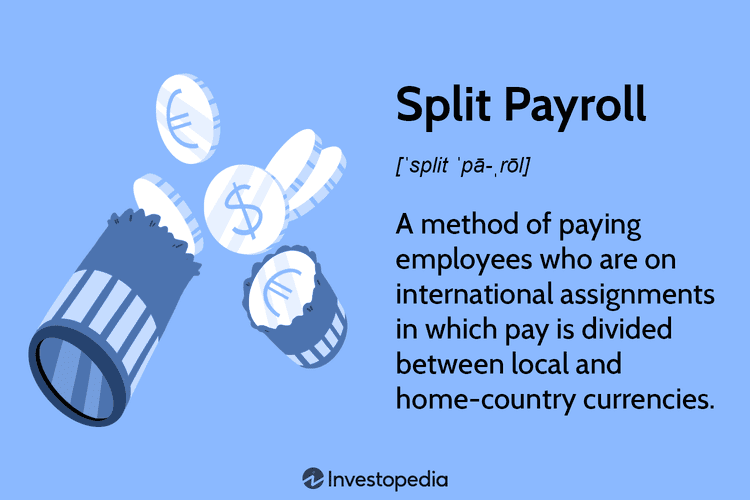

## Table of Contents

## What is split payroll?

Split payroll is a way of paying employees who work in different states or countries. Instead of getting one paycheck for all their work, they get separate paychecks for the work they did in each place. This helps companies follow the different tax and labor laws in each area where their employees work.

For example, if an employee works in New York for part of the month and then in California for the rest, they would get two paychecks. One paycheck would be for the time worked in New York, and the other would be for the time worked in California. This makes it easier to handle taxes and other legal stuff correctly in each state.

## Why would a company use split payroll?

A company would use split payroll to make sure they follow the rules in different places where their employees work. If an employee works in more than one state or country, each place has its own laws about taxes and other things. By using split payroll, the company can give the employee separate paychecks for the work done in each place. This helps the company handle taxes and other legal stuff correctly without mixing everything up.

Another reason is that it makes things easier for the employees. When they get separate paychecks, it's clearer how much they earned in each place. This can help them when they do their own taxes or if they need to show how much they earned in a specific state or country. It also helps avoid confusion and makes sure everyone is paid fairly and correctly according to where they worked.

## How does split payroll differ from regular payroll?

Split payroll and regular payroll are different because of how they handle where employees work. Regular payroll gives employees one paycheck for all their work, no matter where they did it. It's simple and works well if everyone works in the same place. But if an employee works in different states or countries, regular payroll can make it hard to follow the tax and labor laws in each place.

Split payroll solves this problem by giving employees separate paychecks for the work they do in each location. For example, if an employee works in New York and California in the same month, they would get one paycheck for the time worked in New York and another for the time worked in California. This makes it easier for the company to follow the rules in each place and helps employees keep their earnings clear for their own tax purposes.

Using split payroll can be a bit more work for the company because they have to set up and manage multiple paychecks. But it's important for making sure everything is done correctly when employees work in different areas. This way, both the company and the employees can avoid confusion and stay on the right side of the law.

## What are the basic steps to implement split payroll?

To implement split payroll, a company first needs to know where their employees work. They have to keep track of the hours each employee works in different states or countries. This means setting up a system to record this information accurately. Once they have this data, the company needs to calculate the pay for each location separately. They use the right pay rates and any extra pay like overtime for the work done in each place.

After figuring out the pay, the company creates separate paychecks for each location. Each paycheck shows the hours worked, the pay rate, and any taxes or other deductions that apply in that place. The company then makes sure to follow the tax rules and labor laws for each state or country. They might need to work with payroll experts or use special software to make sure everything is done correctly. This way, both the company and the employees can keep their records straight and follow the law.

## What are the legal considerations when using split payroll?

When using split payroll, a company needs to follow the tax and labor laws of each state or country where their employees work. This means understanding and applying the right tax rates, withholding the correct amounts for taxes, and following any local rules about minimum wage, overtime, and benefits. If the company gets this wrong, they could face fines or legal trouble. So, it's important to stay updated on the laws in each place and make sure the payroll system is set up correctly.

Another thing to consider is how to report the income to the right places. Each state or country might have different forms and deadlines for reporting how much employees earned there. The company has to make sure they send the right information to the right places on time. This can be tricky, especially if employees move around a lot. Using payroll software that can handle these differences can help, but the company still needs to check everything to make sure it's done right.

## How does split payroll affect employee taxes?

When a company uses split payroll, it means an employee gets different paychecks for working in different places. Each paycheck has its own taxes taken out based on where the work was done. This can make things a bit more complicated for the employee when they do their taxes at the end of the year. They have to report their income from each place separately, which means they might need to file tax returns in multiple states or countries.

But split payroll can also help make sure the right amount of taxes is taken out. If an employee works in a state with higher taxes for part of the year, their paycheck for that time will have more taxes taken out. This can prevent the employee from owing a big tax bill at the end of the year. It's important for employees to keep good records of their paychecks and understand how much tax is taken out in each place so they can do their taxes correctly.

## What software or tools can assist with managing split payroll?

There are several software options that can help with managing split payroll. One popular choice is Gusto, which can handle payroll for employees working in different states. It automatically calculates the right taxes for each location and helps with filing the necessary paperwork. Another option is Paychex, which also supports split payroll and offers tools for tracking time and attendance across different regions. These tools make it easier for companies to manage the complexities of paying employees who work in multiple places.

Another helpful tool is ADP Workforce Now, which is good for larger companies. It can handle payroll for employees in different countries, making sure the right taxes and benefits are applied everywhere. For smaller businesses, Patriot Software offers a simple and affordable solution for split payroll. It's easy to use and can help keep everything organized without needing a big budget. All these tools help companies stay on top of their payroll duties and make sure everything is done correctly, no matter where their employees work.

## Can split payroll be used for international employees?

Yes, split payroll can be used for international employees. When an employee works in different countries, they get separate paychecks for the work they do in each place. This helps the company follow the tax and labor laws in each country. For example, if an employee works in the United States for part of the month and then in Germany for the rest, they would get one paycheck for the time worked in the U.S. and another for the time worked in Germany.

Using split payroll for international employees can be a bit more complicated because each country has its own rules. The company needs to make sure they are taking out the right amount of taxes and following the local laws for each place. Special software like ADP Workforce Now can help with this, making it easier to manage payroll across different countries. This way, both the company and the employees can keep their records straight and follow the law.

## What are the common challenges faced when implementing split payroll?

When a company starts using split payroll, they might run into some problems. One big challenge is keeping track of where employees work and for how long. If an employee works in different states or countries, the company needs to make sure they have the right information to pay them correctly. This can be hard if employees move around a lot or if the company doesn't have a good system to record this information. Another challenge is making sure the right amount of taxes is taken out for each place. Each state or country has its own tax rules, and getting this wrong can lead to fines or legal trouble.

Another common issue is dealing with different labor laws. Each place might have its own rules about things like minimum wage, overtime, and benefits. The company has to make sure they follow all these rules for each paycheck they give out. This can be a lot of work, especially if the company has employees in many different places. Using special software can help, but the company still needs to check everything to make sure it's done right. It's important to stay updated on the laws in each place and make sure the payroll system is set up correctly to avoid any mistakes.

## How does split payroll impact financial reporting and accounting?

When a company uses split payroll, it changes how they do their financial reporting and accounting. Instead of one big payroll number, the company has to keep track of many smaller payroll numbers for each place where their employees work. This means more work for the accounting team. They have to make sure all the numbers add up correctly and that the taxes and other costs are recorded the right way for each place. This can make the financial reports more complicated because the company has to show how much they spent on payroll in different states or countries.

Using split payroll can also affect how the company plans its budget. Since the costs for payroll are split up, the company needs to know how much they are spending in each place. This helps them see if they are spending too much in one area or if they need to move money around. It's important for the company to keep good records so they can make smart decisions about where to spend their money. Even though it's more work, split payroll helps the company follow the rules and keep their finances in order.

## What are advanced strategies for optimizing split payroll systems?

To make split payroll systems work better, companies can use special software that can handle payroll for different places easily. This software can keep track of where employees work and make sure the right taxes are taken out for each place. It can also help with all the paperwork that comes with paying employees in different states or countries. By using this kind of software, companies can save time and make fewer mistakes. They can also set up rules in the software to make sure they follow the laws in each place without having to check everything by hand.

Another good way to optimize split payroll is to train the payroll and accounting teams well. They need to know the tax and labor laws for each place where employees work. Regular training can help them stay updated on any changes to these laws. It's also a good idea to have a clear way of keeping track of where employees work and how many hours they work in each place. This can be done with time-tracking apps or by having employees fill out forms. Good communication between the payroll team and the employees can help make sure everything is recorded correctly and that everyone gets paid the right way.

## How can split payroll be integrated with other HR and financial systems?

To make split payroll work well with other HR and financial systems, companies can use special software that can talk to other systems. This software can connect with HR systems to get information about where employees work and how many hours they work in each place. It can also connect with financial systems to make sure the payroll numbers are added to the company's [books](/wiki/algo-trading-books) the right way. By using this kind of software, companies can make sure that all the information is shared correctly and that everyone is paid the right way without having to do a lot of extra work.

Another way to integrate split payroll with other systems is to set up clear rules and processes. The HR team can make sure that the time and attendance data is entered into the system correctly, and the payroll team can use this data to create the right paychecks for each place. The financial team can then use the payroll data to keep the company's books up to date. By having good communication and clear rules, companies can make sure that split payroll works well with other systems and that everything is done correctly.

## What is the role of technology in payroll and algorithmic trading?

Advancements in technology have significantly enhanced both payroll processes and financial transactions, notably in [algorithmic trading](/wiki/algorithmic-trading). The introduction of sophisticated payroll systems has enabled organizations to seamlessly manage multi-currency transactions. These systems are designed to comply with diverse tax regulations across different jurisdictions, ensuring that businesses can operate smoothly on an international scale. The integration of technological solutions in payroll systems allows for the automation of complex calculations, minimizing human errors, and facilitating accurate and timely payment processing.

In the context of algorithmic trading, technology plays a pivotal role by employing mathematical models and algorithms to execute trades at unprecedented speeds. Such algorithms are capable of processing vast amounts of data in real-time, which is crucial for making informed trading decisions. The use of high-frequency trading strategies, which depend on computer algorithms to analyze multiple markets and execute orders based on market conditions, demonstrates the power of technology in financial markets.

Algorithmic trading systems are designed to incorporate complex computations that leverage historical data, real-time analytics, and predictive modeling. These systems may include statistical [arbitrage](/wiki/arbitrage), which uses mathematical models to identify pricing inefficiencies between related financial instruments. The classic example of such an algorithm is the pairs trading strategy, which involves matching a long position with a short position in two correlated stocks. The general principle can be expressed as:

$$
\text{Z-score} = \frac{(P_{\text{current}} - P_{\text{mean}})}{P_{\text{std\_dev}}}
$$

where $P_{\text{current}}$ is the current price ratio of the two stocks, $P_{\text{mean}}$ is the historical mean of the price ratio, and $P_{\text{std\_dev}}$ is the standard deviation of the price ratio. When the Z-score indicates a deviation from the mean, the algorithm will automatically execute trades to capitalize on the anticipated correction.

Python is particularly favored in developing such models due to its vast library ecosystem, including packages like NumPy for numerical computations, Pandas for data manipulation, and SciPy for scientific computing. Here's an example of a simple pairs trading strategy using Python:

```python
import numpy as np
import pandas as pd

# Simulated price data for two correlated stocks
stock_A_prices = np.random.normal(100, 10, 100)
stock_B_prices = np.random.normal(110, 15, 100)

# Calculate price ratio
price_ratio = stock_A_prices / stock_B_prices

# Calculate mean and std deviation of the price ratio
mean_ratio = np.mean(price_ratio)
std_dev_ratio = np.std(price_ratio)

# Calculate Z-score
z_scores = (price_ratio - mean_ratio) / std_dev_ratio

# Define trading signals based on Z-score
buy_signal = z_scores < -1
sell_signal = z_scores > 1
```

Both advanced payroll systems and algorithmic trading rely heavily on real-time data integration and computational efficiency. This highlights the crucial role technology plays, driving operational excellence in payroll management and enhancing decision-making processes in financial markets.

## References & Further Reading

[1]: Odinaka, I. (2013). ["The Global Payroll Management Handbook"](https://blogs.payroll.org/pay-news-now/free-13th-guide-to-global-payroll-management-released). 

[2]: Loeppke, R., & Kion-Crosby, W. (2019). ["International Payroll: A Guide to Running Payroll Internationally"](https://www.researchgate.net/publication/228798078_The_value_of_health_and_the_power_of_prevention) Chartered Institute of Personnel and Development.

[3]: ["Global Payroll: Your Solutions for International Payroll"](https://www.forbes.com/advisor/business/best-international-payroll-services/).

[4]: Hull, J. C. (2018). ["Risk Management and Financial Institutions"](https://books.google.com/books/about/Risk_Management_and_Financial_Institutio.html?id=1J1QDwAAQBAJ) John Wiley & Sons.

[5]: McClure, B. (2021). ["Understanding Algorithmic Trading"](https://www.researchgate.net/publication/378548435_Algorithmic_Trading_and_AI_A_Review_of_Strategies_and_Market_Impact) Investopedia.

[6]: ["International Corporate Finance"](https://coursebrowser.dce.harvard.edu/course/international-corporate-finance/) edited by Geert Bekaert, Campbell R. Harvey