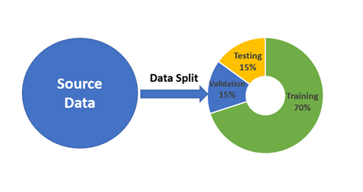

## Table of Contents

## What is split machine learning?

Split machine learning is a technique where the training of a machine learning model is divided between two or more parties. This is often done to protect sensitive data. One party, usually the data owner, keeps their data private and only sends intermediate results to another party, like a model trainer. This way, the model trainer can build a model without ever seeing the actual data.

For example, in a healthcare setting, a hospital might want to train a model to predict patient outcomes but can't share patient data due to privacy laws. Using split machine learning, the hospital can process the data locally and send only the necessary information to a research institution. The research institution then uses this information to train the model and sends the model back to the hospital. This method helps to keep patient data secure while still benefiting from advanced machine learning techniques.

## Why is split machine learning important in data science?

Split machine learning is important in data science because it helps keep data private while still allowing us to build useful models. Imagine you have sensitive information, like medical records or financial data, that you can't share with others. With split machine learning, you can work with this data on your own computer and only send a small part of the results to someone else who is helping to build the model. This way, your private data stays safe, but you can still benefit from advanced machine learning techniques.

This technique is especially useful in fields like healthcare, finance, and government, where data privacy is a big concern. For example, a hospital might want to use patient data to predict diseases but can't share that data due to privacy laws. Using split [machine learning](/wiki/machine-learning), the hospital can process the data locally and send only what's needed to a research group. The research group can then help build a model without ever seeing the actual patient data. This makes it possible to improve healthcare outcomes while keeping patient information secure.

## How does split machine learning differ from traditional machine learning?

Split machine learning and traditional machine learning differ mainly in how they handle data and where the model is trained. In traditional machine learning, all the data is usually gathered in one place, and the entire model is trained on this combined dataset. This means that if you're working with sensitive information, like medical records, you might have to share that data with others, which can be a privacy risk. For example, if a hospital wants to predict patient outcomes, it might have to send all its patient data to a research institution, which could be a problem because of privacy laws.

In contrast, split machine learning keeps the sensitive data private. Instead of sharing all the data, the data owner, like a hospital, processes the data locally and only sends a small part of the results to another party, like a research institution. This way, the research institution can help build the model without ever seeing the actual data. For instance, the hospital can use its own computers to process patient data and then send just the necessary information to the research group. This method helps to keep patient data safe while still allowing the hospital to benefit from advanced machine learning techniques.

## What are the key components of a split machine learning system?

The key components of a split machine learning system are the data owner, the model trainer, and the communication protocol between them. The data owner, like a hospital, has sensitive data that can't be shared. They process this data on their own computers and send only intermediate results to the model trainer. The model trainer, often a research institution, uses these intermediate results to build and improve the machine learning model without ever seeing the actual data. The communication protocol is important because it ensures that the data stays private while allowing the model to be trained effectively.

For example, if a hospital wants to predict patient outcomes, it can use its own computers to process patient data and then send just the necessary information to a research group. This way, the research group can help build a model without seeing the actual patient data. The communication between the hospital and the research group needs to be secure and efficient to make sure the model is trained well and the data stays private.

## Can you explain the process of data splitting in machine learning?

In split machine learning, the process of data splitting is about keeping sensitive data private while still allowing a model to be trained. Imagine you have important information, like medical records, that you can't share with others. In this case, you, the data owner, process your data on your own computer. You don't send the actual data to anyone else. Instead, you send only a small part of the results, called intermediate results, to someone who is helping to build the model, like a research institution. This way, the research institution can work on the model without ever seeing your private data.

For example, a hospital might want to predict patient outcomes but can't share patient data due to privacy laws. The hospital uses its own computers to process the patient data and then sends just the necessary information to a research group. The research group uses this information to train the model and sends the model back to the hospital. This method helps to keep patient data safe while still allowing the hospital to benefit from advanced machine learning techniques. The communication between the hospital and the research group needs to be secure and efficient to make sure the model is trained well and the data stays private.

## What are the common techniques used for splitting data in machine learning?

In split machine learning, one common technique for splitting data is called "vertical partitioning." This means that different parts of the data are split across different parties. For example, a hospital might have patient data, and a research institution might have other medical data. They can work together to train a model without sharing their full datasets. The hospital processes its part of the data and sends intermediate results to the research institution, which then uses this information to build the model.

Another technique is "horizontal partitioning," where the same type of data is split across different parties. Imagine multiple hospitals each with their own set of patient records. They can collaborate to train a model without sharing their individual patient data. Each hospital processes its own data and sends intermediate results to a central model trainer, like a research institution. This way, the model can be trained on a larger dataset without compromising patient privacy.

Both techniques rely on secure communication protocols to ensure that the data stays private while the model is being trained. For example, the hospitals and the research institution might use encryption to protect the intermediate results during transmission. This helps to keep sensitive information safe while still allowing the benefits of advanced machine learning techniques.

## How does split machine learning enhance data privacy and security?

Split machine learning helps keep data private and secure by letting the data owner process their information on their own computer. They don't share the actual data with anyone else. Instead, they send only a small part of the results, called intermediate results, to someone who is helping to build the model, like a research institution. This way, the research institution can work on the model without ever seeing the private data. For example, a hospital can use its own computers to process patient data and then send just the necessary information to a research group. This method helps to keep patient data safe while still allowing the hospital to benefit from advanced machine learning techniques.

The communication between the data owner and the model trainer needs to be secure and efficient to make sure the model is trained well and the data stays private. They might use encryption to protect the intermediate results during transmission. This helps to keep sensitive information safe while still allowing the benefits of advanced machine learning techniques. By using split machine learning, organizations can collaborate on building models without compromising the privacy of their data, making it a valuable tool in fields like healthcare, finance, and government where data privacy is a big concern.

## What are the challenges faced when implementing split machine learning?

Implementing split machine learning can be tricky because it involves keeping data private while still allowing a model to be trained. One big challenge is making sure the communication between the data owner and the model trainer is secure. They need to use strong encryption to protect the intermediate results being sent back and forth. If the communication isn't secure, there's a risk that someone could steal the data or mess with the model. Another challenge is that split machine learning can make the training process slower because the data owner has to process the data locally before sending it to the model trainer. This can take a lot of time, especially if the data owner has a lot of data or if their computers aren't very fast.

Another issue is that split machine learning can be harder to set up and manage compared to traditional machine learning. You need to make sure that the data owner and the model trainer are using the same methods and that their systems can work together smoothly. This can be complicated because different organizations might use different software or have different ways of processing data. Also, if something goes wrong, like a computer breaking down or a network problem, it can be harder to fix because the data and the model are split between different places. Despite these challenges, split machine learning is a powerful tool for keeping data private while still benefiting from advanced machine learning techniques.

## How can split machine learning be applied in real-world scenarios?

In healthcare, split machine learning can help hospitals predict patient outcomes without sharing private medical records. Imagine a hospital wants to build a model to predict if a patient might get a certain disease. They can use their own computers to process the patient data and then send just the necessary information to a research group. The research group uses this information to train the model and sends it back to the hospital. This way, the hospital can improve patient care without breaking privacy laws. For example, a hospital in one city can work with a research institution in another city to predict heart disease risk without ever sharing actual patient data.

In the finance industry, banks can use split machine learning to detect fraud while keeping customer data private. A bank might want to build a model to spot unusual transactions that could be fraud. They can process their customer data locally and send only the needed information to a third party, like a fraud detection company. This company can then train the model and send it back to the bank. This method helps the bank protect its customers' data while still using advanced machine learning to fight fraud. For instance, a bank can collaborate with a tech company to develop a fraud detection system without sharing any sensitive financial information.

## What are the performance considerations when using split machine learning?

When using split machine learning, one big performance consideration is the speed of the training process. Because the data owner has to process the data locally before sending it to the model trainer, it can take longer to train the model. This is especially true if the data owner has a lot of data or if their computers are not very fast. The time it takes to send the intermediate results back and forth between the data owner and the model trainer can also slow things down. If the communication between them is not efficient, it can make the whole process take even longer.

Another performance consideration is the accuracy of the model. In split machine learning, the model trainer only sees the intermediate results, not the actual data. This can sometimes make it harder to build a model that is as accurate as one trained with all the data in one place. The way the data is split and how the intermediate results are calculated can affect the model's performance. If the data owner and the model trainer don't use the same methods or if their systems don't work well together, it can lead to less accurate models. Despite these challenges, split machine learning is a powerful tool for keeping data private while still benefiting from advanced machine learning techniques.

## How does split machine learning integrate with other machine learning techniques?

Split machine learning can work well with other machine learning techniques to make models even better. For example, it can be used with federated learning, where different groups of people or organizations train a model together without sharing their data. In this case, split machine learning helps keep the data private within each group, while federated learning lets all the groups work together to build a strong model. Another way split machine learning can be used is with transfer learning, where a model trained on one kind of data is used to help train a model on different data. The data owner can use split machine learning to keep their data private while still using the knowledge from the first model to make the new one better.

Using split machine learning with other techniques can also help solve some of the challenges it faces. For example, by combining it with techniques like differential privacy, which adds a bit of randomness to the data to protect privacy, you can make the model even more secure. This can help make sure that even the intermediate results sent between the data owner and the model trainer don't give away too much information. By integrating split machine learning with these other methods, organizations can build powerful models that keep their data safe and still get the benefits of advanced machine learning.

## What are the future trends and developments expected in split machine learning?

In the future, split machine learning is expected to become even more important as more organizations focus on keeping data private while still using advanced machine learning techniques. One trend we might see is the development of better and faster ways to split data and communicate between the data owner and the model trainer. This could mean using new types of encryption to make the communication more secure and efficient, so the model can be trained faster without risking data privacy. Another trend could be the integration of split machine learning with other privacy-focused techniques, like differential privacy, to make models even more secure and accurate.

We might also see split machine learning being used in more industries and for more types of data. For example, it could be used in smart cities to analyze traffic patterns without sharing personal information about drivers, or in education to predict student performance without sharing private student data. As technology improves, split machine learning could become easier to set up and use, making it accessible to smaller organizations that don't have a lot of resources. This would help more people benefit from advanced machine learning while keeping their data safe.

## References & Further Reading

[1]: Vepakomma, P., Gupta, O., Swedish, T., & Raskar, R. (2018). Split learning for health: Distributed deep learning without sharing raw patient data. ["arXiv preprint arXiv:1812.00564"](https://arxiv.org/abs/1812.00564).

[2]: Shokri, R., & Shmatikov, V. (2015). ["Privacy-preserving deep learning"](https://dl.acm.org/doi/10.1145/2810103.2813687). In Proceedings of the 22nd ACM SIGSAC Conference on Computer and Communications Security.

[3]: Yang, Q., Liu, Y., Chen, T., & Tong, Y. (2019). ["Federated machine learning: Concept and applications"](https://arxiv.org/abs/1902.04885). ACM Transactions on Intelligent Systems and Technology.

[4]: Abadi, M., Chu, A., Goodfellow, I., McMahan, H. B., Mironov, I., Talwar, K., & Zhang, L. (2016). ["Deep learning with differential privacy"](https://arxiv.org/abs/1607.00133). In Proceedings of the 2016 ACM SIGSAC Conference on Computer and Communications Security.

[5]: Bonawitz, K., et al. (2019). ["Towards Federated Learning at Scale: System Design"](https://arxiv.org/abs/1902.01046). In Proceedings of the 2nd SysML Conference.