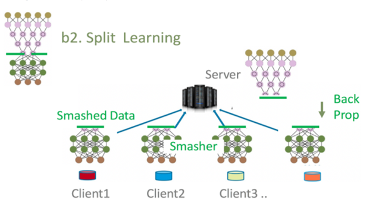

## Table of Contents

## What is a splitter in the context of machine learning?

In machine learning, a splitter is a tool used in decision trees and other tree-based algorithms to divide the dataset into smaller subsets. This division helps the algorithm make predictions by breaking down complex decisions into simpler ones. For example, if you're trying to predict whether someone will buy a product, the splitter might first divide the data based on age, then on income, and so on, until it reaches a decision.

The process of splitting is crucial because it determines how well the tree can separate different classes or predict outcomes. Different methods can be used to decide where to split the data, such as measuring the information gain or the Gini impurity. The goal is to find the split that results in the most homogeneous subsets, making it easier to classify new data accurately.

## How does a splitter function in decision tree algorithms?

In decision tree algorithms, a splitter works by choosing the best way to divide the data into smaller groups. It looks at all the features in the dataset and tries different ways to split them. The goal is to make the groups as pure as possible, meaning each group should have similar outcomes. For example, if you're trying to predict if it will rain, the splitter might first divide the data based on humidity. If high humidity usually leads to rain, then the group with high humidity will be mostly 'rain' outcomes, making it pure.

To decide the best split, the splitter uses measures like information gain or Gini impurity. Information gain measures how much uncertainty is reduced after the split. If a split results in groups that are more certain about their outcomes, it has a high information gain and is considered good. Gini impurity, on the other hand, measures how often a randomly chosen element from the set would be incorrectly labeled if it was randomly labeled according to the distribution of labels in the subset. The splitter chooses the split that minimizes the Gini impurity, making the groups as homogeneous as possible. By doing this repeatedly, the decision tree can make accurate predictions by following the path of splits to a final decision.

## What are the common types of splitters used in machine learning?

In machine learning, the most common types of splitters used in decision trees are those based on information gain and Gini impurity. Information gain measures how much a split reduces the uncertainty in the dataset. It's calculated by comparing the entropy of the parent node to the weighted average entropy of the child nodes. If a split results in child nodes that are more certain about their outcomes, it has a high information gain and is considered a good split. On the other hand, Gini impurity measures how often a randomly chosen element from the set would be incorrectly labeled if it was randomly labeled according to the distribution of labels in the subset. A lower Gini impurity means a better split, as it indicates more homogeneous groups.

Another type of splitter is the gain ratio, which is a modification of information gain to account for the potential bias towards features with many distinct values. The gain ratio divides the information gain by the intrinsic information of the split, which helps to penalize splits that result in many small subsets. This makes it more balanced and less likely to favor features that might overfit the data. Each of these splitters has its own strengths and is chosen based on the specific needs of the dataset and the problem at hand.

## Can you explain the difference between 'best' and 'random' splitters?

The 'best' splitter in decision trees looks at all possible ways to split the data and chooses the one that works the best. It uses measures like information gain or Gini impurity to find the split that makes the groups as pure as possible. For example, if you're trying to decide if someone will buy a product, the 'best' splitter might look at age, income, and other factors, then pick the split that separates buyers from non-buyers the most accurately. This method can be slower because it checks every possibility, but it often leads to a more accurate tree.

On the other hand, the 'random' splitter picks a split randomly from a smaller set of options. Instead of checking every possible split, it might only look at a few random ones and then choose the best from those. This makes it faster because it doesn't have to look at all the possibilities. However, it might not always find the very best split, which could lead to a slightly less accurate tree. The 'random' splitter is often used in algorithms like Random Forests, where many trees are built and combined, and the randomness can help prevent overfitting.

## How does the choice of splitter affect the performance of a decision tree?

The choice of splitter can have a big impact on how well a decision tree works. If you use a 'best' splitter, it will look at all possible ways to split the data and pick the one that makes the groups as pure as possible. This usually leads to a more accurate tree because it finds the best way to separate the data. But, it can take longer to build the tree because it has to check every possibility. For example, if you're trying to predict if it will rain, the 'best' splitter might look at humidity, temperature, and wind speed, and then choose the split that best separates the days when it rains from the days when it doesn't.

On the other hand, using a 'random' splitter can make the decision tree faster to build. It doesn't check every possible split; instead, it looks at a few random ones and picks the best from those. This can be good when you need quick results, but it might not always find the very best split, which could make the tree a bit less accurate. The 'random' splitter is often used in methods like Random Forests, where many trees are built together. The randomness can help stop the trees from overfitting to the data, which means they don't just memorize the training data but can make good predictions on new data too.

## What metrics are typically used to evaluate the quality of a split?

The quality of a split in a decision tree is often evaluated using metrics like information gain and Gini impurity. Information gain measures how much a split reduces the uncertainty in the dataset. It's calculated by comparing the entropy of the parent node to the weighted average entropy of the child nodes. If a split results in child nodes that are more certain about their outcomes, it has a high information gain and is considered a good split. For example, if you're trying to predict if it will rain, a split on humidity that separates rainy and non-rainy days well would have a high information gain.

Gini impurity, on the other hand, measures how often a randomly chosen element from the set would be incorrectly labeled if it was randomly labeled according to the distribution of labels in the subset. A lower Gini impurity means a better split, as it indicates more homogeneous groups. For instance, if you're classifying fruits and you split on color, a split that puts all apples in one group and all oranges in another would have low Gini impurity. Both metrics help decide which feature and value to use for splitting, aiming to make the decision tree as accurate as possible.

## How can the efficiency of a splitter be optimized in large datasets?

When working with large datasets, optimizing the efficiency of a splitter in decision trees is crucial for faster model building and better performance. One way to do this is by using a 'random' splitter instead of a 'best' splitter. The 'best' splitter looks at every possible way to split the data, which can be slow with large datasets. On the other hand, a 'random' splitter only checks a few random splits and picks the best one from those. This makes the process much faster, though it might not always find the very best split. For example, if you're trying to predict if it will rain, a 'random' splitter might only look at a few factors like humidity and wind speed before deciding, instead of checking all possible factors.

Another way to optimize the efficiency of a splitter is by using techniques like feature selection or dimensionality reduction before building the tree. Feature selection helps by choosing only the most important features to use for splitting, which reduces the number of possibilities the splitter needs to check. Dimensionality reduction works by transforming the data into a lower-dimensional space, making it easier and faster for the splitter to find good splits. Both methods help speed up the process and can also improve the performance of the decision tree by focusing on the most relevant data.

## What are the considerations for choosing a splitter in imbalanced datasets?

When working with imbalanced datasets, choosing the right splitter for a decision tree is important. An imbalanced dataset is one where some outcomes happen much more often than others. For example, if you're trying to predict if a rare disease is present, most of your data will show that the disease is not present. In such cases, a splitter like Gini impurity might not work well because it can be biased towards the majority class. This means the tree might keep splitting in a way that makes it good at predicting the common outcome but bad at predicting the rare one.

To deal with this, you might want to use a splitter that's better at handling imbalanced data, like information gain ratio. Information gain ratio is a modification of information gain that accounts for the number of splits, which helps to prevent the tree from favoring features with many different values. This can help the tree make better splits that consider both the common and rare outcomes more evenly. Another approach is to use techniques like class weighting or sampling methods before splitting. These methods can make the dataset more balanced, helping the splitter to create a tree that's better at predicting all outcomes, not just the most common ones.

## How do splitters handle categorical versus numerical data?

When dealing with categorical data, splitters in decision trees work by dividing the data based on different categories. For example, if you're trying to predict if someone will buy a product and you have a feature like 'color' with categories like 'red', 'blue', and 'green', the splitter might split the data into groups based on these colors. It looks at each category and decides which split makes the groups as pure as possible. If 'red' is strongly linked to buying the product, the splitter might put all 'red' data in one group. The splitter uses measures like information gain or Gini impurity to find the best way to split the data, making sure the tree can handle the different categories well.

For numerical data, splitters work a bit differently. They look for a specific value to split the data into two groups. For instance, if you're using 'age' to predict if someone will buy a product, the splitter might try different age values like 25, 30, or 35 to see which one makes the best split. It checks each possible split and uses metrics like information gain or Gini impurity to decide which value to use. If splitting at age 30 results in one group mostly buying the product and the other group not buying it, the splitter will choose 30 as the split point. This way, the decision tree can handle numerical data by finding the best thresholds to divide the data into more homogeneous groups.

## What advanced techniques can be applied to improve splitter performance?

To improve splitter performance in decision trees, one advanced technique is to use ensemble methods like Random Forests. In a Random Forest, many decision trees are built, each using a 'random' splitter. This randomness helps to reduce overfitting, as each tree might split the data differently. When you combine the predictions from all these trees, you get a more accurate and robust model. For example, if you're trying to predict if it will rain, one tree might split on humidity, another on temperature, and another on wind speed. By combining their predictions, you get a better overall prediction.

Another technique is to use cost-sensitive learning, which adjusts the splitter to account for different costs of misclassification. This is especially useful for imbalanced datasets where the cost of missing a rare event might be high. The splitter can be modified to consider these costs when deciding where to split the data. For instance, if the cost of missing a rare disease is much higher than a false positive, the splitter can be tuned to focus more on correctly identifying the disease. This helps the decision tree to make better splits that consider the real-world impact of its predictions.

## How do ensemble methods like Random Forests utilize splitters differently?

In Random Forests, many decision trees are built, and each tree uses a 'random' splitter to decide how to split the data. Instead of looking at all possible ways to split the data like a 'best' splitter, a 'random' splitter only checks a few random options. This randomness helps each tree to be different from the others. For example, if you're trying to predict if it will rain, one tree might split on humidity, another on temperature, and another on wind speed. By using different splits, the trees in the Random Forest can cover more ways to look at the data, which makes the overall prediction more accurate and less likely to overfit.

When all the trees in a Random Forest make their predictions, the final prediction is made by taking a vote from all the trees. If most trees predict rain, then the Random Forest predicts rain. This voting system helps to smooth out any errors that might happen in one tree because the other trees might get it right. So, even though each tree uses a 'random' splitter and might not be perfect on its own, together they make a strong and reliable model.

## What are the current research trends and future directions for splitters in machine learning?

Current research trends in splitters for machine learning focus on improving their ability to handle complex and high-dimensional data. One major trend is the development of more efficient algorithms that can work well with big datasets. Researchers are exploring new ways to optimize splitters, like using parallel computing to speed up the process of finding the best split. Another trend is the use of adaptive splitters that can change their splitting strategy based on the data they see. For example, some researchers are working on splitters that can automatically adjust to imbalanced datasets or noisy data, making them more robust and accurate.

Future directions for splitters in machine learning are likely to involve integrating them with advanced techniques like deep learning. Researchers are interested in combining decision trees with neural networks to create hybrid models that can benefit from the strengths of both approaches. For instance, a neural network could be used to preprocess the data and learn complex features, which the splitter could then use to make more informed decisions. Additionally, there is growing interest in developing splitters that can handle different types of data, such as time series or image data, more effectively. This could lead to more versatile and powerful decision tree algorithms that can be applied to a wider range of problems.